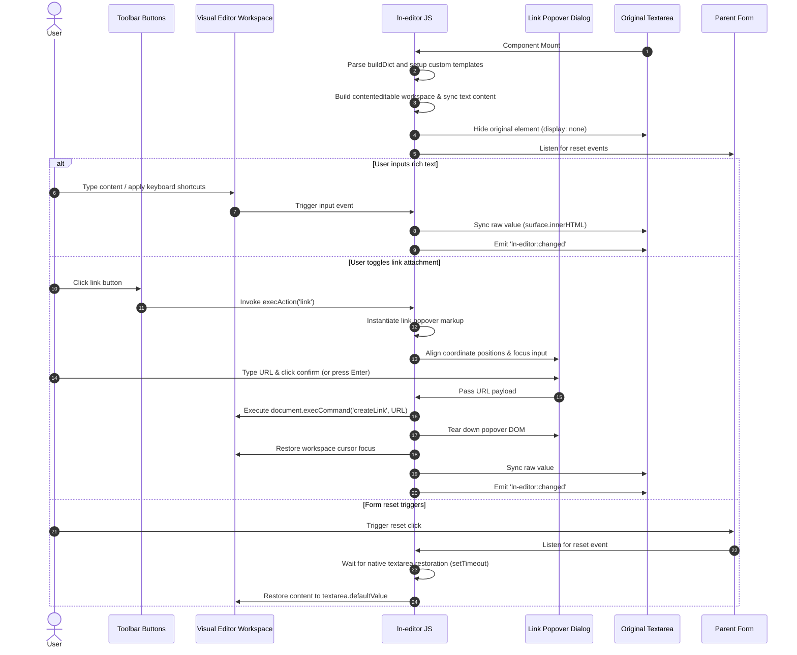

# 📝 ln-editor

> **Classification:** 🟢 Simple Component / Visual Rich Text Editor

---

## 1. Core Behavior & Responsibility

- **Core Role:** Progressively enhances a standard `<textarea>` element, replacing it visually with a rich text editing workspace (`contenteditable` surface).
- **Zero-Dependency WYSIWYG:** Relies entirely on native browser selection APIs and commands (`execCommand`), keeping bundle sizes small.
- **Form Value Synchronization:** Automatically serializes rich text modifications back to the original `<textarea>` to preserve native form submission capabilities.
- Located in [`js/ln-editor/src/ln-editor.js`](../../js/ln-editor/src/ln-editor.js).

> [!IMPORTANT]
> **What the component does NOT do (Orthogonality Doctrine):**
> - **Does NOT perform network queries** — Saving content or submitting form data is managed by [`ln-form`](./ln-form.md) or coordinators.
> - **Does NOT open external modal dialogs** — Text link attachments are handled via an absolute-positioned inline popover anchored to the editor.
> - **Does NOT perform complex CSS layout** — Styling is controlled using global SCSS mixins and classes.

---

## 2. Minimal HTML Markup & Usage Variants

### Base HTML Markup

Standard rich text editor template containing a basic action toolbar:

```html
<div data-ln-editor="post_editor" class="ln-editor">
    <!-- Action Toolbar -->
    <nav class="ln-editor__toolbar">
        <ul>
            <li><button type="button" data-ln-editor-action="bold" aria-label="Bold">B</button></li>
            <li><button type="button" data-ln-editor-action="italic" aria-label="Italic">I</button></li>
            <li><button type="button" data-ln-editor-action="underline" aria-label="Underline">U</button></li>
            <li><button type="button" data-ln-editor-action="link" aria-label="Link">Link</button></li>
        </ul>
    </nav>

    <!-- Native Textarea -->
    <label for="post-body">Content:</label>
    <textarea id="post-body" name="body" placeholder="Write content..."></textarea>
</div>
```

---

### Variant 1: Popover Label Configuration

Overrides default link dialog labels directly via data attributes on the wrapper element:

```html
<div data-ln-editor="comment_editor"
     data-ln-editor-link-placeholder="Enter web address..."
     data-ln-editor-link-confirm="Apply"
     data-ln-editor-link-cancel="Cancel"
     class="ln-editor">
    <nav class="ln-editor__toolbar">
        <button type="button" data-ln-editor-action="bold">B</button>
        <button type="button" data-ln-editor-action="link">Link</button>
    </nav>
    <textarea name="comment" placeholder="Write comment..."></textarea>
</div>
```

---

### Variant 2: Localized Interface Dictionary

Extracts popover labels from a hidden BCP 47 mapping structure inside the container (using `buildDict`):

```html
<div data-ln-editor="translated_editor" class="ln-editor">
    <nav class="ln-editor__toolbar">
        <button type="button" data-ln-editor-action="bold">B</button>
        <button type="button" data-ln-editor-action="link">Link</button>
    </nav>
    <textarea name="content"></textarea>

    <!-- Inline Localized Dictionary -->
    <ul hidden>
        <li data-ln-editor-dict="link-placeholder">Insert URL...</li>
        <li data-ln-editor-dict="link-confirm">Confirm</li>
        <li data-ln-editor-dict="link-cancel">Cancel</li>
    </ul>
</div>
```

---

### Variant 3: Custom Popover Templates

Developers can redefine the HTML structure of the inline link editor popup by supplying a custom `<template>` element:

```html
<div data-ln-editor="custom_editor" class="ln-editor">
    <nav class="ln-editor__toolbar">
        <button type="button" data-ln-editor-action="link">Link</button>
    </nav>
    <textarea name="content"></textarea>

    <!-- Custom Popover Blueprint -->
    <template data-ln-template="ln-editor-link-popover">
        <div class="ln-editor__link-popover custom-popover-theme">
            <input type="url" data-ln-attr="placeholder:placeholderText" class="custom-input" />
            <button type="button" data-ln-editor-action="confirm-link" data-ln-attr="aria-label:confirmLabel">✓</button>
            <button type="button" data-ln-editor-action="cancel-link" data-ln-attr="aria-label:cancelLabel">✗</button>
        </div>
    </template>
</div>
```

---

## 3. Declarative API Contract (Attributes & Events)

### Attributes Table

| Attribute | Element | Type / Values | Default | Description |
|---|---|---|---|---|
| `data-ln-editor` | Wrapper | `String` | — | Initializes the rich text editor. The value specifies the instance identifier. |
| `data-ln-editor-action` | Button | `String` | — | Defines the command executed when the button is clicked. |
| `data-ln-editor-link-placeholder` | Wrapper | `String` | — | Custom placeholder for the link popup input field. |
| `data-ln-editor-link-confirm` | Wrapper | `String` | — | Custom button label for applying links. |
| `data-ln-editor-link-cancel` | Wrapper | `String` | — | Custom button label for canceling link creation. |
| `data-ln-editor-source` | Textarea | Flag (auto) | — | Injected by JS onto the target `<textarea>` to mark it for absolute hiding. |

### Supported Actions

Assign these values to `data-ln-editor-action` to bind toolbar behavior:
- **Inline Formatting:** `bold`, `italic`, `underline`, `strikethrough`.
- **Structural Blocks:** `heading-2`, `heading-3`, `heading-4`, `blockquote`, `code`, `paragraph`.
- **List Operations:** `ordered-list`, `unordered-list`.
- **Special Operations:** `link` (opens attachment popover), `unlink` (strips link references), `clear` (clears style overrides).

---

### Programmatic JS API

Instance interfaces accessed via `element.lnEditor`:

| Helper | Signature | Returns | Description |
|---|---|---|---|
| `element.lnEditor.getHTML` | `()` | `String` | Returns the raw HTML contents of the rich text workspace. |
| `element.lnEditor.setHTML` | `(html: String)` | `void` | Overwrites content in the rich text workspace and synchronizes the textarea value. |
| `element.lnEditor.destroy` | `()` | `void` | Tears down instances, cleans listeners, and restores the visibility of the hidden `<textarea>`. |

---

### Events API

All events bubble from the parent container (`this.dom`):

| Event | Direction | Cancelable | Description | `detail` Object |
|---|---|---|---|---|
| `ln-editor:set-content` | Listens | No | Triggered to set content programmatically. | `{ html: String }` |
| `ln-editor:before-change` | Emits | Yes | Dispatched before formatting changes. Canceling aborts format application. | `{ action: String, target: Node }` |
| `ln-editor:changed` | Emits | No | Dispatched upon user keypress or markup updates. | `{ html: String, target: Node }` |
| `ln-editor:focus` | Emits | No | Dispatched when the contenteditable workspace gains focus. | `{ target: Node }` |
| `ln-editor:blur` | Emits | No | Dispatched when focus leaves the contenteditable workspace. | `{ target: Node }` |
| `ln-editor:destroyed` | Emits | No | Dispatched when the rich text instance is destroyed. | `{ target: Node }` |

---

## 4. CSS Styling & Behavioral Concept

The component structures layout and interactions using these standard CSS hooks:

- **`.ln-editor`:** Root visual wrapping component.
- **`.ln-editor__toolbar`:** Enclosing container for buttons and formatting dropdowns.
- **`.ln-editor__surface`:** The `contenteditable="true"` container. Implements `.prose` classes to configure line-heights, lists, blockquotes, and header sizes.
- **`.ln-editor__link-popover`:** Anchor popover absolute-positioned below the toolbar layout.
- **`.ln-editor-active`:** Injected on active command buttons (e.g. when the cursor selection crosses bold formatting).

### Selection State Management

The component listens for the global `selectionchange` event. When the user selects text within `.ln-editor__surface`, `ln-editor` uses `document.queryCommandState` for basic formatting checks (bold, italic) and traverses the DOM tree upwards to check block levels (such as `H2`, `A`, or `BLOCKQUOTE`), applying `.ln-editor-active` to active formatting tags.

---

## 5. Accessibility (ARIA) & Common Pitfalls

### ARIA & Keyboard Shortcuts

- **ARIA Semantics:** The rich text surface carries `role="textbox"` and `aria-multiline="true"`. If a `<label>` points to the hidden `<textarea>`, its `id` is mapped to the contenteditable area using `aria-labelledby`.
- **Keyboard Shortcuts:** Native support for `Ctrl+B` (bold), `Ctrl+I` (italic), `Ctrl+U` (underline), and `Ctrl+K` (link dialog). Maps commands to `Cmd` keys on macOS.
- **Popover Focus:** Opening the link editor via `Ctrl+K` transfers visual focus to the popover input field. Pressing `Enter` applies the link, and `Escape` cancels; both return focus to the rich text surface.

### Common Pitfalls & Anti-patterns

> [!CAUTION]
> 1. **Omitting `type="button"` on Toolbar Buttons:**
>    If buttons inside `<form>` wrappers lack an explicit `type="button"`, browsers process them as `type="submit"` buttons, causing page reloads when formatting actions are clicked.
> 2. **Executing Direct DOM Modifiers on the Workspace:**
>    Modifying `.ln-editor__surface` elements directly using third-party JS scripts corrupts browser undo/redo histories and causes desynchronization with the target `<textarea>`. Use `ln-editor:set-content` instead.

---

## 6. Flow Diagram & Lifecycle



---

## 7. Related Components

- [`ln-form.md`](./ln-form.md) — Manages the wrapping form context and submission cycles.
- [`ln-validate.md`](./ln-validate.md) — Assesses input length constraints (`required`, `minlength`) on the underlying `<textarea>`.
