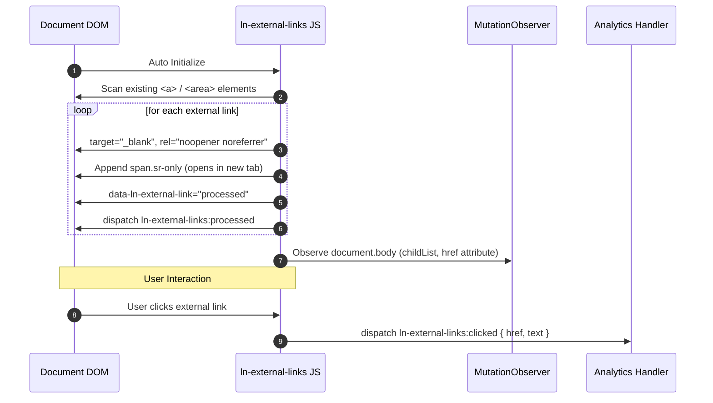

# 🌐 ln-external-links

> **Classification:** 🟢 Simple component / Global Behavior (Layer 1 - Security & Accessibility)

---

## 1. Core Behavior & Responsibility

The `ln-external-links` component is an automated utility that scans and secures outbound links (`<a>` and `<area>` elements) across the page. It is located in [`js/ln-external-links/src/ln-external-links.js`](../../js/ln-external-links/src/ln-external-links.js).

*   **Outbound Detection:** Automatically checks link hostnames against `window.location.hostname`. Any link targeting a different domain is identified as an external link.
*   **Security Sanitization (Reverse Tabnabbing Prevention):** Appends `target="_blank"` and ensures `rel` contains `noopener noreferrer` to protect against security vulnerabilities.
*   **Accessibility Enhancement (A11y Hint):** Appends a visually hidden `<span>` containing `(opens in new tab)` with class `.sr-only` for screen reader users.
*   **Dynamic DOM Observation:** Manages a document-level `MutationObserver` to process newly added links (e.g. injected via AJAX/templates) and monitor `href` attribute changes dynamically.
*   **Telemetry Events:** Listens for global clicks on processed external links and dispatches `ln-external-links:clicked` for easy analytics integration.

> [!IMPORTANT]
> **What the component does NOT do (Orthogonality Doctrine):**
> - **Does NOT apply visual icon styling:** Adding external link visual icons is the responsibility of CSS rules.
> - **Does NOT block navigation or show confirmation dialogs:** Does not interrupt user actions; only dispatches telemetry events.

---

## 2. Minimal HTML Markup & Usage Variants

Works automatically on all links within `document.body` without requiring manual trigger attributes.

### Markup Transformation Example

Before initialization (raw HTML):

```html
<div class="footer-links">
    <a href="https://google.com">Google</a>
    <a href="/about-us">Internal Link</a>
</div>
```

After processing by `ln-external-links`:

```html
<div class="footer-links">
    <a href="https://google.com" 
       target="_blank" 
       rel="noopener noreferrer" 
       data-ln-external-link="processed">
       Google
       <span class="sr-only">(opens in new tab)</span>
    </a>
    
    <!-- Internal link remains untouched -->
    <a href="/about-us">Internal Link</a>
</div>
```

---

## 3. Declarative API Contract (Attributes & Events)

### Attributes Table

| Attribute | Element | Type | Description |
|---|---|---|---|
| `data-ln-external-link` | `<a>`, `<area>` | `String` | Automatically stamped as `processed` after sanitization to prevent duplicate processing. |

### Programmatic JS API (`window.lnExternalLinks`)

| Method | Parameters | Return | Description |
|---|---|---|---|
| `window.lnExternalLinks.process` | `(container?: HTMLElement)` | `void` | Manually triggers link processing for all elements within a specified container. |

### Events API

| Event | Target | Payload `detail` | Description |
|---|---|---|---|
| `ln-external-links:processed` | `a, area` | `{ link: HTMLElement, href: String }` | Dispatched after an external link is sanitized and secured. |
| `ln-external-links:clicked` | `a, area` | `{ link: HTMLElement, href: String, text: String }` | Dispatched when a user clicks on an external link (useful for telemetry/analytics). |

---

## 4. CSS Styling & Behavioral Concept

The component only injects accessible hidden text relying on standard `.sr-only` rules:

```scss
// SCSS visual layer implementation for accessible hidden text
.sr-only {
    position: absolute;
    width: 1px;
    height: 1px;
    padding: 0;
    margin: -1px;
    overflow: hidden;
    clip: rect(0, 0, 0, 0);
    white-space: nowrap;
    border: 0;
}
```

---

## 5. Accessibility (ARIA) & Common Pitfalls

### ARIA & Semantics

- **WCAG Compliance:** Injecting `(opens in new tab)` hidden text fulfills WCAG guidelines by notifying screen reader users before navigating away from the current page.

### Common Pitfalls & Anti-patterns

> [!CAUTION]
> 1. **Missing `.sr-only` CSS Class:** Omitting `.sr-only` CSS utility rules will cause the hidden text `(opens in new tab)` to render visibly on the page.
> 2. **Subdomain Links Treated as External:** Links pointing to different subdomains (e.g. `api.domain.com` vs `domain.com`) are correctly recognized as external because hostnames differ.

---

## 6. Flow Diagram & Lifecycle



---

## 7. Related Components

- [`ln-link.md`](./ln-link.md) — Makes entire DOM blocks clickable.
