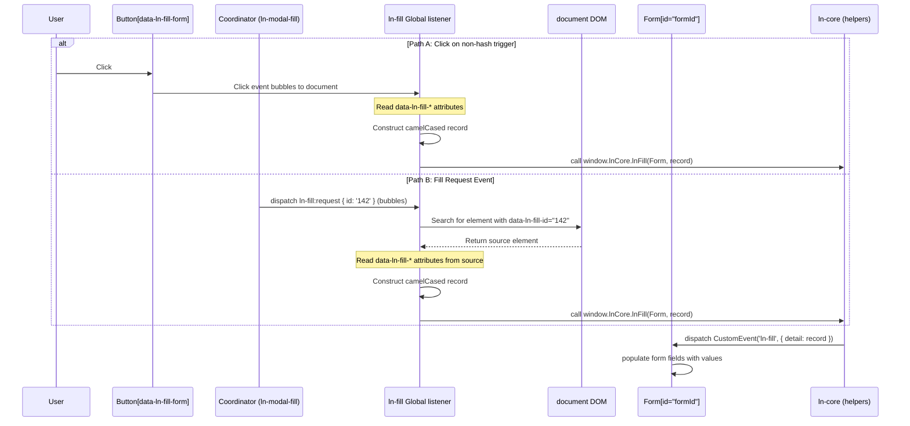

# 🟢 ln-fill

> **Classification:** 🟢 Simple component / Global behavior (Layer 1 - Form/Display Binder)

---

## 1. Core Behavior & Responsibility

The `ln-fill` component is a global DOM population behavior in `ln-ashlar`. It listens for triggers in the DOM (clicks or request events), extracts record datasets, and populates form fields.

The JavaScript source is located at [ln-fill.js](../../js/ln-fill/src/ln-fill.js).

Key responsibilities include:
- **Click-Triggered Fill:** Listening to delegated document clicks on elements with `data-ln-fill-form`, gathering `data-ln-fill-*` attributes, constructing a camelCased record, and dispatching it.
- **Event-Driven Fill:** Listening to global `ln-fill:request` events on `document`, finding the matching source element with `data-ln-fill-id` in the DOM, parsing its attributes, and calling the fill routine.
- **Double-Fill Prevention:** Checking if the click trigger is a hash-bound link. If it is, the click listener skips direct population to let the URL hash change and the coordinator event flow handle it without duplicates.
- **Form Resetting:** Driving forms to call `.reset()` and clear hidden RESTful action/method helpers when populated with a `null` value.

> [!IMPORTANT]
> **What the component does NOT do (Orthogonality Doctrine):**
> - **Modal / Panel toggling:** It does not open dialogs or toggle drawer visibility (handled by [ln-modal](./ln-modal.md) and [ln-toggle](./ln-toggle.md)).
> - **Data Persistence:** It does not persist form fields to storage or fetch them from a remote server (handled by `ln-data-store` and `ln-data-coordinator`).

---

## 2. Minimal HTML Markup & Usage Variants

### Base HTML Markup

Below is a typical button that pre-fills a form directly on click:

```html
<!-- Trigger Element -->
<button type="button" 
        data-ln-fill-form="user-form"
        data-ln-fill-id="101"
        data-ln-fill-name="Ada Lovelace"
        data-ln-fill-role="Administrator">
    Prefill Ada
</button>

<!-- Target Form -->
<form id="user-form" data-ln-form>
    <input type="hidden" name="id">
    <input type="text" name="name">
    <select name="role">
        <option value="User">User</option>
        <option value="Administrator">Administrator</option>
    </select>
</form>
```

### Variant 1: Display Fillable (Read-Only Container)

### Variant 1: Hash-Bound Modal Trigger (Delegated Fill)

When using a hash-bound trigger, `ln-fill` skips direct click population and delegates it to the coordinator and request events:

```html
<!-- Trigger Anchor (Hash-Bound) -->
<a href="#edit-modal:42" 
   data-ln-fill-id="42"
   data-ln-fill-form="edit-form"
   data-ln-fill-title="Project Alpha">
    Edit Project
</a>
```

---

## 3. Declarative API Contract (Attributes & Events)

### Attributes Table

| Attribute | Element | Type / Values | Default | Description |
|---|---|---|---|---|
| `data-ln-fill-form` | Trigger | `String` (ID) | - | Target form ID to populate. |
| `data-ln-fill-id` | Trigger | `String` | - | Unique record identifier, matched against `ln-fill:request` parameters. |
| `data-ln-fill-*` | Trigger | `String` | - | Form values. Keys are converted to camelCase (e.g. `data-ln-fill-user-name` → `userName`). |

### Programmatic JS API

`window.lnCore.lnFill` is the actual population routine. Both the click-triggered path and the `ln-fill:request` event path resolve a record and hand off to this helper — it is the single fan-out point that performs the DOM population.

| Helper | Signature | Returns | Description |
|---|---|---|---|
| `window.lnCore.lnFill` | `(container: HTMLElement, record: Object\|null)` | `void` | Dispatches the `ln-fill` CustomEvent (with `record` as `detail`) at every `[data-ln-form]` / `[data-ln-fillable]` element found inside `container`. Guards against nested fillables re-triggering on the same target and is idempotent — safe to call repeatedly without double-binding. |

Coordinators (e.g. [`ln-modal-fill`](./ln-modal-fill.md)) call `window.lnCore.lnFill` directly when they already hold a resolved record and need to bypass the click/attribute parsing steps. Authors relying purely on declarative markup never call it directly — `data-ln-fill-form` triggers and `ln-fill:request` events cover the common cases and call the helper internally.

### Events API

| Event | Direction | Cancelable | Description | `detail` Object |
|---|---|---|---|---|
| `ln-fill:request` | Listens | No | Dispatched by coordinators to initiate DOM population. | `{ id: String\|null }` |
| `ln-fill` | Emits | No | Dispatched on target forms to prompt input filling. | `Record\|null` |

---

## 4. CSS Styling & Behavioral Concept

`ln-fill` is a functional component with no visual styles or SCSS mixins of its own.

---

## 5. Accessibility (ARIA) & Common Pitfalls

### ARIA & Keyboard

- No custom keyboard controls are introduced by this component.

### Common Pitfalls & Anti-patterns

> [!CAUTION]
> 1. **Target Missing Attribute:** `ln-fill` only dispatches to forms marked with `data-ln-form`. If this attribute is missing, the target will ignore the fill event.
> 2. **Reserved Suffixes:** Do not use `data-ln-fill-form` or `data-ln-fill-store` to pass record values; they are reserved for configuration and ignored during record compilation.

---

## 6. Flow Diagram & Lifecycle



---

## 7. Related Components

- [`ln-form`](./ln-form.md) — the primary target for form filling.
- [`ln-modal-fill`](./ln-modal-fill.md) — coordinator bridging hash modal opens to `ln-fill` requests.
