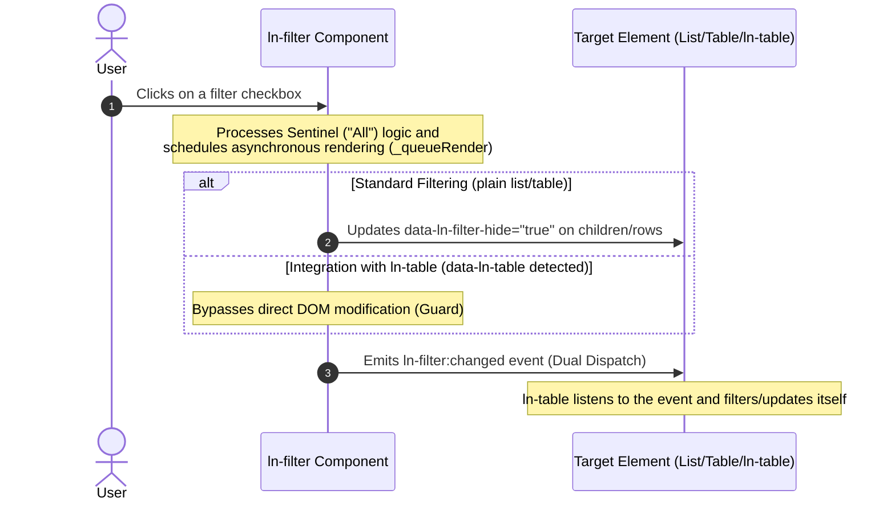

# 🎯 ln-filter

> **Classification:** 🟢 Simple component

---

## 1. Core Behavior & Responsibility

The `ln-filter` component is a zero-dependency, event-driven primitive that manages item visibility states in lists or tables using declarative checkbox controls. It enables multi-criteria filtering (OR logic for options within the same category, and AND logic across different categories/columns).

The JavaScript source is located at [ln-filter.js](../../js/ln-filter/src/ln-filter.js).

Key responsibilities include:
- **Checkbox State Synchronization:** Handles mutual exclusion rules for reset ("All") sentinels and value inputs automatically.
- **Client-side Filtering:** Automatically filters target elements (cards/lists) by matching child attributes (`data-[key]`) and toggling `data-ln-filter-hide="true"`.
- **Plain Table Filtering:** Filters plain `<table>` rows by scanning column cell text using a 0-based column index (`data-ln-filter-col`).
- **Auto-Population Mode:** Generates checkbox options dynamically from unique table column values when a `<template>` is present inside the filter container.
- **State Persistence:** Saves and restores selected filter values in `localStorage` across page reloads when opted-in.
- **Dual Dispatch Notification:** Emits changes via custom events (`ln-filter:changed` and `ln-filter:reset`) on both the filter container and the target element simultaneously.

> [!IMPORTANT]
> **What the component does NOT do (Orthogonality Doctrine):**
> - **No direct API/Network calls:** It operates strictly on DOM elements or dispatches events; it does not perform AJAX/fetch requests.
> - **No local DOM changes for `ln-table`:** When targeting an `ln-table` component (detected via the `data-ln-table` attribute), `ln-filter` functions purely as an event emitter. It bypasses local option generation and direct row-hiding to avoid interfering with `ln-table`'s rendering lifecycle, letting `ln-table` apply filters internally.
> - **No direct inline CSS hiding:** It does not apply `display: none` styles via JavaScript. Instead, it toggles the `data-ln-filter-hide="true"` attribute and relies on Vanilla CSS rules for visual hiding.

---

## 2. Minimal HTML Markup & Usage Variants

### Base HTML Markup (Generic List Filtering)

Binds the filter control to a list container. Target items declare matching `data-*` attributes.

```html
<ul data-ln-filter="employees-list">
  <!-- Reset Sentinel -->
  <li>
    <label>
      <input type="checkbox" data-ln-filter-key="category" data-ln-filter-reset checked>
      All
    </label>
  </li>

  <!-- Value Filters -->
  <li>
    <label>
      <input type="checkbox" data-ln-filter-key="category" data-ln-filter-value="design">
      Design
    </label>
  </li>
  <li>
    <label>
      <input type="checkbox" data-ln-filter-key="category" data-ln-filter-value="dev">
      Development
    </label>
  </li>
</ul>

<ul id="employees-list">
  <li data-category="design">Ana Petrova — UI Designer</li>
  <li data-category="dev">Marko Nikolov — Developer</li>
</ul>
```

### Variant 1: Plain Table Filter with Auto-Population & Persistence

Auto-populates unique filter checkboxes from column index `2` (Department) and persists state in storage.

```html
<ul id="dept-filter" data-ln-filter="users-table" data-ln-filter-col="2" data-ln-persist>
  <li>
    <label>
      <input type="checkbox" data-ln-filter-key="dept" data-ln-filter-reset checked>
      All Departments
    </label>
  </li>
  
  <!-- Template cloned dynamically for unique values -->
  <template>
    <li>
      <label>
        <input type="checkbox"> {{ text }}
      </label>
    </li>
  </template>
</ul>

<table id="users-table">
  <thead>
    <tr><th>ID</th><th>Name</th><th>Department</th></tr>
  </thead>
  <tbody>
    <tr><td>1</td><td>Ana Petrova</td><td>Engineering</td></tr>
    <tr><td>2</td><td>Marko Nikolov</td><td>Design</td></tr>
  </tbody>
</table>
```

### Variant 2: Composition with Popover in `ln-table`

The canonical composition for `ln-table` per-column filters. `ln-filter` dispatches events, and `ln-table` handles filtration.

```html
<!-- Table Header column with filter button -->
<th data-ln-table-sort="string" data-ln-table-filter-col="department">
  Department
  <button class="table-filter" type="button"
          data-ln-table-col-filter
          data-ln-popover-for="filter-dept-popover"
          aria-label="Filter department">
    <svg class="ln-icon" aria-hidden="true"><use href="#ln-filter"></use></svg>
  </button>
</th>

<!-- Popover container outside of the table -->
<div data-ln-popover id="filter-dept-popover">
  <input type="search" placeholder="Search..."
         data-ln-search="filter-dept-list"
         data-ln-search-items="label"
         data-ln-search-debounce="0">

  <ul id="filter-dept-list" data-ln-filter="my-table">
    <li><label><input type="checkbox" data-ln-filter-key="department" data-ln-filter-reset checked> All</label></li>
    <li><label><input type="checkbox" data-ln-filter-key="department" data-ln-filter-value="Engineering"> Engineering</label></li>
    <li><label><input type="checkbox" data-ln-filter-key="department" data-ln-filter-value="Design"> Design</label></li>
  </ul>
</div>
```

---

## 3. Declarative API Contract (Attributes & Events)

### HTML Attributes

| Attribute | Element | Type | Default | Description |
| :--- | :--- | :--- | :--- | :--- |
| `data-ln-filter` | Container root | `String` | *(Required)* | Target container `id` (list, table, or `ln-table`) whose elements are filtered. |
| `data-ln-filter-key` | `<input type="checkbox">` | `String` | `null` | The field name/key to match (corresponds to `data-[key]` on children, or column field name). |
| `data-ln-filter-value` | `<input type="checkbox">` | `String` | `""` | Value to match. Active inputs keep matching items visible. |
| `data-ln-filter-reset` | `<input type="checkbox">` | `Flag` | `false` | Marks the reset sentinel input ("All"). Unchecks all value inputs when checked. |
| `data-ln-filter-col` | Container root | `Number` | `null` | 0-based column index to filter rows in a plain HTML `<table>` by cell content. |
| `data-ln-persist` | Container root | `Flag`/`String` | `false` | Enables state persistence in `localStorage` using the element's `id` or given key. |
| `data-ln-filter-hide` | Target children | `Boolean` | `false` | *State attribute* applied as `data-ln-filter-hide="true"` on elements that do not match the active filters. |

### DOM Events (Events API)

`ln-filter` dispatches events on both the filter container (`this.dom`) and the target element (`document.getElementById(targetId)`) simultaneously (Dual Dispatch).

| Event | Target | Detail (`event.detail`) | Description |
| :--- | :--- | :--- | :--- |
| `ln-filter:changed` | Filter Root + Target | `{ key: string, values: string[] }` | Fired on any change in the selected filter values. |
| `ln-filter:reset` | Filter Root + Target | `{}` | Fired only when transitioning from an active state back to the reset sentinel ("All"). |

---

## 4. CSS Styling & Behavioral Mechanics

### CSS Styling rules

Vanilla CSS rule to handle the visual hiding of items is defined in `ln-filter.scss`:

```css
[data-ln-filter-hide="true"] {
  display: none !important;
}
```

Visual pills/chips variants for lists of filter checkboxes are supported using form layout styles:
- `.pills` / `.pills-outline` / `.pills-segmented` / `.pills-switch` applied to `<ul>` list groups.
- `.pill` / `.pill-outline` for single checkbox item labels.

### Sentinel Logic (Reset Rules)

The reset sentinel checkbox acts as an automatic coordinator:
1. **Checking Sentinel:** Unchecks all value checkboxes in the group.
2. **Checking Value:** Unchecks the sentinel.
3. **Collapse to Sentinel:** If all values in the group are checked, it automatically unchecks them and re-checks the sentinel to simplify filters.
4. **Enforcing Selection:** If the last active value is unchecked, the sentinel is automatically re-checked (preventing an empty selection state).

### Performance and Persistence
- **Batching:** Render calls are batched via a microtask queue (`createBatcher`) to prevent excessive layout recalculations during rapid sequential input changes.
- **Persistence:** If `data-ln-persist` is defined, the state is persisted in `localStorage` under `ln:filter:<path>:<id>`.

---

## 5. Accessibility (ARIA) & Common Pitfalls

### ARIA & Keyboard Navigation
- **Semantic Inputs:** The component relies on native `<input type="checkbox">` elements, which naturally support `Tab` focusing and `Space` toggling.
- **Labels:** Ensure every checkbox input is wrapped in a `<label>` or linked via `aria-label` / `aria-labelledby`.
- **Popover Trigger:** When housed in a popover, the filter trigger button must contain a `data-ln-popover-for="<id>"` and appropriate `aria-label="Filter..."`.

### Common Pitfalls (Anti-Patterns)

> [!CAUTION]
> **1. Updating `input.checked` Programmatically Without Dispatching Events**
> Modifying `input.checked = true` using JavaScript does not trigger browser `change` listeners. You must explicitly dispatch the event:
> ```javascript
> input.checked = true;
> input.dispatchEvent(new Event('change', { bubbles: true }));
> ```

> [!WARNING]
> **2. Missing ID on Persisted Filters**
> When using `data-ln-persist`, the container must declare an `id` or specify a key value in the attribute (e.g. `data-ln-persist="key"`). Otherwise, persistence fails and a console warning is emitted.

> [!IMPORTANT]
> **3. Incorrectly using `data-ln-filter-col` with `ln-table`**
> The `data-ln-filter-col` attribute is strictly for plain HTML tables. Do not use it when targeting an `ln-table` component. For `ln-table`, use `data-ln-filter="<tableId>"` on the filter `<ul>` and `data-ln-table-filter-col="<columnName>"` on the `<th>`.

---

## 6. Sequence Flow Diagram



---

## 7. Related Components

- [ln-table.md](./ln-table.md) — Table component that consumes `ln-filter:changed` to filter table columns.
- [ln-search.md](./ln-search.md) — Search input primitive that works orthogonally alongside `ln-filter`.
- [ln-popover.md](./ln-popover.md) — Popover container used to host column filter dropdowns.
- [ln-toggle.md](./ln-toggle.md) — Simple state toggler.
