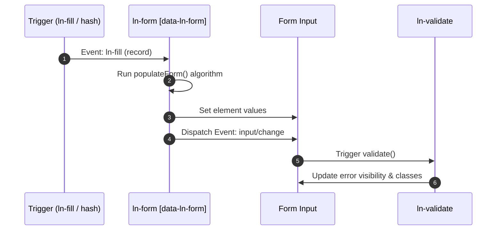

# 📝 ln-form

> **Classification:** 🟢 Simple component / Form Coordinator

---

## 1. Core Behavior & Responsibility

- Automates the population of input values from data records (Form Population).
- Handles RESTful action URI interpolation and method spoofing for update operations.
- Located in [`js/ln-form/src/ln-form.js`](../../js/ln-form/src/ln-form.js).

> [!IMPORTANT]
> **What the component does NOT do (Orthogonality Doctrine):**
> - **Does NOT intercept submit events or run validation** — the validation gate is owned by [`ln-validate`](./ln-validate.md); submit interception (write-claim) is owned by [`ln-data-coordinator`](./ln-data-coordinator.md).
> - **Does NOT perform network requests** — AJAX or other HTTP transport is delegated to [`ln-ajax`](./ln-ajax.md) or [`ln-data-coordinator`](./ln-data-coordinator.md).

---

## 2. Minimal HTML Markup & Usage Variants

### Base HTML Markup

```html
<form id="user-form" data-ln-form action="/admin/users" method="POST">
    <div class="form-element">
        <label for="username">Username</label>
        <input id="username" name="username" type="text" required />
    </div>
    <ul class="form-actions">
        <li><button type="button" class="btn btn-ghost">Cancel</button></li>
        <li><button type="submit" class="btn btn-primary">Save</button></li>
    </ul>
</form>
```

### Variant 1: Populate Only

Form containing fields to be populated automatically when an external event triggers `ln-fill`.

#### HTML Markup
```html
<form id="user-form" data-ln-form action="/admin/users" method="POST">
    <input type="hidden" name="id" />
    <label for="username">Username</label>
    <input id="username" name="username" type="text" />
</form>
```

### Variant 2: RESTful Edit Mode (Method Spoofing)

Configured for both creation and modification. Uses dynamic action path templates and spoofing inputs.

#### HTML Markup
```html
<form id="user-form" data-ln-form action="/admin/users" method="POST"
      data-ln-form-action-edit="/admin/users/:id"
      data-ln-form-action-method="PUT">
    <input type="hidden" name="id" />
    <label for="email">Email</label>
    <input id="email" name="email" type="email" />
</form>
```

---

## 3. Declarative API Contract (Attributes & Events)

### Attributes Table

| Attribute | Element | Type / Values | Default | Description |
|---|---|---|---|---|
| `data-ln-form` | `<form>` | Flag | — | Initializes the `ln-form` component. |
| `data-ln-form-action-edit` | `<form>` | `String` | — | Path pattern used in edit mode. Overrides the form action. `:id` is replaced by the actual ID. |
| `data-ln-form-action-method` | `<form>` | `String` | `"PUT"` | HTTP method placed in the hidden `_method` field when editing. |
| `data-ln-fill-as` | Input control | `String` | — | Maps a record key to this input if it differs from the `name` attribute. |
| `data-ln-form-scope` | `<form>` | `String` | — | Associates the form with a specific `data-ln-data-coordinator`. |

### Programmatic JS API

| Helper | Signature | Returns | Description |
|---|---|---|---|
| `form.lnForm.fill` | `(record: Object)` | `void` | Populates form controls with record fields. Triggers `input`/`change` events. |
| `form.lnForm.destroy` | `()` | `void` | Restores form attributes and cleans up event handlers. |

### Events API

| Event | Direction | Cancelable | Description | `detail` Object |
|---|---|---|---|---|
| `ln-form:destroyed` | Emits | No | Dispatched when the form instance is destroyed. | `{ target: HTMLFormElement }` |
| `ln-fill` | Listens | No | Populates form elements with data or resets them if `null`. | `{ record: Object \| null }` |

---

## 4. CSS Styling & Behavioral Concept

- **Headless Component:** `ln-form` has no visual classes of its own. Visual styling is defined in `scss/components/_form.scss` for general HTML form elements.
- **Population Algorithm:**
  When `.fill(data)` runs, it scans fields with `name` or `data-ln-fill-as`:
  - *Text / Hidden / Textarea:* Value set to matching key value.
  - *Checkboxes:* Selects elements matching a boolean value, comma-separated string, or array.
  - *Radio & Multiple Selects:* Automatically checked/selected.
  - Triggers `input` or `change` on elements to ensure `ln-validate` is notified.
- **Method Spoofing:** When transitioning to edit mode, a hidden `<input type="hidden" name="_method">` is injected with the configured method name (e.g. `PUT`).

---

## 5. Accessibility (ARIA) & Common Pitfalls

### ARIA & Keyboard
- `ln-form` does not alter focus or key behavior. Form actions (`Cancel`, `Submit`) should use semantic keyboard navigation.

### Common Pitfalls & Anti-patterns

> [!CAUTION]
> 1. **Updating values directly in JS:** Changing `input.value = '...'` does not fire validation events. Always use `form.lnForm.fill(data)` or manually dispatch `input` events.
> 2. **Omiting button types:** Always define `type="button"` on non-submit buttons inside a form to prevent implicit submit behavior.

---

## 6. Flow Diagram & Lifecycle



---

## 7. Related Components

- [`ln-validate.md`](./ln-validate.md) — Adds reactive validation gates.
- [`ln-data-coordinator.md`](./ln-data-coordinator.md) — Intercepts form submits for scoped forms.
- [`ln-modal.md`](./ln-modal.md) — Modal container often wrapping dynamic forms.
