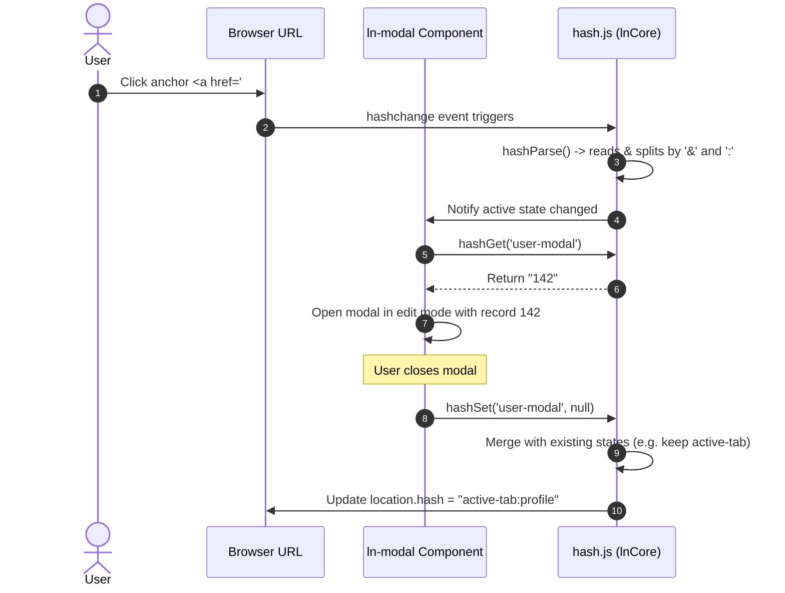

# 🔑 ln-hash

> **Classification:** ⚛️ Service (Layer 3 - State Serialization Codec)

---

## 1. Core Behavior & Responsibility

The `ln-hash` codec (defined in [hash.js](../../js/ln-core/hash.js) and exported via `window.lnCore`) is a utility that manages namespaced interface states inside the browser's URL fragment (Hash).

*   **Namespaced Segment Isolation:** Manages states in the form of `#nsA:valA&nsB:valB`. Each component interacts strictly with its own namespace. When writing to the hash, it preserves all other segments, preventing components from wiping out each other's state (e.g., opening a modal does not reset the active tab).
*   **Three-State Value Model:**
    *   *Absent:* If the namespace is not in the URL, `hashGet` returns `null` (e.g., the modal is closed).
    *   *Present, Empty:* If the namespace is present without a value (e.g., `#profile`), `hashGet` returns `""` (e.g., the modal is open in "Create" mode).
    *   *Present, with Parameter:* If the namespace contains a parameter (e.g., `#profile:142`), `hashGet` returns `"142"` (e.g., the modal is open in "Edit" mode for ID 142).
*   **Loop Prevention:** Compares the next serialized string with the active URL fragment before writing. If they are identical, the write is aborted to avoid infinite triggering of browser `hashchange` events.
*   **Hash Link Guard:** Exposes `hashLinkClick(e)` which intercepts clicks on hash-driven links. It ignores modifier clicks (Ctrl/Cmd/Shift click or middle clicks) to allow native open-in-new-tab actions, while calling `preventDefault()` on standard left clicks to pass routing control to the component.

> [!IMPORTANT]
> **What the component does NOT do (Orthogonality Doctrine):**
> - **No Direct Navigation Routing:** Does not handle page-level routing logic (use [`ln-router`](./ln-router.md) instead).
> - **No State Management logic:** Does not determine what the state *means*, it only manages how it is serialized and read from the URL.

---

## 2. Minimal HTML Markup & Usage Variants

Because `ln-hash` is a pure logic codec, it has no HTML visual markup. It is utilized in JavaScript files or triggered via semantic URL fragments in anchor links:

```html
<!-- Links that update the active modal and active tab states concurrently -->
<a href="#user-modal:142&active-tab:profile">Edit Profile</a>

<a href="#user-modal">Add New User</a>
```

### Usage in JavaScript Components

```javascript
import { hashGet, hashSet, hashLinkClick } from '../../ln-core/hash.js';

// Read state
const userId = hashGet('user-modal'); // Returns "142", "", or null

// Update state while preserving others
hashSet('active-tab', 'settings'); // URL becomes: #user-modal:142&active-tab:settings

// Clear state segment
hashSet('user-modal', null); // URL becomes: #active-tab:settings
```

---

## 3. Declarative API Contract (Attributes & Events)

### Programmatic JS API

| Helper | Signature | Returns | Description |
|---|---|---|---|
| `hashParse` | `(str?: String)` | `Object` | Parses a hash string (defaults to `location.hash`) into a key-value object map. |
| `hashGet` | `(ns: String)` | `String` \| `null` | Returns the state value of the given namespace following the three-state model. |
| `hashSet` | `(ns: String, value: String\|null)` | `void` | Updates or adds a namespace value to the URL. Passing `null` or `undefined` deletes the segment. |
| `hashLinkClick` | `(e: MouseEvent)` | `Boolean` | Guard that calls `e.preventDefault()` on ordinary clicks (returning `true`) or allows native browser new-tab actions on modifier clicks (returning `false`). |

---

## 4. CSS Styling & Behavioral Concept

As a headless logical utility, `ln-hash` contains no styles or visual representations.

---

## 5. Accessibility (ARIA) & Common Pitfalls

### ARIA & Keyboard

- By routing hash links through `hashLinkClick`, assistive technologies can natively trigger standard new-tab actions and keyboard shortcuts, since the anchors retain valid href attributes pointing to fragments.

### Common Pitfalls & Anti-patterns

> [!CAUTION]
> 1. **Direct Hash Overwrites:** Using raw `location.hash = '#my-state'` is strictly forbidden. Doing so will completely wipe out the states stored by other components. Always use `hashSet('my-state', value)` to safely merge parameters.
> 2. **Double Decoding:** `hashGet` already decodes parameters via `decodeURIComponent`. Do not attempt to manually decode parameters after reading them.

---

## 6. Flow Diagram & Lifecycle



---

## 7. Related Components

- [`ln-modal`](./ln-modal.md) — Uses the codec to save its open/closed state for deep-linking.
- [`ln-tabs`](./ln-tabs.md) — Persists the active tab in the URL hash.
- [`ln-router`](./ln-router.md) — Listens to hash updates but ignores namespaced segments managed by `ln-hash` to avoid full-page reloads.
