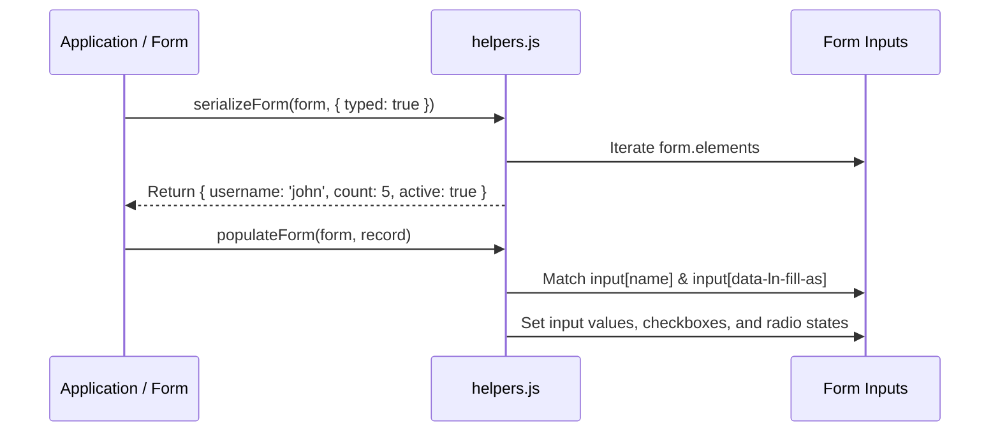

# 🛠️ ln-helpers

> **Classification:** ⚙️ Service (Layer 3 - DOM & Form Operations)

---

## 1. Core Behavior & Responsibility

`ln-helpers` implements the core DOM utility functions, component registration pipeline, form processing tools, and template engines used across all `ln-ashlar` components and project coordinators.

The JavaScript source is located at [helpers.js](../../js/ln-core/helpers.js).

Key responsibilities include:
- **Component Lifecycle Registration (`registerComponent`):** Registers component classes with MutationObserver-based lifecycle management (childList, attribute observation, auto-instantiation, and automatic `destroy()` teardown on DOM removal).
- **Declarative Attribute & Field Binding (`fill`, `lnFill`):** Maps data properties onto elements declaring `data-ln-field`, `data-ln-attr`, `data-ln-show`, or `data-ln-class`, and broadcasts `ln-fill` events.
- **Form Data Pipeline (`serializeForm`, `populateForm`, `resolveFormMethod`, `interceptValueProperty`, `readValue`):** Extracts typed JavaScript objects from HTML forms, populates forms back from records, intercepts input value getters/setters, and reads raw machine values.
- **Template Operations (`cloneTemplate`, `cloneTemplateScoped`, `fillTemplate`, `renderList`):** Clones `<template>` elements and interpolates text nodes and attribute placeholders (`{{ prop }}`).
- **Network, Headers & URL Helpers (`shouldInterceptLink`, `buildUrl`, `getHeaders`, `parseHeaders`):** Provides URL path joining, link interception for SPA routers, header compilation, and header parsing.
- **Data Mapper & Locale Fallback Registries (`registerDataMapper`, `getDataMapper`, `registerLocaleFallback`, `getLocaleFallback`):** Manages data translation mappers and Macedonian/regional date-month dictionaries.

> [!IMPORTANT]
> **What the module does NOT do (Orthogonality Doctrine):**
> - **State Storage:** `ln-helpers` functions are pure operations; they do not maintain internal component state.
> - **Event Listening Gates:** It provides event dispatchers (`dispatch`, `dispatchCancelable`), but does not attach long-lived event listeners (except the once-per-page `ln-fill` delegate).

---

## 2. Minimal HTML Markup & Usage Variants

### Component Registration Example

```javascript
import { registerComponent } from '../../ln-core';

// Automatically instantiates MyWidget on page load & dynamic MutationObserver insertion
registerComponent('[data-ln-widget]', 'lnWidget', MyWidget, 'ln-widget', {
    extraAttributes: ['data-ln-status'],
    onAttributeChange: (dom, attrName) => dom.lnWidget?._syncAttribute(attrName)
});
```

### Declarative DOM Binding (`fill`)

```html
<div id="user-card">
    <h3 data-ln-field="name">---</h3>
    <span data-ln-attr="data-status:status" data-ln-class="active:isActive">---</span>
    <p data-ln-show="bio">Bio: <span data-ln-field="bio">---</span></p>
</div>
```

```javascript
import { fill } from '../../ln-core';

const card = document.getElementById('user-card');
fill(card, {
    name: 'Alex Smith',
    status: 'online',
    isActive: true,
    bio: 'Software engineer'
});
```

### Form Serialization & Population

```javascript
import { serializeForm, populateForm } from '../../ln-core';

const form = document.querySelector('form');

// Extract typed data object from form
const data = serializeForm(form, { typed: true });
// { name: "Jane", age: 30, isAdmin: true }

// Populate form fields back from record
populateForm(form, { name: "Jane", age: 31, isAdmin: false });
```

---

## 3. Declarative API Contract (Attributes & Events)

### Declarative Binding Attributes (Processed by `fill`)

| Attribute | Format | Description |
|---|---|---|
| `data-ln-field` | `data-ln-field="property"` | Sets `textContent` to `data[property]`. |
| `data-ln-attr` | `data-ln-attr="attr:property, attr2:prop2"` | Sets DOM attributes to `data[property]`. |
| `data-ln-show` | `data-ln-show="property"` | Toggles `.hidden` CSS class based on truthiness of `data[property]`. |
| `data-ln-class` | `data-ln-class="className:property"` | Toggles CSS class `className` based on truthiness of `data[property]`. |
| `data-ln-fill-as` | `data-ln-fill-as="key"` | Overrides input `name` attribute matching during `populateForm`. |

### Programmatic JS API (Complete Inventory of 28 Exports)

| Helper | Signature | Returns | Description |
|---|---|---|---|
| `registerComponent` | `(selector: String, attribute: String, ComponentFn: Class\|Function, componentTag?: String, options?: Object)` | `Function` | Registers a component constructor with MutationObserver subtree tracking, auto-instantiation, attribute change callbacks (`onAttributeChange`), and automatic `destroy()` teardown on node removal. |
| `cloneTemplate` | `(name: String, componentTag?: String)` | `DocumentFragment\|null` | Clones a `<template data-ln-template="name">` element. Caches template lookups after first retrieval. |
| `cloneTemplateScoped` | `(root: HTMLElement, name: String, componentTag?: String)` | `DocumentFragment\|null` | Searches for a scoped `<template data-ln-template="name">` within `root` before falling back to document-global lookup. |
| `fillTemplate` | `(clone: DocumentFragment\|HTMLElement, data: Object)` | `DocumentFragment\|HTMLElement` | Replaces `{{ prop }}` placeholders inside text nodes and element attribute values. |
| `fill` | `(root: HTMLElement\|DocumentFragment, data: Object)` | `HTMLElement\|DocumentFragment` | Executes declarative attribute binding (`data-ln-field`, `data-ln-attr`, `data-ln-show`, `data-ln-class`) inside `root`. |
| `lnFill` | `(container: HTMLElement, record: Object\|null)` | `HTMLElement` | Dispatches `ln-fill` custom event across `[data-ln-form]` and `[data-ln-fillable]` descendants. `null` triggers form/display clear. |
| `renderList` | `(container: HTMLElement, items: Array, templateName: String, keyFn: Function, fillFn: Function, componentTag?: String)` | `void` | Performs keyed list reconciliation on `container` matching `data-ln-key`. |
| `dispatch` | `(element: HTMLElement, eventName: String, detail?: Object)` | `void` | Dispatches a bubbling `CustomEvent`. |
| `dispatchCancelable` | `(element: HTMLElement, eventName: String, detail?: Object)` | `CustomEvent` | Dispatches a cancelable bubbling `CustomEvent`. Returns event object to check `defaultPrevented`. |
| `requestData` | `(component: Object, eventName: String, keyName: String)` | `void` | Re-filters, sorts, and re-renders list/table components, then dispatches data request event with current sort, filter, and search state. |
| `buildDict` | `(root: HTMLElement, selector: String)` | `Object` | Extracts dictionary text values from hidden elements matching `[selector]` and removes them from DOM. |
| `guardBody` | `(setupFn: Function, componentTag: String)` | `void` | Defers execution until `DOMContentLoaded` if `document.body` is not yet available. |
| `findElements` | `(root: HTMLElement, selector: String, attribute: String, ComponentClass: Class)` | `void` | Instantiates `ComponentClass` on all matching elements under `root` that lack `el[attribute]`. |
| `isVisible` | `(el: HTMLElement)` | `Boolean` | Returns true if element has layout bounds or bounding client rects. |
| `readValue` | `(el: HTMLElement)` | `String` | Reads `data-ln-value` attribute if present, otherwise returns trimmed `textContent`. |
| `interceptValueProperty` | `(dom: HTMLElement, descriptor: PropertyDescriptor, callbacks: { get?: Function, set?: Function })` | `void` | Intercepts programmatic `value` getter/setter on inputs to sync custom formatting. |
| `serializeForm` | `(form: HTMLFormElement, opts?: { typed?: Boolean, exclude?: String })` | `Object` | Extracts form inputs into a plain JavaScript object. |
| `populateForm` | `(form: HTMLFormElement, data: Object)` | `Array<HTMLElement>` | Fills form inputs matching field names or `data-ln-fill-as` attributes. |
| `resolveFormMethod` | `(form: HTMLFormElement)` | `String` | Determines effective HTTP method (`_method` input value or `form.method`). |
| `getLocale` | `(el?: HTMLElement)` | `String` | Detects document or element BCP 47 locale tag. |
| `registerLocaleFallback` | `(langPrefix: String, dictionary: Object)` | `void` | Registers fallback month/day dictionaries for language prefix (e.g. `"mk"`). |
| `getLocaleFallback` | `(lang: String)` | `Object\|null` | Retrieves registered fallback dictionary for a language code. |
| `shouldInterceptLink` | `(event: MouseEvent, anchor: HTMLAnchorElement)` | `Boolean` | Checks if a link click should be intercepted by in-app SPA routers. |
| `buildUrl` | `(...segments: Array<String>)` | `String` | Joins URL path segments, stripping duplicate slashes. |
| `getHeaders` | `(customHeaders?: Object, auth?: String)` | `Object` | Compiles JSON request headers. |
| `parseHeaders` | `(str: String, componentName?: String)` | `Object` | Safely parses JSON header strings. |
| `registerDataMapper` | `(name: String, mapper: { ingress: Function, egress: Function })` | `void` | Registers domain data mappers for record transformation in connectors/stores. |
| `getDataMapper` | `(name: String)` | `Object` | Retrieves a registered data mapper (or identity fallback). |

### Events API

| Event | Direction | Cancelable | Description | `detail` Object |
|---|---|---|---|---|
| `ln-fill` | Emits | No | Dispatched by `lnFill` to trigger data population or form reset across containers. | `Object` (record) \| `null` |

---

## 4. CSS Styling & Behavioral Concept

The `fill` helper interacts with CSS via class toggling:
- Elements targeted by `data-ln-show` receive or lose the `.hidden` class depending on data value evaluation:

```css
.hidden {
    display: none !important;
}
```

---

## 5. Accessibility (ARIA) & Common Pitfalls

- **Decoupled Form Keys:** Use `data-ln-fill-as="key"` on form inputs when the backend record property name differs from the input's HTML `name` attribute. `populateForm` reads `data-ln-fill-as` first.
- **Common Pitfall — Untyped Checkbox Values:** In default (untyped) `serializeForm(form)` mode, checkboxes serialize to array values (`["on"]`) rather than boolean flags (`true`/`false`). Always pass `{ typed: true }` when building JSON payloads.

---

## 6. Flow Diagram & Lifecycle



---

## 7. Related Components

- [`ln-core`](./ln-core.md) — Base module that re-exports all helper utilities.
- [`ln-form`](./ln-form.md) — Form wrapper component that uses `serializeForm` and `populateForm`.
- [`ln-fill`](./ln-fill.md) — Simple data-fill component wrapper.
