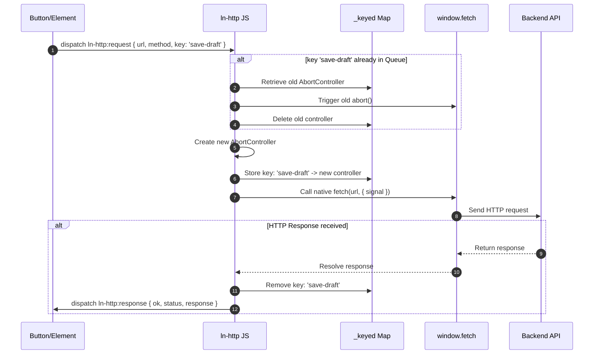

# 🌐 ln-http

> **Classification:** ⚛️ Service (Layer 3 - Network/Fetch Middleware)

---

## 1. Core Behavior & Responsibility

The `ln-http` utility is a network middleware that wraps the browser's global `window.fetch` to prevent race conditions, avoid data conflicts, and handle request deduplication. It is defined in [ln-http.js](../../js/ln-http/src/ln-http.js).

It operates through two parallel paths:
*   **Path A — Transparent Fetch Interception (GET/HEAD):** Intercepts all native calls to `fetch()`. If a new GET or HEAD request is sent to the exact same URL while a previous request is still in-flight, the previous request is automatically cancelled (`abort()`). Non-idempotent methods (POST, PUT, DELETE, etc.) are never auto-cancelled in this path to prevent mutating actions from being aborted.
*   **Path B — Event-Driven API with Explicit Key (Any Method):** Listens globally for the `ln-http:request` event. A request can be dispatched with an explicit `key`. If a new request arrives with the same key (regardless of method, including POST), the previous in-flight request is immediately aborted. This is particularly useful for features like drag-and-drop reordering or autosaving where only the final state needs to reach the server.

> [!IMPORTANT]
> **What the component does NOT do (Orthogonality Doctrine):**
> - **No Header Manipulation:** Does not automatically append CSRF tokens, session IDs, or authentication headers (headers must be set by the caller or specialized connectors).
> - **No Response Parsing:** Does not consume or parse the Response body (it yields the raw `Response` back to the caller).
> - **No Retries/Timeouts:** Does not implement retry logic or request timeouts (timeouts must be handled via an externally supplied `AbortSignal`).

---

## 2. Minimal HTML Markup & Usage Variants

Because `ln-http` is a headless service, it has no direct HTML markup. Other components continue to call `fetch()` natively, or interface with `ln-http` using DOM events:

### Path A: Automatic Interception of Native `fetch`

```javascript
// Two rapid searches. The first GET is automatically aborted.
fetch('/api/search?q=a');
fetch('/api/search?q=ab'); // Aborts the previous GET request
```

### Path B: Explicit Deduplication via Event API

Used for non-idempotent updates (like POST or PUT mutations) that must be throttled or debounced.

```javascript
const triggerEl = document.getElementById('save-button');

// Dispatching a deduplicated request
triggerEl.dispatchEvent(new CustomEvent('ln-http:request', {
    bubbles: true, // Must bubble to document
    detail: {
        url: '/api/posts/reorder',
        method: 'POST',
        body: JSON.stringify({ items: [1, 3, 2] }),
        key: 'reorder-action' // Identical key aborts any preceding in-flight requests
    }
}));

// Listening for the response
triggerEl.addEventListener('ln-http:response', function(e) {
    console.log('Response status:', e.detail.status, 'OK:', e.detail.ok);
});

triggerEl.addEventListener('ln-http:error', function(e) {
    console.error('Network error occurred:', e.detail.error);
});
```

---

## 3. Declarative API Contract (Attributes & Events)

### Events API

`ln-http` listens for `ln-http:request` on `document` and emits response/error events on the triggering element.

| Event | Direction | Cancelable | Description | `detail` Object |
|---|---|---|---|---|
| `ln-http:request` | Listens | No | Dispatched by a consumer (must `bubble` to `document`) to run a deduplicated request; response/error fire back on the dispatching element. | `{ url, method?, body?, key?, signal? }` |
| `ln-http:response` | Emits | No | Fired on the triggering element when a request completes (any HTTP status, e.g. 200/404/500). | `{ ok: Boolean, status: Number, response: Response }` |
| `ln-http:error` | Emits | No | Fired on the triggering element on network failure (DNS/CORS/loss); never fires on manual or automatic abort. | `{ ok: false, status: 0, error: Error }` |

The `ln-http:request` `detail` fields:

- **`url`** (`String`, required) — the target URL of the request.
- **`method`** (`String`, default `'GET'`, or `'POST'` when a body is present) — the HTTP method; uppercased automatically.
- **`body`** (`any`, default `undefined`) — the request body payload.
- **`key`** (`String`, default `undefined`) — optional deduplication key (Path B); a new request with the same key aborts the previous in-flight one.
- **`signal`** (`AbortSignal`, default `undefined`) — external AbortSignal combined with the internal controller.

### Programmatic JS API (via `window.lnHttp`)

| Helper | Signature | Returns | Description |
|---|---|---|---|
| `lnHttp.cancel` | `(url: String)` | `Boolean` | Aborts any Path A request matching the URL. Returns `true` if a request was cancelled. |
| `lnHttp.cancelByKey` | `(key: String)` | `Boolean` | Aborts the Path B request matching the key. Returns `true` if a request was cancelled. |
| `lnHttp.cancelAll` | `()` | `void` | Aborts all active requests across both Path A and Path B. |
| `lnHttp.inflight` | `(getter)` | `Array` | Returns an array of currently active requests: `{ method, url }` or `{ key }`. |
| `lnHttp.destroy` | `()` | `void` | Restores original `fetch`, removes event listener, and clears queues. |

---

## 4. CSS Styling & Behavioral Concept

`ln-http` is a headless logic service and does not contain any visual CSS styling.

---

## 5. Accessibility (ARIA) & Common Pitfalls

### ARIA & Keyboard

- Although headless, by deduplicating race-condition requests, `ln-http` ensures that screen readers are not confused by outdated updates that arrive out-of-order in the DOM.

### Common Pitfalls & Anti-patterns

> [!CAUTION]
> 1. **Missing Event Bubbling:** When dispatching `ln-http:request`, always include `{ bubbles: true }`. Because `ln-http` listens at the document level, non-bubbling events will never be detected.
> 2. **Double Consumption of Response Stream:** The `response` property passed in `ln-http:response` is the raw browser `Response` stream. It can be read (via `.json()`, `.text()`, etc.) only **once**. Reading it twice will throw a `TypeError`.
> 3. **Unhandled AbortError in consumer code:** If your code uses `fetch` directly with try-catch and depends on `AbortController`, you must explicitly check `err.name === 'AbortError'` and ignore it, rather than showing it to users as a network error.

---

## 6. Flow Diagram & Lifecycle



---

## 7. Related Components

- [`ln-ajax`](./ln-ajax.md) — Relies on native `fetch` calls which transparently benefit from Path A GET/HEAD deduplication.
- [`ln-api-queue`](./ln-api-queue.md) — Manages offline request queues that rely on network status monitored at the `ln-http` layer.
- [`ln-data-coordinator`](./ln-data-coordinator.md) — Integrates with `ln-http` to synchronize local cache databases with backend servers.
