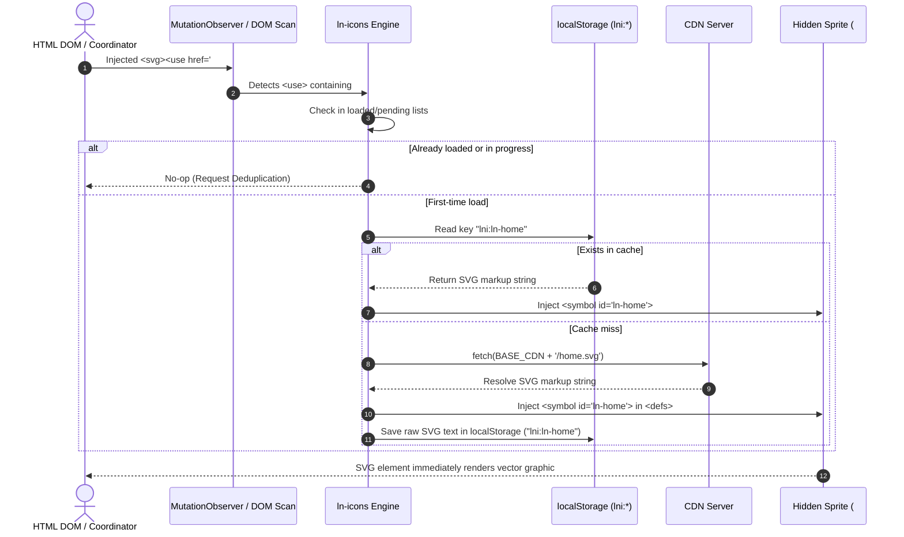

# 🎨 ln-icons

> **Classification:** ⚛️ Service (Layer 3 - SVG Sprite Loader Service)

---

## 1. Core Behavior & Responsibility

The `ln-icons` utility is an on-demand SVG sprite manager. It loads SVG vector definitions dynamically as they are requested in the DOM, caching them locally in `localStorage` to eliminate subsequent network latency. It is defined in [ln-icons.js](../../js/ln-icons/src/ln-icons.js).

*   **Declarative Detection:** Monitors the DOM for `<use href="#ln-...">` and `<use href="#lnc-...">` targets.
*   **On-Demand Fetching:** Fetches only the requested SVG assets from a CDN (or a custom company directory) dynamically.
*   **LocalStorage Caching:** Caches loaded SVG paths locally under the prefix `lni:` to guarantee instant load times on subsequent views.
*   **Central Sprite Injection:** Automatically compiles and appends a hidden SVG sprite wrapper (`#ln-icons-sprite`) at the start of the `<body>`, transforming fetched SVGs into reusable `<symbol>` elements.
*   **Deduplication:** Prevents multiple parallel network requests for the same icon by tracking pending assets.

> [!IMPORTANT]
> **What the component does NOT do (Orthogonality Doctrine):**
> - **No Event Trigger Handling:** Does not bind click events or handle UI interactions (interactivity is handled by target buttons, toggle anchors, etc.).
> - **No Hardcoded Color Styling:** Does not force icon colors; outlines use `stroke="currentColor"` to inherit text color from parent containers.
> - **No JS-Driven Element Creation:** Does not build SVG icons in JS; icons are declared natively in HTML using `<svg><use href="..."></use></svg>`.

---

## 2. Minimal HTML Markup & Usage Variants

### Variant 1: Base Tabler Icon (`#ln-`)

Standard icon from the Tabler Icons library. Inherits its stroke color from the parent text element.

```html
<svg class="ln-icon" aria-hidden="true">
  <use href="#ln-home"></use>
</svg>
```

### Variant 2: Custom / Branded Icon (`#lnc-`)

Used for company logos or custom multi-colored SVGs loaded via a custom CDN configuration (`window.LN_ICONS_CUSTOM_CDN`).

```html
<script>
  // Set custom CDN before loading ln-ashlar
  window.LN_ICONS_CUSTOM_CDN = "https://cdn.mycompany.com/assets/icons";
</script>

<svg class="ln-icon" aria-hidden="true">
  <use href="#lnc-company-logo"></use>
</svg>
```

### Variant 3: Controlled Icon Sizing

Icon scale is governed by modifier utility classes: `.ln-icon--sm` (1rem), `.ln-icon--lg` (1.5rem), `.ln-icon--xl` (4rem).

```html
<!-- Large icon -->
<svg class="ln-icon ln-icon--lg" aria-hidden="true">
  <use href="#ln-settings"></use>
</svg>
```

---

## 3. Declarative API Contract (Attributes & Events)

### HTML & SVG Attributes

| Attribute | Element | Value Format | Description |
|---|---|---|---|
| `href` | `<use>` | `#ln-{name}` \| `#lnc-{name}` | Prefix determines source: `#ln-` points to Tabler CDN, `#lnc-` points to custom company directory. |
| `class` | `<svg>` | `ln-icon`, `ln-icon--sm`, `ln-icon--lg`, `ln-icon--xl`, `ln-chevron` | Utility sizing and rotation classes. `ln-icon` sets default size to `1.25rem`. |
| `aria-hidden` | `<svg>` | `"true"` | Hides decorative icons from screen readers. |

### Global Window Configuration

These properties must be declared in the global scope (`window`) *before* the script is executed:

| Config Parameter | Default Value | Description |
|---|---|---|
| `window.LN_ICONS_CDN` | `'https://cdn.jsdelivr.net/npm/@tabler/icons@3.31.0/icons/outline'` | Base URL for Tabler outline SVG icons. |
| `window.LN_ICONS_CUSTOM_CDN` | `""` | Base URL for custom `#lnc-` brand assets. Custom CDN is disabled if left empty. |

---

## 4. CSS Styling & Behavioral Concept

Styles are managed through the SCSS layout file `scss/config/_icons.scss`.

### Core SCSS Layout

```scss
svg.ln-icon {
  display: inline-block;
  --icon-size: 1.25rem; // Default size
  width: var(--icon-size);
  height: var(--icon-size);
  flex-shrink: 0;
  vertical-align: middle;
}

svg.ln-icon.ln-icon--sm { --icon-size: 1rem; }
svg.ln-icon.ln-icon--lg { --icon-size: 1.5rem; }
svg.ln-icon.ln-icon--xl { --icon-size: 4rem; }

// Toggle chevron transition helper
svg.ln-icon.ln-chevron {
  transition: transform 0.2s ease;
  
  [aria-expanded="true"] & {
    transform: rotate(180deg);
  }
}
```

---

## 5. Accessibility (ARIA) & Common Pitfalls

### ARIA & Keyboard

- **Decorative Icons:** If an icon is placed next to self-descriptive text or within a descriptive button, always apply `aria-hidden="true"` to prevent screen readers from announcing redundant details.
- **Standalone Icons:** If a button or link has only an icon inside, you MUST set an `aria-label` on the parent interactive element:
  ```html
  <button type="button" aria-label="Delete item">
    <svg class="ln-icon" aria-hidden="true"><use href="#ln-trash"></use></svg>
  </button>
  ```

### Common Pitfalls & Anti-patterns

> [!CAUTION]
> 1. **Omiting the `ln-icon` class:** Browser SVG elements default to expanding to 100% width and height of their parent. Omiting the `ln-icon` class will cause the SVG to render in a giant, broken layout.
> 2. **Missing Custom CDN:** Attempting to render `#lnc-` custom icons without configuring `window.LN_ICONS_CUSTOM_CDN` beforehand will cause the fetch request to fail, leaving an empty space in the UI.
> 3. **Lower-level innerHTML/createElement exception:** In order to build the hidden `#ln-icons-sprite` dynamically in the DOM, `ln-icons` leverages `document.createElementNS` and parses fetched vector contents via `.innerHTML`. This is a conscious low-level framework design choice to support on-demand SVG caching, and does not warrant modification.

---

## 6. Flow Diagram & Lifecycle



---

## 7. Related Components

- [`ln-confirm`](./ln-confirm.md) — Swaps the `href` attribute on the `<use>` node dynamically during user confirmation prompts.
- [`ln-toggle`](./ln-toggle.md) — Drives the rotation of the `.ln-chevron` class as toggle targets expand.
- [`ln-toast`](./ln-toast.md) — Embeds `#ln-x` close icons dynamically inside notification templates.
- [`ln-table`](./ln-table.md) — Leverages `#ln-arrows-sort` sort icons inside dynamic table headers.
