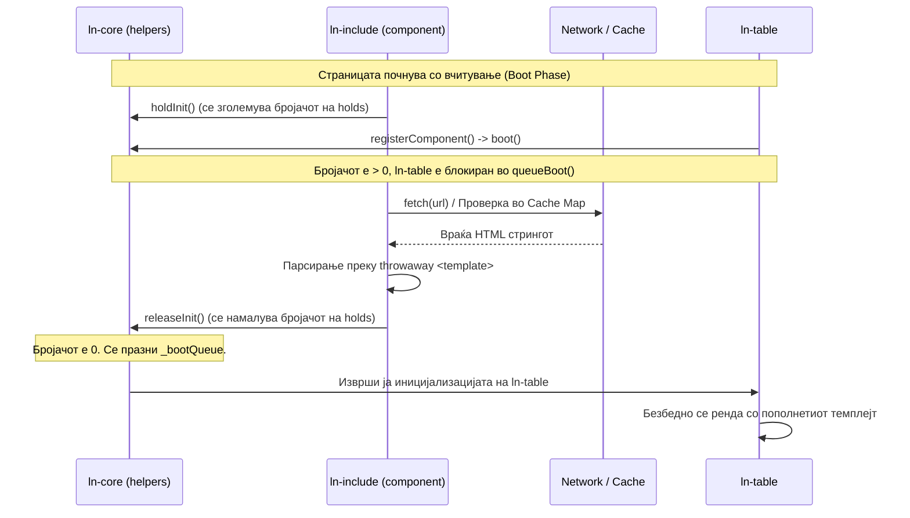

# 📦 ln-include

> **Класификација:** 🟢 Едноставна компонента (Layer 1)

---

## 1. Заднинско дејство и одговорност

- **Краток опис:** Овозможува содржината на еден `<template>` елемент да се вчита од надворешен HTML фајл асинхроно, при што темплејтот го задржува својот идентитет во DOM-от. Ова овозможува споделување на темплејти (пр. редови за табели, празни состојби, рути) на проекти без build-чекор.
- **Ортогоналност (Што компонентата НЕ прави):**
  - Не го менува однесувањето на `ln-router` или другите компоненти. Тие продолжуваат да го клонираат темплејтот по име преку `cloneTemplate`.
  - Не ги иницијализира компонентите внатре во вчитаната содржина; тоа го прави глобалниот `MutationObserver` во `ln-core` откако тие ќе влезат во DOM.
  - Не ги прекинува споделените мрежни барања преку `AbortController` за да не влијае на други инстанци кои го користат истиот URL.

---

## 2. Минимален HTML Маркап и Варијанти на Употреба

### Базен HTML маркап

Се дефинира празен `<template>` со атрибутите `data-ln-template` (за именување) и `data-ln-include` (за вчитување):

```html
<template data-ln-template="documents-row" data-ln-include="/tpl/documents-row.html"></template>
```

### Варијанти на употреба

#### Користење за вчитување на изгледи за рути (`ln-router`)

Содржината на цела рута може да се вчита од екстерен фајл. Вгнездените темплејти внатре во парцијалот се исто така поддржани:

```html
<template data-ln-route="/users" data-ln-route-target="main" data-ln-include="/views/users.html"></template>
```

---

## 3. Декларативен API Договор (Атрибути и Настани)

### Табела со атрибути

| Атрибут | Тип | Стандардна вредност | Опис |
|---|---|---|---|
| `data-ln-include` | `String (URL)` | `null` | Патека до екстерниот HTML фајл кој треба да се вчита. Дозволено е само на `<template>` елементи. |

### Настани (Events API)

Компонентата ги диспачира следните настани кои меуруваат (`bubbles: true`):

| Настан | Насока | Опис | `detail` објект |
|---|---|---|---|
| `ln-include:loaded` | Диспачира | Се активира кога содржината е успешно вчитана, парсирана и додадена во темплејтот. | `{ target: HTMLElement, url: String }` |
| `ln-include:error` | Диспачира | Се активира кога вчитувањето ќе пропадне (мрежна грешка или 404). | `{ target: HTMLElement, url: String, error: Error }` |

---

## 4. CSS Стилизирање и Поведенски Концепт

- **SCSS Миксини & Класи:** Компонентата нема визуелен дел и нема сопствени SCSS стилови.
- **Поведенски концепт:**
  - **Дедупликација на барања:** Повеќе компоненти со ист URL користат еден Promise од модуларен кеш, со што се спречуваат дупли повици по мрежа.
  - **Парсирање преку темплејт:** Се користи привремен `<template>` елемент за `innerHTML` парсирање за да се спречи нативното исфрлање на `<tr>` или `<td>` елементи надвор од табела.

---

## 5. Пристапност (ARIA) и Чести Грешки

- **ARIA & Тастатура:** Компонентата не влијае директно на пристапноста. Елементите кои се вчитуваат од парцијалот мора самите да ги следат ARIA стандардите.
- **Анти-патерни (Common Pitfalls):**
  - **Парцијалот како регистар:** Надворешниот HTML фајл треба да ја содржи само директната содржина на темплејтот (пр. `<tr>...</tr>`), а не да биде обвиен со дополнителен `<template data-ln-template="...">`.
  - **Погрешен таг:** Ставање на `data-ln-include` на елементи кои не се `<template>` (пр. `<div>`). Ова ќе исфрли предупредување во конзолата и вчитаниот код ќе биде бајпасиран.
  - **Редослед на скрипти во standalone опција:** Ако скриптите се вчитани поединечно во страницата, `ln-include.js` мора да се вчита пред која било друга компонента за да може навреме да го активира boot-гејтот.

---

## 6. Дијаграм на Текот и Животен Циклус



---

## 7. Поврзани Компоненти

- [`ln-core`](./ln-core.md) — Го овозможува механизмот за блокирање на иницијализацијата (`holdInit` / `releaseInit`).
- [`ln-table`](./ln-table.md) — Класичен потрошувач на темплејти кој има корист од блокирањето на иницијализацијата.
- [`ln-router`](./ln-router.md) — Овозможува надворешно вчитување на цел изглед на страници.
- [`ln-modal-coordinator`](./ln-modal-coordinator.md) — Ги синхронизира отворените SSR модали дури откако ќе се заврши асинхроното вчитување на темплејтите.
