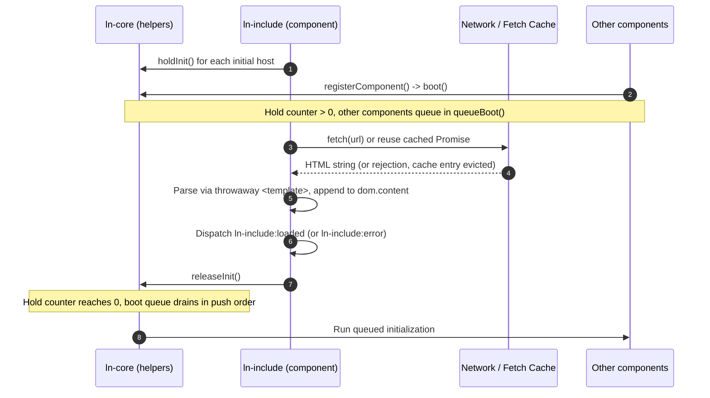

# 📦 ln-include

> **Classification:** 🟢 Simple component (Layer 1)

---

## 1. Core Behavior & Responsibility

- Lets the *content* of an existing `<template>` element be loaded from an external HTML file asynchronously, while the template keeps its own identity in the DOM. This lets templates (table rows, empty states, route views) be shared across pages without a build step.
- Located in [`js/ln-include/src/ln-include.js`](../../js/ln-include/src/ln-include.js).

> [!IMPORTANT]
> **What the component does NOT do (Orthogonality Doctrine):**
> - **Does NOT change the behavior of `ln-router` or any other consumer.** They keep cloning the template by name/route via the standard `cloneTemplate` flow — `ln-include` only fills `.content` before that happens.
> - **Does NOT initialize components inside the loaded content.** The central `MutationObserver` in `ln-core` handles subtree additions once the cloned content actually enters the document.
> - **Does NOT abort shared network requests via `AbortController`.** A fetch is shared across every host pointing at the same URL, so cancelling it for one host would break the others.

---

## 2. Minimal HTML Markup & Usage Variants

### Base HTML Markup

```html
<template data-ln-template="documents-row" data-ln-include="/tpl/documents-row.html"></template>
```

When the fetch resolves, the contents of `/tpl/documents-row.html` are parsed and appended into the template's own `.content` fragment.

### Variant 1: Router View Partial

An entire route view can be loaded from an external file. `ln-router` requires zero changes — it still finds `<template data-ln-route>` and clones `.content` as usual; `ln-include` only needs to have already filled that content by boot time. Nested `<template>` elements inside the partial are supported and are the canonical route-view case.

#### HTML Markup
```html
<template data-ln-route="/users" data-ln-route-target="main" data-ln-include="/views/users.html"></template>
```

---

## 3. Declarative API Contract (Attributes & Events)

### Attributes Table

| Attribute | Element | Type / Values | Default | Description |
|---|---|---|---|---|
| `data-ln-include` | `<template>` | `String` (URL) | — | The external URL to fetch HTML content from. Only recognized on `<template>` elements; see Common Pitfalls. |

### Events API

<!-- The Events table is a full protocol inventory. ln-include listens for nothing; it only emits. -->

| Event | Direction | Cancelable | Description | `detail` Object |
|---|---|---|---|---|
| `ln-include:loaded` | Emits | No | Dispatched on the host `<template>` when the partial has been successfully fetched, parsed, and appended to `.content`. | `{ target: HTMLElement, url: String }` |
| `ln-include:error` | Emits | No | Dispatched on the host `<template>` when the fetch fails (network error or non-2xx response). | `{ target: HTMLElement, url: String, error: Error }` |

`ln-include` does not listen for any events.

---

## 4. CSS Styling & Behavioral Concept

`ln-include` has no visual output and ships no SCSS — it is a pure data-loading component. The only behavior to document is its coordination strategy:

- **Shared fetch, deduplicated:** all hosts pointing at the same URL share a single fetch `Promise` from a module-level cache, so only one network request is made no matter how many templates reference that URL.
- **Eviction on rejection:** a rejected promise is deleted from the cache the moment it rejects, so a host created later (e.g. via the `MutationObserver`) retries the fetch instead of failing instantly against a stale rejection.
- **Parsing via throwaway `<template>`:** the fetched HTML string is parsed by assigning it to `innerHTML` of a disposable `<template>` element, not a `<div>`. This is required because a `<div>` parsing context silently discards elements like `<tr>`, `<td>`, and `<option>` when they appear without their required ancestor — a `<template>` parsing context does not.

---

## 5. Accessibility (ARIA) & Common Pitfalls

### ARIA & Keyboard

- `ln-include` has no direct accessibility surface — it only populates a `<template>`, which is inert and never rendered. Elements delivered by the partial are responsible for their own ARIA semantics once they are cloned into the live DOM.

### Common Pitfalls & Anti-patterns

> [!CAUTION]
> 1. **Partial content, not a template registry:** the external file must contain the direct *content* of the template (e.g. `<tr>...</tr>`), not a wrapper `<template data-ln-template="...">` around that content. A `<template>` tag inside the fetched HTML never reaches the document on its own — its content only materializes when *its own* host element is cloned. Wrapping the whole partial in one is not "redundant nesting," it is a dead registry: nothing ever clones that outer wrapper, so its content is permanently unreachable.
> 2. **Non-`<template>` hosts are silently ignored, not warned:** `data-ln-include` only matches elements selected by `template[data-ln-include]`. Placing the attribute on a `<div>` or any other non-`<template>` element means the component's selector never matches it — it is never instantiated, no fetch is attempted, and no warning is logged. There is no dev-time signal; the attribute is simply inert.
> 3. **Late-entering hosts are ungated:** hosts created and inserted into the DOM after initial page boot are still discovered by the `MutationObserver` and load correctly, but they do not participate in the boot gate — they load asynchronously while other, already-booted components keep running.
> 4. **Standalone bundle script order:** if individual component files are loaded instead of the master bundle (`js/index.js`), `ln-include.js` must execute before every other component script. Use plain `<script>` tags in order, or `defer` — never `async` — otherwise other components will run their `DOMContentLoaded` sweeps before the gate is raised and bypass it entirely.

---

## 6. Flow Diagram & Lifecycle



---

## 7. Related Components

- [`ln-core`](./ln-core.md) — Provides the `holdInit()` / `releaseInit()` boot-gating mechanism `ln-include` uses.
- [`ln-table`](./ln-table.md) — A typical consumer of templates gated by `ln-include`.
- [`ln-router`](./ln-router.md) — Consumes `<template data-ln-route>` views whose content `ln-include` can populate, with no changes to the router.
- [`ln-ui-coordinator`](./ln-ui-coordinator.md) — Coordinates SSR modal templates that may also depend on `ln-include`-loaded content finishing before opening.
