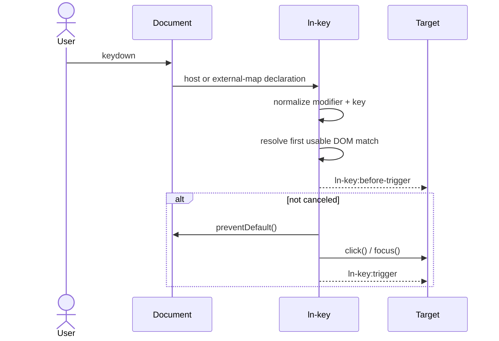

# ln-key

> **Classification:** Simple Component

## 1. Core Behavior & Responsibility

`ln-key` maps a normalized keyboard combination to the natural interaction of a DOM target. Buttons and links receive `click()`; editing controls receive `focus()`. The component has no knowledge of other Ashlar components, so the target's existing click/focus event chain remains the integration point.

Source: [ln-key.js](../../components/ln-key/src/ln-key.js).

## 2. Minimal HTML Markup & Usage Variants

Shortcut on the target itself:

```html
<button type="button" data-ln-key="Ctrl+S Meta+S">Save</button>
<input type="search" data-ln-key="Ctrl+K Meta+K">
```

Separate declaration and target:

```html
<span hidden data-ln-key="Ctrl+K, Meta+K" data-ln-key-target="#search"></span>
<input id="search" type="search">
```

Grouped external shortcut map for retrofitting existing controls:

```html
<ul data-ln-key-modifier="Ctrl">
    <li data-ln-key-for="#save">S</li>
    <li data-ln-key-for="#search">K</li>
    <li data-ln-key-for="#print">P</li>
</ul>
```

The item text must contain exactly one key token. The nearest modifier container and the item key are normalized into one shortcut and passed through the same resolver as host mode.

Opt in while the user is editing:

```html
<button type="button" data-ln-key="Ctrl+S" data-ln-key-allow-input>Save</button>
```

## 3. Declarative API Contract (Attributes & Events)

| Attribute | Type | Default | Description |
|---|---|---|---|
| `data-ln-key` | Shortcut list | Required | Comma- or whitespace-separated combinations using `Ctrl`, `Alt`, `Shift`, and `Meta`. |
| `data-ln-key-target` | CSS selector | Host element | Resolves the action target at trigger time. |
| `data-ln-key-modifier` | Modifier combination | None | Nearest external-map context, for example `Ctrl` or `Ctrl+Shift`. |
| `data-ln-key-for` | CSS selector | Required on map item | Points an external-map item to an existing target; trimmed item text supplies the key. |
| `data-ln-key-allow-input` | Presence | Off | Allows the shortcut when the event originates in an editing control; inherited from a modifier container by map items. |

| Event | Cancelable | Detail |
|---|---:|---|
| `ln-key:before-trigger` | Yes | `{ source, target, action, key, event }` |
| `ln-key:trigger` | No | `{ source, target, action, key, event }` |
| `ln-key:destroyed` | No | `{ target }` |

## 4. CSS Styling & Behavioral Concept

`ln-key` has no visual layer and ships no SCSS. It only calls an existing element's native `click()` or `focus()` method. Host declarations, direct external targets, and grouped map items normalize into the same runtime contract and share one document `keydown` listener.

## 5. Accessibility (ARIA) & Common Pitfalls

- Prefer native `<button>`, `<a href>`, and form controls; do not use `ln-key` to make a generic `<div>` interactive.
- Keep visible controls and accessible names in the markup. A shortcut is an enhancement, not the only way to reach an action.
- Shortcuts do not run inside editing controls by default. Add `data-ln-key-allow-input` only when overriding normal editing behavior is intentional.
- `Ctrl` and `Meta` are distinct. Declare both for cross-platform application shortcuts.
- Keep an external map's item text to one recognizable key such as `S`, `Escape`, or `ArrowDown`; place descriptions outside that text node.
- Native unmodified `Enter`/`Space` behavior on a focused button or link is not duplicated.

## 6. Flow Diagram & Lifecycle



## 7. Related Components

- [`ln-link`](./ln-link.md) - row/card click delegation to an existing link.
- [`ln-router`](./ln-router.md) - consumes normal link activation without direct coupling to `ln-key`.
- [`ln-modal`](./ln-modal.md) - can be opened by a button that `ln-key` activates.
