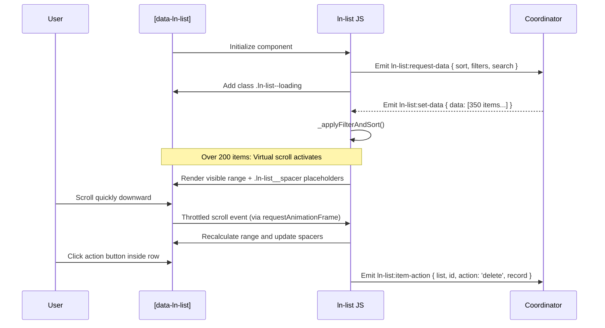

# 📋 ln-list

> **Classification:** 🟢 Simple component / Presenter (Layer 1 - Presenter Component)

---

## 1. Core Behavior & Responsibility

`ln-list` is a robust presenter component designed for rendering lists, card layouts, sections, or grids of data. It operates in two fundamental modes:

1. **SSR (Server-Side Rendered) Mode:** Hydrates pre-existing markup directly inside the container or a body wrapper element (`[data-ln-list-body]`). It parses existing DOM elements on initialization to support local in-memory search, filtering, and virtual scrolling.
2. **Data-Driven Mode:** Acts as a client-side template renderer. When supplied with a dataset, it clones a specified item template (`<template data-ln-template="...-row">`), populates properties using `fillTemplate()` / `fill()`, coordinates selection/actions, and dynamically manages empty state overlays.

For lists containing more than 200 items, `ln-list` automatically activates virtual scrolling, rendering only the items in the viewport plus a small buffer of extra items to keep rendering times low and conserve memory.

The JavaScript source is located at [ln-list.js](../../js/ln-list/src/ln-list.js).

> [!IMPORTANT]
> **What the component does NOT do (Orthogonality Doctrine):**
> - **No direct API/Network calls:** It does not fetch data itself. When sorting or searching is triggered in Data-Driven mode, it emits `ln-list:request-data` and delegates the fetching to coordinators like [`ln-data-coordinator`](./ln-data-coordinator.md).
> - **No primary state storage:** The component represents a visual presentation window of the data. Modifying items must be done at the database/store layer, and updated datasets are pushed back to the list using `ln-list:set-data`.
> - **No confirmation dialogs:** Triggering actions via `item-action` buttons emits events but never opens dialogs directly. Action validation and confirmation (e.g. showing a [`ln-modal`](./ln-modal.md)) must be handled by Layer 2 coordinators.

---

## 2. Minimal HTML Markup & Usage Variants

### Base HTML Markup (SSR Mode)

In SSR mode, the list is functional immediately with the server-rendered markup. Sort and search filters are run locally.

```html
<form role="search" onsubmit="return false;">
  <input type="search" data-ln-search="ssr-documents-list" placeholder="Search...">
</form>

<ul id="ssr-documents-list" data-ln-list="ssr-documents">
  <li data-ln-item data-ln-item-id="1">
    <span data-ln-list-field="title">Document A</span>
  </li>
  <li data-ln-item data-ln-item-id="2">
    <span data-ln-list-field="title">Document B</span>
  </li>
</ul>

<!-- Empty state template for SSR -->
<template data-ln-list-empty>
  <li class="empty-state">No items found.</li>
</template>
```

### Variant 1: Data-Driven Mode with Selection and Virtual Scroll

In Data-Driven mode, the list requests data via coordinator events and populates rows using templates:

```html
<div data-ln-list="users_list" 
     data-ln-list-source="api/users" 
     data-ln-list-selectable>
     
  <!-- Toolbar for Search and Stats -->
  <div class="list-controls">
    <!-- Global select-all checkbox -->
    <input type="checkbox" data-ln-list-select-all />
    
    <input type="text" data-ln-search="users_list" placeholder="Search..." />
    
    <!-- Footer / Stats spans -->
    <div>
      Total: <span data-ln-list-total></span>
      <span class="hidden">
        (Filtered: <span data-ln-list-filtered></span>)
      </span>
      <span class="hidden">
        (Selected: <span data-ln-list-selected></span>)
      </span>
    </div>
    
    <button type="button" data-ln-list-clear-all>Clear Filters</button>
  </div>

  <!-- List body target container (can be ul, ol, or div) -->
  <ul class="list-body" data-ln-list-body></ul>

  <!-- Item row template -->
  <template data-ln-template="users_list-row">
    <li class="user-card" data-ln-item>
      <input type="checkbox" data-ln-item-select />
      <strong data-ln-fill="name" data-ln-list-field="name"></strong>
      <span data-ln-fill="email" data-ln-list-field="email"></span>
      
      <button type="button" data-ln-item-action="delete">Delete</button>
    </li>
  </template>

  <!-- Option A: Named Empty State Templates -->
  <template data-ln-template="users_list-empty">
    <div class="empty-state">
      <h3>No users</h3>
      <p>Add your first user to get started.</p>
    </div>
  </template>

  <template data-ln-template="users_list-empty-filtered">
    <div class="empty-state">
      <h3>No matches found</h3>
      <p>Try searching for something else or clearing filters.</p>
      <button type="button" data-ln-list-clear class="btn">Clear Search</button>
    </div>
  </template>

  <!-- Option B: Universal Fallback Template -->
  <!--
  <template data-ln-empty>
    <div>
      <div data-ln-empty-when="initial" class="empty-state">
        <h3>No data</h3>
        <p>Enter your first records.</p>
      </div>
      <div data-ln-empty-when="search" class="empty-state">
        <h3>No results</h3>
        <p>Try searching for a different term.</p>
      </div>
    </div>
  </template>
  -->
</div>
```

---

## 3. Declarative API Contract (Attributes & Events)

### Attributes Table

| Attribute | Element | Type / Values | Default | Description |
|---|---|---|---|---|
| `data-ln-list` | Root container | `String` | - | Identifies the list component and names the generated events. |
| `data-ln-list-source` | Root container | `String` | - | Enables Data-Driven mode. Specifies a key or API endpoint to request data. |
| `data-ln-list-selectable` | Root container | `Flag` | - | Enables selection logic and row select checkbox listeners. |
| `data-ln-list-body` | Root container | `Flag` | - | Designates the target container where list rows are appended. Falls back to root. |
| `data-ln-item` | Template element | `Flag` | - | Identifies a row/card element inside a template or hydrated list. |
| `data-ln-item-id` | `[data-ln-item]` | `String` | - | Unique ID of the row item (mapped from the data record). |
| `data-ln-item-select` | `<input>` | `Flag` | - | Checkbox inside the row template for toggling row selection. |
| `data-ln-list-select-all` | `<input>` | `Flag` | - | Global checkbox to select or deselect all items simultaneously. |
| `data-ln-list-field` | Sub-element | `String` | - | Placed on elements within a row to map their text content to a property of the parsed record (crucial for local sorting/filtering of SSR/hydrated data). |
| `data-ln-item-action` | `<button>` | `String` | - | Declares a named action on the item. Click bubbles up as `ln-list:item-action`. |
| `data-ln-list-total` | `<span>` | `Flag` | - | Displays total number of records. |
| `data-ln-list-filtered` | `<span>` | `Flag` | - | Displays filtered visible count. Parent element is hidden when no filters are active. |
| `data-ln-list-selected` | `<span>` | `Flag` | - | Displays active selection count. Parent element is hidden when selection is 0. |
| `data-ln-list-clear-all` | `<button>` | `Flag` | - | Button to clear all filters and trigger a new fetch. |
| `data-ln-list-clear` | `<button>` | `Flag` | - | Button to clear the search input locally. |
| `data-ln-list-empty` | `<template>` | `Flag` | - | Template (`template[data-ln-list-empty]`) for the empty state in SSR mode. |
| `data-ln-empty` | `<template>` | `Flag` | - | Generic fallback template (`template[data-ln-empty]`) for empty states in Data-Driven mode. |
| `data-ln-empty-when` | Sub-element | `"initial"` \| `"search"` | - | Placed inside `template[data-ln-empty]` to show a specific block when list is empty initially (`initial`) vs when search returned no results (`search`). |

### Events API

| Event | Direction | Cancelable | Description | `detail` Object |
|---|---|---|---|---|
| `ln-list:set-data` | Listens | No | Populates the list with a dataset, removes loading overlays, and triggers render. | `{ data: Array, total: Number, filtered: Number }` |
| `ln-list:set-loading` | Listens | No | Controls the visual loading state of the list. | `{ loading: Boolean }` |
| `ln-search:change` | Listens | No | Received from `ln-search` inputs, triggering local filtering or a new fetch request. | `{ term: String }` |
| `ln-list:request-data` | Emits | No | Dispatched on initialization or parameter changes (sort, search, filter) to request data. | `{ list: String, sort: Object, filters: Object, search: String }` |
| `ln-list:ready` | Emits | No | Dispatched after hydration or initial SSR item parsing completes. | `{ total: Number }` |
| `ln-list:rendered` | Emits | No | Dispatched after items are appended/redrawn in the DOM. | `{ list: String, total: Number, visible: Number }` |
| `ln-list:item-click` | Emits | No | Dispatched on item click (ignoring action button, checkbox, and link clicks). | `{ list: String, id: String, record: Object }` |
| `ln-list:item-action` | Emits | No | Dispatched when clicking a button marked with `data-ln-item-action`. | `{ list: String, id: String, action: String, record: Object }` |
| `ln-list:select` | Emits | No | Dispatched when item selection changes. | `{ list: String, selectedIds: Set, count: Number }` |
| `ln-list:select-all` | Emits | No | Dispatched when the global "Select All" checkbox status changes. | `{ list: String, selected: Boolean }` |
| `ln-list:search` | Emits | No | Dispatched when a search is executed on the list. | `{ list: String, query: String }` |
| `ln-list:empty` | Emits | No | Dispatched when the empty state template is drawn. | `{ term: String, total: Number }` |
| `ln-list:filter` | Emits | No | Dispatched during local filtering in SSR mode. | `{ term: String, matched: Number, total: Number }` |
| `ln-list:clear-filters` | Emits | No | Dispatched on clear-all click to instruct coordinator to reset active filters. | `{ list: String }` |
| `ln-list:before-clear-search` | Emits | Yes | Dispatched before resetting search query via `[data-ln-list-clear]`. | `{ list: String }` |

---

## 4. CSS Styling & Behavioral Concept

To support virtual scrolling correctly, items must have a predictable height. If the list body wrapper (`.list-body`) displays in a grid layout, the virtual scroll mechanism reads the grid track parameters and coordinates rendering offsets using `.ln-list__spacer` elements.

### CSS Classes & Layout Contract
- `.list-body`: Required scrolling container (`overflow-y: auto`, `max-height`) where the scroll event is monitored.
- `.ln-list__spacer`: Empty element generated by JavaScript to placeholder the unrendered virtual scroll space above and below the viewport.
- `.ln-item-selected`: Applied to selected `[data-ln-item]` rows for active highlights.
- `.ln-list--loading`: Temporary class applied to root container when data is fetching.

```scss
/* Source details from js/ln-list/ln-list.scss */
.list-body {
    position: relative;
    overflow-y: auto;
    max-height: 600px; /* Mandatory for virtual scroll constraint */
}

.ln-list__spacer {
    pointer-events: none;
    visibility: hidden;
    grid-column: 1 / -1; /* Spans full grid width in Grid layout */
}

[data-ln-list].ln-list--loading {
    opacity: 0.6;
    pointer-events: none;
    transition: opacity 0.2s ease;
}
```

---

## 5. Accessibility (ARIA) & Common Pitfalls

### ARIA & Keyboard
- **Virtual Scroll Accessibility Constraints:** Virtual scroll dynamic rendering adds and removes nodes from the DOM. Consequently, screen readers cannot query the entire dataset at once. For layouts where accessibility is critical, prefer using a paginated [`ln-table`](./ln-table.md) rather than a virtualized scrolling list.
- **Selection Semantics:** Always add proper `aria-label` tags to checkboxes (`data-ln-item-select`, `data-ln-list-select-all`) and make sure action buttons have clean labels.

### Common Pitfalls & Anti-patterns

> [!CAUTION]
> 1. **Hidden Parent Dimension Zeroing:** If the list initializes inside a collapsed tab, details accordion, or dropdown, its height reads as `0`. The virtual scroll mechanism will fall back to a default row height of `50px`, causing layout issues.
>    * **Fix:** When changing the parent wrapper's visibility, trigger `window.dispatchEvent(new Event('resize'))` to force dimensions recalculation.
> 2. **Bulk Actions Confirmation Gating:** Gating high-impact or bulk operations (e.g. deleting all selected items via `selectedIds`) with a simple in-place `ln-confirm` is forbidden. High-risk bulk operations MUST invoke an explicit [`ln-modal`](./ln-modal.md) listing the affected items and requiring positive button confirmation.

---

## 6. Flow Diagram & Lifecycle



---

## 7. Related Components

- [`ln-search`](./ln-search.md) — Dispatches `ln-search:change` to update the list's search criteria.
- [`ln-filter`](./ln-filter.md) — Feeds multi-criteria options to the list.
- [`ln-table`](./ln-table.md) — Paginated tabular alternative suitable for data-grid layout constraints.
- [`ln-data-coordinator`](./ln-data-coordinator.md) — Bridges data store fetching automatically.

---
Component source file: [ln-list.js](../../js/ln-list/src/ln-list.js)
