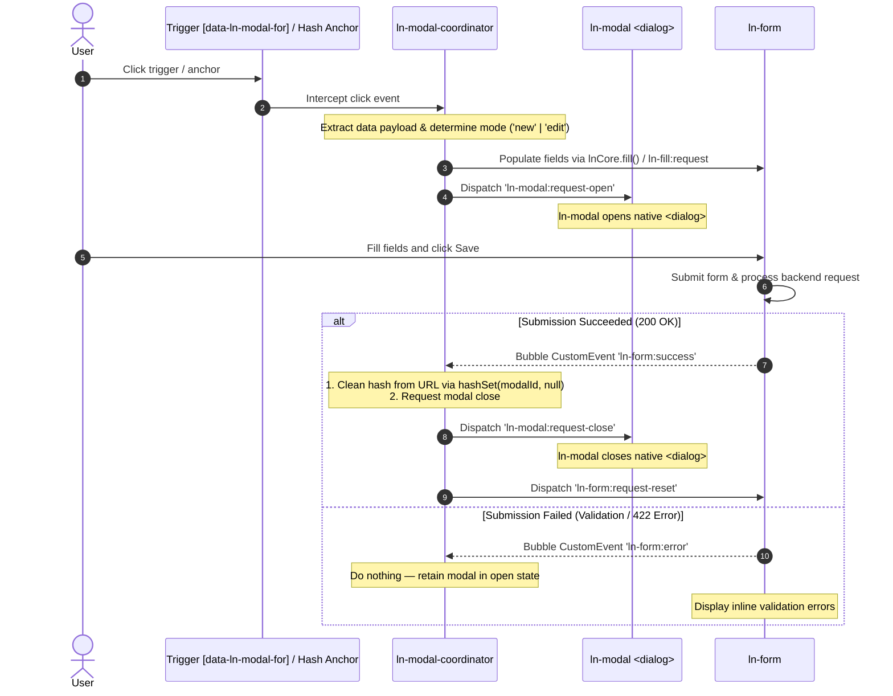

# 🎼 ln-modal-coordinator

> **Classification:** 🟡 Coordinator

---

## 1. Core Behavior & Responsibility

The `ln-modal-coordinator` component is a **Layer 2 Coordinator (Mediator)** responsible for orchestrating the lifecycle between user triggers, URL hash navigation, data populating (`ln-fill`), form submission pipelines (`ln-form` / `ln-ajax`), and the modal overlay primitive (`ln-modal`).

The JavaScript source is located at [ln-modal-coordinator.js](../../js/ln-modal-coordinator/src/ln-modal-coordinator.js).

Key responsibilities include:
- **Trigger & Hash Navigation:** Intercepting click events on triggers (`[data-ln-modal-for]`) and hash anchors (`<a href="#modalId:42">`), updating the URL hash without wiping foreign segments, and listening to `hashchange`.
- **Data Population & Mode Management:** Extracting payload attributes from triggers (`data-ln-modal-*` for display fields, `data-ln-fill-*` for form fields), calling `window.lnCore.fill()`, setting `data-ln-modal-mode="new|edit"`, and dispatching `ln-fill:request`.
- **Modal Command Dispatching:** Dispatching `ln-modal:request-open` and `ln-modal:request-close` to command the targeted `ln-modal` panel.
- **Form Submit Auto-Closing:** Listening to `ln-form:success` and `ln-ajax:success` bubbling up from inner forms. Upon success, it cleans up the URL hash, dispatches `ln-modal:request-close`, and dispatches `ln-form:request-reset`.
- **Validation Error Gate:** Listening to `ln-form:error` and `ln-ajax:error`. On error, it keeps the modal open in `data-ln-modal="open"` so inline validation messages remain visible.

> [!IMPORTANT]
> **What the component does NOT do (Orthogonality Doctrine):**
> - **Modal Visibility & Focus:** It does not render overlays, backdrop styles, or manage native `<dialog>` focus trapping (handled strictly by [`ln-modal`](./ln-modal.md)).
> - **Form Serialization & AJAX:** It does not serialize forms or handle network HTTP transport (handled by [`ln-form`](./ln-form.md) and [`ln-api-connector`](./ln-api-connector.md)).

---

## 2. Minimal HTML Markup & Usage Variants

### Base HTML Markup

`ln-modal-coordinator` attaches to a parent wrapper container (`<div data-ln-modal-coordinator>`), coordinating child triggers and modals within its DOM subtree:

```html
<section data-ln-modal-coordinator>
    <!-- Trigger Button for Creating (New mode) -->
    <button type="button" data-ln-modal-for="user-modal">
        New User
    </button>

    <!-- Trigger Link for Editing (Edit mode + Hash + Fill payload) -->
    <a href="#user-modal:42"
       data-ln-fill-id="42"
       data-ln-fill-form="user-form"
       data-ln-fill-name="Ada Lovelace">
        Edit User #42
    </a>

    <!-- Target Modal Overlay -->
    <dialog class="ln-modal" data-ln-modal data-ln-modal-mode="new" id="user-modal">
        <form id="user-form" data-ln-form>
            <header>
                <h3>
                    <span data-ln-modal-when="new">New User</span>
                    <span data-ln-modal-when="edit">Edit User — <span data-ln-field="name"></span></span>
                </h3>
                <button type="button" data-ln-modal-close aria-label="Close">&times;</button>
            </header>
            <main>
                <label>Name: <input name="name" type="text" autofocus /></label>
            </main>
            <footer>
                <button type="button" data-ln-modal-close>Cancel</button>
                <button type="submit">Save</button>
            </footer>
        </form>
    </dialog>
</section>
```

---

## 3. Declarative API Contract (Attributes & Events)

### Attributes Table

| Attribute | Element | Type / Values | Default | Description |
|---|---|---|---|---|
| `data-ln-modal-for` | Trigger Button | Modal `id` | — | Connects button trigger to target `ln-modal` for open/toggle requests. |
| `data-ln-modal-<key>` | Trigger Button | String | — | Populates display element `[data-ln-field="key"]` inside the modal. |
| `data-ln-modal-mode` | `<dialog>` / Trigger | `"new"` \| `"edit"` | — | Specifies active mode; set automatically based on payload presence or hash parameter. |
| `data-ln-fill-*` | Trigger Link | String | — | Populates form controls matching the `data-ln-fill-*` namespace. |

### Events API

| Event | Direction | Cancelable | Description | `detail` Object |
|---|---|---|---|---|
| `ln-modal:request-open` | Emits | No | Sent to target `ln-modal` to request panel opening. | `{ modalId: String }` |
| `ln-modal:request-close` | Emits | No | Sent to target `ln-modal` to request panel closing. | `{ modalId: String }` |
| `ln-form:request-reset` | Emits | No | Sent to inner `ln-form` to clear inputs after successful submit or cancel. | `{}` |
| `ln-fill:request` | Emits | No | Sent to form layer to fill fields with record data. | `{ id: String, data: Object }` |
| `ln-form:success` | Listens | No | Catches form submission success, triggering hash cleanup and modal close. | `{ response: Object }` |
| `ln-ajax:success` | Listens | No | Catches AJAX request success, triggering hash cleanup and modal close. | `{ response: Object }` |
| `ln-form:error` | Listens | No | Catches form submit errors, keeping the modal open for user correction. | `{ errors: Array }` |
| `ln-modal:close` | Listens | No | Listens to modal close event to clean up URL hash and reset forms. | `{ modalId: String }` |

---

## 4. State & Persistence

- **Storage:** URL hash (`#modalId` or `#modalId:param`).
- **Key format:** `#<modalId>` for new mode, `#<modalId>:<param>` for edit mode.
- **Written when:** User clicks a hash trigger or opens a hash-addressable modal.
- **Cleared when:** Form submission succeeds (`ln-form:success`) or user closes modal (`ln-modal:close`).

---

## 5. Accessibility & Common Pitfalls

### Common Pitfalls & Anti-patterns

> [!CAUTION]
> 1. **Embedding Form Auto-Close in Simple Component:** Do not write `ln-form:success` auto-close logic inside `ln-modal.js`. It belongs in `ln-modal-coordinator.js`.
> 2. **Wiping Foreign Hash Segments:** Do not overwrite `window.location.hash` directly with simple strings. Always use `hashSet(modalId, param)` from `ln-core` to preserve co-existing hash segments (e.g. `ln-tabs`).

---

## 6. Flow Diagram & Lifecycle



---

## 7. Related Components

- [`ln-modal`](./ln-modal.md) — The simple overlay primitive managing `<dialog>` visibility and focus.
- [`ln-fill`](./ln-fill.md) — Core helper for populating form and display elements.
- [`ln-form`](./ln-form.md) — Form serialization and submission pipeline.
- [`ln-data-coordinator`](./ln-data-coordinator.md) — Data store and API connector coordinator.
