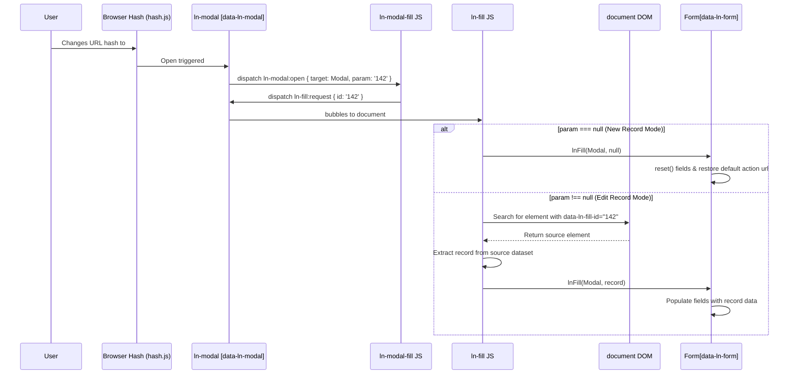

# ⚙️ ln-modal-fill

> **Classification:** ⚙️ Coordinator (Layer 2 - Modal & Form Bridge)

---

## 1. Core Behavior & Responsibility

The `ln-modal-fill` component is a stateless coordinator in `ln-ashlar`. Its sole responsibility is mapping hash-bound modal open events into form/display population request events.

The JavaScript source is located at [ln-modal-fill.js](../../js/ln-modal-fill/src/ln-modal-fill.js).

Key responsibilities include:
- **Event Coordination:** Listening for global `ln-modal:open` events on `document` and determining if they originate from hash-based modals.
- **Request Dispatching:** Translating the open event and its parameter into an `ln-fill:request` CustomEvent dispatched directly on the active modal element.
- **Reset Triggering:** Dispatching a request event with a `null` ID when a modal is opened in "new record" mode (no parameter in hash, e.g. `#my-modal`), causing target forms to reset.
- **Edit Triggering:** Dispatching a request event with the parameter value as the ID when a modal is opened in "edit record" mode (e.g. `#my-modal:142`).

> [!IMPORTANT]
> **What the component does NOT do (Orthogonality Doctrine):**
> - **DOM Queries & Scraping:** It does not query elements for `data-ln-fill-id` or read `data-ln-fill-*` attributes (delegated to [ln-fill](./ln-fill.md)).
> - **Form Population:** It does not directly write input values or modify form states (delegated to `ln-core` helpers and `ln-form`).
> - **Modal Visibility:** It does not open or close dialog overlays (handled by [ln-modal](./ln-modal.md)).

---

## 2. Minimal HTML Markup & Usage Variants

### Base HTML Markup

Below is a typical setup showing a link opening an edit modal and the coordinator bridging the interaction. Note that `ln-modal-fill` is completely headless and does not require any HTML wrapper or markup attributes; it automatically listens to global events once loaded on the page.

```html
<!-- Trigger Anchor (Edit mode with ID 142) -->
<a href="#user-modal:142" 
   data-ln-fill-id="142"
   data-ln-fill-form="user-form"
   data-ln-fill-name="Petar Petrovski"
   data-ln-fill-email="petar@example.com">
   Edit Petar
</a>

<!-- Target Modal -->
<dialog class="ln-modal" id="user-modal" data-ln-modal>
    <!-- Target Form -->
    <form id="user-form" data-ln-form action="api/users">
        <input type="hidden" name="id" />
        <input type="text" name="name" />
        <input type="email" name="email" />
    </form>
</dialog>
```

---

## 3. Declarative API Contract (Attributes & Events)

### Attributes Table

`ln-modal-fill` is a stateless coordinator and has no HTML markup attributes of its own.

### Events API

| Event | Direction | Cancelable | Description | `detail` Object |
|---|---|---|---|---|
| `ln-modal:open` | Listens | No | Fired by `ln-modal` when a dialog is opened. | `{ target: HTMLElement, param: String\|null }` |
| `ln-fill:request` | Emits | No | Dispatched on the modal to request form/display population. | `{ id: String\|null }` |

---

## 4. CSS Styling & Behavioral Concept

`ln-modal-fill` is a logic-only coordinator. It does not load or apply any CSS styles, relying entirely on the visual layers of `ln-modal` and form elements.

---

## 5. Accessibility (ARIA) & Common Pitfalls

### ARIA & Keyboard

- Focus management and keyboard traps are completely managed by the parent `ln-modal` instance.

### Common Pitfalls & Anti-patterns

> [!CAUTION]
> 1. **Trigger Missing ID:** The edit trigger must carry a `data-ln-fill-id` that matches the parameter in the hash exactly (e.g. `#modal:142` requires `data-ln-fill-id="142"`). If it is missing or mismatched, the form will fail to populate.
> 2. **Form Context Ambiguity:** If multiple data sources across different tables use identical ID values, ensure they declare `data-ln-fill-form` pointing to forms scoped within their respective modals so `ln-fill` can disambiguate.

---

## 6. Flow Diagram & Lifecycle



---

## 7. Related Components

- [`ln-modal`](./ln-modal.md) — the modal component that triggers coordination.
- [`ln-fill`](./ln-fill.md) — the display populator that performs the lookup and form population.
- [`ln-form`](./ln-form.md) — the form target.
