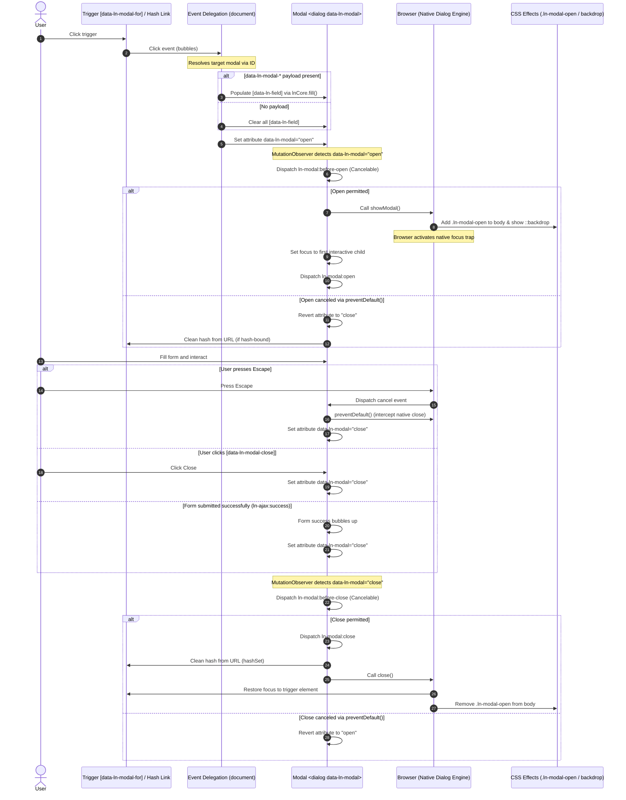

# 🪟 ln-modal

> **Classification:** 🟢 Simple Component

---

## 1. Core Behavior & Responsibility

The `ln-modal` component manages modal overlay windows (dialogs) that block visual display and interaction with the rest of the page. It wraps the browser's native `<dialog>` element and manages its open/closed state.

The JavaScript source is located at [ln-modal.js](../../js/ln-modal/src/ln-modal.js).

Key responsibilities include:
- **Visibility Management:** Synchronizing the `data-ln-modal` attribute (`"open"` / `"close"`) with native `<dialog>` methods `showModal()` and `close()`.
- **Deep-linking Coordination:** Listening to URL hash changes and automatically opening or closing based on hash presence (e.g., `#user-modal:42` opens the modal with parameter `42`, setting `data-ln-modal-mode="edit"`).
- **Cancel Interception:** Listening to the native `'cancel'` event on the `<dialog>` (fired when pressing `Escape`), preventing the default browser close, and routing it through the attribute synchronizer to ensure that `before-close` validation and hash cleanup always execute.
- **Focus Management:** Selecting and focusing the first eligible child (e.g. `autofocus`, visible text inputs, selects, textareas, or buttons) upon opening.
- **Body Scroll Lock:** Adding the `.ln-modal-open` class to `<body>` to lock scrolling when any modal is active.

> [!IMPORTANT]
> **What the component does NOT do (Orthogonality Doctrine):**
> - **Focus Trapping:** It does not manually trap focus (the native `<dialog>` handles focus trapping automatically when opened via `showModal()`).
> - **Business Logic & Submissions:** It does not manage form submissions or CRUD operations (handled by coordinators like [`ln-modal-fill`](./ln-modal-fill.md) and [`ln-form`](./ln-form.md)).
> - **DOM Styling:** It does not handle sizes or animations in JavaScript; they are handled via SCSS mixins and the `ln-modal-slideIn` animation.

---

## 2. Minimal HTML Markup & Usage Variants

### Base HTML Markup

Below is a standard copy-paste template for a simple modal dialog:

```html
<dialog class="ln-modal" data-ln-modal id="simple-modal">
    <form>
        <header>
            <h3>Modal Title</h3>
            <button type="button" data-ln-modal-close aria-label="Close">&times;</button>
        </header>
        <main>
            <p>Modal content goes here...</p>
        </main>
        <footer>
            <button type="button" data-ln-modal-close>Close</button>
        </footer>
    </form>
</dialog>
```

### Variant 1: Hash-Addressed Modal & ln-modal-fill Coordination

Any modal with an `id` attribute automatically participates in hash deep-linking (e.g., `#user-modal:42`). The URL hash parameter has absolute priority over triggers:

```html
<!-- Trigger for creating a new record (bare hash) -->
<a href="#user-modal" class="btn">New User</a>

<!-- Trigger for editing a record (hash with parameter + fill data) -->
<a href="#user-modal:42"
   data-ln-fill-id="42"
   data-ln-fill-form="user-form"
   data-ln-fill-name="Ada Lovelace"
   data-ln-fill-role="Engineer">
   Edit User #42
</a>

<!-- Hash-bound Dialog -->
<dialog class="ln-modal" data-ln-modal data-ln-modal-mode="new" id="user-modal">
    <form id="user-form" data-ln-form>
        <header>
            <h3>
                <span data-ln-modal-when="new">New User</span>
                <span data-ln-modal-when="edit">Edit User — <span data-ln-field="name"></span></span>
            </h3>
            <button type="button" data-ln-modal-close aria-label="Close">&times;</button>
        </header>
        <main>
            <label>
                Name:
                <input name="name" type="text" autofocus />
            </label>
            <label>
                Role:
                <input name="role" type="text" />
            </label>
        </main>
        <footer>
            <button type="button" data-ln-modal-close>Cancel</button>
            <button type="submit">Save</button>
        </footer>
    </form>
</dialog>
```

### Variant 2: Declarative Trigger Data Binding (data-ln-modal-*)

When clicking a trigger with `data-ln-modal-for="id"`, any custom attributes prefixed with `data-ln-modal-<key>` are automatically mapped and filled into matching display fields (`[data-ln-field="key"]`) within the dialog:

```html
<!-- Trigger Button -->
<button data-ln-modal-for="info-modal"
        data-ln-modal-title="System Status"
        data-ln-modal-message="All services are running normally.">
    Show Status
</button>

<!-- Target Modal -->
<dialog class="ln-modal" data-ln-modal id="info-modal">
    <form>
        <header>
            <!-- Filled automatically with data-ln-modal-title -->
            <h3 data-ln-field="title">Title</h3>
            <button type="button" data-ln-modal-close>&times;</button>
        </header>
        <main>
            <!-- Filled automatically with data-ln-modal-message -->
            <p data-ln-field="message">Message...</p>
        </main>
        <footer>
            <button type="button" data-ln-modal-close>Close</button>
        </footer>
    </form>
</dialog>
```

---

## 3. Declarative API Contract (Attributes & Events)

### Attributes Table

| Attribute | Element | Type / Values | Default | Description |
|---|---|---|---|---|
| `data-ln-modal` | `<dialog>` | `"open"` \| `"close"` | Required | Controls the open/closed visibility state. Modals without an `id` do not participate in URL hash-linking. |
| `data-ln-modal-for` | Trigger | target modal `id` | Required | Binds a click trigger to open/close the modal (toggle behavior). |
| `data-ln-modal-close` | Children | Presence | - | Closes the ancestor modal when clicked. |
| `data-ln-modal-mode` | `<dialog>` / Trigger | `"new"` \| `"edit"` | `"new"` | Specifies the active mode of the form. Synced automatically for hash parameters, otherwise set from trigger. |
| `data-ln-modal-when` | Children | `"new"` \| `"edit"` | - | Element is displayed only when its value matches the current `data-ln-modal-mode`. |
| `data-ln-modal-<key>`| Trigger | String | - | Maps to and populates `[data-ln-field="key"]` fields in the modal on open. |

### Programmatic JS API

The initialized instance is exposed on the dialog element via the property `dom.lnModal`.

| Property / Method | Type | Description |
|---|---|---|
| `dom.lnModal` | `Object` | The simple component instance attached to the DOM element. |
| `dom.lnModal.isOpen` | `Boolean` | True if the modal is currently open. |
| `dom.lnModal.destroy()` | `Function` | Cleans up events, unlocks body scroll, and destroys the instance. |

#### Programmatic Open/Close:
```javascript
const modal = document.getElementById('user-modal');
modal.setAttribute('data-ln-modal', 'open');  // Opens
modal.setAttribute('data-ln-modal', 'close'); // Closes
```

### Events API

All events bubble up (`bubbles: true`) and contain the target details in `event.detail`.

| Event | Direction | Cancelable | Description | `detail` Object |
|---|---|---|---|---|
| `ln-modal:before-open` | Emits | **Yes** | Fires after `data-ln-modal` changes to `"open"`, before styles or focus are applied. | `{ modalId: String, target: HTMLElement }` |
| `ln-modal:open` | Emits | No | Fires once the modal is natively open, body scrolled locked, and initial focus set. | `{ modalId: String, target: HTMLElement, hashNs: String?, param: String? }` |
| `ln-modal:before-close` | Emits | **Yes** | Fires upon request to close, allowing the application to prevent closing via `e.preventDefault()`. | `{ modalId: String, target: HTMLElement }` |
| `ln-modal:close` | Emits | No | Fires after the modal closes, before the hash is cleared and focus restored. | `{ modalId: String, target: HTMLElement }` |
| `ln-modal:destroyed` | Emits | No | Fires when the modal instance is destroyed. | `{ modalId: String, target: HTMLElement }` |
| `ln-ajax:success` | Listens | No | Listened for on the dialog element itself; automatically closes the modal when a form submission inside it succeeds. | `{ method: String, url: String, data: Object }` |

---

## 4. CSS Styling & Behavioral Concept

The styling is separated from JavaScript logic and defined in `js/ln-modal/ln-modal.scss` and `scss/config/mixins/_modal.scss`.

### SCSS Component Selector Bindings
```scss
// In js/ln-modal/ln-modal.scss
[data-ln-modal] {
	background: transparent;
	border: none;
	padding: 0;
	margin: 0;
	width: 100%;
	height: 100%;
	max-width: none;
	max-height: none;
	color: inherit;
	overflow: visible;

	&[data-ln-modal="open"] {
		display: flex;
	}
}

body.ln-modal-open {
	overflow: hidden;
}

[data-ln-modal-when] {
	display: none;
}

[data-ln-modal-mode="new"] [data-ln-modal-when="new"],
[data-ln-modal-mode="edit"] [data-ln-modal-when="edit"] {
	display: inline;
}
```

### SCSS Mixins Reference
```scss
// In scss/config/mixins/_modal.scss
@mixin modal-overlay {
	display: none;
	@include fixed;
	@include inset-0;
	z-index: var(--z-modal);
	@include items-center;
	@include justify-center;

	&::backdrop {
		background-color: var(--color-scrim);
		backdrop-filter: blur(4px);
		-webkit-backdrop-filter: blur(4px);
		opacity: 1;

		@include motion-safe {
			transition: opacity var(--transition);
			transition-behavior: allow-discrete;
		}

		@starting-style {
			opacity: 0;
		}
	}
}

@mixin modal-panel {
	@include section-card;
	margin-bottom: 0;
	box-shadow: var(--shadow-xl);
	display: grid;
	grid-template-rows: auto 1fr auto;
	max-width: 600px;
	width: 90%;
	max-height: 90vh;
	@include motion-safe {
		animation: ln-modal-slideIn var(--transition-slow);
	}

	> main {
		min-height: 0;
		overflow-y: auto;
		overflow-x: hidden;
	}

	> header {
		@include modal-header;
	}
}
```

---

## 5. Accessibility (ARIA) & Common Pitfalls

### ARIA & Keyboard

- **Semantic Role:** Native `<dialog>` opened via `showModal()` already provides dialog semantics — an implicit `role="dialog"` and modal behavior are applied by the browser. No redundant `role="dialog"` or `aria-modal="true"` attributes are needed in the markup.
- **Focus Management:** Focus is automatically directed to the child containing `autofocus`. If missing, the component queries and focuses the first visible interactive element (inputs, selects, textareas, links, or buttons).
- **Native Focus Trap:** When opened via `showModal()`, the browser natively traps the keyboard focus. Tabbing is restricted to interactive controls within the dialog overlay.
- **Escape Key Integration:** Pressing `Escape` triggers the native browser `cancel` event. The component cancels the native immediate close (`e.preventDefault()`) and routes the request to `data-ln-modal="close"`, ensuring `before-close` handlers run and the URL hash is cleaned up.
- **Focus Restoration:** Upon close, focus natively returns to the element that triggered the dialog.

### Common Pitfalls & Anti-patterns

> [!CAUTION]
> 1. **Manual Focus Trap Implementation:** Do not write custom focus trap keyboard listeners. The native `<dialog>` handles focus trapping out-of-the-box when opened with `showModal()`.
> 2. **BEM Wrappers in Markup:** Do not add inner `.ln-modal__content` or `.ln-modal__dialog` divs. The `<form>` should be a direct child of `<dialog>` and styled via `@include modal-panel;`.
> 3. **Mixing data-ln-modal-* and data-ln-fill-*:** Do not confuse display fields with form fields. Use `data-ln-modal-*` for static texts (`[data-ln-field]`) and `data-ln-fill-*` for input values (`[data-ln-form]`).

---

## 6. Flow Diagram & Lifecycle



---

## 7. Related Components

- [`ln-modal-fill`](./ln-modal-fill.md) — Coordinates form population inside hash-addressable modals.
- [`ln-fill`](./ln-fill.md) — The core helper used to populate visual and input elements.
- [`ln-form`](./ln-form.md) — Handles submission and reset flows for inner forms.
- [`ln-validate`](./ln-validate.md) — Standard form validation wrapper.
- [`ln-confirm`](./ln-confirm.md) — Modal-less variant for low-risk actions.
