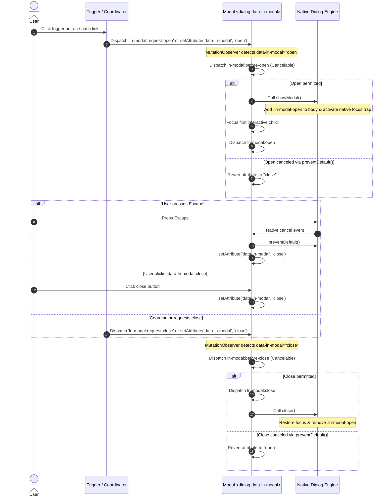

# 🪟 ln-modal

> **Classification:** 🟢 Simple Component

---

## 1. Core Behavior & Responsibility

The `ln-modal` component is a **Layer 1 Simple Component** that manages modal overlay windows (dialogs). It wraps the browser's native `<dialog>` element and manages its open/closed visibility state.

The JavaScript source is located at [ln-modal.js](../../js/ln-modal/src/ln-modal.js).

Key responsibilities include:
- **Visibility Management:** Synchronizing the `data-ln-modal` attribute (`"open"` / `"close"`) with native `<dialog>` methods `showModal()` and `close()`.
- **Command Handling:** Responding to `ln-modal:request-open` and `ln-modal:request-close` custom request events.
- **Cancel Interception:** Intercepting the native `'cancel'` event on the `<dialog>` (fired when pressing `Escape`), preventing the default browser close, and routing it through the attribute synchronizer to ensure that `before-close` validation and lifecycle events always execute.
- **Focus Placement:** Selecting and focusing the first eligible child (e.g. `autofocus`, visible text inputs, selects, textareas, or buttons) upon opening.
- **Body Scroll Lock:** Toggling the `.ln-modal-open` class on `<body>` to lock scrolling when a modal is active.

> [!IMPORTANT]
> **What the component does NOT do (Orthogonality Doctrine):**
> - **Focus Trapping:** It does not manually trap focus (the native `<dialog>` handles focus trapping automatically when opened via `showModal()`).
> - **Form Submissions & Auto-close:** It does NOT listen to `ln-form:success` or manage form submit states. Form submission and completion handling belong strictly to **Layer 2 Coordinators** (such as `ln-modal-coordinator` or `ln-data-coordinator`).
> - **Validation Error Inspection:** It does not check form validation classes (`.has-error`, `[data-ln-validate-error]`).
> - **DOM Data Population:** It does not populate form fields or display elements directly (handled by `ln-fill` / `ln-modal-coordinator`).

---

## 2. Minimal HTML Markup & Usage Variants

### Base HTML Markup

Below is a standard template for a simple modal dialog:

```html
<dialog class="ln-modal" data-ln-modal id="simple-modal">
    <form>
        <header>
            <h3>Modal Title</h3>
            <button type="button" data-ln-modal-close aria-label="Close">&times;</button>
        </header>
        <main>
            <p>Modal content goes here...</p>
        </main>
        <footer>
            <button type="button" data-ln-modal-close>Close</button>
        </footer>
    </form>
</dialog>
```

### Declarative Triggers

Triggers communicate with modals via `data-ln-modal-for="modalId"` or URL hash links:

```html
<!-- Declarative trigger button -->
<button type="button" data-ln-modal-for="simple-modal">Open Modal</button>

<!-- Hash deep-link anchor -->
<a href="#simple-modal">Open via Hash</a>
```

---

## 3. Declarative API Contract (Attributes & Events)

### Attributes Table

| Attribute | Element | Type / Values | Default | Description |
|---|---|---|---|---|
| `data-ln-modal` | `<dialog>` | `"open"` \| `"close"` | Required | Controls the open/closed visibility state of the modal panel. |
| `data-ln-modal-for` | Trigger | target modal `id` | Required | Binds a trigger to request opening/closing the targeted modal. |
| `data-ln-modal-close` | Children | Presence | - | Requests close of ancestor modal when clicked. |
| `data-ln-modal-mode` | `<dialog>` | `"new"` \| `"edit"` | `"new"` | State attribute indicating form mode (toggles `[data-ln-modal-when]` descendants). |
| `data-ln-modal-when` | Children | `"new"` \| `"edit"` | - | Element is displayed only when its value matches the modal's `data-ln-modal-mode`. |

### Programmatic State Query

The initialized instance is exposed on the dialog element via `dom.lnModal`.

| Property / Method | Type | Description |
|---|---|---|
| `dom.lnModal` | `Object` | The simple component instance attached to the DOM element. |
| `dom.lnModal.isOpen` | `Boolean` | True if the modal is currently open. |
| `dom.lnModal.destroy()` | `Function` | Cleans up events, unlocks body scroll, and destroys the instance. |

### Events API

All events bubble (`bubbles: true`) and contain target details in `event.detail`.

| Event | Direction | Cancelable | Description | `detail` Object |
|---|---|---|---|---|
| `ln-modal:request-open` | Listens | No | Command request event sent to open the modal. | `{}` |
| `ln-modal:request-close` | Listens | No | Command request event sent to close the modal. | `{}` |
| `ln-modal:before-open` | Emits | **Yes** | Dispatched when state changes to `"open"`, before styles or focus are applied. | `{ modalId: String, target: HTMLElement }` |
| `ln-modal:open` | Emits | No | Dispatched once modal is natively open, body scroll locked, and initial focus set. | `{ modalId: String, target: HTMLElement, hashNs: String?, param: String? }` |
| `ln-modal:before-close` | Emits | **Yes** | Dispatched upon request to close; calling `preventDefault()` cancels closing. | `{ modalId: String, target: HTMLElement }` |
| `ln-modal:close` | Emits | No | Dispatched after modal closes, before focus restoration. | `{ modalId: String, target: HTMLElement }` |
| `ln-modal:destroyed` | Emits | No | Dispatched when the component instance is destroyed. | `{ modalId: String, target: HTMLElement }` |

---

## 4. CSS Styling & Behavioral Concept

Styles are defined in `js/ln-modal/ln-modal.scss` and `scss/config/mixins/_modal.scss`.

```scss
[data-ln-modal] {
	background: transparent;
	border: none;
	padding: 0;
	margin: 0;
	width: 100%;
	height: 100%;
	max-width: none;
	max-height: none;
	overflow: visible;

	&[data-ln-modal="open"] {
		display: flex;
	}
}

body.ln-modal-open {
	overflow: hidden;
}

[data-ln-modal-when] {
	display: none;
}

[data-ln-modal-mode="new"] [data-ln-modal-when="new"],
[data-ln-modal-mode="edit"] [data-ln-modal-when="edit"] {
	display: inline;
}
```

---

## 5. Accessibility (ARIA) & Common Pitfalls

### ARIA & Keyboard

- **Semantic Role:** Native `<dialog>` opened via `showModal()` provides implicit `role="dialog"` and modal semantics.
- **Focus Management:** Focus is automatically directed to the child with `autofocus`, or the first visible interactive element.
- **Native Focus Trap:** When opened via `showModal()`, the browser natively traps keyboard focus inside the dialog.
- **Escape Key Integration:** Pressing `Escape` triggers native `cancel`. The component intercepts `cancel` to route through `data-ln-modal="close"`, ensuring `before-close` validation runs.

### Common Pitfalls

> [!CAUTION]
> 1. **Manual Focus Trap Implementation:** Do not write custom focus trap keyboard listeners. Native `<dialog>` handles focus trapping.
> 2. **Form Event Handling inside Modal:** Do not add form submission or AJAX auto-closing logic inside `ln-modal`. Use a Layer 2 Coordinator (`ln-modal-coordinator` or `ln-data-coordinator`).

---

## 6. Flow Diagram & Lifecycle


```mermaid
sequenceDiagram
    autonumber
    actor User
    participant Trigger as Trigger / Coordinator
    participant Modal as Modal <dialog data-ln-modal>
    participant Browser as Native Dialog Engine

    User->>Trigger: Click trigger button / hash link
    Trigger->>Modal: Dispatch 'ln-modal:request-open' or setAttribute('data-ln-modal', 'open')
    
    Note over Modal: MutationObserver detects data-ln-modal="open"
    Modal->>Modal: Dispatch ln-modal:before-open (Cancelable)
    
    alt Open permitted
        Modal->>Browser: Call showModal()
        Note over Browser: Add .ln-modal-open to body & activate native focus trap
        Modal->>Modal: Focus first interactive child
        Modal->>Modal: Dispatch ln-modal:open
    else Open canceled via preventDefault()
        Modal->>Modal: Revert attribute to "close"
    end

    alt User presses Escape
        User->>Browser: Press Escape
        Browser->>Modal: Native cancel event
        Modal->>Browser: preventDefault()
        Modal->>Modal: setAttribute('data-ln-modal', 'close')
    else User clicks [data-ln-modal-close]
        User->>Modal: Click close button
        Modal->>Modal: setAttribute('data-ln-modal', 'close')
    else Coordinator requests close
        Trigger->>Modal: Dispatch 'ln-modal:request-close' or setAttribute('data-ln-modal', 'close')
    end

    Note over Modal: MutationObserver detects data-ln-modal="close"
    Modal->>Modal: Dispatch ln-modal:before-close (Cancelable)

    alt Close permitted
        Modal->>Modal: Dispatch ln-modal:close
        Modal->>Browser: Call close()
        Note over Browser: Restore focus & remove .ln-modal-open
    else Close canceled via preventDefault()
        Modal->>Modal: Revert attribute to "open"
    end
```

---

## 7. Related Components

- [`ln-modal-coordinator`](./ln-modal-coordinator.md) — Layer 2 Coordinator that handles triggers, hash addressing, data filling, and form auto-closing.
- [`ln-fill`](./ln-fill.md) — Fills form and display elements from data records.
- [`ln-form`](./ln-form.md) — Manages form submission pipelines.

