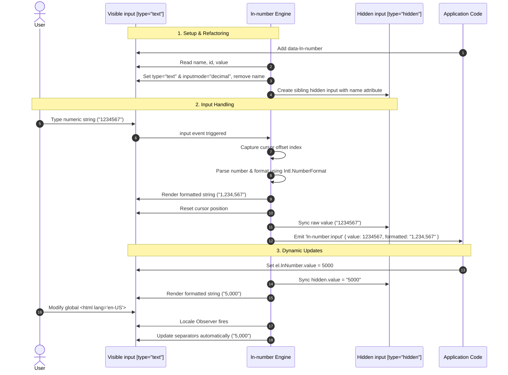

# 🔢 ln-number

> **Classification:** 🟢 Simple Component / Locale-Aware Real-Time Formatter

---

## 1. Core Behavior & Responsibility

- **Core Role:** Formats numeric input fields (currency, quantities, decimals) in real time according to the current BCP 47 locale (e.g., `1.234.567,89` for `mk` or `1,234,567.89` for `en-US`), while preserving raw numbers for server payloads.
- **Dynamic DOM Refactoring:** On initialization, converts the target input element to `type="text" inputmode="decimal"` (disabling native spinners), strips the `name` attribute, and injects a sibling `<input type="hidden">` carrying that `name` attribute to store clean numeric values.
- **Two-Way Value Interception:** Overrides native DOM `value` property descriptors. Assigning values programmatically (e.g. `input.value = 1500.5`) to the visible or hidden input automatically synchronizes and updates the formatted presentation.
- **Intelligent Cursor Tracking:** Measures digit offsets before formatting to preserve the cursor's logical position when the user types or deletes characters in the middle of a formatted string.
- **Locale Synchronization:** Listens to global page language changes via a `MutationObserver` on the `document.documentElement` lang attribute, instantly formatting all fields if the page language shifts.
- Located in [`js/ln-number/src/ln-number.js`](../../js/ln-number/src/ln-number.js).

> [!IMPORTANT]
> **What the component does NOT do (Orthogonality Doctrine):**
> - **Does NOT perform form validation** — Range clamping (`data-ln-number-min` and `max`) is enforced during typing, but error output and form blocking are delegated to [`ln-validate`](./ln-validate.md).
> - **Does NOT implement visual spinners or buttons** — Custom increment/decrement buttons are left to global CSS/markup layout.

---

## 2. Minimal HTML Markup & Usage Variants

### Base HTML Markup

An input field configured for basic real-time formatting:

```html
<div class="form-element">
    <label for="amount">Amount:</label>
    <input type="number" id="amount" name="amount" data-ln-number />
</div>
```

> [!NOTE]
> **DOM Transformation Output:**
> After initialization, the structure above transforms into:
> ```html
> <div class="form-element">
>     <label for="amount">Amount:</label>
>     <input type="text" id="amount" data-ln-number inputmode="decimal" />
>     <input type="hidden" name="amount" />
> </div>
> ```

---

### Variant 1: Decimal Place Restrictions

Locks the maximum number of decimal places permitted:

```html
<div class="form-element">
    <label for="price">Price (max. 2 decimals):</label>
    <input type="number" id="price" name="price"
           data-ln-number
           data-ln-number-decimals="2" />
</div>
```

---

### Variant 2: Min / Max Clamping

Constrains the user input within a specific range:

```html
<div class="form-element">
    <label for="quantity">Quantity (1 to 1,000,000):</label>
    <input type="number" id="quantity" name="quantity"
           data-ln-number
           data-ln-number-min="1"
           data-ln-number-max="1000000" />
</div>
```

---

### Variant 3: Pre-filled SSR Value

When initialized with a server-rendered value, the raw value is automatically parsed, synced to the hidden input, and formatted on the visible field:

```html
<div class="form-element">
    <label for="budget">Budget:</label>
    <input type="number" id="budget" name="budget" value="1500000"
           data-ln-number
           data-ln-number-decimals="2" />
</div>
```

---

### Variant 4: ln-validate and ln-form Integration

`ln-number` integrates with form verification and serialization components. The `required` state remains on the visible field for validation, while [`ln-form`](./ln-form.md) reads clean values from the hidden input:

```html
<form id="profile-form" data-ln-form>
    <div class="form-element">
        <label for="salary">Salary:</label>
        <input type="number" id="salary" name="salary"
               required
               data-ln-validate
               data-ln-number
               data-ln-number-decimals="2" />
        <ul data-ln-validate-errors>
            <li class="hidden" data-ln-validate-error="required">Salary field is required</li>
        </ul>
    </div>
</form>
```

---

## 3. Declarative API Contract (Attributes & Events)

### Attributes Table

| Attribute | Element | Type / Values | Default | Description |
|---|---|---|---|---|
| `data-ln-number` | `<input>` | Flag | — | Initializes the numeric formatting behaviors on the target control. |
| `data-ln-number-decimals` | `<input>` | `Number` | — | Caps the number of decimal places allowed. |
| `data-ln-number-min` | `<input>` | `Number` | — | Minimum value clamp. Inputs falling below this value are restricted. |
| `data-ln-number-max` | `<input>` | `Number` | — | Maximum value clamp. Inputs exceeding this value are blocked. |
| `data-ln-fill-as` | `<input>` | `String` | — | Ported automatically to the hidden field to allow targeting by data filling systems. |

### Programmatic JS API

Instance interfaces accessed via `element.lnNumber`:

| Helper | Signature | Returns | Description |
|---|---|---|---|
| `element.lnNumber.value` | *Property* | `Number` | Getter / Setter for raw values. Reading returns a `Number` (or `NaN`). Setting updates the hidden and formatted values. |
| `element.lnNumber.formatted` | *Property* | `String` | Getter. Returns the formatted display string visible to the user. |
| `element.lnNumber.destroy` | `()` | `void` | Restores the original type and name attributes, purges the hidden input, and breaks listener hooks. |

### Events API

All events bubble from the parent container (`this.dom`):

| Event | Direction | Cancelable | Description | `detail` Object |
|---|---|---|---|---|
| `ln-number:input` | Emits | No | Dispatched upon user input or programmatic value changes. | `{ value: Number, formatted: String }` |
| `ln-number:destroyed` | Emits | No | Dispatched when the component is destroyed. | `{ target: HTMLElement }` |

---

## 4. CSS Styling & Behavioral Concept

### Visual Guidelines

Right-aligning inputs displaying currency or decimals improves dashboard legibility:

```scss
input[data-ln-number] {
    text-align: right;
    font-variant-numeric: tabular-nums;
}
```

### Behavioral Mechanics

1. **Smart Cursor Indexing:** Prior to string mutation, the component counts standard digits to the left of the selection bounds. Once formatted, it relocates selection focus back to the identical digit position using `setSelectionRange()`.
2. **Writing Edge Cases:**
  - **Negative Sign (`-`):** Allowed as a lone starting character to support typing negative values without throwing `NaN`.
  - **Trailing Separators (`123.` or `123,`):** Preserved during active input so users can input decimals without instant deletion.
  - **Paste Sanitation:** Pasting mixed text (such as `"$1,234.50 USD"`) intercepts the paste event, filters non-numeric characters (retaining signs and decimal points), and passes the cleaned input to the formatting engine.

---

## 5. Accessibility (ARIA) & Common Pitfalls

### ARIA & Mobile Semantics

- **Virtual Keypad:** Applying `inputmode="decimal"` triggers numeric keyboard layouts on touch screen operating systems (iOS, Android).
- **Label Association:** Label relationships targeting the visible input ID are preserved.
- **Screen Reader Protection:** The generated `<input type="hidden">` is absent from tab flows and accessibility trees, preventing duplicate value announcements.

### Common Pitfalls & Anti-patterns

> [!CAUTION]
> 1. **Targeting Non-Input Elements:**
>    `ln-number` works strictly on `<input>` elements. Placing `data-ln-number` on a `<div>` or `<span>` triggers console warnings and aborts initialization.
> 2. **Reading Name Attributes in Scripts:**
>    Because the `name` attribute is moved to the hidden input, querying `visibleInput.name` returns empty. Use form serialization or reference the hidden element's value.
> 3. **Setting Formatted Strings Programmatically:**
>    Always pass raw `Number` objects when modifying `input.lnNumber.value`. Passing formatted strings (like `"1.500,00"`) results in incorrect value synchronization.
>    ```javascript
>    // ❌ WRONG
>    inputEl.lnNumber.value = "1.500,50";
>
>    // ✅ CORRECT
>    inputEl.lnNumber.value = 1500.50;
>    ```

---

## 6. Flow Diagram & Lifecycle



---

## 7. Related Components

- [`ln-form.md`](./ln-form.md) — Coordinates form serialization and population.
- [`ln-validate.md`](./ln-validate.md) — Implements validation constraints (like `required`, `min`, `max`) on input fields.
- [`ln-persist.md`](./ln-persist.md) — Preserves form state inside local/session storage.
