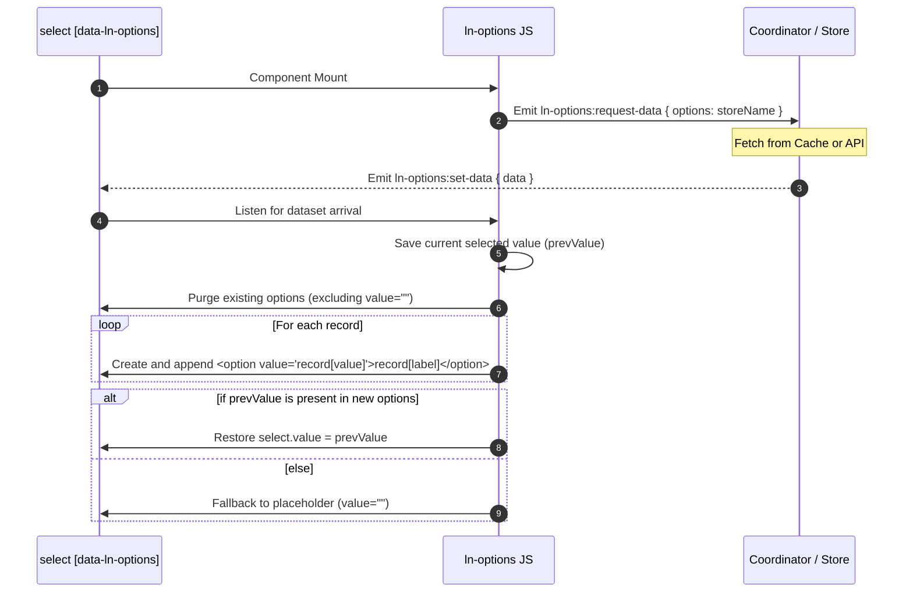

# 🗂️ ln-options

> **Classification:** 🟢 Simple Component / Layer 1 Form Helper

---

## 1. Core Behavior & Responsibility

- **Core Role:** Dynamically fills HTML `<select>` controls with options fetched from databases, caches, or API endpoints.
- **State Preservation:** Backs up the selected value (`select.value`) before rebuilding the options. If the previously selected value exists in the new dataset, it is automatically restored.
- **Placeholder Retention:** Keeps initial header placeholder elements (e.g., `<option value="">Select...</option>`), replacing only option nodes that carry actual values.
- **Event-Driven Isolation:** Emits `ln-options:request-data` to request dataset arrays and listens for `ln-options:set-data` to trigger option generation.
- Located in [`js/ln-options/src/ln-options.js`](../../js/ln-options/src/ln-options.js).

> [!IMPORTANT]
> **What the component does NOT do (Orthogonality Doctrine):**
> - **Does NOT fetch network queries directly** — Option retrieval is delegated to database coordinators or form controllers.
> - **Does NOT manage form validation** — Handled independently by [`ln-validate`](./ln-validate.md).

---

## 2. Minimal HTML Markup & Usage Variants

### Base HTML Markup

Standard select element linking directly to a data store named `"users"`. Uses default key configuration:

```html
<div class="form-element">
    <label for="user-select">Select User:</label>
    <select id="user-select" data-ln-options="users">
        <option value="">-- Choose a user --</option>
    </select>
</div>
```

### Variant 1: Custom Property Mapping

Overrides target record keys using `data-ln-options-value` and `data-ln-options-label`:

```html
<div class="form-element">
    <label for="category-select">Category:</label>
    <select id="category-select" 
            data-ln-options="categories" 
            data-ln-options-value="code" 
            data-ln-options-label="title">
        <option value="">-- All categories --</option>
    </select>
</div>
```

---

## 3. Declarative API Contract (Attributes & Events)

### Attributes Table

| Attribute | Element | Type / Values | Default | Description |
|---|---|---|---|---|
| `data-ln-options` | `<select>` | `String` | — | Activates the component and defines the name of the source data store. |
| `data-ln-options-value` | `<select>` | `String` | `"id"` | The record property mapped to the `<option>` tag `value` attribute. |
| `data-ln-options-label` | `<select>` | `String` | `"name"` | The record property mapped to the `<option>` tag display text content. |

### Events API

| Event | Direction | Cancelable | Description | `detail` Object |
|---|---|---|---|---|
| `ln-options:request-data` | Emits | No | Dispatched on load to request option records. | `{ options: String }` |
| `ln-options:set-data` | Listens | No | Listens for the array of options to render. | `{ data: Array }` |

---

## 4. CSS Styling & Behavioral Concept

This component is logic-only. It applies no custom CSS classes or styling. Visual customization of the `<select>` tag is fully delegated to standard form styles defined in the global CSS system.

---

## 5. Accessibility (ARIA) & Common Pitfalls

### ARIA & Keyboard

- Standard `<option>` DOM elements generated inside native `<select>` structures guarantee native accessibility support across screen readers and keyboard input devices.

### Common Pitfalls & Anti-patterns

> [!CAUTION]
> 1. **Omitting the Empty-Value Attribute on Placeholders:**
>    Placeholder options must carry an explicit empty value attribute (`value=""`). If omitted, the browser evaluates the display text as the fallback value, causing the options engine to purge the placeholder during rebuild cycles.
> 2. **Mismatching Property Keys:**
>    Ensure `data-ln-options-value` maps precisely to active payload properties. Using a key that does not exist in the record array generates options with `value="undefined"`.

---

## 6. Flow Diagram & Lifecycle



---

## 7. Related Components

- [`ln-data-store.md`](./ln-data-store.md) — The data store containing source records.
- [`ln-form.md`](./ln-form.md) — Wraps select inputs and monitors changes during validation or submission.
