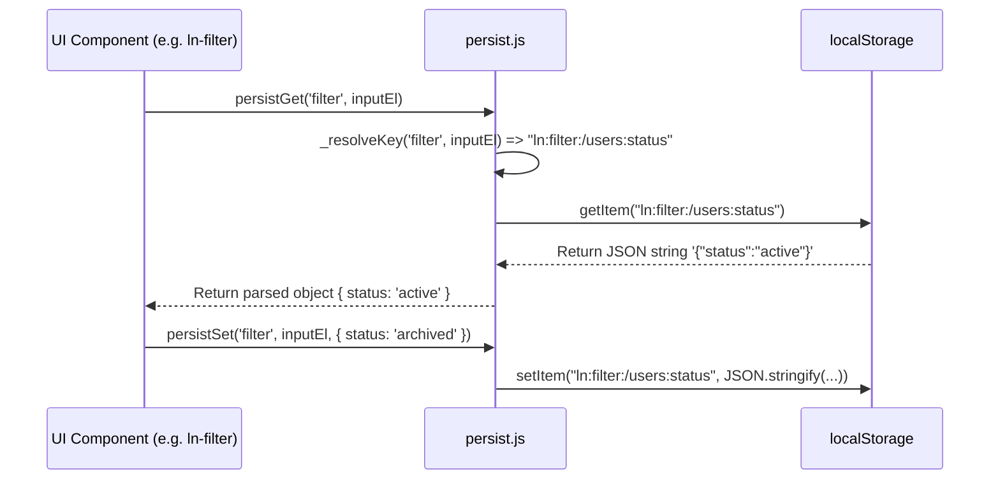

# 💾 ln-persist

> **Classification:** ⚙️ Service (Layer 3 - Storage & Persistence Mechanics)

---

## 1. Core Behavior & Responsibility

`ln-persist` provides namespaced, page-scoped `localStorage` persistence helper functions for `ln-ashlar` UI components (such as filter inputs, active table tab selections, and drawer toggles).

The JavaScript source is located at [persist.js](../../components/ln-core/persist.js).

Key responsibilities include:
- **Namespaced Key Generation (`_resolveKey`):** Automatically formats key names using the pattern `ln:{component}:{pathname}:{elementId}` to guarantee component and page isolation.
- **Safe Storage Access (`_checkStorage`):** Performs availability checks before reading or writing to `localStorage`, gracefully returning `null` or swallowing errors in restricted iframe environments (e.g. third-party cookies disabled).
- **JSON Serialization (`persistGet`, `persistSet`):** Serializes objects, strings, numbers, and booleans to JSON automatically on write, and parses JSON strings on read.
- **Bulk Clearance (`persistClear`):** Clears all stored entries matching a specific component namespace across pages.

> [!IMPORTANT]
> **What the module does NOT do (Orthogonality Doctrine):**
> - **Autosave Engine:** Form draft saving is handled independently by [`ln-autosave`](./ln-autosave.md) using the `ln-autosave:` prefix. `ln-persist` is for UI state, not form draft buffers.
> - **IndexedDB Storage:** Domain data records and offline caches belong in IndexedDB via [`ln-data-store`](./ln-data-store.md).

---

## 2. Minimal HTML Markup & Usage Variants

### Component Integration Example

Elements opt into persistence by providing `data-ln-persist="uniqueKey"` or a standard `id`:

```html
<!-- Data attribute explicit persistence key -->
<input type="text" id="user-search" data-ln-persist="user-search-query">

<!-- Fallback to element ID -->
<div id="filter-panel" data-ln-persist></div>
```

```javascript
import { persistGet, persistSet } from '../../ln-core';

const el = document.getElementById('user-search');

// 1. Read stored value on mount
const savedQuery = persistGet('search', el);
if (savedQuery) {
    el.value = savedQuery;
}

// 2. Persist value on change
el.addEventListener('input', () => {
    persistSet('search', el, el.value);
});
```

---

## 3. Declarative API Contract (Attributes & Events)

### Declarative Attributes (Processed by `_resolveKey`)

| Attribute | Element | Type | Description |
|---|---|---|---|
| `data-ln-persist` | Target Element | `String` (Optional) | Custom persistence key name. If omitted or empty, `el.id` is used instead. |

### Programmatic JS API

| Helper | Signature | Returns | Description |
|---|---|---|---|
| `persistGet` | `(component: String, el: HTMLElement)` | `*\|null` | Reads and JSON-parses the persisted value for `el` within `component` namespace. Returns `null` if empty or disabled. |
| `persistSet` | `(component: String, el: HTMLElement, value: *)` | `void` | JSON-stringifies and saves `value` into `localStorage`. Removes key if `value` is `null` or `undefined`. |
| `persistRemove` | `(component: String, el: HTMLElement)` | `void` | Explicitly removes the persisted key for `el` from `localStorage`. |
| `persistClear` | `(component: String)` | `void` | Removes all keys starting with `ln:{component}:` from `localStorage`. |

---

## 4. State & Persistence Concept

### Storage Key Format

All keys generated by `ln-persist` follow this strict naming format:

`ln:{component}:{pathname}:{elementId}`

- **`ln:`** Global ashlar namespace prefix.
- **`{component}`:** Component identifier (e.g., `"filter"`, `"sort"`, `"toggle"`, `"tabs"`).
- **`{pathname}`:** Normalized lowercase `location.pathname` (e.g., `"/admin/users"`).
- **`{elementId}`:** Value of `data-ln-persist` attribute or `el.id`.

#### Example Key
`ln:filter:/admin/users:status-filter`

---

## 5. Accessibility (ARIA) & Common Pitfalls

- **Element Identification Required:** `persistGet` and `persistSet` print a console warning and abort if `el` has neither a `data-ln-persist` value nor an `id`.
- **Common Pitfall — Storage Quota Exceeded:** `persistSet` silently catches `QuotaExceededError` exceptions when `localStorage` is full, preventing application crashes.

---

## 6. Flow Diagram & Lifecycle



---

## 7. Related Components

- [`ln-core`](./ln-core.md) — Re-exports `persistGet`, `persistSet`, `persistRemove`, `persistClear`.
- [`ln-filter`](./ln-filter.md) — Uses `ln-persist` to save filter criteria per page.
- [`ln-tabs`](./ln-tabs.md) — Uses `ln-persist` to remember active tab selection.
- [`ln-autosave`](./ln-autosave.md) — Independent form draft storage using `ln-autosave:` keys.
