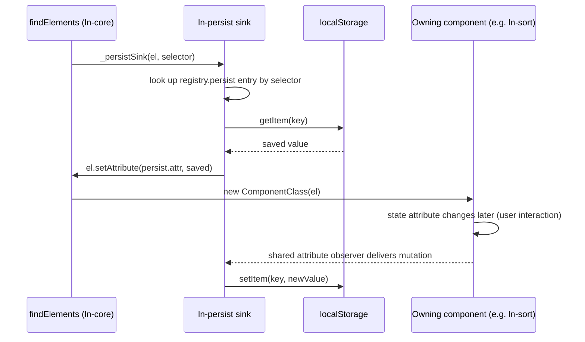

# 🟢 ln-persist

> **Classification:** 🟢 Simple component (no instance, no `DOM_ATTRIBUTE` — a document-level sink)

---

## 1. Core Behavior & Responsibility

`ln-persist` restores and saves a single state attribute to `localStorage`
for the components that opt in, via a declarative `options.persist` block
each owning component passes to `registerComponent(...)` — not by hand-called
function invocations.

The JavaScript source is located at [ln-persist.js](../../components/ln-persist/src/ln-persist.js).

**`data-ln-persist` only has an effect on an element owned by a component
that declares `options.persist` — currently `ln-toggle`, `ln-tabs`,
`ln-sort`, `ln-search`, `ln-filter`. On any other element the attribute is a
silent no-op** — there is no bare, hand-wired usage; `ln-persist` never
reads or writes an element that isn't already an instance of one of those
five components.

Key responsibilities include:
- **Namespaced Key Generation (`_resolveKey`):** Formats key names using the
  pattern `ln:{id}:{attr}` (or `ln:{id}:{pathname}:{attr}` when
  `data-ln-persist-scope="page"` is present) to guarantee per-element and,
  optionally, per-page isolation.
- **Safe Storage Access (`_checkStorage`):** Performs availability checks
  before reading or writing to `localStorage`, gracefully no-opping in
  restricted environments (private browsing, disabled storage).
- **Restore-before-construct:** Writes the owning component's declared
  state attribute onto the element via `setAttribute`, synchronously,
  before that element's own component instance is constructed.
- **Hash-aware save gating:** Skips both restore and save entirely when the
  owning component reports an active URL hash for that element.

> [!IMPORTANT]
> **What the component does NOT do (Orthogonality Doctrine):**
> - **Autosave Engine:** Form draft saving is handled independently by [`ln-autosave`](./ln-autosave.md) using the `ln-autosave:` prefix. `ln-persist` is for a single declared state attribute, not form draft buffers.
> - **IndexedDB Storage:** Domain data records and offline caches belong in IndexedDB via [`ln-data-store`](./ln-data-store.md).
> - **Composite/object values:** Persisted values are raw attribute strings only — no JSON serialization of composite shapes.

---

## 2. Minimal HTML Markup & Usage Variants

### Base HTML Markup

Any of the five owning components opts in by adding `data-ln-persist` to the
element that already carries its own marker attribute:

```html
<!-- Uses element id as storage key (global) -->
<section id="sidebar" data-ln-toggle="close" data-ln-persist></section>

<!-- Explicit key override (global, no id needed) -->
<section data-ln-toggle="close" data-ln-persist="sidebar-section"></section>
```

### Variant 1: Page-Scoped Persistence

`data-ln-persist-scope="page"` is a second, independent attribute — it only
changes the key shape of an element that already has `data-ln-persist`.

```html
<ul data-ln-sort="orders-table" data-ln-sort-field="name"
    data-ln-persist="name-sort" data-ln-persist-scope="page">
  ...
</ul>
```

### Variant 2: Persistent Alert Banner

```html
<div id="promo-banner" data-ln-toggle="open" data-ln-persist>
  <span>Promo code active!</span>
  <button type="button" data-ln-toggle-for="promo-banner" data-ln-toggle-action="close">&times;</button>
</div>
```

There is no Programmatic JS API. `persistGet`/`persistSet`/`persistRemove`/
`persistClear` do not exist — the attribute is the sole contract.

---

## 3. Declarative API Contract (Attributes & Events)

### Attributes Table

| Attribute | Element | Type / Values | Default | Description |
|---|---|---|---|---|
| `data-ln-persist` | Element owned by a persist-declaring component | Presence \| `String` (key) | Absent | Opt-in. Bare = use `el.id` as the storage key. `data-ln-persist="key"` = explicit key override. No effect on any other element. |
| `data-ln-persist-scope` | Same element as `data-ln-persist` | `"page"` | Absent (global) | Opt-in, independent attribute. Scopes the persisted key to the current URL pathname instead of the global default. |

### Events API

`ln-persist` dispatches no events of its own. It writes the owning
component's own state attribute directly, which drives that component's
existing attribute-sync pipeline and event dispatch — see the owning
component's own doc (`ln-toggle.md`, `ln-tabs.md`, `ln-sort.md`,
`ln-search.md`, `ln-filter.md`) for the resulting event sequence.

---

## 4. State & Persistence Concept

### Storage Key Format

Global by default:

```
ln:{id}:{attr}
```

Page-scoped, via `data-ln-persist-scope="page"`:

```
ln:{id}:{pathname}:{attr}
```

- **`ln:`** Global ashlar namespace prefix.
- **`{id}`:** The `data-ln-persist="key"` value if non-empty, else the
  element's own `id`.
- **`{pathname}`:** Normalized lowercase `location.pathname`, trailing
  slash stripped, falls back to `/`.
- **`{attr}`:** The owning component's declared `persist.attr` (e.g.
  `data-ln-toggle`, `data-ln-tabs-active`, `data-ln-sort-state`,
  `data-ln-search`, `data-ln-filter-values`).

#### Example Key
`ln:name-sort:/admin/orders:data-ln-sort-state`

This orphans every key written under the previous
`ln:{component}:{pathname}:{id}` format — never read again, harmless
leftover localStorage.

### Hash wins

When the owning component's `persist.hashActive(el)` returns `true`,
`ln-persist` skips both restore and save for that element — the URL hash is
authoritative, never double-written to both hash and `localStorage`.

---

## 5. Accessibility (ARIA) & Common Pitfalls

- **Element Identification Required:** if an opted-in element has neither a
  `data-ln-persist` value nor an `id`, `ln-persist` prints
  `[ln-persist] Element requires id or data-ln-persist="key"` and skips
  persistence for that element.
- **Common Pitfall — Not owned by a persist-declaring component:** adding
  `data-ln-persist` to any element other than one of the five owning
  components' host elements is a silent no-op — `ln-persist` never inspects
  arbitrary elements.
- **Common Pitfall — Storage Quota Exceeded:** the save handler silently
  catches `localStorage` write failures (quota, private mode), preventing
  application crashes.

---

## 6. Flow Diagram & Lifecycle



---

## 7. Related Components

- [`ln-core`](./ln-core.md) — Exposes `setPersistSink`, the nullable sink
  `findElements` calls into.
- [`ln-toggle`](./ln-toggle.md) — Declares `persist: { attr: data-ln-toggle, hashActive: null }`.
- [`ln-tabs`](./ln-tabs.md) — Declares `persist` for `data-ln-tabs-active`, hash-gated.
- [`ln-sort`](./ln-sort.md) — Declares `persist` for `data-ln-sort-state`, hash-gated.
- [`ln-search`](./ln-search.md) — Declares `persist` for `data-ln-search`, hash-gated.
- [`ln-filter`](./ln-filter.md) — Declares `persist` for `data-ln-filter-values`, hash-gated.
- [`ln-autosave`](./ln-autosave.md) — Independent form draft storage using `ln-autosave:` keys.
