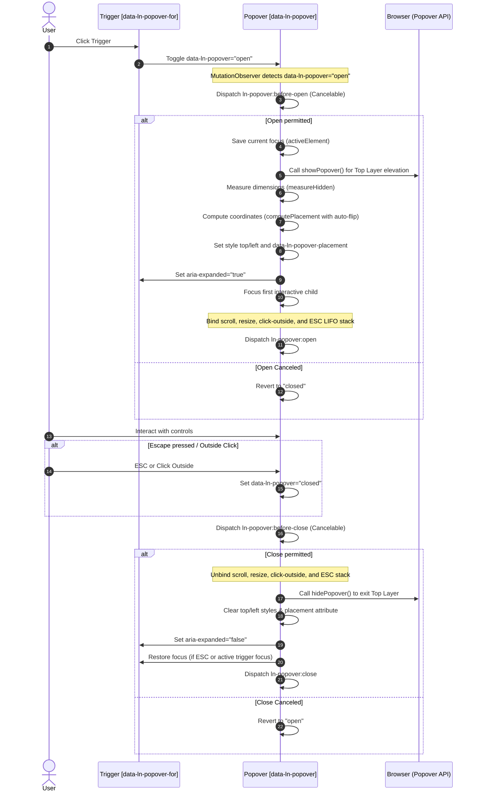

# 💬 ln-popover

> **Classification:** 🟢 Simple Component

---

## 1. Core Behavior & Responsibility

The `ln-popover` component is a lightweight floating UI container meant for showing rich contextual content (such as user profile menus, quick forms, filters, or detail cards) positioned relative to a trigger element.

The JavaScript source is located at [ln-popover.js](../../js/ln-popover/src/ln-popover.js).

Key responsibilities include:
- **Top-Layer Promotion:** Automatically setting `popover="manual"` on initialization and calling `showPopover()` / `hidePopover()` to natively display the panel on the browser's top layer. This completely bypasses parent overflow clipping and z-index contexts.
- **Dynamic Positioning:** Computing exact absolute viewport coordinates relative to the trigger using `computePlacement` and `measureHidden`, aligning the popover appropriately with support for auto-flip (reversing directions when edge collisions occur).
- **LIFO ESC Management:** Maintaining a Last-In-First-Out (LIFO) open stack in JavaScript to ensure that pressing `Escape` dismisses the top-most active popover sequentially.
- **Initial Focus:** Focusing the first visible interactive input/button inside the popover on open, falling back to the popover panel itself.
- **Outside Click Dismissal:** Listening for document clicks outside the popover and trigger elements to automatically close the active popover.

> [!IMPORTANT]
> **What the component does NOT do (Orthogonality Doctrine):**
> - **Focus Trapping:** It does not trap focus inside the panel (pressing `Tab` lets the user navigate outside the popover to sequential page controls; use [`ln-modal`](./ln-modal.md) if a focus trap is needed).
> - **DOM Teleportation:** It does not move the element in the DOM tree (it remains in its authored position since the browser's Popover API natively elevates it).
> - **Business Logic:** It is completely decoupled from forms or data filtering operations (handled by inner components).

---

## 2. Minimal HTML Markup & Usage Variants

### Base HTML Markup

Below is a standard template for a profile menu popover:

```html
<!-- Trigger Button -->
<button type="button" class="btn" data-ln-popover-for="profile-popover" aria-label="Profile">
    <span>Admin Profile</span>
</button>

<!-- Popover Container (Positioned below the trigger by default) -->
<div data-ln-popover id="profile-popover">
    <p>Logged in as <strong>admin@livenetworks.com</strong></p>
    <hr />
    <nav>
        <ul>
            <li><a href="/settings">Settings</a></li>
            <li><a href="/logout">Log Out</a></li>
        </ul>
    </nav>
</div>
```

### Variant 1: Preferred Placement & Auto-Flip

Use `data-ln-popover-position` to define the preferred placement. If there is insufficient viewport space, the engine automatically flips it to the opposite side and writes the final side to `data-ln-popover-placement`:

```html
<!-- Trigger Button -->
<button type="button" class="btn" data-ln-popover-for="action-popover">
    Actions
</button>

<!-- Popover with right preferred position -->
<div data-ln-popover id="action-popover" data-ln-popover-position="right">
    <ul>
        <li><button type="button">Copy Link</button></li>
        <li><button type="button">Share</button></li>
        <li><button type="button">Delete</button></li>
    </ul>
</div>
```

### Variant 2: Nested Popovers (LIFO Stack)

Opening a popover from within another popover is supported. The ESC key dismisses them sequentially from top to bottom:

```html
<button class="btn" data-ln-popover-for="popover-a">Open A</button>

<!-- First Popover -->
<div data-ln-popover id="popover-a">
    <p>Popover A content.</p>
    <button class="btn" data-ln-popover-for="popover-b">Open B</button>
</div>

<!-- Nested Popover -->
<div data-ln-popover id="popover-b">
    <p>Popover B content. Press ESC to close me first.</p>
</div>
```

---

## 3. Declarative API Contract (Attributes & Events)

### Attributes Table

| Attribute | Element | Type / Values | Default | Description |
|---|---|---|---|---|
| `data-ln-popover` | Container | `"open"` \| `"closed"` | Required | Controls the open/closed visibility state. |
| `popover` | Container | `"manual"` | Added by JS | Configures the element as a manual popover for native top-layer rendering. |
| `data-ln-popover-for` | Trigger | target popover `id` | Required | Binds a trigger element to toggle the popover on click. |
| `data-ln-popover-position`| Container | Position String | `"bottom"` | Preferred placement (e.g. `top`, `bottom`, `left`, `right` and alignments `-start`, `-end`). |
| `data-ln-popover-placement`| Container | Value | Added by JS | Viewport-clamped side that won after placement calculation. |

### Programmatic JS API

The initialized instance is exposed on the container element via `dom.lnPopover`.

| Property / Method | Type | Description |
|---|---|---|
| `dom.lnPopover` | `Object` | The simple component instance. |
| `dom.lnPopover.isOpen` | `Boolean` | True if the popover is open. |
| `dom.lnPopover.trigger` | `HTMLElement?` | The trigger element that opened this instance. |
| `dom.lnPopover.open(trigger)` | `Function` | Opens the popover using the specified trigger element. |
| `dom.lnPopover.close()` | `Function` | Closes the popover. |
| `dom.lnPopover.toggle(trigger)`| `Function` | Toggles the popover open or closed. |
| `dom.lnPopover.destroy()` | `Function` | Cleans up events, hides the popover, and destroys the instance. |

### Events API

All events bubble up (`bubbles: true`).

| Event | Direction | Cancelable | Description | `detail` Object |
|---|---|---|---|---|
| `ln-popover:before-open` | Emits | **Yes** | Fires after attribute changes to `"open"`, before top-layer promotion or placement calculations. | `{ popoverId: String, target: HTMLElement, trigger: HTMLElement? }` |
| `ln-popover:open` | Emits | No | Fires once the popover is visible in the top layer, positioned, and focus set. | `{ popoverId: String, target: HTMLElement, trigger: HTMLElement? }` |
| `ln-popover:before-close` | Emits | **Yes** | Fires before close, letting the app prevent closing via `e.preventDefault()`. | `{ popoverId: String, target: HTMLElement, trigger: HTMLElement? }` |
| `ln-popover:close` | Emits | No | Fires after popover is hidden, inline styles cleared, and focus restored. | `{ popoverId: String, target: HTMLElement, trigger: HTMLElement? }` |
| `ln-popover:destroyed` | Emits | No | Fires when the popover instance is destroyed. | `{ popoverId: String, target: HTMLElement }` |

---

## 4. CSS Styling & Behavioral Concept

The visual layer is separated from JavaScript logic. Custom styles are provided via mixins in `scss/config/mixins/_popover.scss` and bindings in `scss/components/_popover.scss`.

### SCSS Component Selector Bindings
```scss
// In scss/components/_popover.scss
[data-ln-popover] {
    @include popover;
}
```

### SCSS Mixins Reference
```scss
// In scss/config/mixins/_popover.scss
@mixin popover {
    @include floating-panel;
    display: none;
    position: fixed;
    min-width: 14rem;
    max-width: 24rem;
    padding: var(--size-sm);
    z-index: var(--z-dropdown);
    outline: none;

    &[data-ln-popover="open"] {
        display: block;
        animation: ln-popover-fade var(--transition-fast);
    }
}
```

### Behavioral Concept

1. **Top-Layer Promotion:** On open, `showPopover()` is invoked to natively elevate the element to the browser's top layer.
2. **Fixed Positioning:** Coordinates are computed dynamically in relation to the trigger's `getBoundingClientRect()` with an **8px** gap offset via `computePlacement`.
3. **Passive Repositioning:** While open, window `scroll` and `resize` listeners automatically recalculate coordinates to keep the panel pinned.
4. **Transition Animations:** The panel fades in smoothly using keyframe animation `@keyframes ln-popover-fade`.

---

## 5. Accessibility (ARIA) & Common Pitfalls

### ARIA & Keyboard

- **Semantic Role:** Configures `role="dialog"` and `tabindex="-1"` on the popover. The trigger receives `aria-haspopup="dialog"`, `aria-controls="id"`, and `aria-expanded="true/false"`.
- **Keyboard Tab Flow:** Tab and Shift+Tab navigate through links/buttons inside the popover and then move outside naturally (no focus trap).
- **LIFO Stack Escape Key:** Keydown Escape closes the top-most active popover in LIFO order and restores focus to its trigger.
- **Outside Click Restoration:** Clicking outside closes the popover but *does not* yank focus back to the trigger (preserving natural flow).

### Common Pitfalls & Anti-patterns

> [!CAUTION]
> 1. **Focus Traps:** Never block Tab navigation inside a popover.
> 2. **Mismatching IDs:** The trigger's `data-ln-popover-for="abc"` must match the popover's `id="abc"` exactly.
> 3. **Manual Stencil Placement:** Avoid inline positioning in HTML markup. The engine computes coordinates dynamically.

---

## 6. Flow Diagram & Lifecycle



---

## 7. Related Components

- [`ln-toggle`](./ln-toggle.md) — Base toggle primitive.
- [`ln-dropdown`](./ln-dropdown.md) — Droplist coordinator.
- [`ln-modal`](./ln-modal.md) — Modal dialog wrapper.
