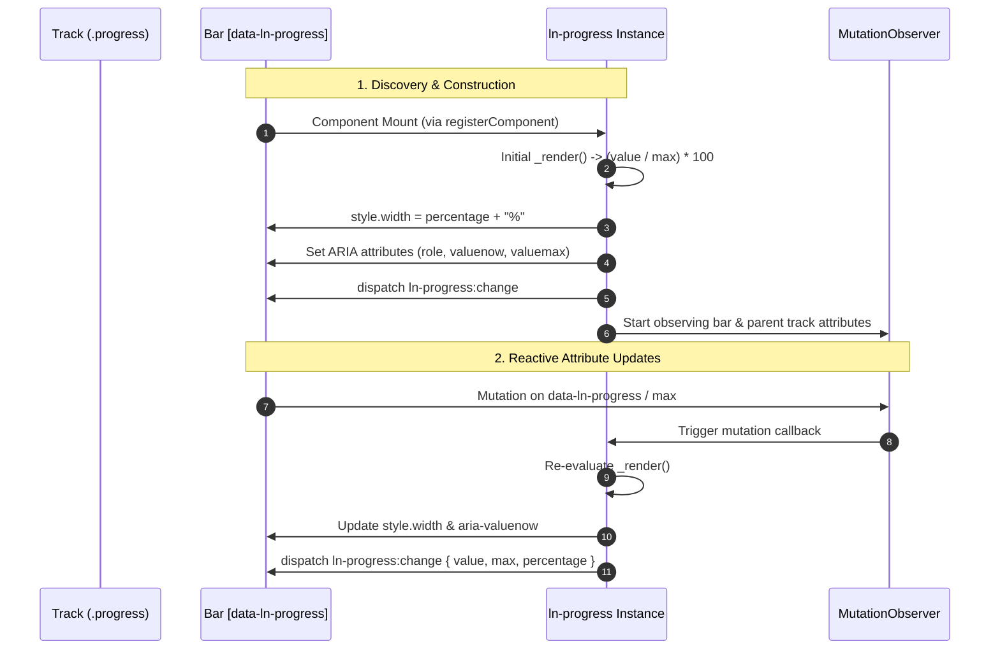

# ➖ ln-progress

> **Classification:** 🟢 Simple component / Passive Vector Renderer (Layer 1 - Data Visualization)

---

## 1. Core Behavior & Responsibility

The `ln-progress` component is a lightweight (~85 lines JS) passive visualization tool used to render and reactively update linear progress bars. It is located in [`js/ln-progress/src/ln-progress.js`](../../js/ln-progress/src/ln-progress.js).

*   **Attribute Bridge Pattern (Attribute IS State):** There are no imperative mutation methods (e.g. `setValue()`). Developers update `data-ln-progress="N"` on the element, and an internal `MutationObserver` automatically recalculates width (`style.width = "%"`) and ARIA attributes.
*   **Parent-Child Max Inheritance:** Supports declaring `data-ln-progress-max` on the parent track container (`.progress`). This allows multiple child bars (stacked bars) to share a common denominator. The component observes the parent track for attribute changes via a secondary `MutationObserver`.
*   **Native ARIA Reflection:** Automatically manages and maintains ARIA properties on every render: `role="progressbar"`, `aria-valuemin="0"`, `aria-valuemax`, and `aria-valuenow` (clamped to `[0, max]`).
*   **Self-Initialization:** Registers automatically via `registerComponent` from [`ln-core`](../../js/ln-core/src/ln-core.js) targeting elements with `[data-ln-progress]`.

> [!IMPORTANT]
> **What the component does NOT do (Orthogonality Doctrine):**
> - **Does NOT clamp input attributes:** Clamps only the computed percentage applied to `style.width`. `el.getAttribute('data-ln-progress')` retains the raw written string.
> - **Does NOT handle indeterminate / pulsing states:** For unbounded operations without a known total, use the SCSS [`@mixin loader`](../../scss/config/mixins/_loader.scss).
> - **Does NOT throttle or debounce writes:** Every attribute mutation immediately triggers a render pass and `:change` event.
> - **Does NOT render internal text labels:** Manages bar width only. Display text must be rendered in separate DOM elements.

---

## 2. Minimal HTML Markup & Usage Variants

### Base HTML Markup

Standard single linear progress bar:

```html
<div class="progress">
    <div data-ln-progress="75" class="success"></div>
</div>
```

### Variant 1: Custom Max Value (Bar Level)

Custom denominator declared on the bar itself:

```html
<div class="progress">
    <div data-ln-progress="7.5" data-ln-progress-max="10" class="warning"></div>
</div>
```

### Variant 2: Stacked Progress Bars (Shared Parent Max)

Multiple child bars sharing one parent track:

```html
<div class="progress" data-ln-progress-max="7">
    <div data-ln-progress="4" class="success" aria-label="Completed"></div>
    <div data-ln-progress="2" class="warning" aria-label="In Progress"></div>
    <div data-ln-progress="1" class="error" aria-label="Pending"></div>
</div>
```

---

## 3. Declarative API Contract (Attributes & Events)

### Attributes Table

| Attribute | Target Element | Type / Values | Default | Description |
|---|---|---|---|---|
| `data-ln-progress` | Bar (`div`) | `Float` | `0` | Current progress value. Computed width percentage is clamped to `[0%, 100%]`. |
| `data-ln-progress-max` | Bar (`div`) | `Float` | `100` | Maximum boundary value (denominator) for this specific bar. |
| `data-ln-progress-max` | Track (`.progress`) | `Float` | `null` | Shared denominator for all child bars. Overrides each child bar's own max. |

#### Maximum Value Priority Resolution:
1. `data-ln-progress-max` declared on parent track (parsed as float > 0).
2. `data-ln-progress-max` declared on bar element (parsed as float > 0).
3. Fallback default `100`.

### Programmatic JS API

Instance interfaces accessed via `element.lnProgress`:

| Property / Method | Type | Description |
|---|---|---|
| `element.lnProgress.dom` | `HTMLElement` | Reference to the bar DOM element. |
| `element.lnProgress.destroy()` | `Function` | Disconnects both attribute observers and removes the `lnProgress` instance reference. |

### Events API

| Event | Direction | Cancelable | Payload `detail` | Description |
|---|---|---|---|---|
| `ln-progress:change` | Emits | No | `{ target: HTMLElement, value: Number, max: Number, percentage: Number }` | Dispatched on construction and every time value or max attributes change. |

---

## 4. CSS Styling & Behavioral Concept

Visual styling is separated from JS logic using SCSS mixins:

```scss
// SCSS visual layer implementation
.progress {
    @include progress;
}

[data-ln-progress] {
    &.success { @include progress-success; }
    &.warning { @include progress-warning; }
    &.error   { @include progress-error; }
}
```

*   **`@mixin progress`** ([`scss/config/mixins/_progress.scss`](../../scss/config/mixins/_progress.scss)): Configures the track height, recessed background (`var(--bg-recessed)`), border-radius, overflow clipping, and inner bar transition (`transition: width var(--transition-base)`).
*   **Color Variants:** Color modifier classes (`.success`, `.warning`, `.error`) define state HSL colors in [`scss/components/_progress.scss`](../../scss/components/_progress.scss).

---

## 5. Accessibility (ARIA) & Common Pitfalls

### ARIA & Semantics

- **Automatic Attributes:** Automatically applies `role="progressbar"`, `aria-valuenow` (clamped to `[0, max]`), `aria-valuemin="0"`, and `aria-valuemax`.
- **Screen Reader Context:** Authors should manually provide `aria-label` or `aria-labelledby` on the bar element:
  ```html
  <div data-ln-progress="80" class="success" aria-label="Upload progress"></div>
  ```

### Common Pitfalls & Anti-patterns

> [!CAUTION]
> 1. **Setting `style="width: ..."` manually in HTML:** `_render()` executes at construction and immediately overwrites inline `style.width`. Always pass values via `data-ln-progress`.
> 2. **Placing `data-ln-progress` on the Track:** Placing the attribute on the track wrapper shrinks the track container itself instead of the inner bar. Always place `class="progress"` on the track and `data-ln-progress` on child bars.
> 3. **Omitting Parent Max for Stacked Bars:** When placing multiple bars in one track without setting `data-ln-progress-max` on the parent, each bar defaults to `max="100"`, causing incorrect bar scaling.
> 4. **Expecting Automatic Threshold Colors:** The component does not toggle `.success` / `.warning` / `.error` based on progress values. Threshold color switching must be handled by consumer script logic.

---

## 6. Flow Diagram & Lifecycle



---

## 7. Related Components

- [`ln-circular-progress.md`](./ln-circular-progress.md) — Circular progress indicators for dashboards and charts.
- [`ln-stat.md`](./ln-stat.md) — Statistical overview cards that often encapsulate progress bars.
