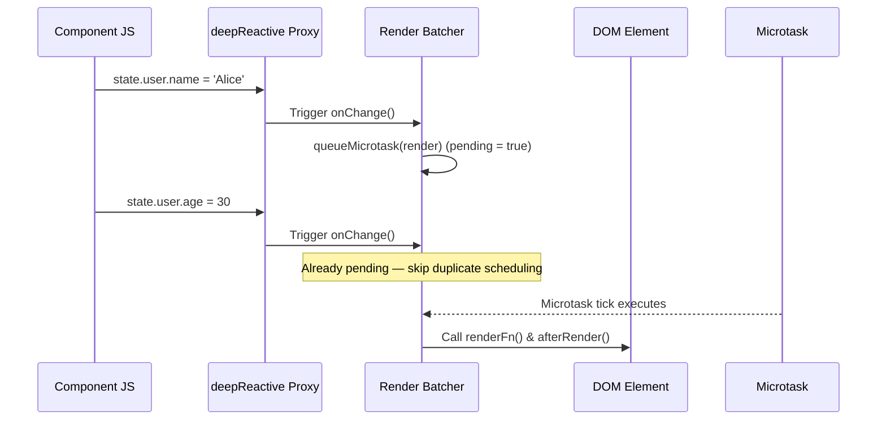

# ⚡ ln-reactive

> **Classification:** ⚙️ Service (Layer 3 - Reactive State & Rendering Optimization)

---

## 1. Core Behavior & Responsibility

`ln-reactive` provides lightweight, framework-free reactive state management using native JavaScript `Proxy` objects, alongside a microtask-based render batcher to prevent redundant DOM updates.

The JavaScript source is located at [reactive.js](../../components/ln-core/reactive.js).

Key responsibilities include:
- **Shallow Reactive Proxy (`reactiveState`):** Wraps an initial state object in a Proxy that triggers a callback when top-level properties are mutated.
- **Deep Reactive Proxy (`deepReactive`):** Recursively wraps nested objects and arrays in Proxies, notifying on nested updates or property deletions.
- **Microtask Render Batcher (`createBatcher`):** Batches multiple synchronous state mutations into a single DOM render cycle using `queueMicrotask`.

> [!IMPORTANT]
> **What the module does NOT do (Orthogonality Doctrine):**
> - **Virtual DOM Diffing:** `ln-reactive` does not diff virtual DOM trees. Component rendering callbacks must update target DOM nodes directly.
> - **Global Store Management:** It is a primitive utility, not a centralized store architecture (use [`ln-data-store`](./ln-data-store.md) for domain data stores).

---

## 2. Minimal HTML Markup & Usage Variants

`ln-reactive` is a pure JavaScript utility module imported directly into components:

```javascript
import { reactiveState, deepReactive, createBatcher } from '../../ln-core';

// 1. Create a render batcher
const scheduleRender = createBatcher(
    () => {
        document.getElementById('counter').textContent = state.count;
    },
    () => {
        console.log('Render cycle complete');
    }
);

// 2. Create reactive state attached to the batcher
const state = reactiveState({ count: 0 }, (prop, value, old) => {
    scheduleRender();
});

// 3. Synchronous mutations trigger only ONE scheduled render
state.count = 1;
state.count = 2;
state.count = 3;
```

---

## 3. Declarative API Contract (Attributes & Events)

### Attributes Table

This service module exposes no declarative HTML attributes directly.

### Programmatic JS API

| Helper | Signature | Returns | Description |
|---|---|---|---|
| `reactiveState` | `(initial: Object, onChange: Function)` | `Proxy` | Creates a shallow reactive Proxy around `initial`. `onChange(prop, value, old)` fires when any top-level property changes. |
| `deepReactive` | `(obj: Object, onChange: Function)` | `Proxy` | Recursively wraps `obj` and its nested objects/arrays in reactive Proxies. `onChange()` fires on any property write or deletion. |
| `createBatcher` | `(renderFn: Function, afterRender?: Function)` | `Function` | Returns a `schedule()` function that queues `renderFn` and optional `afterRender` on the microtask queue. Multiple calls within the same tick execute `renderFn` exactly once. |

### Events API

This service module emits and listens to no custom DOM events directly.

---

## 4. Performance & Batching Concept

When multiple properties on a reactive state change sequentially in a synchronous block, executing DOM writes for every change causes layout thrashing.

`createBatcher` uses `queueMicrotask` to combine state mutations:

```
[Sync Mutate A] ──┐
[Sync Mutate B] ──┼──> queueMicrotask ──> [ single renderFn() ]
[Sync Mutate C] ──┘
```

---

## 5. Accessibility (ARIA) & Common Pitfalls

- **Identical Value Guard:** `reactiveState` skips firing `onChange` if the new value is strictly equal (`===`) to the existing value.
- **Common Pitfall — Cyclic References:** Avoid creating circular object references inside objects passed to `deepReactive`, as the recursive proxy wrapper does not track cyclic references.

---

## 6. Flow Diagram & Lifecycle



---

## 7. Related Components

- [`ln-core`](./ln-core.md) — Re-exports `reactiveState`, `deepReactive`, and `createBatcher`.
- [`ln-data-store`](./ln-data-store.md) — Uses reactive state management for local record stores.
