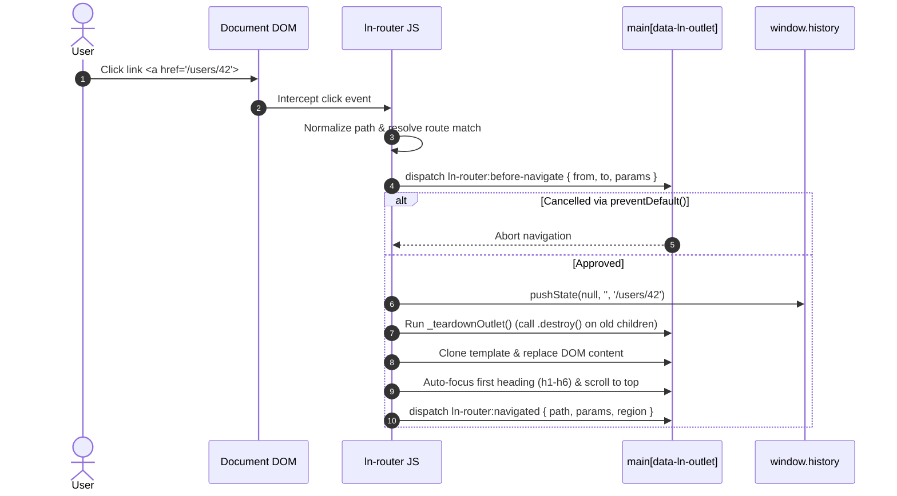

# 🧭 ln-router

> **Classification:** ⚙️ Coordinator / Core Engine (Layer 3 - SPA Routing Engine)

---

## 1. Core Behavior & Responsibility

The `ln-router` component is the client-side SPA routing engine of `ln-ashlar`. It is located in [`js/ln-router/src/ln-router.js`](../../js/ln-router/src/ln-router.js).

*   **Declarative HTML Template Routes:** Routes are declared directly in HTML using `<template data-ln-route="...">`.
*   **Route Specificity Ranking:** Routes are ranked automatically based on pattern specificity:
    1. Static segments (e.g. `/posts/new`) have highest priority.
    2. Dynamic parameter segments (`:param`) have secondary priority.
    3. Wildcards (`*`) have lowest priority and act as catch-all or 404 routes.
*   **Multi-Region Support (Auxiliary Outlets):** Supports rendering into multiple independent target containers simultaneously. Beyond the primary outlet (`__primary__` mapping to `[data-ln-outlet]` or `<main>`), auxiliary regions render via `data-ln-route-target="id"`.
*   **Teardown & Garbage Collection Pipeline:** When a route target is unmounted, `ln-router` recursively invokes `.destroy()` on all active component instances within the outlet to prevent memory leaks.
*   **Keep-Region State Survival:** Regions marked with `data-ln-route-keep` skip DOM replacement if the newly matched template node is identical, preserving internal DOM state (form values, scroll position, focus).
*   **View Transitions API:** Integrates with native `document.startViewTransition()` for hardware-accelerated page transitions.
*   **Hash Popstate Guard:** Ignores `popstate` events that only change the URL fragment/hash, allowing hash-driven mechanisms to process independently without tearing down active routes.

> [!IMPORTANT]
> **What the component does NOT do (Orthogonality Doctrine):**
> - **Does NOT reference or depend on specific UI components:** Completely decoupled from modals, popovers, toasts, or form elements.
> - **Does NOT fetch remote template HTML:** Page templates are declared in the DOM. Async template fetching is handled by [`ln-ajax`](./ln-ajax.md).
> - **Does NOT handle authentication / business guards:** Route guards and access control logic belong in application-level coordinators.

---

## 2. Minimal HTML Markup & Usage Variants

### Base HTML Template Routes

```html
<!-- Primary Routes -->
<template data-ln-route="/" data-ln-route-title="Home">
    <section class="page-home">
        <h1>Welcome Home</h1>
    </section>
</template>

<template data-ln-route="/users" data-ln-route-title="Users">
    <section class="page-users">
        <h1>Users List</h1>
    </section>
</template>

<!-- Dynamic Route Parameter -->
<template data-ln-route="/users/:id" data-ln-route-title="User Profile">
    <section class="page-user-profile">
        <h1>User Details</h1>
    </section>
</template>

<!-- Auxiliary Region Route (data-ln-route-target) -->
<template data-ln-route="/users/:id" 
          data-ln-route-target="sidebar-panel" 
          data-ln-route-title="User Sidebar">
    <aside class="sidebar-details">
        <h3>User Quick Stats</h3>
    </aside>
</template>

<!-- Wildcard 404 Route -->
<template data-ln-route="*" data-ln-route-title="Page Not Found">
    <section class="page-not-found">
        <h1>Error 404</h1>
        <p>The requested page could not be found.</p>
    </section>
</template>

<!-- Outlets / Target Containers -->
<main data-ln-outlet></main>
<div id="sidebar-panel" data-ln-route-keep></div>

<!-- Intercepted Anchor Links -->
<a href="/">Home</a>
<a href="/users">Users</a>
<a href="/users/42">User 42</a>
```

---

## 3. Declarative API Contract (Attributes & Events)

### Attributes Table

| Attribute | Element | Type | Description |
|---|---|---|---|
| `data-ln-route` | `<template>` | String | Registers template as a route with specified pattern (e.g. `/users/:id` or `*`). |
| `data-ln-route-target` | `<template>` | String | ID of target container for auxiliary regions (defaults to primary `[data-ln-outlet]`). |
| `data-ln-route-title` | `<template>` | String | Document title to apply on route match (`document.title`). |
| `data-ln-route-keep` | Outlet Container | Flag | Skips DOM re-rendering when the matched template node has not changed. |
| `data-ln-outlet` | `<main>` / `<div>` | Flag | Identifies the primary outlet container for main routes. |
| `data-ln-router-hydrate` | Outlet Container | Flag | Prevents cloning initial template during server-side pre-rendered hydration. |

### Programmatic JS API (`window.lnRouter` / `router`)

| Method | Parameters | Return | Description |
|---|---|---|---|
| `window.lnRouter.navigate` | `(fullPath: String)` | `void` | Triggers client SPA navigation with history push (`history.pushState`). |
| `window.lnRouter.replace` | `(fullPath: String)` | `void` | Triggers client SPA navigation replacing current history entry (`history.replaceState`). |
| `window.lnRouter.current` | `()` | `Object` | Returns active route state `{ path, params, query, route, regions }`. |

### Events API

| Event | Target | Cancelable | Payload `detail` | Description |
|---|---|---|---|---|
| `ln-router:before-navigate` | Primary Outlet | Yes | `{ from: String, to: String, params: Object, query: Object }` | Dispatched before navigation starts. Calling `preventDefault()` aborts route swap. |
| `ln-router:navigated` | Swapped Outlets | No | `{ path, params, query, route, target, region }` | Dispatched on each updated target container after DOM replacement and focus setup. |
| `ln-router:not-found` | `document.body` | No | `{ path: String }` | Dispatched when no route matches the requested URL. |

---

## 4. CSS Styling & Behavioral Concept

Integrates natively with View Transitions API:

```scss
// CSS View Transitions customization
::view-transition-old(root) {
    animation: fade-out 0.2s ease-out;
}
::view-transition-new(root) {
    animation: fade-in 0.2s ease-in;
}

@keyframes fade-out {
    from { opacity: 1; }
    to { opacity: 0; }
}
@keyframes fade-in {
    from { opacity: 0; }
    to { opacity: 1; }
}
```

---

## 5. Accessibility (ARIA) & Common Pitfalls

### ARIA & Keyboard

- **Focus Management:** On route navigation, `ln-router` automatically shifts focus to prevent keyboard users from losing context. It locates the first heading (`h1-h6`) inside the new container, applies `tabindex="-1"`, and invokes `.focus()`. If no heading is found, it focuses the outlet container itself.

### Common Pitfalls & Anti-patterns

> [!CAUTION]
> 1. **Placing `<template data-ln-route="...">` Inside Its Own Outlet:** Placing template tags inside `<main>` causes the template to be destroyed on the first route swap. Always place route templates at the root level outside outlets.
> 2. **Using Reserved Target Keyword `__primary__`:** `__primary__` is an internal sentinel key. Explicitly setting `data-ln-route-target="__primary__"` is rejected with a console warning.

---

## 6. Flow Diagram & Lifecycle



---

## 7. Related Components

- [`ln-nav.md`](./ln-nav.md) — Listens to router navigation to update active link states.
- [`ln-ajax.md`](./ln-ajax.md) — Asynchronous content loader for template elements.
