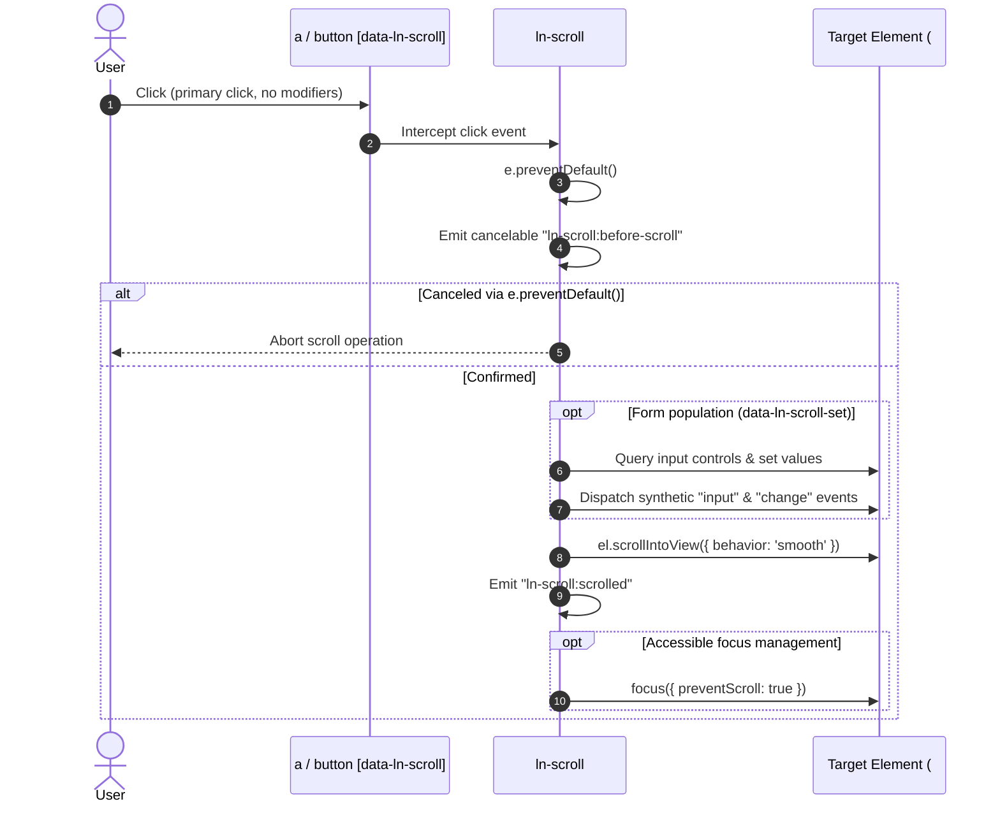

# ⚓ ln-scroll

> **Classification:** 🟢 Simple component / Autonomous Decorator (Layer 1 - Navigation & Interaction)  
> Binds to `<a>` or `<button>` elements carrying `data-ln-scroll` and smoothly scrolls to the target specified by `data-ln-scroll` (e.g. `data-ln-scroll="#apply"`) or their `href` anchor.
> Supports declarative form field population via `data-ln-scroll-set`, post-scroll focus management, and cancelable lifecycle events.

---

## 1. Core Behavior & Responsibility

The `ln-scroll` component provides progressive enhancement for anchor navigation and smooth section scrolling within a page. It is located in [`components/ln-scroll/src/ln-scroll.js`](../../components/ln-scroll/src/ln-scroll.js).

*   **Supported Triggers:** Applies to `<a>` and `<button>` elements. If attached to non-interactive elements, it safely ignores initialization.
*   **Dual Target Resolution:** The scroll destination can be specified directly via `data-ln-scroll="#apply"` (or without the `#` as `data-ln-scroll="apply"`), or via the link's standard HTML `href` attribute (e.g. `href="#apply"`), preserving native HTML semantics and graceful degradation.
*   **Modifier Key Pass-through:** If a user clicks an anchor with Ctrl, Cmd, Shift, Alt or middle click, native browser handling is respected.
*   **Form Pre-population (`data-ln-scroll-set`):** Supports `selector:value` pairs (such as `#opportunity_type:Company Driver`) to set form fields and dispatch `input` and `change` events before scrolling.
*   **Accessible Focus Management:** Automatically moves focus to the first interactive field inside the target section after scrolling (or a field specified by `data-ln-scroll-focus`), using `preventScroll: true`.
*   **Lifecycle Events:** Dispatches cancelable `ln-scroll:before-scroll` and post-scroll `ln-scroll:scrolled`.

---

## 2. Minimal HTML Markup & Usage Variants

### Variant A: Standard Anchor Link

```html
<a href="#services" data-ln-scroll>Our Services</a>
```

### Variant B: Explicit Target Attribute (Links or Buttons)

```html
<button type="button" data-ln-scroll="#apply" class="btn btn-primary">
    Apply Now
</button>
```

### Variant C: Form Preset & Smooth Scroll

```html
<a href="#apply"
   data-ln-scroll
   data-ln-scroll-set="#opportunity_type:Company Driver">
   Apply for Company Driver
</a>
```

---

## 3. Declarative API Contract (Attributes & Events)

### Attributes Table

| Attribute | Element | Type / Values | Default | Description |
|---|---|---|---|---|
| `data-ln-scroll` | `<a>`, `<button>` | `String` (selector or ID) | `""` | Activates smooth scrolling. Can contain target selector (e.g. `"#apply"`, `"apply"`). If empty on `<a>`, reads `href`. |
| `data-ln-scroll-set` | `<a>`, `<button>` | `String` (`selector:value`) | — | Pre-populates target form input before scroll. |
| `data-ln-scroll-behavior` | `<a>`, `<button>` | `"smooth"` \| `"auto"` | `"smooth"` | Scroll animation behavior. |
| `data-ln-scroll-block` | `<a>`, `<button>` | `"start"` \| `"center"` \| `"end"` \| `"nearest"` | `"start"` | Vertical alignment positioning. |
| `data-ln-scroll-focus` | `<a>`, `<button>` | `String` (selector) \| `"false"` | First interactive field | Target element to focus after scroll, or `"false"` to disable focus. |
| `data-ln-scroll-delay` | `<a>`, `<button>` | `Number` | `450` | Milliseconds delay before shifting focus. |
| `data-ln-scroll-update-hash` | `<a>`, `<button>` | `"true"` \| `"false"` | `"false"` | Pushes the anchor hash to browser history via `history.pushState`. |

### Events API

| Event | Direction | Cancelable | Description | `detail` Object |
|---|---|---|---|---|
| `ln-scroll:before-scroll` | Emits | Yes | Dispatched on link/button before scrolling begins. Calling `e.preventDefault()` halts scroll. | `{ target: HTMLElement, link: HTMLElement, href: string }` |
| `ln-scroll:scrolled` | Emits | No | Dispatched immediately after `scrollIntoView` is triggered. | `{ target: HTMLElement, link: HTMLElement, href: string }` |

---

## 4. CSS Styling & Behavioral Concept

The component is purely behavioral. It does not dictate visual appearance or require dedicated stylesheets. Visual styling of anchors or buttons is handled by standard Ashlar button and link mixins (`@include button-base`, `.btn`).

---

## 5. Accessibility (ARIA) & Common Pitfalls

### ARIA & Semantics

- **Preserve Anchor Semantics:** When using `<a>`, always provide a valid `href="#target"` so assistive technologies understand the destination and middle-click / new-tab works as expected.
- **Focus Transition:** Focus is shifted after scrolling to preserve keyboard navigation flow for screen readers and keyboard-only users.

### Common Pitfalls & Anti-patterns

> [!CAUTION]
> 1. **Target element missing:** Ensure the target ID exists on the page. If the element is not found, `ln-scroll` safely returns without error.
> 2. **Avoid unstyled buttons:** When applying `data-ln-scroll` to `<button>`, ensure `type="button"` is explicitly set to prevent unintended form submissions.

---

## 6. Flow Diagram & Lifecycle



---

## 7. Related Components

- [`ln-link.md`](./ln-link.md) — Makes whole container elements clickable.
- [`ln-nav.md`](./ln-nav.md) — Manages dynamic navigation state across links.
- [`ln-form.md`](./ln-form.md) — Form prefilling and record mapping.
