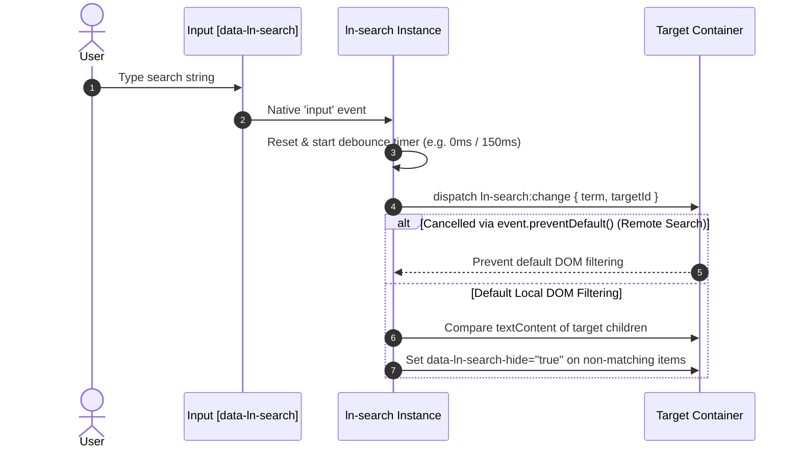

# 🔍 ln-search

> **Classification:** 🟢 Simple component / Filter Utility (Layer 1 - DOM Search & Debounced Filter)

---

## 1. Core Behavior & Responsibility

The `ln-search` component handles instant client-side DOM filtering and dispatches debounced search events for remote (API) search integration. It is located in [`js/ln-search/src/ln-search.js`](../../js/ln-search/src/ln-search.js).

*   **Dual Search Operations (Local vs Remote):**
    *   **Local DOM Filtering (Markup Search):** Configured with `data-ln-search-debounce="0"` for instant per-keyup text matching against DOM children or target sub-elements. Matches are shown, while non-matching elements receive `data-ln-search-hide="true"`.
    *   **Remote API Search:** Uses a default `150ms` debounce (or custom value via `data-ln-search-debounce="150"`) to throttle search dispatches and prevent network request flooding.
*   **Cancelable Change Event:** Emits `ln-search:change` on the target container. External components (such as [`ln-table`](./ln-table.md)) can call `event.preventDefault()` to handle custom API fetching and skip default DOM show/hide logic.
*   **Clear Trigger Integration:** Binds `[data-ln-search-clear]` buttons to reset text input, dispatch empty term events, and restore focus.
*   **Reactive Form Restore Hook:** Restores initial search filtering via `queueMicrotask` when browsers pre-fill form fields on page reload.

> [!IMPORTANT]
> **What the component does NOT do (Orthogonality Doctrine):**
> - **Does NOT filter memory stores directly:** Only dispatches events or sets `data-ln-search-hide="true"` on DOM elements.
> - **Does NOT apply inline CSS display styles:** Toggles `data-ln-search-hide="true"`. Actual hiding is enforced by CSS (`[data-ln-search-hide="true"] { display: none !important; }`).
> - **Does NOT perform HTTP requests:** Server communication is delegated to coordinators or consumer components.

---

## 2. Minimal HTML Markup & Usage Variants

### Base HTML Markup (Instant Local DOM Filter)

Recommended visual wrapper with `data-ln-search-debounce="0"`:

```html
<label class="search">
    <svg class="ln-icon" aria-hidden="true"><use href="#ln-search"></use></svg>
    <input type="search" 
           placeholder="Search items..." 
           data-ln-search="items-list" 
           data-ln-search-debounce="0" 
           aria-label="Search items">
    <button type="button" data-ln-search-clear aria-label="Clear search">
        <svg class="ln-icon" aria-hidden="true"><use href="#ln-x"></use></svg>
    </button>
</label>

<ul id="items-list">
    <li>Item Alpha</li>
    <li>Item Beta</li>
    <li>Item Gamma</li>
</ul>
```

### Variant 1: Deep Sub-Element Filtering (`data-ln-search-items`)

Targets specific descendant elements inside tables or complex trees:

```html
<label class="search">
    <svg class="ln-icon" aria-hidden="true"><use href="#ln-search"></use></svg>
    <input type="search" 
           placeholder="Search users..." 
           data-ln-search="user-table" 
           data-ln-search-items="tbody tr" 
           data-ln-search-debounce="0"
           aria-label="Search users">
    <button type="button" data-ln-search-clear aria-label="Clear search">
        <svg class="ln-icon" aria-hidden="true"><use href="#ln-x"></use></svg>
    </button>
</label>

<table id="user-table">
    <thead>
        <tr><th>Name</th><th>Role</th></tr>
    </thead>
    <tbody>
        <tr><td>Alice Smith</td><td>Admin</td></tr>
        <tr><td>Bob Jones</td><td>User</td></tr>
    </tbody>
</table>
```

### Variant 2: Remote API / Table Integration (Debounced Event Mode)

Dispatches debounced `ln-search:change` events to drive remote table queries:

```html
<label class="search">
    <svg class="ln-icon" aria-hidden="true"><use href="#ln-search"></use></svg>
    <input type="search" 
           placeholder="Search database..." 
           data-ln-search="main-data-table" 
           aria-label="Search database">
    <button type="button" data-ln-search-clear aria-label="Clear search">
        <svg class="ln-icon" aria-hidden="true"><use href="#ln-x"></use></svg>
    </button>
</label>

<div data-ln-table="users" id="main-data-table"></div>
```

---

## 3. Declarative API Contract (Attributes & Events)

### Attributes Table

| Attribute | Element | Type | Default | Description |
|---|---|---|---|---|
| `data-ln-search` | Input / Label | String | — | Target element ID to filter or send search events to. |
| `data-ln-search-items` | Input / Label | String | `null` | Optional CSS selector (e.g. `tbody tr`) targeting child elements instead of direct children. |
| `data-ln-search-debounce` | Input / Label | Number | `150` | Debounce time in ms. Set `0` for instant local DOM filtering. |
| `data-ln-search-clear` | Button | Flag | — | Identifies the clear button inside search wrapper. |
| `data-ln-search-hide` | Target Children | Boolean | `false` | State attribute added to non-matching DOM elements (`"true"`). |

### Programmatic JS API (`element.lnSearch`)

| Property / Method | Type | Description |
|---|---|---|
| `element.lnSearch.targetId` | String | Target container element ID. |
| `element.lnSearch.input` | HTMLInputElement | Reference to the search input element. |
| `element.lnSearch.destroy()` | Function | Disconnects event listeners, timers, and deletes component instance. |

### Events API

| Event | Target | Cancelable | Payload `detail` | Description |
|---|---|---|---|---|
| `ln-search:change` | Target Container | Yes | `{ term: String, targetId: String }` | Dispatched when search term updates. `preventDefault()` skips default DOM show/hide. |

---

## 4. CSS Styling & Behavioral Concept

Visual styling relies on standard SCSS mixins and state attribute selectors:

```scss
// Visual wrapper styling
label.search {
    @include search;
}

// Hiding non-matching elements
[data-ln-search-hide="true"] {
    display: none !important;
}
```

---

## 5. Accessibility (ARIA) & Common Pitfalls

### ARIA & Keyboard

- **Input Labeling:** Always provide `aria-label` or wrapping `<label>` for input fields.
- **Clear Action:** Clear trigger must be a `<button type="button">` with `aria-label="Clear search"`.
- **Decorative Icons:** Decorative SVG icons require `aria-hidden="true"`.

### Common Pitfalls & Anti-patterns

> [!CAUTION]
> 1. **Omitting `data-ln-search-debounce="0"` for Local Search:** Omitting `debounce="0"` for local DOM filtering introduces an unneeded 150ms delay.
> 2. **Programmatic Input Writes Without Dispatching Event:** Changing `input.value = "text"` programmatically does not trigger native `input` events. Manually dispatch `new Event('input', { bubbles: true })`.

---

## 6. Flow Diagram & Lifecycle



---

## 7. Related Components

- [`ln-table.md`](./ln-table.md) — Table component that intercepts search events for server-side queries.
- [`ln-data-coordinator.md`](./ln-data-coordinator.md) — Mediator connecting search inputs with data stores.
