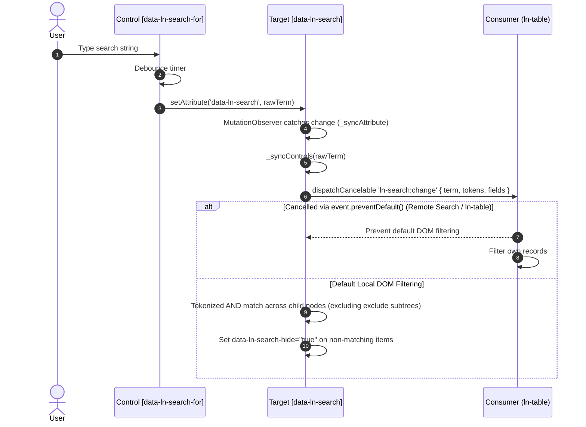

# 🔍 ln-search

> **Classification:** 🟢 Simple component / Search Primitive (Layer 1 - Two-Host Attribute Bridge)

---

## 1. Core Behavior & Responsibility

The `ln-search` component is a decoupled search primitive implemented using the **Two-Host / Attribute Bridge Architecture**. It splits search functionality into two distinct roles:
1. **Control Role (`data-ln-search-for="targetId"`)**: Sits on the input or wrapper, capturing user keystrokes, managing the debounce timer and clear button, and writing the search term into the target's `data-ln-search` attribute.
2. **State Host Role (`data-ln-search="term"`)**: Sits on the target element (table, list, container). It observes its own attribute changes via `MutationObserver`, syncs matching controls, dispatches `ln-search:change`, and runs tokenized DOM filtering if not prevented.

*   **Dual Search Operations (Local vs Remote):**
    *   **Local DOM Filtering (Markup Search):** Configured with `data-ln-search-debounce="0"` on the control for instant per-keyup text matching. Matches stay visible, non-matching elements receive `data-ln-search-hide="true"`.
    *   **Remote API Search:** Uses default `500ms` debounce (or custom `data-ln-search-debounce="150"`) to throttle queries.
*   **Tokenized AND Matching:** Matches whitespace-separated tokens order-independently using substring tests (`indexOf`).
*   **Exempt & Subtree Exclusion (`data-ln-search-exclude`):**
    *   On an **item root**: The item is completely exempt from filtering (always visible, never hidden).
    *   On a **descendant**: That subtree is omitted from search text calculation.
*   **Cancelable Change Event:** Emits `ln-search:change` on the target. External components (`ln-table`, `ln-data-store`, or `ln-table-coordinator`) call `event.preventDefault()` to handle custom filtering.
*   **Deep-link / Form Restore Support:** Pre-filled `data-ln-search` attributes on the target seed the initial state safely via `queueBoot`.

> [!IMPORTANT]
> **What the component does NOT do (Orthogonality Doctrine):**
> - **Does NOT hold JS references between control and target:** Communication is strictly attribute-driven.
> - **Does NOT filter memory stores directly:** Consumers (`ln-table`, `ln-list`, `ln-data-store`) handle their own datasets via `ln-search:change`.
> - **Does NOT apply inline CSS display styles:** Toggles `data-ln-search-hide="true"`. CSS rules handle visibility.
> - **Does NOT perform HTTP requests:** Server communication is delegated to coordinators or consumer components.

---

## 2. Minimal HTML Markup & Usage Variants

### Base HTML Markup (Instant Local DOM Filter)

Recommended visual wrapper with `data-ln-search-debounce="0"`:

```html
<label class="search">
    <svg class="ln-icon" aria-hidden="true"><use href="#ln-icon-search"></use></svg>
    <input type="search" 
           placeholder="Search items..." 
           data-ln-search-for="items-list" 
           data-ln-search-debounce="0" 
           aria-label="Search items">
    <button type="button" data-ln-search-clear aria-label="Clear search">
        <svg class="ln-icon" aria-hidden="true"><use href="#ln-icon-x"></use></svg>
    </button>
</label>

<ul id="items-list" data-ln-search="">
    <li>Item Alpha</li>
    <li>Item Beta</li>
    <li data-ln-search-exclude>Pinned Header (Always Visible)</li>
</ul>
```

### Variant 1: Deep Sub-Element Filtering (`data-ln-search-items`) & Exclusion

Targets specific descendant elements inside tables or complex trees:

```html
<label class="search">
    <svg class="ln-icon" aria-hidden="true"><use href="#ln-icon-search"></use></svg>
    <input type="search" 
           placeholder="Search users..." 
           data-ln-search-for="user-table" 
           data-ln-search-debounce="0"
           aria-label="Search users">
    <button type="button" data-ln-search-clear aria-label="Clear search">
        <svg class="ln-icon" aria-hidden="true"><use href="#ln-icon-x"></use></svg>
    </button>
</label>

<table id="user-table" data-ln-search="" data-ln-search-items="tbody tr" data-ln-search-fields="name,role">
    <thead>
        <tr><th>Name</th><th>Role</th><th>Actions</th></tr>
    </thead>
    <tbody>
        <tr>
            <td>Alice Smith</td>
            <td>Admin</td>
            <td data-ln-search-exclude><button type="button">Delete</button></td>
        </tr>
        <tr>
            <td>Bob Jones</td>
            <td>User</td>
            <td data-ln-search-exclude><button type="button">Delete</button></td>
        </tr>
    </tbody>
</table>
```

### Search Clear Variants (`data-ln-search-clear`)

Clear triggers work universally without external coordinators:

1. **Inside `.search` Chrome (Sibling to Input):**
```html
<label class="search">
    <input type="search" placeholder="Search..." data-ln-search-for="user-table">
    <button type="button" data-ln-search-clear aria-label="Clear search">
        <svg class="ln-icon" aria-hidden="true"><use href="#ln-icon-x"></use></svg>
    </button>
</label>
```

2. **Inside Empty State (Target Container):**
```html
<ul id="items-list" data-ln-search="">
    <li class="empty-state">
        <p>No results found.</p>
        <button type="button" data-ln-search-clear>Clear search</button>
    </li>
</ul>
```

3. **Remote / Detached Clear Button:**
```html
<button type="button" data-ln-search-clear-for="user-table">Reset Search</button>
```

---

## 3. Declarative API Contract (Attributes & Events)

### Attributes Table

| Attribute | Element | Type / Values | Default | Description |
|---|---|---|---|---|
| `data-ln-search-for` | Control (Input / Label) | String | — | Target element ID to drive search state on. |
| `data-ln-search` | Target (State Host) | String | `""` | Search term state. Single source of truth. |
| `data-ln-search-items` | Target (State Host) | String | `null` | Optional CSS selector (e.g. `tbody tr`) targeting items instead of direct children. |
| `data-ln-search-fields` | Target (State Host) | String | `null` | Comma-separated list of fields forwarded in `event.detail.fields`. |
| `data-ln-search-exclude` | Item root or descendant | Flag | — | On item root: exempt from filtering (always visible). On descendant: subtree omitted from search text. |
| `data-ln-search-debounce` | Control | Number | `500` | Debounce time in ms. Set `0` for instant local DOM filtering. |
| `data-ln-search-clear` | Button | Flag | — | Universal clear button (inside control wrapper or inside target empty state). Clears input and resets target state. |
| `data-ln-search-clear-for` | Button | String | — | Remote clear button referencing target element ID. Clears linked input and resets target state. |
| `data-ln-search-hide` | Target Children | Boolean | `false` | State attribute added to non-matching DOM elements (`"true"`). |

### Programmatic JS API

| Instance | Property / Method | Description |
|---|---|---|
| `element.lnSearchControl` (Control) | `targetId`, `input`, `debounceTime`, `destroy()` | Manages input, debounce timer, and clear button. |
| `element.lnSearch` (State Host) | `term`, `_apply()`, `destroy()` | Owns true search state, dispatches events, and performs DOM filtering. |

### Events API

| Event | Direction | Cancelable | Description | `detail` Object |
|---|---|---|---|---|
| `ln-search:change` | Target (State Host) | Yes | Dispatched when search term updates. `preventDefault()` skips default DOM show/hide. | `{ term: string, tokens: string[], targetId: string, fields: string[]\|null }` |

---

## 4. CSS Styling & Behavioral Concept

Visual styling relies on standard SCSS mixins and state attribute selectors:

```scss
// Visual wrapper styling
label.search {
    @include search;
}

// Hiding non-matching elements
[data-ln-search-hide="true"] {
    display: none !important;
}
```

---

## 5. Accessibility (ARIA) & Common Pitfalls

### ARIA & Keyboard

- **Input Labeling:** Always provide `aria-label` or wrapping `<label>` for input fields.
- **Clear Action:** Clear trigger must be a `<button type="button">` with `aria-label="Clear search"`.
- **Decorative Icons:** Decorative SVG icons require `aria-hidden="true"`.

### Common Pitfalls & Anti-patterns

> [!CAUTION]
> 1. **Using `data-ln-search="targetId"` on inputs:** `data-ln-search` is the state attribute on the target. Controls must use `data-ln-search-for="targetId"`.
> 2. **Omitting `data-ln-search-debounce="0"` for Local Search:** Omitting `debounce="0"` for local DOM filtering introduces a default 500ms delay.

---

## 6. Flow Diagram & Lifecycle


```mermaid
sequenceDiagram
    autonumber
    actor User
    participant Control as Control [data-ln-search-for]
    participant Target as Target [data-ln-search]
    participant Consumer as Consumer (ln-table)

    User->>Control: Type search string
    Control->>Control: Debounce timer
    Control->>Target: setAttribute('data-ln-search', rawTerm)
    Target->>Target: MutationObserver catches change (_syncAttribute)
    Target->>Target: _syncControls(rawTerm)
    Target->>Consumer: dispatchCancelable 'ln-search:change' { term, tokens, fields }

    alt Cancelled via event.preventDefault() (Remote Search / ln-table)
        Consumer-->>Target: Prevent default DOM filtering
        Consumer->>Consumer: Filter own records
    else Default Local DOM Filtering
        Target->>Target: Tokenized AND match across child nodes (excluding exclude subtrees)
        Target->>Target: Set data-ln-search-hide="true" on non-matching items
    end
```

---

## 7. Related Components

- [`ln-table.md`](./ln-table.md) — Table component that intercepts search events directly in SSR mode; in data-driven mode `ln-table-coordinator` intercepts them on the table's behalf.
- [`ln-table-coordinator.md`](./ln-table-coordinator.md) — Coordinator connecting search controls with table data stores.
