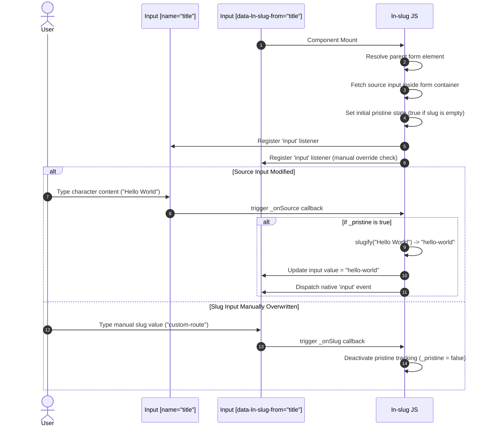

# 🔗 ln-slug

> **Classification:** 🟢 Simple Component / Layer 1 Form Helper

---

## 1. Core Behavior & Responsibility

- **Core Role:** Generates URL-friendly paths (slugs) in real time from a source text field (such as a blog title or product name) inside the same form wrapper.
- **Pristine State Tracking:** Synchronizes value mappings continuously until the user manually types inside the slug field. Modifying the slug directly toggles `_pristine = false`, disconnecting auto-syncing. If the user empties the slug input field, pristine status is restored (`_pristine = true`), re-enabling auto-population.
- **Event Dispatching:** Fires a native `input` event on the target input upon every auto-generation update, ensuring that validator hooks (e.g. uniqueness checks) are triggered.
- Located in [`js/ln-slug/src/ln-slug.js`](../../js/ln-slug/src/ln-slug.js).

> [!IMPORTANT]
> **What the component does NOT do (Orthogonality Doctrine):**
> - **Does NOT transliterate non-ASCII characters** — Characters outside standard ranges are stripped and replaced with hyphens.
> - **Does NOT query uniqueness against database tables** — Verification logic is owned by [`ln-validate`](./ln-validate.md) or the API layer.
> - **Does NOT submit values** — Submission is owned by [`ln-form`](./ln-form.md).

---

## 2. Minimal HTML Markup & Usage Variants

### Base HTML Markup

Standard copy-paste implementation showing a slug input linked to an article title input:

```html
<form id="article-form">
    <!-- Source Input -->
    <div class="form-element">
        <label for="title">Article Title:</label>
        <input type="text" id="title" name="title" required />
    </div>

    <!-- Destination Input -->
    <div class="form-element">
        <label for="slug">URL Path (Slug):</label>
        <input type="text" 
               id="slug" 
               name="slug" 
               required 
               data-ln-slug-from="title" />
    </div>
</form>
```

---

## 3. Declarative API Contract (Attributes & Events)

### Attributes Table

| Attribute | Element | Type / Values | Default | Description |
|---|---|---|---|---|
| `data-ln-slug-from` | Destination `<input>` | `String` | — | Activates the slug generator. The value specifies the `name` attribute of the source input. |

### Events API

`ln-slug` does not emit custom events. To support coordination with validation helpers, it dispatches native **`input`** events (`{ bubbles: true }`) to the target input upon every auto-filled update.

---

## 4. CSS Styling & Behavioral Concept

This component is logic-only. It applies no custom CSS classes or styling. Visual customization of the `<input>` tag is fully delegated to standard form styles defined in the global CSS system.

---

## 5. Accessibility (ARIA) & Common Pitfalls

### ARIA & User Guidance

- **Visual Associations:** Because inputs dynamically mutate as users type elsewhere, it is recommended to provide descriptive captions or map relationship IDs using `aria-describedby` to inform screen reader users of the link between the title and slug inputs.

### Common Pitfalls & Anti-patterns

> [!CAUTION]
> 1. **Targeting Non-Input Elements:**
>    Applying `data-ln-slug-from` on containers other than `<input>` triggers warnings and aborts initialization.
> 2. **Orphaned Outside Forms:**
>    The component resolves source elements via the native browser form element catalog (`dom.form.elements[sourceName]`). If either target resides outside parent `<form>` elements, lookup fails.
> 3. **Non-Unique Name Matching:**
>    If the source input name matches multiple elements (such as radio groups) inside the form, input lookup resolves incorrectly. Always target single unique input names.

---

## 6. Flow Diagram & Lifecycle



---

## 7. Related Components

- [`ln-form.md`](./ln-form.md) — The form manager coordinating validation and value serialization.
- [`ln-validate.md`](./ln-validate.md) — Listens for slug modifications to perform unique database queries.
