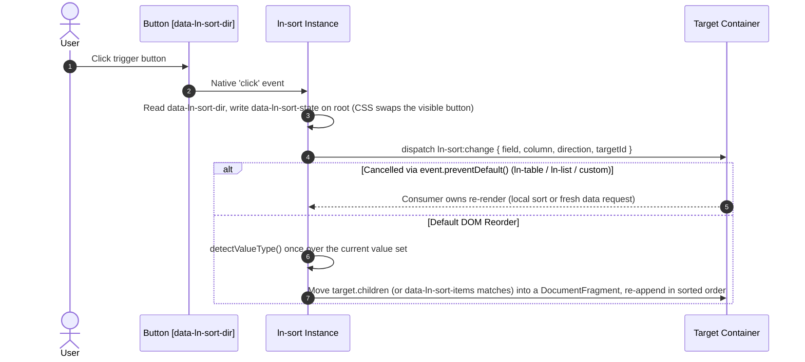

# ⇅ ln-sort

> **Classification:** 🟢 Simple component / Sort Control Primitive (Layer 1 - Sort Intent & Default DOM Reorder)

---

## 1. Core Behavior & Responsibility

`ln-sort` announces a sort intent on a target element via a cancelable event, letting tables, lists, or custom integrations intercept it or fall back to a built-in DOM-reorder default. It is located at [`js/ln-sort/src/ln-sort.js`](../../js/ln-sort/src/ln-sort.js).

It follows the same contract shape as [`ln-search`](./ln-search.md): dispatch-only-to-target, cancelable, default-DOM-behaviour fallback. Unlike [`ln-filter`](./ln-filter.md), it never dual-dispatches to itself.

* **No cycle logic in JS:** A click reads `data-ln-sort-dir` off the clicked button, writes it to `data-ln-sort-state` on the root, and dispatches. The circular order `none → asc → desc → none` is produced entirely by CSS — only one `<button data-ln-sort-dir>` is visible at a time, selected by `[data-ln-sort-state]` on the root.
* **Field is optional:** Author `data-ln-sort-field="name"` when the target is data-driven (server needs a name, not an index). Omit it inside a `<th>` to fall back to `th.cellIndex` — SSR/DOM-only, resolved once at construction, never bridged to `field`. The dispatched payload always carries both keys, exactly one non-null: `{ field: string|null, column: number|null, direction, targetId }`.
* **Single sort, mutual exclusion via the target:** Every instance listens for `ln-sort:change` on its OWN target (not on itself — events bubble up, listening on self would never hear a sibling). When an incoming event's field/column doesn't match this instance's own, it resets its own `data-ln-sort-state` to `"none"`. No registry, no sibling awareness.
* **Type is inferred once per sort, not per pair:** `ln-core.detectValueType` scans the current value set; if every non-empty value is a finite number, comparison is numeric, else `localeCompare` via `ln-core.getLocale`. Per-pair type inference breaks comparator transitivity and produces wrong ordering — never done here.

> [!IMPORTANT]
> **What the component does NOT do (Orthogonality Doctrine):**
> - **Does NOT support multi-column sort:** Single sort only. Multiple `[data-ln-sort]` instances targeting the same target enforce mutual exclusion automatically — they never combine into a compound sort.
> - **Does NOT decide table/list rendering:** Its own default fallback only reorders `target.children` (or `data-ln-sort-items` matches). A consumer calling `preventDefault()` (e.g. [`ln-table`](./ln-table.md), [`ln-list`](./ln-list.md)) owns rendering entirely — local re-sort or a fresh server request.
> - **Does NOT declare a sort type attribute:** There is no `data-ln-sort-type` or similar. The comparison type (string vs number) is inferred once per sort via `ln-core.detectValueType`, never author-declared.

---

## 2. Minimal HTML Markup & Usage Variants

### Base HTML Markup

*(SSR / DOM Table Column — index fallback)*

Omit `data-ln-sort-field` and nest the `<ul>` inside the `<th>` so the `th.cellIndex` fallback resolves:

```html
<th>
	<span>Name</span>
	<ul data-ln-sort="users-table" data-ln-sort-state="none">
		<li><button type="button" data-ln-sort-dir="asc" aria-label="Sort ascending"><svg class="ln-icon" aria-hidden="true"><use href="#ln-icon-arrows-sort"></use></svg></button></li>
		<li><button type="button" data-ln-sort-dir="desc" aria-label="Sort descending"><svg class="ln-icon" aria-hidden="true"><use href="#ln-icon-arrow-up"></use></svg></button></li>
		<li><button type="button" data-ln-sort-dir="none" aria-label="Remove sort"><svg class="ln-icon" aria-hidden="true"><use href="#ln-icon-arrow-down"></use></svg></button></li>
	</ul>
</th>
```

> [!WARNING]
> **Icon convention — READ BEFORE COPYING THIS MARKUP.** Each button carries the icon of the sort
> STATE it is visible in, never the icon of the direction it sets:
>
> | Button | Visible when `data-ln-sort-state` = | Icon it carries |
> |---|---|---|
> | `data-ln-sort-dir="asc"` | `none` | `#ln-icon-arrows-sort` |
> | `data-ln-sort-dir="desc"` | `asc` | `#ln-icon-arrow-up` |
> | `data-ln-sort-dir="none"` | `desc` | `#ln-icon-arrow-down` |
>
> **This is not a typo.** The `dir="desc"` button contains an UP arrow. The visible button always
> performs the NEXT action (clicking `dir="desc"` sorts descending), but its icon always reports the
> CURRENT state (the column is currently ascending — hence the up arrow). If the icon instead matched
> the button's own `data-ln-sort-dir`, the header would visually lie about its own sort order the
> instant the column reaches `state="asc"`. Do not "fix" the icons to match `data-ln-sort-dir` when
> hand-authoring markup — that reintroduces the exact bug this convention exists to prevent.

### Variant 1: Data-Driven Table Column (`data-ln-sort-field`)

Set `data-ln-sort-field` to the same value as the `<th>`'s `data-ln-table-col`. Never combine this with the SSR index fallback on the same instance — `column` stays `null` and the SSR sort path has nothing to key off:

```html
<th data-ln-table-col="price">
	<span>Price</span>
	<ul data-ln-sort="products-table" data-ln-sort-field="price" data-ln-sort-state="none">
		<li><button type="button" data-ln-sort-dir="asc" aria-label="Sort ascending"><svg class="ln-icon" aria-hidden="true"><use href="#ln-icon-arrows-sort"></use></svg></button></li>
		<li><button type="button" data-ln-sort-dir="desc" aria-label="Sort descending"><svg class="ln-icon" aria-hidden="true"><use href="#ln-icon-arrow-up"></use></svg></button></li>
		<li><button type="button" data-ln-sort-dir="none" aria-label="Remove sort"><svg class="ln-icon" aria-hidden="true"><use href="#ln-icon-arrow-down"></use></svg></button></li>
	</ul>
</th>
```

### Variant 2: Plain List (`data-ln-sort-items`)

Target a generic `<ul>`/`<li>` container by `id`. Set `data-ln-sort-items` for deep targeting when the sortable items are not direct children (mirrors `data-ln-search-items`):

```html
<ul data-ln-sort="team-list" data-ln-sort-field="name" data-ln-sort-state="none">
	<li><button type="button" data-ln-sort-dir="asc" aria-label="Sort ascending"><svg class="ln-icon" aria-hidden="true"><use href="#ln-icon-arrows-sort"></use></svg></button></li>
	<li><button type="button" data-ln-sort-dir="desc" aria-label="Sort descending"><svg class="ln-icon" aria-hidden="true"><use href="#ln-icon-arrow-up"></use></svg></button></li>
	<li><button type="button" data-ln-sort-dir="none" aria-label="Remove sort"><svg class="ln-icon" aria-hidden="true"><use href="#ln-icon-arrow-down"></use></svg></button></li>
</ul>

<ul id="team-list">
	<li><span data-ln-field="name">Ana Petrova</span></li>
	<li><span data-ln-field="name">Marko Nikolov</span></li>
</ul>
```

---

## 3. Declarative API Contract (Attributes & Events)

### Attributes Table

| Attribute | Element | Type / Values | Default | Description |
|---|---|---|---|---|
| `data-ln-sort` | `<ul>` (root) | `String` | - | Component root. Value is the `id` of the target element being sorted. |
| `data-ln-sort-field` | Same as root | `String` | `null` | Opt-in. The record field name (data-driven). Omit for the `th.cellIndex` fallback (SSR/DOM only) — never author both on the same instance. |
| `data-ln-sort-state` | Same as root | `"none"`\|`"asc"`\|`"desc"` | `"none"` | *State*. Drives which trigger button is visible via CSS. |
| `data-ln-sort-items` | Same as root | `String` | `null` | Opt-in. Deep CSS selector for default-DOM-behaviour reordering (mirrors `data-ln-search-items`). |
| `data-ln-sort-dir` | `<button>` (inside root) | `"asc"`\|`"desc"`\|`"none"` | - | Identifies which sort action this trigger performs. |
| `data-ln-persist` | Same as root | `String` (Optional) | - | Opt-in. Persists `{ field, column, direction }` to `localStorage`. Give each `[data-ln-sort]` its own value (or `id`) — persistence is per-instance, not per-table. |

### Programmatic JS API (`element.lnSort`)

| Property / Method | Type | Description |
|---|---|---|
| `element.lnSort.targetId` | `String` | The `id` of the target element. |
| `element.lnSort.field` | `String \| null` | The authored field name, or `null`. |
| `element.lnSort.column` | `Number \| null` | The resolved `th.cellIndex` fallback, or `null`. |
| `element.lnSort.destroy()` | `Function` | Removes listeners and tears down the instance. |

### Events API

| Event | Direction | Cancelable | Description | `detail` Object |
|---|---|---|---|---|
| `ln-sort:change` | Emits | Yes | Dispatched on the **target** (never on the sort control itself) on trigger click or persisted-state restore. `preventDefault()` hands the sort intent fully to the consumer and skips the default DOM reorder. | `{ field: String\|null, column: Number\|null, direction: 'asc'\|'desc'\|'none', targetId: String }` |
| `ln-sort:change` | Listens | No | Listens on target container to enforce mutual exclusion across multiple `ln-sort` controls. | `{ field: String\|null, column: Number\|null, direction: 'asc'\|'desc'\|'none', targetId: String }` |

---

## 4. CSS Styling & Behavioral Concept

The circular order lives entirely in CSS via `[data-ln-sort-state]` — only one `<button data-ln-sort-dir>` is ever visible:

```scss
@mixin sort {
	@include inline-flex;
	list-style: none;
	margin: 0;
	padding: 0;
	vertical-align: middle;

	li { list-style: none; }

	button {
		@include table-header-btn-base;
		display: none;
	}

	&[data-ln-sort-state="none"] [data-ln-sort-dir="asc"],
	&[data-ln-sort-state="asc"]  [data-ln-sort-dir="desc"],
	&[data-ln-sort-state="desc"] [data-ln-sort-dir="none"] {
		display: inline-flex;
	}
}

@mixin sort-active {
	[data-ln-sort-dir] {
		opacity: 1;
		color: var(--color-accent);
	}
}
```

Applied globally in [`scss/components/_sort.scss`](../../scss/components/_sort.scss):

```scss
[data-ln-sort] { @include sort; }

th:hover [data-ln-sort] { opacity: 0.7; }

[data-ln-sort][data-ln-sort-state="asc"],
[data-ln-sort][data-ln-sort-state="desc"] {
	@include sort-active;
}
```

`sort-active` applies the accent color only while the state is `asc`/`desc` (an active sort), not
`none` — the visual cue for "this column currently drives ordering."

`<th>` header-button positioning is shared with `.table-filter` — a `<th>` containing both a
`[data-ln-sort]` and a `.table-filter` button auto-repositions each absolutely (sort to the left of
filter) via `table-base`'s `&:has([data-ln-sort]):has(.table-filter)` selector.

---

## 5. Accessibility (ARIA) & Common Pitfalls

### ARIA & Keyboard

- **Icon-only buttons:** Each `<button data-ln-sort-dir>` carries no visible text — `aria-label` is required (`"Sort ascending"`, `"Sort descending"`, `"Remove sort"`).
- **Decorative icons:** Every `<svg>` inside a trigger button requires `aria-hidden="true"`.
- **Native grouping:** The three triggers are `<li>` siblings inside a `<ul>` (the html skill's Button Group Rule) — no `role="group"` override needed, native list semantics already communicate the grouping.

### Common Pitfalls & Anti-patterns

> [!CAUTION]
> 1. **Setting both `data-ln-sort-field` and expecting the index fallback to also work.** They are never bridged. Pick one per instance based on the mode (SSR → index fallback; data-driven → field).
> 2. **Multi-column sort.** Not supported — single sort only. Multiple `[data-ln-sort]` instances targeting the same target enforce mutual exclusion automatically (see §1 "Single sort, mutual exclusion via the target").
> 3. **Expecting JS to own the click cycle.** It doesn't — the circular order is CSS-driven via `[data-ln-sort-state]`. If the three trigger buttons aren't authored per the canonical markup, the cycle breaks visually even though the JS click handling still works.
> 4. **Persisting without a stable key.** `data-ln-persist` with no value falls back to `el.id`; a bare `<ul data-ln-sort data-ln-persist>` with no `id` silently skips persistence (`console.warn`s once).

---

## 6. Flow Diagram & Lifecycle



---

## 7. Related Components

- [`ln-table`](./ln-table.md) — intercepts `ln-sort:change` on its own root to reorder local rows (SSR) or request fresh data (Data-Driven).
- [`ln-list`](./ln-list.md) — same contract as `ln-table`, including windowed mode (re-requests the current page on sort change).
- [`ln-search`](./ln-search.md) — the contract this component's shape mirrors (dispatch-only-to-target, cancelable, default-DOM-behaviour fallback).
- [`ln-persist`](./ln-persist.md) — opt-in per-instance persistence of the active sort via `data-ln-persist`.
