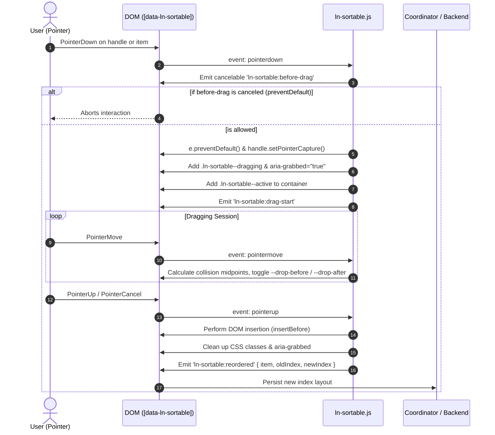

# 🔀 ln-sortable

> **Classification:** 🟢 Simple Component / Drag & Drop Reordering Primitive

---

## 1. Core Behavior & Responsibility

- **Core Role:** Provides drag-and-drop reordering of direct child DOM elements within a parent container (`[data-ln-sortable]`).
- **Touch-Friendly Interaction:** Operates exclusively using the modern browser Pointer Events API (`pointerdown`, `pointermove`, `pointerup`, `pointercancel`), supporting mouse, touch, and stylus input without reliance on heavy HTML5 drag-and-drop APIs.
- Located in [`js/ln-sortable/src/ln-sortable.js`](../../js/ln-sortable/src/ln-sortable.js).

> [!IMPORTANT]
> **What the component does NOT do (Orthogonality Doctrine):**
> - **Does NOT persist order to the backend** — `ln-sortable` only updates the visual/DOM hierarchy (`insertBefore`). Saving the new indices to a database is delegated to a project coordinator listening for the `ln-sortable:reordered` event.
> - **Does NOT inject inline styles** — It avoids inline visual changes (such as `transform` or `position: absolute`). State transformations are applied via CSS classes (`.ln-sortable--dragging`, `.ln-sortable--drop-before`, `.ln-sortable--drop-after`, `.ln-sortable--active`) and ARIA attributes.
> - **Does NOT implement domain business logic** — It maintains strict component isolation, managing only coordinates and child DOM reordering.

---

## 2. Minimal HTML Markup & Usage Variants

### Base HTML Markup (Drag-anywhere list)

Annotating the container (`<ul>`, `<ol>`, or `<div>`) with `data-ln-sortable` makes all direct children interactive and draggable:

```html
<ul data-ln-sortable>
    <li>First Item</li>
    <li>Second Item</li>
    <li>Third Item</li>
</ul>
```

### Variant 1: Dedicated Handles (`data-ln-sortable-handle`)

To prevent accidental drags on mobile when clicking text/buttons inside list items, drag handles can be specified. If present, dragging is initiated ONLY from the handle:

```html
<ol data-ln-sortable>
    <li>
        <span data-ln-sortable-handle class="sortable-handle" aria-label="Move item">
            <svg class="ln-icon" aria-hidden="true"><use href="#ln-grip-vertical"></use></svg>
        </span>
        <span>Board Configuration</span>
    </li>
    <li>
        <span data-ln-sortable-handle class="sortable-handle" aria-label="Move item">
            <svg class="ln-icon" aria-hidden="true"><use href="#ln-grip-vertical"></use></svg>
        </span>
        <span>User Management</span>
    </li>
</ol>
```

### Variant 2: Disabled List (`data-ln-sortable="disabled"`)

Drag interactions can be blocked dynamically or statically:

```html
<ul data-ln-sortable="disabled">
    <li>Locked Item 1</li>
    <li>Locked Item 2</li>
</ul>
```

### Variant 3: Syncing Order with Backend (Rollback Pattern)

An example of how an application script listens to the `ln-sortable:reordered` event, extracts the IDs in the new DOM order, and issues a request, applying a rollback on failure:

```html
<ul id="task-list" data-ln-sortable>
    <li data-task-id="101">
        <span data-ln-sortable-handle class="sortable-handle">
            <svg class="ln-icon" aria-hidden="true"><use href="#ln-grip-vertical"></use></svg>
        </span>
        <span>Task 1: Database Config</span>
    </li>
    <li data-task-id="102">
        <span data-ln-sortable-handle class="sortable-handle">
            <svg class="ln-icon" aria-hidden="true"><use href="#ln-grip-vertical"></use></svg>
        </span>
        <span>Task 2: Implement REST APIs</span>
    </li>
</ul>

<script>
document.getElementById('task-list').addEventListener('ln-sortable:reordered', async function (e) {
    const { item, oldIndex, newIndex } = e.detail;
    const container = e.target;

    const orderedIds = Array.from(container.children)
        .map(child => child.getAttribute('data-task-id'))
        .filter(Boolean);

    try {
        const response = await fetch('/api/tasks/reorder', {
            method: 'PUT',
            headers: { 'Content-Type': 'application/json' },
            body: JSON.stringify({
                taskId: item.getAttribute('data-task-id'),
                oldIndex,
                newIndex,
                orderedIds
            })
        });

        if (!response.ok) throw new Error(`Server error: ${response.status}`);

        window.dispatchEvent(new CustomEvent('ln-toast:enqueue', {
            detail: { type: 'success', title: 'Saved', message: 'Order successfully saved.' }
        }));
    } catch (err) {
        console.error('Reorder sync error:', err);

        // Rollback: return item to its original DOM position
        const children = Array.from(container.children);
        children.splice(newIndex, 1); // remove from new position

        if (oldIndex >= children.length) {
            container.appendChild(item);
        } else {
            container.insertBefore(item, children[oldIndex]);
        }

        window.dispatchEvent(new CustomEvent('ln-toast:enqueue', {
            detail: { type: 'danger', title: 'Error', message: 'Failed to sync order. Rolled back changes.' }
        }));
    }
});
</script>
```

### Variant 4: Coordinator Integration (`data-project-sortable-sync`)

In accordance with Ashlar architecture, communication is mediated using a project-specific coordinator registered through `registerComponent`. 

```html
<ul data-ln-sortable 
    data-project-sortable-sync="/api/tasks/reorder" 
    data-project-item-key="task-id">
    <li data-task-id="101">
        <span data-ln-sortable-handle class="sortable-handle">
            <svg class="ln-icon" aria-hidden="true"><use href="#ln-grip-vertical"></use></svg>
        </span>
        <span>Task 1</span>
    </li>
</ul>
```

---

## 3. Declarative API Contract (Attributes & Events)

### Attributes Table

| Attribute | Element | Type / Values | Default | Description |
|---|---|---|---|---|
| `data-ln-sortable` | Wrapper | `"disabled"` \| `""` | `""` | Main component indicator. If `"disabled"`, drag reordering is deactivated. |
| `data-ln-sortable-handle` | Descendant of list item | Marker | — | If present, dragging can only start on this handle element. |
| `aria-roledescription` | Wrapper | `String` | `"sortable list"` | Automatically applied on initialization to assist screen readers. |
| `aria-grabbed` | Dragged item | `Boolean` string | `"true"` | Placed on the active item during drag; removed once dropped. |

### Programmatic JS API

Direct instance operations via `element.lnSortable`:

| Helper | Signature | Returns | Description |
|---|---|---|---|
| `element.lnSortable.enable` | `()` | `void` | Enables drag reordering (sets `data-ln-sortable=""`). |
| `element.lnSortable.disable` | `()` | `void` | Disables drag reordering (sets `data-ln-sortable="disabled"`). |
| `element.lnSortable.destroy` | `()` | `void` | Removes event bindings and cleans up the instance property. |

### Events API

All events bubble from the parent container (`this.dom`):

| Event | Direction | Cancelable | Description | `detail` Object |
|---|---|---|---|---|
| `ln-sortable:before-drag` | Emits | Yes | Dispatched on `pointerdown` before starting a drag. If canceled, dragging is aborted. | `{ item: HTMLElement, index: number }` |
| `ln-sortable:drag-start` | Emits | No | Dispatched when dragging commences and pointer capture is acquired. | `{ item: HTMLElement, index: number }` |
| `ln-sortable:reordered` | Emits | No | Dispatched upon pointer release ONLY if the DOM index changed. | `{ item: HTMLElement, oldIndex: number, newIndex: number }` |
| `ln-sortable:enabled` | Emits | No | Dispatched when transitioning from `"disabled"` to active. | `{ target: HTMLElement }` |
| `ln-sortable:disabled` | Emits | No | Dispatched when `data-ln-sortable` changes to `"disabled"`. | `{ target: HTMLElement }` |
| `ln-sortable:destroyed` | Emits | No | Dispatched when the instance is destroyed. | `{ target: HTMLElement }` |

---

## 4. CSS Styling & Behavioral Concept

### CSS State Hooks

| CSS Class | Target Element | Description |
|---|---|---|
| `.ln-sortable--active` | Container | Active while a drag session is in progress. Used to suppress text selection. |
| `.ln-sortable--dragging` | Dragged Item | Active on the item being moved. Usually lowers opacity (e.g., `opacity: 0.4`). |
| `.ln-sortable--drop-before` | Sibling Item | Applied to a sibling when the pointer is hovering in its top half. Displays top drop indicators. |
| `.ln-sortable--drop-after` | Sibling Item | Applied to a sibling when the pointer is hovering in its bottom half. Displays bottom drop indicators. |

### Recommended SCSS Styles

```scss
[data-ln-sortable] {
    list-style: none;
    padding: 0;
    margin: 0;

    &.ln-sortable--active {
        user-select: none;
    }

    > li, > div {
        user-select: none;
        transition: box-shadow 0.15s ease, opacity 0.15s ease;

        &.ln-sortable--dragging {
            opacity: 0.4;
        }

        &.ln-sortable--drop-before {
            box-shadow: inset 0 2px 0 0 hsl(var(--color-primary));
        }

        &.ln-sortable--drop-after {
            box-shadow: inset 0 -2px 0 0 hsl(var(--color-primary));
        }
    }
}

[data-ln-sortable-handle],
.sortable-handle {
    touch-action: none;
    cursor: grab;

    &:active {
        cursor: grabbing;
    }
}
```

### Behavioral Concept (Pointer Capture & Midpoint Collision)

- **Pointer Capture:** On `pointerdown`, the handle obtains pointer capture (`setPointerCapture`). This prevents drag interruption if the mouse/finger moves outside the viewport or off the list items during rapid movement.
- **Midpoint Collision:** During movement, the component measures the center line of surrounding elements (`rect.top + rect.height / 2`). Hovering in the top half triggers `.ln-sortable--drop-before`, and the bottom half triggers `.ln-sortable--drop-after`.

---

## 5. Accessibility (ARIA) & Common Pitfalls

### ARIA & Keyboard

- **`aria-roledescription="sortable list"`:** Placed on the root container so screen readers describe the drag capability.
- **`aria-grabbed="true"`:** Dynamically toggled on the active element to indicate selection state.

### Common Pitfalls & Anti-patterns

> [!CAUTION]
> 1. **Omitting `touch-action: none;` on Drag Triggers:**
>    On touch devices, if drag handles or target elements lack `touch-action: none`, the browser will intercept touch gestures as page scrolling (pan-scroll). This terminates pointer capture immediately and triggers `pointercancel`.
> 2. **Assuming Auto-Syncing:**
>    `ln-sortable` is solely a DOM sorting primitive. It **never performs network requests**. Order persistence must be wired separately using events or custom coordinators.
> 3. **Improper Handle Nesting:**
>    `data-ln-sortable-handle` elements must reside within a direct child element of the `data-ln-sortable` container. If placed outside, the sorting engine cannot associate the target gesture with a list item.
> 4. **Drags Triggered on Form Elements:**
>    If no handle is defined, clicking links, buttons, or input text inside items starts a drag action. For lists with interactive controls, **always define a `data-ln-sortable-handle`**.

---

## 6. Flow Diagram & Lifecycle



---

## 7. Related Components

- [`ln-table.md`](./ln-table.md) — Table displays that utilize sortable row primitives.
- [`ln-data-coordinator.md`](./ln-data-coordinator.md) — Mediates backend syncing for model order modifications.
- [`ln-toast.md`](./ln-toast.md) — Outputs success/error status toasts for reordering transactions.
