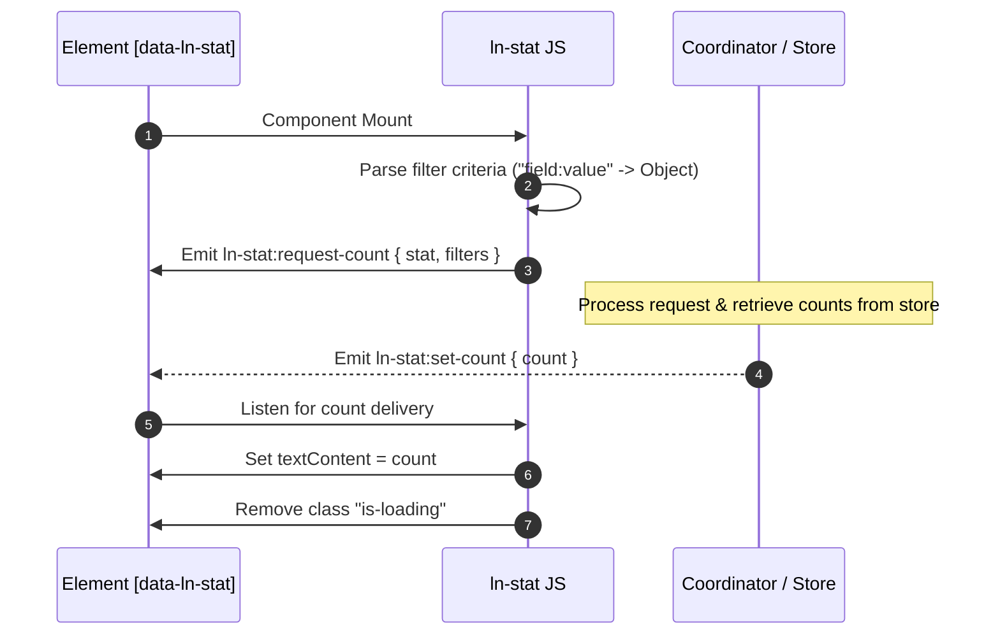

# 📊 ln-stat

> **Classification:** 🟢 Simple Component / Layer 1 Data Metric

---

## 1. Core Behavior & Responsibility

- **Core Role:** Displays statistical metrics (such as database record counts or filtered subgroups) in the user interface.
- **Event-Driven Integration:** Emits `ln-stat:request-count` to trigger queries and listens for `ln-stat:set-count` to display the resolved value.
- **Loading Management:** Supports loading states by removing the `.is-loading` class when the data value is rendered.
- Located in [`js/ln-stat/src/ln-stat.js`](../../js/ln-stat/src/ln-stat.js).

> [!IMPORTANT]
> **What the component does NOT do (Orthogonality Doctrine):**
> - **Does NOT connect directly to the database or network** — It is isolated and delegates the query work to a data coordinator or store manager.
> - **Does NOT manage complex layout or dashboards** — It is a leaf node visual indicator.

---

## 2. Minimal HTML Markup & Usage Variants

### Base HTML Markup

Below is a simple display card showing a count of all users:

```html
<div class="stat-card">
    <h3>Total Users</h3>
    <span class="is-loading" data-ln-stat="users">--</span>
</div>
```

### Variant 1: Filtered Metric Count

Counts a subset of data by specifying field-value constraints:

```html
<div class="stat-card">
    <h3>Active Projects</h3>
    <span class="is-loading" 
          data-ln-stat="projects" 
          data-ln-stat-filter="status:active">--</span>
</div>
```

---

## 3. Declarative API Contract (Attributes & Events)

### Attributes Table

| Attribute | Element | Type / Values | Default | Description |
|---|---|---|---|---|
| `data-ln-stat` | Metric Container | `String` | — | Activates the component and defines the name of the target database store (e.g., `"users"`). |
| `data-ln-stat-filter` | Metric Container | `String` | — | Optional filter criteria formatted as `"field:value"` (e.g., `"status:active"`). |

### Events API

| Event | Direction | Cancelable | Description | `detail` Object |
|---|---|---|---|---|
| `ln-stat:request-count` | Emits | No | Dispatched on initialization to ask the coordinator to resolve the count. | `{ stat: String, filters: Object }` |
| `ln-stat:set-count` | Listens | No | Received from the coordinator when the count is resolved, triggers rendering. | `{ count: Number }` |

---

## 4. CSS Styling & Behavioral Concept

The component controls the text content of the element and manages the `.is-loading` class, which can be styled with skeleton/pulse styling during asynchronous fetches:

```scss
[data-ln-stat] {
    font-size: 2.25rem;
    font-weight: 700;
    color: var(--color-text-dark, #0f172a);
    
    &.is-loading {
        display: inline-block;
        min-width: 40px;
        height: 1em;
        background-color: var(--color-gray-light, #e2e8f0);
        border-radius: 4px;
        color: transparent;
        animation: stat-pulse 1.5s infinite ease-in-out;
    }
}

@keyframes stat-pulse {
    0%, 100% { opacity: 0.6; }
    50% { opacity: 1; }
}
```

---

## 5. Accessibility (ARIA) & Common Pitfalls

### ARIA & Keyboard

- **Dynamic Updates:** Because the metric counts load asynchronously after the initial DOM mount, wrap parent elements or card blocks with `aria-live="polite"` so screen readers announce modifications to visually impaired users.

### Common Pitfalls & Anti-patterns

> [!CAUTION]
> 1. **Malformed Filter Values:**
>    The `data-ln-stat-filter` value must strictly follow the `"field:value"` syntax containing a single colon. Using alternative dividers (such as `status=active` or just `active`) causes the filter parser to fail, rendering the total count instead.
> 2. **Missing Event Coordinator:**
>    If no coordinator listens for `ln-stat:request-count` on the page, the component remains in an indefinite `.is-loading` state, rendering `--`.

---

## 6. Flow Diagram & Lifecycle



---

## 7. Related Components

- [`ln-data-store.md`](./ln-data-store.md) — The data store from which record counts are extracted.
- [`ln-data-coordinator.md`](./ln-data-coordinator.md) — The mediator that routes count requests between metrics and stores.
