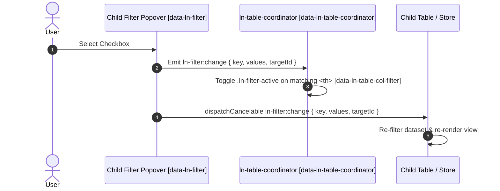

# 🧭 ln-table-coordinator

> **Classification:** 🟡 Coordinator Component

---

## 1. Core Behavior & Responsibility

The `ln-table-coordinator` component is a Layer 2 mediator attached to a wrapper container (`<div data-ln-table-coordinator>`). It encapsulates and coordinates its child [`ln-search`](./ln-search.md), [`ln-filter`](./ln-filter.md), clear buttons, and target [`ln-table`](./ln-table.md) primitives without requiring named scopes or explicit target IDs.

The JavaScript source is located at [ln-table-coordinator.js](../../js/ln-table-coordinator/src/ln-table-coordinator.js).

Key responsibilities include:
- **Child Component Coordination:** Coordinating child search inputs, filter popovers, and table primitives enclosed within the wrapper container.
- **Multiple Coordinators Per Page:** Allowing multiple `data-ln-table-coordinator` wrappers to coexist independently on the exact same page without ID collisions or cross-table interference.
- **Filter Indicator Mediation:** Catching `ln-filter:change` events within the wrapper and toggling `.ln-filter-active` visual indicator classes on header filter buttons (`<th>`).
- **Clear Actions Handler:** Intercepting clicks on `[data-ln-table-clear]` and `[data-ln-table-clear-all]` inside the wrapper, resetting search inputs and filter checkboxes to `checked`, removing `.ln-filter-active` indicator classes, and dispatching `ln-table:request-clear-filters` to an SSR table.
- **Keyboard Shortcut:** Capturing keydown `'/'` to focus the search input inside the active wrapper container.

> [!IMPORTANT]
> **What the component does NOT do (Orthogonality Doctrine):**
> - **Internal Table Rendering:** It does not render table rows or calculate virtual scrolling (handled entirely by [`ln-table`](./ln-table.md)).
> - **Backend Data Fetching:** It does not initiate HTTP requests directly (table data queries route through `ln-table` and [`ln-data-coordinator`](./ln-data-coordinator.md)).

---

## 2. Minimal HTML Markup & Usage Variants

### Base HTML Markup (Wrapper Coordinator Pattern)

Below is the canonical production pattern where `data-ln-table-coordinator` wraps the search bar, table primitive, and filter popovers as a single cohesive unit. The wrapper may equally be an outer element enclosing the card and its popovers rather than the card itself — the contract requires only that the table, its filter popovers, and its clear buttons are descendants of the coordinator host, not any specific shape of container.

```html
<!-- Table Coordinator Wrapper -->
<section class="section-card" data-ln-table-coordinator>

    <!-- Header Toolbar with Search & Reset -->
    <header class="page-header">
        <label class="search">
            <svg class="ln-icon" aria-hidden="true"><use href="#ln-icon-search"></use></svg>
            <input type="search" placeholder="Search employees... (Press '/')" data-ln-search-for="employee-table" data-ln-search-debounce="0">
            <button type="button" data-ln-search-clear aria-label="Clear search">
                <svg class="ln-icon" aria-hidden="true"><use href="#ln-icon-x"></use></svg>
            </button>
        </label>
        <button type="button" class="btn" data-ln-table-clear>
            <svg class="ln-icon" aria-hidden="true"><use href="#ln-icon-filter-off"></use></svg>
            <span>Reset Filters</span>
        </button>
    </header>

    <!-- Table Primitive -->
    <div data-ln-table id="employee-table">
        <!-- Empty State Template -->
        <template data-ln-table-empty>
            <article class="ln-table__empty-state">
                <svg class="ln-icon ln-icon--xl" aria-hidden="true"><use href="#ln-icon-filter"></use></svg>
                <h3>No employees found</h3>
                <p>Try adjusting your search terms or filters.</p>
                <button type="button" class="btn" data-ln-table-clear>Clear all</button>
            </article>
        </template>

        <!-- Table Element -->
        <table>
            <thead>
                <tr>
                    <th>
                        <span>Name</span>
                        <ul data-ln-sort="employee-table" data-ln-sort-state="none">
                            <li><button type="button" data-ln-sort-dir="asc" aria-label="Sort ascending"><svg class="ln-icon" aria-hidden="true"><use href="#ln-icon-arrows-sort"></use></svg></button></li>
                            <li><button type="button" data-ln-sort-dir="desc" aria-label="Sort descending"><svg class="ln-icon" aria-hidden="true"><use href="#ln-icon-arrow-up"></use></svg></button></li>
                            <li><button type="button" data-ln-sort-dir="none" aria-label="Remove sort"><svg class="ln-icon" aria-hidden="true"><use href="#ln-icon-arrow-down"></use></svg></button></li>
                        </ul>
                    </th>
                    <th data-ln-table-filter-col="dept">
                        <span>Department</span>
                        <button type="button" class="table-filter" data-ln-table-col-filter data-ln-popover-for="filter-dept-popover" aria-label="Filter department">
                            <svg class="ln-icon" aria-hidden="true"><use href="#ln-icon-filter"></use></svg>
                        </button>
                        <ul data-ln-sort="employee-table" data-ln-sort-state="none">
                            <li><button type="button" data-ln-sort-dir="asc" aria-label="Sort ascending"><svg class="ln-icon" aria-hidden="true"><use href="#ln-icon-arrows-sort"></use></svg></button></li>
                            <li><button type="button" data-ln-sort-dir="desc" aria-label="Sort descending"><svg class="ln-icon" aria-hidden="true"><use href="#ln-icon-arrow-up"></use></svg></button></li>
                            <li><button type="button" data-ln-sort-dir="none" aria-label="Remove sort"><svg class="ln-icon" aria-hidden="true"><use href="#ln-icon-arrow-down"></use></svg></button></li>
                        </ul>
                    </th>
                    <th data-ln-table-filter-col="status">
                        <span>Status</span>
                        <button type="button" class="table-filter" data-ln-table-col-filter data-ln-popover-for="filter-status-popover" aria-label="Filter status">
                            <svg class="ln-icon" aria-hidden="true"><use href="#ln-icon-filter"></use></svg>
                        </button>
                    </th>
                </tr>
            </thead>
            <tbody>
                <tr>
                    <td data-label="Name">Ana Petrova</td>
                    <td data-label="Department">Engineering</td>
                    <td data-label="Status"><span class="pass">Active</span></td>
                </tr>
                <tr>
                    <td data-label="Name">Marko Nikolov</td>
                    <td data-label="Department">Design</td>
                    <td data-label="Status"><span class="warn">On Leave</span></td>
                </tr>
            </tbody>
        </table>
    </div>

    <!-- Filter Popovers nested inside the coordinator wrapper -->
    <div data-ln-popover id="filter-dept-popover">
        <ul data-ln-filter="employee-table">
            <li><label><input type="checkbox" data-ln-filter-key="dept" data-ln-filter-reset checked> All Departments</label></li>
            <li><label><input type="checkbox" data-ln-filter-key="dept" data-ln-filter-value="Design"> Design</label></li>
            <li><label><input type="checkbox" data-ln-filter-key="dept" data-ln-filter-value="Engineering"> Engineering</label></li>
        </ul>
    </div>

    <div data-ln-popover id="filter-status-popover">
        <ul data-ln-filter="employee-table">
            <li><label><input type="checkbox" data-ln-filter-key="status" data-ln-filter-reset checked> All Statuses</label></li>
            <li><label><input type="checkbox" data-ln-filter-key="status" data-ln-filter-value="Active"> Active</label></li>
            <li><label><input type="checkbox" data-ln-filter-key="status" data-ln-filter-value="On Leave"> On Leave</label></li>
        </ul>
    </div>
</section>
```

### Variant 1: Multiple Table Coordinators on One Page

Multiple `data-ln-table-coordinator` wrappers can safely exist on the same page. Each wrapper isolates its child search and filters from other tables:

```html
<!-- Table 1 Coordinator: Active Employees -->
<section class="section-card" data-ln-table-coordinator>
    <header class="page-header">
        <h2>Active Employees</h2>
        <label class="search">
            <input type="search" placeholder="Search active..." data-ln-search-for="active-employees-table" data-ln-search-debounce="0">
        </label>
    </header>
    <div data-ln-table id="active-employees-table">
        <!-- Table 1 content -->
    </div>
</section>

<!-- Table 2 Coordinator: Archived Records -->
<section class="section-card" data-ln-table-coordinator>
    <header class="page-header">
        <button type="button" class="btn btn-outline" data-ln-table-clear>Reset Filters</button>
    </header>

    <!-- Table Component -->
    <table id="my-table" data-ln-table="items" data-ln-search="">
        <thead>
            <tr>
                <th data-ln-table-filter-col="category">
                    Category
                    <button class="table-filter" type="button" data-ln-table-col-filter data-ln-popover-for="filter-cat" aria-label="Filter category">
                        <svg class="ln-icon" aria-hidden="true"><use href="#ln-icon-filter"></use></svg>
                    </button>
                </th>
            </tr>
        </thead>
        <tbody>
            <tr data-category="engineering"><td>Engineering</td></tr>
        </tbody>
    </table>

    <!-- Filter Popover -->
    <div data-ln-popover id="filter-cat">
        <ul data-ln-filter="my-table">
            <li><label><input type="checkbox" data-ln-filter-key="category" data-ln-filter-reset checked> All</label></li>
            <li><label><input type="checkbox" data-ln-filter-key="category" data-ln-filter-value="engineering"> Engineering</label></li>
        </ul>
    </div>
</section>
```

---

## 3. Declarative API Contract (Attributes & Events)

### Attributes Table

| Attribute | Element | Type / Values | Default | Description |
|---|---|---|---|---|
| `data-ln-table-coordinator` | Wrapper | Flag | Required | Declares the wrapper container that coordinates child search, filter, and table elements. |
| `data-ln-search-for` | Input / Host | Table / Target ID | Required | Targets the element (by its `id`) whose items the search filters. |
| `data-ln-filter` | `<ul>` / Form | Table / Target ID | Required | Filter popover/form coordinated by the parent wrapper. |
| `data-ln-table-clear` | Button | Flag | — | Button trigger that resets search and filters for the child table inside the wrapper. |
| `data-ln-table-clear-all` | Button | Flag | — | Button trigger that resets search and filters globally across all tables. |
| `data-ln-table-filter-col` | `<th>` | Key String | Required | Identifies the table header column matching a filter key string. |
| `data-ln-table-col-filter` | Button | Flag | — | Filter button inside `<th>` that receives `.ln-filter-active` when active. |
| `data-ln-filter-key` | Checkbox | Key String | Required | Specifies the filter field key for checkbox inputs inside `[data-ln-filter]`. |
| `data-ln-filter-value` | Checkbox | Value String | Required | Specifies the filter field value matched against table dataset rows. |
| `data-ln-filter-reset` | Checkbox | Flag | — | Checkbox marked `checked` when all filter options for a column are cleared. |

### Events API

| Event | Direction | Cancelable | Description | `detail` Object |
|---|---|---|---|---|
| `ln-filter:change` | Listens | No | Caught on `data-ln-filter` inside the wrapper container to update header indicators. | `{ key: String, values: Array, targetId: String }` |
| `click` | Listens | No | Caught on `[data-ln-table-clear]` / `[data-ln-table-clear-all]` inside wrapper. | Native MouseEvent |
| `keydown` | Listens | No | Caught on `document` to focus search inside active wrapper on `'/'`. | Native KeyboardEvent |
| `ln-table:request-clear-filters` | Emits | No | Dispatched to child SSR `[data-ln-table]` element on clear button click. | `{ table: String }` |

---

## 4. CSS Styling & Behavioral Concept

The `ln-table-coordinator` component is completely unstyled and contains no layout CSS. It dynamically toggles the visual CSS class `.ln-filter-active` on `[data-ln-table-col-filter]` buttons inside `<th>` headers when a column filter carries non-empty selection values.

---

## 5. Accessibility (ARIA) & Common Pitfalls

### ARIA & Keyboard

- **Search Shortcut:** Pressing `/` anywhere on the page automatically moves focus to `[data-ln-search-for]` inputs inside the active wrapper container.
- **Icon Labels:** Filter and sort buttons in `<th>` carry explicit `aria-label` attributes.

### Common Pitfalls & Anti-patterns

> [!CAUTION]
> 1. **Omitting Wrapper Container:** Always place `data-ln-table-coordinator` on the parent container wrapping your `data-ln-table` and `data-ln-filter` popovers so header indicators and clear actions are coordinated automatically without ID conflicts.
> 2. **Missing `ul/li` Wrap:** Filter options inside popovers MUST be wrapped in `<ul>/<li>` containers according to project DOM rules (`<ul data-ln-filter><li><label><input type="checkbox"...></label></li></ul>`).

---

## 6. Flow Diagram & Lifecycle



---

## 7. Related Components

- [`ln-table`](./ln-table.md) — Table primitive receiving search and filter events.
- [`ln-search`](./ln-search.md) — Search bar input.
- [`ln-filter`](./ln-filter.md) — Column filter popover component.
- [`ln-popover`](./ln-popover.md) — Floating popover container holding filter lists.
- [`ln-data-coordinator`](./ln-data-coordinator.md) — Data store & form write coordinator.
