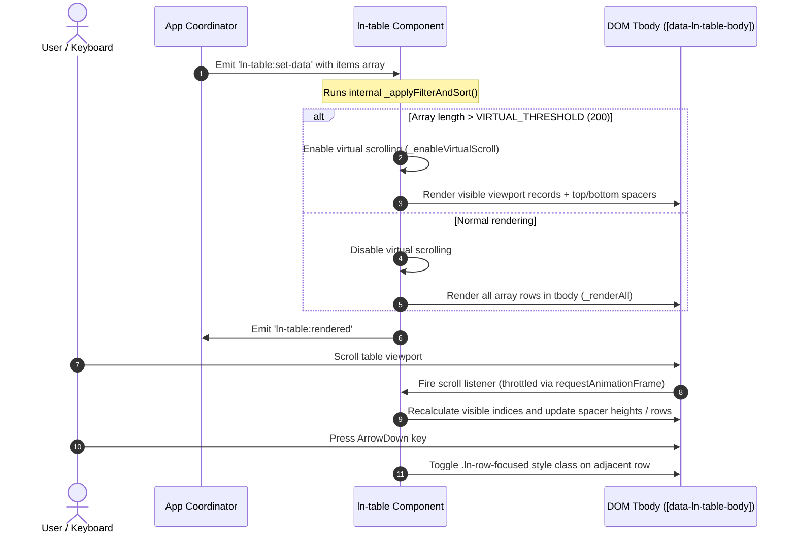
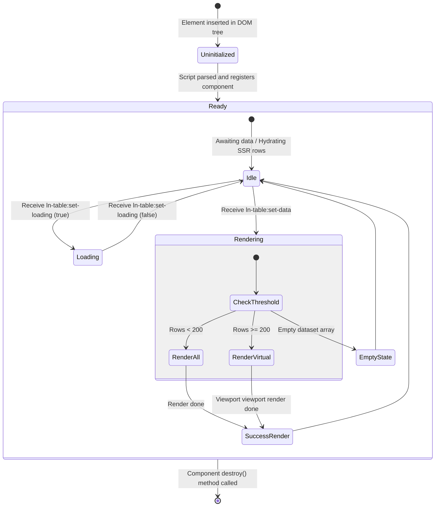

# 📊 ln-table

> **Classification:** 🟢 Simple component / Presenter (Layer 1 - Data Grid View)

---

## 1. Core Behavior & Responsibility

`ln-table` is a high-performance presenter component in the `ln-ashlar` design system, built for tabular data display. It operates in two fundamental modes:

1. **SSR (Server-Side Rendered) Mode:** Hydrates pre-existing markup in `<tbody>` sent from the server. It parses the rows once on initialization and enables instant client-side sorting, column filtering, search, and virtual scrolling on the existing DOM.
2. **Data-Driven Mode:** Functions as a dynamic template engine. When provided with a dataset, it clones a specified row template (`<template data-ln-template="...-row">`), performs safe XSS interpolation using double curly braces (`{{ field }}`), manages active row selections, and updates stats counters in the footer.

The JavaScript source is located at [ln-table.js](../../js/ln-table/src/ln-table.js) and [ln-table-sort.js](../../js/ln-table/src/ln-table-sort.js).

### Orthogonality Doctrine (What the component does NOT do)
* **No direct network/API calls:** It does not fetch data itself. When sorting, filtering, or searching changes in Data-Driven mode, it merely emits a `ln-table:request-data` event. The app coordinator (e.g., [`ln-data-coordinator`](./ln-data-coordinator.md)) handles the transport layer.
* **No primary state storage:** The component represents a visual window onto the data. State modifications must be propagated back via the `ln-table:set-data` event.
* **No filter UI generation:** It does not generate dropdown menus or filter checkboxes. Filter panels are independent DOM trees managed by [`ln-filter`](./ln-filter.md), which notifies the table of filter changes via `ln-filter:changed`.

---

## 2. Minimal HTML Markup & Usage Variants

### Base HTML Markup (SSR Mode)

In SSR mode, the table is functional immediately with the server-rendered markup. Sort buttons are activated via [ln-table-sort.js](../../js/ln-table/src/ln-table-sort.js).

```html
<div id="employees-table" data-ln-table="employees">
  <!-- Empty State Template -->
  <template data-ln-table-empty>
    <div class="ln-table__empty-state">
      <h3>No matches found</h3>
      <button type="button" data-ln-table-clear>Clear Filters</button>
    </div>
  </template>

  <table>
    <thead>
      <tr>
        <th data-ln-table-sort="string">
          Name
          <button type="button" class="table-sort" data-ln-table-col-sort aria-label="Sort by name">
            <svg class="ln-icon" aria-hidden="true" data-ln-table-col-sort-icon="none"><use href="#ln-arrows-sort"></use></svg>
            <svg class="ln-icon" aria-hidden="true" data-ln-table-col-sort-icon="asc"><use href="#ln-arrow-up"></use></svg>
            <svg class="ln-icon" aria-hidden="true" data-ln-table-col-sort-icon="desc"><use href="#ln-arrow-down"></use></svg>
          </button>
        </th>
        <th data-ln-table-sort="number">
          Salary
          <button type="button" class="table-sort" data-ln-table-col-sort aria-label="Sort by salary">
            <svg class="ln-icon" aria-hidden="true" data-ln-table-col-sort-icon="none"><use href="#ln-arrows-sort"></use></svg>
            <svg class="ln-icon" aria-hidden="true" data-ln-table-col-sort-icon="asc"><use href="#ln-arrow-up"></use></svg>
            <svg class="ln-icon" aria-hidden="true" data-ln-table-col-sort-icon="desc"><use href="#ln-arrow-down"></use></svg>
          </button>
        </th>
      </tr>
    </thead>
    <tbody>
      <tr>
        <td>John Doe</td>
        <td data-ln-value="120000">$120,000</td>
      </tr>
      <tr>
        <td>Joanna Doe</td>
        <td data-ln-value="85000">$85,000</td>
      </tr>
    </tbody>
  </table>
</div>
```

---

### Variant 1: Data-Driven Mode

Use when the table queries a store and connects through a coordinator rather than hydrating static SSR markup.

#### HTML Markup

```html
<div data-ln-data-coordinator="products" id="products-coordinator">
  <div data-ln-data-store="products" id="products-store"></div>
  <div data-ln-api-connector="/api/products" id="products-connector"></div>

  <div id="products-table" data-ln-table="products" data-ln-table-source="products" data-ln-table-store="products">
    <table>
      <thead>
        <tr>
          <th data-ln-table-col="name" data-ln-table-sort="string">
            Product
            <button type="button" class="table-sort" data-ln-table-col-sort aria-label="Sort by product">
              <svg class="ln-icon" aria-hidden="true" data-ln-table-col-sort-icon="none"><use href="#ln-arrows-sort"></use></svg>
              <svg class="ln-icon" aria-hidden="true" data-ln-table-col-sort-icon="asc"><use href="#ln-arrow-up"></use></svg>
              <svg class="ln-icon" aria-hidden="true" data-ln-table-col-sort-icon="desc"><use href="#ln-arrow-down"></use></svg>
            </button>
          </th>
          <th data-ln-table-col="price" data-ln-table-sort="number">
            Price
            <button type="button" class="table-sort" data-ln-table-col-sort aria-label="Sort by price">
              <svg class="ln-icon" aria-hidden="true" data-ln-table-col-sort-icon="none"><use href="#ln-arrows-sort"></use></svg>
              <svg class="ln-icon" aria-hidden="true" data-ln-table-col-sort-icon="asc"><use href="#ln-arrow-up"></use></svg>
              <svg class="ln-icon" aria-hidden="true" data-ln-table-col-sort-icon="desc"><use href="#ln-arrow-down"></use></svg>
            </button>
          </th>
        </tr>
      </thead>
      <tbody data-ln-table-body></tbody>
    </table>

    <template data-ln-template="products-row">
      <tr data-ln-table-row>
        <td>{{ name }}</td>
        <td>{{ price }}</td>
      </tr>
    </template>
  </div>
</div>
```

---

## 3. Declarative API Contract (Attributes & Events)

### Attributes Table

| Attribute | Element | Type / Values | Default | Description |
|---|---|---|---|---|
| `data-ln-table` | Root container | `String` | - | Identifies the table. The value names generated events. Must have a unique `id`. |
| `data-ln-table-source` | Root container | `String` | - | Enables Data-Driven mode. Value maps to the data source name. |
| `data-ln-table-store` | Root container | `String` | - | Target data store name to connect with via `ln-data-coordinator`. |
| `data-ln-table-selectable` | Root container | `Boolean` | `false` | Enables row multi-selection and checkboxes. |
| `data-ln-table-col` | `<th>` | `String` | - | Maps a table header to a JSON payload field. |
| `data-ln-table-sort` | `<th>` | `string`\|`number`\|`date` | - | Enables client-side/server-side sorting on this column. |
| `data-ln-value` | `<td>` | `String` | - | Raw computer-readable sorting value, ignoring HTML formatting. *(Processed externally via `ln-core.js` / `fill()`)* |
| `data-ln-table-col-sort` | `<button>` | - | - | Activates column sorting on click. |
| `data-ln-table-col-filter` | `<button>` | - | - | Receives `.ln-filter-active` styling when filters are active on the column. |
| `data-ln-table-col-select` | `<th>` | - | - | Marks a header column containing the global "Select All" checkbox. |
| `data-ln-table-row` | `<tr>` | - | - | Identifies the row element inside a row template. |
| `data-ln-table-row-id` | `<tr>` | `String` | - | Rendered unique ID of the row, populated from record. |
| `data-ln-table-row-select` | `<input>` | - | - | Local selection checkbox in the row template. |
| `data-ln-table-row-action` | `<button>` | `String` | - | Trigger button for actions. Click bubbles to `ln-table:row-action` and stops propagation to select/row clicks. |
| `data-ln-table-total` | `<span>` | - | - | Displays total count in footer. |
| `data-ln-table-filtered` | `<span>` | - | - | Displays filtered count in footer. The immediate parent element is automatically shown/hidden based on active filters. |
| `data-ln-table-selected` | `<span>` | - | - | Displays selection count in footer. The immediate parent element is automatically shown/hidden when selection > 0. |
| `data-ln-table-filter-col` | `<th>` | `String` | - | Maps column header to a filter key. Required for column filtering. |
| `data-ln-table-clear` | `<button>` | - | - | Resets local search inputs and column filters in SSR mode. |
| `data-ln-table-clear-all` | `<button>` | - | - | Resets all active filters and triggers a new data request in Data-Driven mode. |
| `data-ln-table-cell-attr` | Template element | `String` | - | List of `field:attribute` mappings for attribute interpolation. *(Processed externally via `ln-core.js` / `fillTemplate()`)* |
| `data-ln-table-empty-when` | Template element | `initial`\|`search` | - | Targets empty state variant to show based on search vs initial load. |
| `data-ln-persist` | Root container | - | - | Persists sorting configuration in storage. *(Processed externally via `ln-persist.js`)* |

---

### Events API

| Event | Direction | Cancelable | Description | `detail` Object |
|---|---|---|---|---|
| `ln-table:set-data` | Listens | No | Populates the table with a raw dataset (Data-Driven mode). | `{ data: Array, total: Number, filtered: Number }` |
| `ln-table:set-loading` | Listens | No | Toggles the `.ln-table--loading` overlay class (Data-Driven mode). | `{ loading: Boolean }` |
| `ln-search:change` | Listens | No | Triggers local (SSR) or server-side (Data-Driven) search matching. | `{ term: String }` |
| `ln-filter:changed` | Listens | No | Applies column filter values in both SSR and Data-Driven modes. | `{ key: String, values: Array }` |
| `ln-table:sort` | Listens | No | SSR mode only — dispatched externally by `ln-table-sort.js` to execute local row re-ordering. | `{ column: Number, direction: String\|null, sortType: String }` |
| `ln-table:ready` | Emits | No | Fired once after initial row hydration/parsing completes (SSR and Data-Driven modes). | `{ total: Number }` |
| `ln-table:rendered` | Emits | No | Fired after `ln-table:set-data` finishes rendering (Data-Driven mode). | `{ table: String, total: Number, visible: Number }` |
| `ln-table:request-data` | Emits | No | Requests a new data page from the coordinator whenever sort/filter/search state changes, including the initial mount (Data-Driven mode). | `{ table: String, sort: Object\|null, filters: Object, search: String }` |
| `ln-table:sort` | Emits | No | Emitted on column header sort click (Data-Driven mode). | `{ table: String, field: String, direction: String\|null }` |
| `ln-table:sorted` | Emits | No | Emitted after applying a local sort (SSR mode). | `{ column: Number, direction: String\|null, matched: Number, total: Number }` |
| `ln-table:filter` | Emits | No | Emitted after applying search, column filter, or clear actions locally (SSR mode). | `{ term: String, matched: Number, total: Number }` |
| `ln-table:search` | Emits | No | Emitted when receiving an `ln-search:change` term, before requesting fresh data (Data-Driven mode). | `{ table: String, query: String }` |
| `ln-table:clear-filters` | Emits | No | Emitted on clear-all button click, before requesting fresh data (Data-Driven mode). | `{ table: String }` |
| `ln-table:row-click` | Emits | No | Emitted on row left-click or `Enter` keypress (Data-Driven mode). | `{ table: String, id: String, record: Object }` |
| `ln-table:row-action` | Emits | No | Emitted on a row action button click (Data-Driven mode). | `{ table: String, id: String, action: String, record: Object }` |
| `ln-table:select` | Emits | No | Emitted on individual row selection toggle and after select-all (Data-Driven mode). | `{ table: String, selectedIds: Set, count: Number }` |
| `ln-table:select-all` | Emits | No | Emitted when the header "select all" checkbox is toggled (Data-Driven mode). | `{ table: String, selected: Boolean }` |
| `ln-table:empty` | Emits | No | Emitted when the empty-state template is rendered (SSR and Data-Driven modes). | `{ term: String, total: Number }` |

---

## 4. CSS Styling & Behavioral Concept

Styles are divided according to **Separation of Concerns**:
1. **Visual Styling Layer:** Handled by [_ln-table.scss](../../scss/config/mixins/_ln-table.scss).
2. **Behavioral State Layer:** Defined in the component styles [ln-table.scss](../../js/ln-table/ln-table.scss).

### Core SCSS Mixins
* `@mixin ln-table`: Styles border radii, header stickiness (`position: sticky`), shadows, and responsive scrolling wrapper.
* `@mixin ln-table-footer`: Styles the sticky footer at the bottom.
* `@mixin ln-table-empty-state`: Centers and shapes empty search placeholders.
* `@mixin ln-table-spacer-row`: Applied to `.ln-table__spacer` virtual scroll mock elements to hide paddings, borders, and backgrounds.

---

### Behavioral Concepts

#### 1. Virtual Scrolling
Automatically activates when rows exceed `VIRTUAL_THRESHOLD = 200`.
* **Row Measurement:** Component measures the `offsetHeight` of the first row on render.
* **Scroll Container:** Traverses up the DOM via `_findScrollContainer` searching for an element with `overflow-y: auto/scroll`. Falls back to the `window` scroll height.
* **Buffering:** Renders `BUFFER_ROWS = 15` offscreen rows above and below the viewport to prevent scroll flashing. Dynamically changes heights of `.ln-table__spacer` rows at the top and bottom of `<tbody>` to keep scrollbars accurate.

```html
<tbody data-ln-table-body>
  <!-- Top spacer matching heights of hidden top items -->
  <tr class="ln-table__spacer" aria-hidden="true">
    <td colspan="3" style="height: 1200px;"></td>
  </tr>
  
  <!-- Visible viewport rows -->
  <tr data-ln-table-row data-ln-table-row-id="101">...</tr>
  <tr data-ln-table-row data-ln-table-row-id="102">...</tr>
  
  <!-- Bottom spacer matching heights of hidden bottom items -->
  <tr class="ln-table__spacer" aria-hidden="true">
    <td colspan="3" style="height: 3400px;"></td>
  </tr>
</tbody>
```

#### 2. Width Locking (`_lockColumnWidths`)
To prevent column width adjustments as virtual scrolling swaps rows in and out of the viewport, the table generates a `<colgroup>` element with fixed column widths measured in pixels from the headers (`<th>`) upon initial render.

#### 3. Locale-Aware Sorting
Text comparisons utilize `Intl.Collator` read from the document `<html lang>` tag (case-insensitive, ignoring diacritics). Status counters in the footer are localized via `Intl.NumberFormat`.

---

## 5. Accessibility (ARIA) & Common Pitfalls

### ARIA & Keyboard Navigation

* **Semantic Structure:** Leverages native `<table>` semantics for screen readers.
* **Keyboard Focus (Data-Driven Mode Only):** When focused inside the table:
  * `ArrowDown` / `ArrowUp` — Focuses adjacent rows, adding `.ln-row-focused` and `tabindex="0"`, calling `scrollIntoView({ block: 'nearest' })` automatically.
  * `Home` / `End` — Jumps directly to the first or last row.
  * `Enter` — Executes click action (emits `ln-table:row-click`).
  * `Space` — Toggles selection checkbox on active row.
  * `/` (Forward slash) — Moves focus instantly to the associated search input.
* **Ignored Spacers:** Spacer elements are hidden via `aria-hidden="true"`.

---

### Common Pitfalls & Anti-patterns

> [!WARNING]
> 1. **Header Missing Button:** Column sorting requires `data-ln-table-col-sort` button elements inside `th[data-ln-table-sort]`. Otherwise sorting is disabled, and diagnostics styling highlights the mistake.
> 2. **Manual DOM Injection:** In Data-Driven mode, do not append table rows manually. Modifying dataset collections must go through the coordinator via `ln-table:set-data` events to preserve virtual scrolling and selected states.
> 3. **Unformatted SSR Sort:** Column sorting on dates or formatted currencies will fail if done via raw text. Always define `data-ln-value` attributes with raw values on `<td>` cells for proper sorting.

> [!CAUTION]
> 4. **Search Debounce Throttling:** Remote searches targeting APIs must configure `data-ln-search-debounce` on search inputs with a throttle value (at least `150`ms, recommended `250`ms) to prevent server overload. Instant filtering (`0`ms) is restricted to local SSR markup.

---

## 6. Flow Diagram & Lifecycle

### Lifecycle Sequence (Data-Driven Mode)



---

### Table Rendering State Machine



---

## 7. Related Components

* [`ln-search`](./ln-search.md) — drives table text matching via `ln-search:change` events.
* [`ln-filter`](./ln-filter.md) — controls column filter logic and active dropdown menus.
* [`ln-data-coordinator`](./ln-data-coordinator.md) — generic coordinator bridging store datasets and connectors to `ln-table` inputs.
* [`ln-data-store`](./ln-data-store.md) — caches query collections and updates views.
