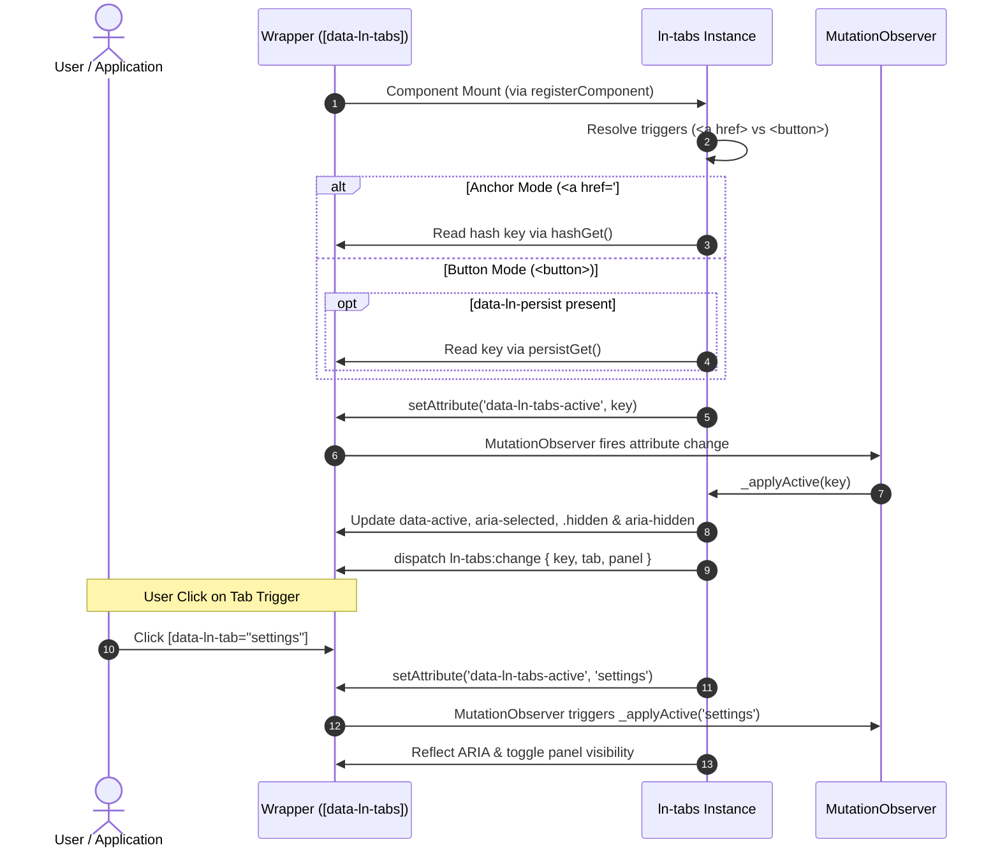

# 📂 ln-tabs

> **Classification:** 🟢 Simple component / State Manager (Layer 1 - UI Primitive)

---

## 1. Core Behavior & Responsibility

The `ln-tabs` component (~180 lines JS) manages N-way exclusive selection of contextual panels within a wrapper container (`[data-ln-tabs]`). It is located in [`js/ln-tabs/src/ln-tabs.js`](../../js/ln-tabs/src/ln-tabs.js).

*   **Single Source of Truth:** Active state resides strictly in `data-ln-tabs-active="key"` on the host container. Click events, URL hash updates (`hashchange`), `localStorage` restoration, and programmatic changes all converge into `setAttribute('data-ln-tabs-active', key)`. The component's `MutationObserver` callback executes UI rendering via `_applyActive(key)`.
*   **Dual Operating Modes (Trigger-Based):**
    1.  **Anchor Triggers (`<a href="#nsKey:key">`) → URL Hash Sync Mode:** Enables shareable, bookmarkable deep links with browser Back/Forward navigation. Uses `id` or `data-ln-tabs-key` on the wrapper as the namespace via [`js/ln-core/hash.js`](../../js/ln-core/hash.js).
    2.  **Button Triggers (`<button>`) → localStorage Persist Mode:** Used for standard UI buttons. Does not mutate the URL. Opt-in persistence via `data-ln-persist` saves/restores state via [`js/ln-core/persist.js`](../../js/ln-core/persist.js).
*   **Reactive ARIA & Focus Management:** Automatically updates `aria-selected` on triggers, toggles `.hidden` and `aria-hidden` on panels, and focuses the first focusable element inside newly activated panels (`data-ln-tabs-focus="true"` by default).

> [!IMPORTANT]
> **What the component does NOT do (Orthogonality Doctrine):**
> - **Does NOT apply visual layout styles:** Tab bars, borders, and animations are strictly owned by CSS (`scss/components/_tabs.scss`).
> - **Does NOT allow mixing anchor and button triggers in one group:** Trigger element type determines operating mode.

---

## 2. Minimal HTML Markup & Usage Variants

### Base HTML Markup (Button Triggers)

```html
<section data-ln-tabs data-ln-tabs-default="overview">
    <nav>
        <button type="button" data-ln-tab="overview">Overview</button>
        <button type="button" data-ln-tab="details">Details</button>
        <button type="button" data-ln-tab="settings">Settings</button>
    </nav>

    <section data-ln-panel="overview">
        <h4>Overview</h4>
    </section>

    <section data-ln-panel="details" class="hidden">
        <h4>Details</h4>
    </section>

    <section data-ln-panel="settings" class="hidden">
        <h4>Settings</h4>
    </section>
</section>
```

### Variant 1: URL Hash-Deep-Linkable Tabs (Anchor Triggers)

```html
<section id="user-tabs" data-ln-tabs data-ln-tabs-default="info">
    <nav>
        <a href="#user-tabs:info" data-ln-tab>Information</a>
        <a href="#user-tabs:settings" data-ln-tab>Settings</a>
    </nav>

    <section data-ln-panel="info">
        <h4>User Info</h4>
    </section>

    <section data-ln-panel="settings" class="hidden">
        <h4>User Settings</h4>
    </section>
</section>
```

### Variant 2: LocalStorage Persisted Tabs (`data-ln-persist`)

```html
<section data-ln-tabs data-ln-persist="user-pref-tabs" data-ln-tabs-default="general">
    <nav>
        <button type="button" data-ln-tab="general">General</button>
        <button type="button" data-ln-tab="security">Security</button>
    </nav>

    <section data-ln-panel="general">...</section>
    <section data-ln-panel="security" class="hidden">...</section>
</section>
```

---

## 3. Declarative API Contract (Attributes & Events)

### Attributes Table

| Attribute | Target Element | Type | Default | Description |
|---|---|---|---|---|
| `data-ln-tabs` | Host | Identifier | — | Initializes the tab group instance. |
| `data-ln-tabs-active` | Host | State | — | Active tab key. Written by component; observed for reactive state changes. |
| `data-ln-tabs-default` | Host | String | First tab | Default fallback key when no URL hash or persisted value exists. |
| `data-ln-tabs-focus` | Host | Boolean | `true` | When `false`, disables automatic focus on the first focusable element inside new active panels. |
| `data-ln-tabs-key` | Host | String | Host `id` | Explicit hash namespace key for anchor triggers. |
| `data-ln-tab` | Trigger | String | `href` hash | Marks element as a tab trigger and defines its key. |
| `data-ln-panel` | Panel | String | — | Marks element as a content panel matching a trigger key. |
| `data-ln-persist` | Host | String / Flag | — | Enables `localStorage` persistence for button triggers. |

### Events API

| Event | Target | Payload `detail` | Description |
|---|---|---|---|
| `ln-tabs:change` | Host | `{ key: String, tab: HTMLElement, panel: HTMLElement }` | Dispatched after panel visibility, ARIA attributes, focus, and persistence updates complete. |
| `ln-tabs:destroyed` | Host | `{ target: HTMLElement }` | Dispatched when `destroy()` is called on the instance. |

---

## 4. CSS Styling & Behavioral Concept

Visual styling relies on SCSS mixins in the visual layer:

```scss
[data-ln-tabs] {
    nav { @include tabs-nav; }
    [data-ln-tab] { @include tabs-tab; }
    [data-ln-panel] { @include tabs-panel; }
    [data-ln-panel].hidden { @include hidden; }
}
```

*   **Active Tab Hooks:** Active triggers receive `[data-active]` attribute and `aria-selected="true"`.
*   **Inactive Panel Hooks:** Hidden panels receive `.hidden` class and `aria-hidden="true"`.

---

## 5. Accessibility (ARIA) & Common Pitfalls

### ARIA & Keyboard

- **Selection State:** Active trigger gets `data-active` & `aria-selected="true"`. Inactive triggers get `aria-selected="false"`.
- **Panel Visibility:** Active panel gets `aria-hidden="false"`. Inactive panels get `class="hidden"` & `aria-hidden="true"`.
- **Auto-Focus:** Focuses first focusable element (`input, button, select, textarea, [tabindex]`) in active panel via `setTimeout(0)` with `{ preventScroll: true }`.

### Common Pitfalls & Anti-patterns

> [!CAUTION]
> 1. **Buttons Inside `<form>` Without `type="button"`:** `<button>` elements inside forms default to `type="submit"`, triggering unintended form submissions when clicking tabs. Always add `type="button"`.
> 2. **Omitting `class="hidden"` on Inactive Panels in Markup:** Omitting `.hidden` from inactive panels in initial server markup causes Layout Flash (FOUC) before JS initializes.
> 3. **Mixing Anchors and `data-ln-persist`:** Anchor triggers use Hash Sync mode and bypass `localStorage` persistence to avoid competing state sources.

---

## 6. Flow Diagram & Lifecycle



---

## 7. Related Components

- [`ln-persist.md`](./ln-persist.md) — LocalStorage persistence mechanics.
