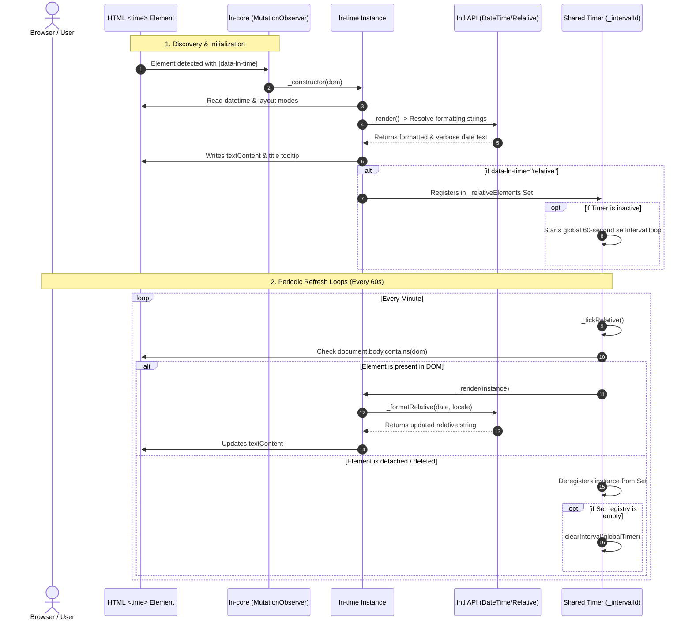

# 🕒 ln-time

> **Classification:** 🟢 Simple Component / Timezone-Aware Formatter

---

## 1. Core Behavior & Responsibility

- **Core Role:** Formats static Unix timestamps on native HTML `<time>` elements into dynamic, localized date/time values using the browser's native `Intl` APIs.
- **Progressive Enhancement:** Allows server-rendered fallback text. If JavaScript is slow to load or disabled, the original string remains visible.
- **Performance Optimization:**
  - **Shared Interval Scheduler:** Runs a single global `setInterval` loop (ticking every 60 seconds) to update all elements configured with `data-ln-time="relative"`.
  - **Formatter Cache:** Caches instances of `Intl.DateTimeFormat` and `Intl.RelativeTimeFormat` under composite locale/options keys to prevent memory churn.
  - **Memory Safety:** Automatically tracks element detachment from the DOM (`document.body.contains`). Detached elements are garbage-collected from the active registry, and the global timer terminates when no relative elements remain.
- **Dynamic Context:** Automatically generates standard description tooltip bounds (`dom.title`) matching the full localized date and time.
- Located in [`js/ln-time/src/ln-time.js`](../../js/ln-time/src/ln-time.js).

> [!IMPORTANT]
> **What the component does NOT do (Orthogonality Doctrine):**
> - **Does NOT handle form input values** — Input controls utilize [`ln-date`](./ln-date.md) instead.
> - **Does NOT run countdown widgets or second-by-second clocks** — Designed for relative time increments (minimum 1-minute updates).
> - **Does NOT perform timezone offset updates** — Relies completely on native user agent locales and defaults.

---

## 2. Minimal HTML Markup & Usage Variants

### Base HTML Markup

Standard static time element. Displays using the default `"short"` style:

```html
<time data-ln-time datetime="1736952600">Jan 15</time>
```

> [!NOTE]
> **Unix Timestamp Format:**
> `ln-time` expects Unix timestamps in **seconds** (10-digit integers, e.g., `1736952600`), NOT milliseconds (13-digit integers). Divide JavaScript `Date.now()` values by `1000` before outputting.

---

### Variant 1: Dynamic Relative Display (`data-ln-time="relative"`)

Calculates age offsets and refreshes every 60 seconds:

```html
<time data-ln-time="relative" datetime="1736952600">just now</time>
```

#### Relative Formatting Thresholds

| Time Difference | Intl Unit | Example Output (en) |
|---|---|---|
| `< 10 seconds` | `second` (0 value) | `"now"` |
| `< 60 seconds` | `second` | `"45 sec. ago"` |
| `< 60 minutes` | `minute` | `"5 min. ago"` |
| `< 24 hours` | `hour` | `"3 hr. ago"` |
| `< 7 days` | `day` | `"2 days ago"` |
| `< 30 days` | `week` | `"2 wk. ago"` |
| `>= 30 days` | — | Fallback to `short` style (e.g. `"Jan 15"`) |

---

### Variant 2: Static Display Modes

```html
<!-- short (Default): "Jan 15" (current year) or "Jan 15, 2024" (past year) -->
<time data-ln-time="short" datetime="1736952600">Jan 15</time>

<!-- full: "January 15, 2025 at 2:30 PM" -->
<time data-ln-time="full" datetime="1736952600">January 15, 2025 14:30</time>

<!-- date: "1/15/2025" -->
<time data-ln-time="date" datetime="1736952600">1/15/2025</time>

<!-- time: "2:30 PM" -->
<time data-ln-time="time" datetime="1736952600">14:30</time>
```

---

### Variant 3: Explicit Locale Overrides

Defines custom localization targets using `data-ln-time-locale`:

```html
<time data-ln-time="full" datetime="1736952600" data-ln-time-locale="de">
    15. Januar 2025 um 14:30
</time>

<time data-ln-time="relative" datetime="1736952600" data-ln-time-locale="fr">
    il y a 5 min.
</time>
```

---

## 3. Declarative API Contract (Attributes & Events)

### Attributes Table

| Attribute | Element | Type / Values | Default | Description |
|---|---|---|---|---|
| `data-ln-time` | `<time>` | `"short"` \| `"relative"` \| `"full"` \| `"date"` \| `"time"` | `"short"` | Sets the display format. If empty or invalid, falls back to `"short"`. |
| `datetime` | `<time>` | `String` / `Number` | — | Target Unix timestamp in **seconds**. If omitted or invalid, text contents are left unchanged. |
| `data-ln-time-locale` | `<time>` | `String` | — | BCP 47 language code override (e.g., `"en-US"`, `"mk"`). Default resolves from `<html lang>` or browser defaults. |

### Programmatic JS API

Instance interfaces accessed via `element.lnTime`:

| Helper | Signature | Returns | Description |
|---|---|---|---|
| `element.lnTime.render` | `()` | `void` | Force-triggers formatter evaluation to refresh text content and title. |
| `element.lnTime.destroy` | `()` | `void` | Cleans up the instance registry, removes event listeners, and deletes the `lnTime` property. |

### Events API

This component emits and listens to no custom ln-* events.

---

## 4. CSS Styling & Behavioral Concept

### Visual Styling

Utilize monospace alignment for tabular metrics to prevent layout shifts during tick refreshes:

```scss
time[data-ln-time] {
    font-variant-numeric: tabular-nums;
    display: inline-block;

    &[data-ln-time="relative"] {
        cursor: help;
    }
}
```

### Behavioral Mechanics

1. **Shared Scheduler Loop:** Active elements are registered in a central `Set` registry (`_relativeElements`). One global `setInterval` loop updates all elements in a single pass.
2. **Garbage Collection:** On each tick, the scheduler runs `document.body.contains(dom)`. If an element has been removed from the DOM, it is purged from the set. Once the set is empty, the interval stops.
3. **Hover Announcement:** For all layout modes except `full`, the component builds a verbose date representation and writes it directly to the element's `title` attribute.

---

## 5. Accessibility (ARIA) & Common Pitfalls

### ARIA & Semantics

- **HTML5 Semantic Wrapping:** Encapsulating Unix parameters inside `<time>` structures provides native machine readability for search indexes, while offering readable translated texts to screen readers.
- **Title Attributes:** Tooltips offer screen reader focus targets and context helpers on hover.

### Common Pitfalls & Anti-patterns

> [!CAUTION]
> 1. **Passing Milliseconds to Datetime:**
>    Providing `datetime="1736952600000"` (13 digits) causes `ln-time` to project the date into the far future (year 57000+). Always verify timestamps are stored and output in seconds (10 digits).
> 2. **ISO 8601 String Formats:**
>    Using formats like `datetime="2025-01-15T14:30:00Z"` results in `NaN` parsing errors. Convert raw strings to Unix seconds before setting the attribute.
> 3. **Indefinite 1-Second Precision Expectation:**
>    The shared relative scheduler loop updates once every **60 seconds** to preserve mobile battery life and minimize CPU consumption.

---

## 6. Flow Diagram & Lifecycle



---

## 7. Related Components

- [`ln-date.md`](./ln-date.md) — Date inputs for forms.
- [`ln-number.md`](./ln-number.md) — Localization formatting utility for numbers, currencies, and percentages.
- [`ln-table.md`](./ln-table.md) — Tabular outputs which commonly embed relative timestamps.
