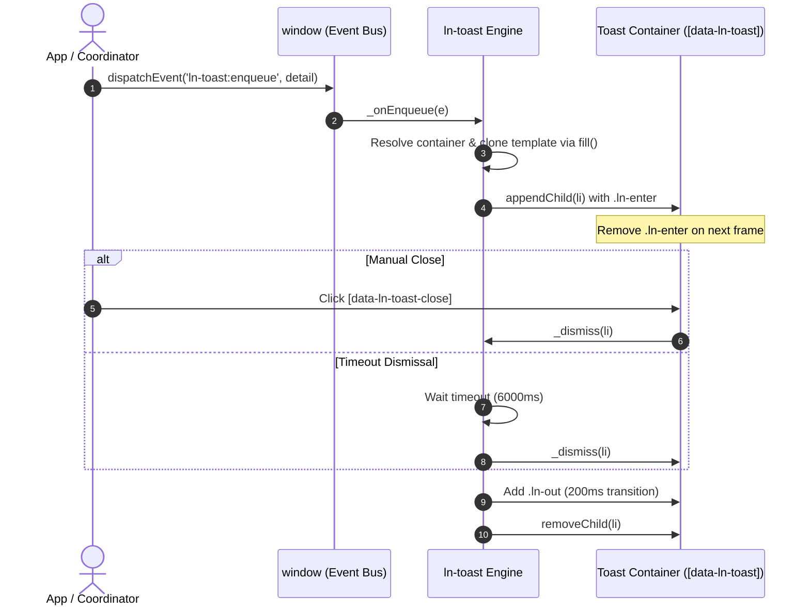

# 🔔 ln-toast

> **Classification:** 🟢 Simple component / Viewport Service (Layer 1 - UI Messaging)

---

## 1. Core Behavior & Responsibility

The `ln-toast` component provides a global non-blocking toast notification service driven by a window-level CustomEvent bus (`window.addEventListener`). It is located in [`js/ln-toast/src/ln-toast.js`](../../js/ln-toast/src/ln-toast.js).

*   **Declarative Templating:** Toast cards are rendered declaratively from an HTML template (`<template data-ln-template="ln-toast-item">`) using `cloneTemplateScoped` and `fill` from [`ln-core`](../../js/ln-core/src/ln-core.js).
*   **SSR / Hydration:** Supports auto-hydrating pre-rendered server-side `<li>` elements existing inside the toast container on initial load.
*   **Queue Eviction (FIFO):** Automatically caps the maximum number of visible notifications (`data-ln-toast-max="5"`), evicting the oldest card when the queue threshold is exceeded.
*   **Automatic Timeout & Manual Dismissal:** Manages auto-dismiss timers (`data-ln-toast-timeout="6000"`) and binds click handlers to `[data-ln-toast-close]` buttons.

> [!IMPORTANT]
> **What the component does NOT do (Orthogonality Doctrine):**
> - **Does NOT perform remote AJAX fetches:** Does not poll or fetch backend messaging APIs.
> - **Does NOT contain hardcoded UI text:** All title and message content is supplied dynamically via events.
> - **Does NOT render interactive confirmation dialogs:** Use [`ln-confirm`](./ln-confirm.md) or [`ln-modal`](./ln-modal.md) for user confirmations.
> - **Does NOT decide when toasts trigger:** UI events are dispatched by coordinators or form handlers.

---

## 2. Minimal HTML Markup & Usage Variants

### Base HTML Container

Placed at the end of the main layout body:

```html
<ul data-ln-toast data-ln-toast-timeout="6000" data-ln-toast-max="5"></ul>
```

### Base HTML Template (`ln-toast-item`)

```html
<template data-ln-template="ln-toast-item">
    <li data-ln-toast-item data-ln-attr="class:type">
        <div class="icon">
            <ul>
                <li data-ln-toast-when="success"><svg class="ln-icon" aria-hidden="true"><use href="#ln-circle-check"></use></svg></li>
                <li data-ln-toast-when="error"><svg class="ln-icon" aria-hidden="true"><use href="#ln-circle-x"></use></svg></li>
                <li data-ln-toast-when="warn"><svg class="ln-icon" aria-hidden="true"><use href="#ln-alert-triangle"></use></svg></li>
                <li data-ln-toast-when="info"><svg class="ln-icon" aria-hidden="true"><use href="#ln-info-circle"></use></svg></li>
            </ul>
        </div>
        <section class="content">
            <header>
                <strong class="title" data-ln-field="title"></strong>
                <button type="button" data-ln-toast-close aria-label="Close">
                    <svg class="ln-icon" aria-hidden="true"><use href="#ln-x"></use></svg>
                </button>
            </header>
            <main class="body" data-ln-field="message"></main>
        </section>
    </li>
</template>
```

### Variant 1: Enqueueing Notifications via Event Bus

```html
<script>
window.dispatchEvent(new CustomEvent('ln-toast:enqueue', {
    detail: {
        type: 'success', // success | error | warn | info
        title: 'Operation Successful',
        message: 'Your changes have been saved.'
    }
}));
</script>
```

### Variant 2: Validation Error Lists

```html
<script>
window.dispatchEvent(new CustomEvent('ln-toast:enqueue', {
    detail: {
        type: 'error',
        title: 'Validation Error',
        message: ['Username is required.', 'Email address is invalid.']
    }
}));
</script>
```

---

## 3. Declarative API Contract (Attributes & Events)

### Attributes Table

| Attribute | Target Element | Type | Default | Description |
|---|---|---|---|---|
| `data-ln-toast` | Container (`ul`) | Identifier | — | Marks element as a toast container host. |
| `data-ln-toast-timeout` | Container / Event | `Number (ms)` | `6000` | Display duration before auto-dismissal. `0` disables timeout. |
| `data-ln-toast-max` | Container (`ul`) | `Number` | `5` | Maximum active cards in stack before FIFO eviction. |
| `data-ln-toast-item` | Card (`li`) | Identifier | — | Identifies individual toast cards for hydration/removal. |
| `data-ln-toast-close` | Button | Identifier | — | Identifies manual close triggers inside card headers. |

### Events API

| Event | Target | Payload `detail` | Description |
|---|---|---|---|
| `ln-toast:enqueue` | `window` | `{ type, title, message, data, timeout, container }` | Dispatches a request to construct and append a new toast notification. |
| `ln-toast:clear` | `window` | `{ container }` | Clears all active toast notifications (optionally filtered by container). |

---

## 4. CSS Styling & Behavioral Concept

Visual layer implementation using SCSS mixins:

```scss
[data-ln-toast] {
    @include toast-container; // Fixed bottom-right positioning, pointer-events: none

    > li {
        @include toast-item; // pointer-events: auto, flex layout

        &.ln-enter { @include toast-item-enter; } // Initial slide/fade in
        &.ln-out   { @include toast-item-out; }   // Dismissal fade out (200ms)
    }
}
```

*   **`@mixin toast-container`** ([`scss/config/mixins/_toast.scss`](../../scss/config/mixins/_toast.scss)): Positions container at viewport bottom-right with `pointer-events: none` to pass clicks through to page content.
*   **Two-Phase Animation:** On mount, cards receive `.ln-enter` (removed next frame via `requestAnimationFrame`). On dismissal, cards receive `.ln-out` for 200ms before `removeChild()` is called.

---

## 5. Accessibility (ARIA) & Common Pitfalls

### ARIA & Semantics

- **Notification Region:** Container MUST specify `aria-live="polite"` and `aria-atomic="false"` for screen readers to announce new messages without interrupting user flow.
- **Close Action:** Close buttons require explicit `aria-label="Close"`.

### Common Pitfalls & Anti-patterns

> [!CAUTION]
> 1. **Invoking Internal Instance Methods Directly:** Calling `container.lnToast._append()` manually breaks encapsulation. Always emit `ln-toast:enqueue`.
> 2. **Passing Raw HTML Strings to Message:** Message strings pass through `textContent` and `fill()` to prevent XSS. For structured lists, pass array values.

---

## 6. Flow Diagram & Lifecycle



---

## 7. Related Components

- [`ln-confirm.md`](./ln-confirm.md) — Two-click in-place confirmation trigger.
- [`ln-modal.md`](./ln-modal.md) — Modal dialogs for complex/high-impact operations.
