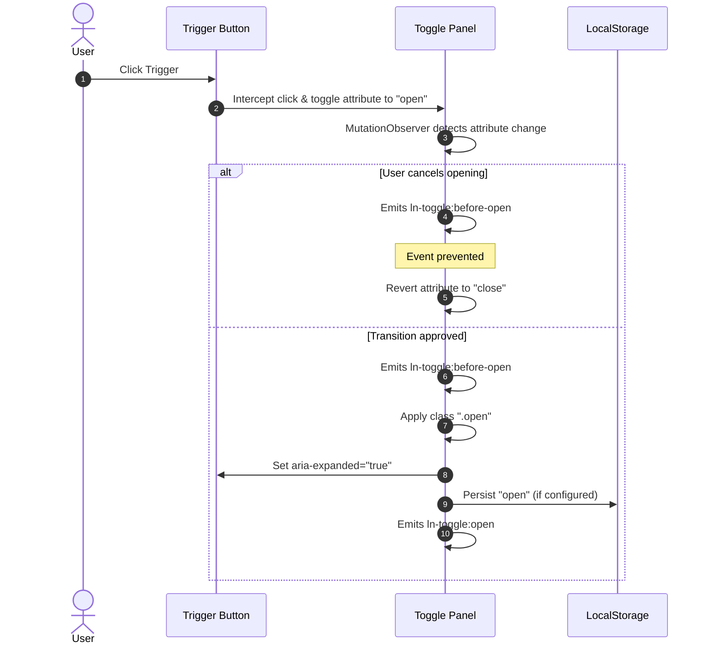

# 🟢 ln-toggle

> **Classification:** 🟢 Simple component

---

## 1. Core Behavior & Responsibility

The `ln-toggle` component serves as the smallest reactive state machine in `ln-ashlar`. Its sole responsibility is managing binary (`open` / `close`) states in the DOM and synchronizing accessibility indicators.

The JavaScript source is located at [ln-toggle.js](../../js/ln-toggle/src/ln-toggle.js).

Key responsibilities include:
- **Binary State Management:** Toggling the value of the `data-ln-toggle` attribute on panel elements and synchronizing a visual `.open` CSS class.
- **Trigger Linking:** Listening to global document clicks, intercepting triggers referencing the panel via `data-ln-toggle-for`, and resolving actions.
- **ARIA Expansion Sync:** Automatically updating the `aria-expanded` attribute on all triggers pointing to the target panel.
- **State Persistence:** Restoring and saving panel states in browser `localStorage` when opted-in.

> [!IMPORTANT]
> **What the component does NOT do (Orthogonality Doctrine):**
> - **Visual Transitions:** It does not animate height or slide panels directly in JavaScript (handled by Vanilla CSS/SCSS mixins, see Section 4).
> - **Mutual Exclusions:** It does not coordinate group toggles where only one panel can be open at a time (handled by [ln-accordion](./ln-accordion.md)).

---

## 2. Minimal HTML Markup & Usage Variants

### Base HTML Markup

Below is a simple collapsible panel bound to a trigger button:

```html
<!-- Trigger Button -->
<button type="button" data-ln-toggle-for="my-panel">
    Toggle Options
</button>

<!-- Target Panel -->
<section id="my-panel" data-ln-toggle="close" class="collapsible">
    <div class="collapsible-body">
        <p>This is smooth collapsible content.</p>
    </div>
</section>
```

### Variant 1: Persistent Alert Banner

Uses `data-ln-persist` to save the closed state in `localStorage` across page reloads.

```html
<div id="promo-banner" class="alert-banner" data-ln-toggle="open" data-ln-persist>
    <span>Promo code active!</span>
    <button type="button" data-ln-toggle-for="promo-banner" data-ln-toggle-action="close">
        &times; Dismiss
    </button>
</div>
```

### Variant 2: Sidebar Panel with Header Dismiss

Includes a trigger that opens the drawer, and a separate close-only button inside the panel header.

```html
<!-- Open Trigger -->
<button type="button" data-ln-toggle-for="main-sidebar" data-ln-toggle-action="open">
    Open Menu
</button>

<!-- Sidebar Panel -->
<aside id="main-sidebar" data-ln-toggle="close" class="sidebar">
    <header>
        <h3>Main Navigation</h3>
        <button type="button" data-ln-toggle-for="main-sidebar" data-ln-toggle-action="close">
            Close &times;
        </button>
    </header>
    <nav>
        <ul>
            <li><a href="/dashboard">Dashboard</a></li>
            <li><a href="/settings">Settings</a></li>
        </ul>
    </nav>
</aside>
```

---

## 3. Declarative API Contract (Attributes & Events)

### Attributes Table

| Attribute | Element | Type / Values | Default | Description |
|---|---|---|---|---|
| `data-ln-toggle` | Panel | `"open"` \| `"close"` | `"close"` | The primary state indicator. Set to `"open"` to show the panel, any other value closes it. |
| `data-ln-toggle-for` | Trigger | Panel Element `id` | Required | Binds a trigger to a target panel by its HTML ID. |
| `data-ln-toggle-action` | Trigger | `"open"` \| `"close"` \| `"toggle"` | `"toggle"` | Restricts trigger click behavior to only open, only close, or toggle the target. |
| `data-ln-persist` | Panel | Presence | Absent | Saves the open/closed state in `localStorage` under the key `ln:toggle:{pagePath}:{id}`. |

### Events API

All events bubble up from the target panel element.

| Event | Direction | Cancelable | Description | `detail` Object |
|---|---|---|---|---|
| `ln-toggle:before-open` | Emits | **Yes** | Fires when the state is about to switch to `"open"`. Prevent default to block the open sequence. | `{ target: HTMLElement }` |
| `ln-toggle:open` | Emits | No | Fires after the panel has fully opened and classes are updated. | `{ target: HTMLElement }` |
| `ln-toggle:before-close` | Emits | **Yes** | Fires when the state is about to switch to `"close"`. Prevent default to block the close sequence. | `{ target: HTMLElement }` |
| `ln-toggle:close` | Emits | No | Fires after the panel has fully closed. | `{ target: HTMLElement }` |
| `ln-toggle:destroyed` | Emits | No | Fires when the component instance is torn down. | `{ target: HTMLElement }` |

---

## 4. CSS Styling & Behavioral Concept

The visual expansion transition is powered by CSS Grid track sizing. The panel is styled using two key mixins defined in [scss/config/mixins/_collapsible.scss](../../scss/config/mixins/_collapsible.scss):

- `@mixin collapsible` — Applied to the panel container. It defaults to `grid-template-rows: 0fr` and transitions to `1fr` when `.open` is added.
- `@mixin collapsible-content` — Applied to the direct child container. It enforces `overflow: hidden` and `min-height: 0` so the track can collapse to exactly `0px`.

### SCSS Style Binding:
```scss
// In scss/components/_collapsible.scss
.collapsible {
    @include collapsible;
    
    .collapsible-body {
        @include collapsible-content;
    }
}
```

---

## 5. Accessibility (ARIA) & Common Pitfalls

### ARIA & Keyboard
- **`aria-expanded` Sync:** All triggers configured with `data-ln-toggle-for` automatically receive `aria-expanded="true"` or `"false"` in sync with the target panel state.
- **Triggers:** Triggers should use standard semantic `<button>` elements to maintain keyboard focusability (`Enter`/`Space` activation).

### Common Pitfalls & Anti-patterns

> [!CAUTION]
> 1. **Padding on Collapsible Panels:** Never apply padding directly to a container styled with `@mixin collapsible`. Padding is not affected by `grid-template-rows: 0fr`, which prevents the panel from collapsing fully, leaving a visual box. Always apply padding to the inner `.collapsible-body` instead.
> 2. **Missing ID on Target Panel:** The panel element must carry a unique `id` attribute. Triggers match target elements by ID, and diagnostic styles (in dev mode) will highlight panels lacking an ID.

---

## 6. Flow Diagram & Lifecycle



---

## 7. Related Components

- [`ln-accordion`](./ln-accordion.md) — Single-open coordinator that orchestrates multiple `ln-toggle` panels.
- [`ln-dropdown`](./ln-dropdown.md) — Overlay menu wrapper that uses toggle state combined with click-outside dismissal.
