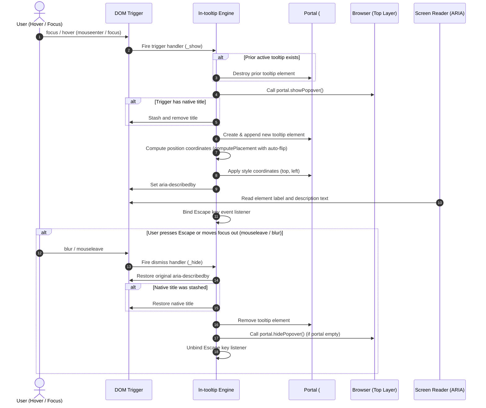

# 💡 ln-tooltip

> **Classification:** 🟢 Simple Component

---

## 1. Core Behavior & Responsibility

The `ln-tooltip` component is a progressive-enhancement floating tooltip engine that shows lightweight contextual descriptions on `hover` or `focus`.

The JavaScript source is located at [ln-tooltip.js](../../js/ln-tooltip/src/ln-tooltip.js).

It operates on a dual-layer approach:
1. **Layer 1: Zero-JS CSS Baseline:** Any element with `data-ln-tooltip="Text"` immediately displays a CSS-only tooltip via `::after` pseudo-elements. This runs instantly without JavaScript overhead.
2. **Layer 2: JS Progressive Enhancement:** If the element carries `data-ln-tooltip-enhance` (or is a semantic `<abbr>` with `title`), the JavaScript engine takes over. The tooltip element is created inside a global `#ln-tooltip-portal` container at the body root. This portal is set as a manual popover (`popover="manual"`) and shown via `showPopover()` to prevent layout clipping and promote it to the Top Layer.
3. **Native Title Suppression:** If a trigger has a native `title` attribute (e.g. `<abbr data-ln-tooltip title="API">`), the JS layer temporarily stashes and strips the `title` during hover/focus to prevent the browser's default yellow tooltip from showing.

> [!IMPORTANT]
> **What the component does NOT do (Orthogonality Doctrine):**
> - **Focus Trapping:** It does not trap focus (its controls are passive, informational, and have `pointer-events: none`).
> - **Multiple Tooltips:** It only displays at most one active tooltip at a time on the screen.
> - **State Coordination:** It does not emit status requests or synchronize data stores.

---

## 2. Minimal HTML Markup & Usage Variants

### Base HTML Markup (Zero-JS CSS Baseline)

Best for icon buttons or static elements located in open layout areas where parents do not clip content:

```html
<button type="button" 
        class="btn btn-icon" 
        data-ln-tooltip="Save Changes" 
        aria-label="Save Changes">
    <svg class="ln-icon" aria-hidden="true">
        <use href="#ln-device-floppy"></use>
    </svg>
</button>
```

### Variant 1: JS Enhanced Portaled Tooltip (Auto-Flip)

Recommended for elements close to the screen edges or nested inside containers with `overflow: hidden` or `overflow-x: auto` (e.g. table cells):

```html
<button type="button" 
        class="btn btn-icon btn-ghost-danger" 
        data-ln-tooltip="Delete Row" 
        data-ln-tooltip-enhance 
        data-ln-tooltip-position="right"
        aria-label="Delete Row">
    <svg class="ln-icon" aria-hidden="true">
        <use href="#ln-trash"></use>
    </svg>
</button>
```

### Variant 2: Semantic <abbr> with Title Stripping

When combining `data-ln-tooltip` with a native `title`, the engine automatically upgrades it to suppress the browser default:

```html
<p>
    The system connects via 
    <abbr data-ln-tooltip title="Application Programming Interface">API</abbr> 
    endpoints.
</p>
```

---

## 3. Declarative API Contract (Attributes & Events)

### Attributes Table

| Attribute | Element | Type / Values | Default | Description |
|---|---|---|---|---|
| `data-ln-tooltip` | Trigger | String | Required | The text content of the tooltip. If empty (`""`), it falls back to the trigger's `title` attribute. |
| `data-ln-tooltip-position`| Trigger | `"top"` \| `"bottom"` \| `"left"` \| `"right"` | `"top"` | Preferred placement side. It flips opposite if edge collisions occur. |
| `data-ln-tooltip-enhance` | Trigger | Presence | - | Explicitly enables JS portal rendering and Top-Layer promotion. |
| `title` | Trigger | String | - | Semantic abbreviation title, stashed/stripped on hover to prevent dual rendering. |
| `data-ln-tooltip-enhanced`| Trigger | Attribute | Added by JS | Added to the trigger by JS to hide the CSS `::after` fallback. |
| `data-ln-tooltip-placement`| Tooltip | Placement String | Added by JS | Winning placement side written on the active tooltip element. |
| `aria-describedby` | Trigger | Tooltip `id` | Synced by JS | Dynamically binds the trigger to the active portal tooltip ID. |

### Events API

| Event | Direction | Cancelable | Description | `detail` Object |
|---|---|---|---|---|
| `ln-tooltip:destroyed` | Emits | No | Dispatched when the trigger component instance is destroyed. | `{ trigger: HTMLElement }` |

---

## 4. CSS Styling & Behavioral Concept

Visual styling is separated from JS logic. Local pseudo-elements are styled in `scss/config/mixins/_tooltip.scss` and `scss/components/_tooltip.scss`. The co-located `js/ln-tooltip/ln-tooltip.scss` supplies the enhancement-suppression rule for the CSS baseline.

### SCSS Component Selector Bindings
```scss
// In scss/components/_tooltip.scss
[data-ln-tooltip] {
	@include tooltip;
}

#ln-tooltip-portal {
	@include tooltip-portal;
}

.ln-tooltip {
	@include tooltip-element;
}
```

### Co-located Component SCSS
```scss
// In js/ln-tooltip/ln-tooltip.scss
[data-ln-tooltip][data-ln-tooltip-enhance]::after,
[data-ln-tooltip][data-ln-tooltip-enhanced]::after,
[data-ln-tooltip][title]::after {
	content: none;
}
```

### SCSS Mixins Reference
```scss
// In scss/config/mixins/_tooltip.scss
@mixin tooltip-bubble {
	--padding-y: var(--size-xs);
	--padding-x: var(--size-sm);
	padding: var(--padding-y) var(--padding-x);
	background: var(--fg-default);
	color: var(--bg-base);
	@include typography(caption);
	--radius: var(--radius-sm);
	border-radius: var(--radius);
	white-space: nowrap;
	pointer-events: none;
	z-index: var(--z-dropdown);
	--shadow: var(--shadow-floating);
	box-shadow: var(--shadow);
}

@mixin tooltip-portal {
	position: fixed;
	inset: auto;
	margin: 0;
	top: 0;
	left: 0;
	pointer-events: none;
}

@mixin tooltip-element {
	@include tooltip-bubble;
	position: fixed;
	max-width: 20rem;

	@include motion-safe {
		animation: ln-tooltip-fade var(--transition-fast);
	}
}
```

### Behavioral Concept

1. **Top-Layer Portal Promotion:** On JS show, the shared `#ln-tooltip-portal` container (created dynamically if not present) is elevated to the Top Layer via `showPopover()`.
2. **Viewport-Aware Positioning:** The tooltip is attached to the portal, measured via offset metrics, and positioned relative to the trigger bounding rect with a **6px** gap offset via `computePlacement`.
3. **Dismissal Transitions:** When hiding, the tooltip element is removed, the stashed trigger properties (`title` / `aria-describedby`) are restored, and `hidePopover()` is called to exit the Top Layer.

---

## 5. Accessibility (ARIA) & Common Pitfalls

### ARIA & Keyboard

- **aria-describedby Integration:** The component dynamically links the trigger to the tooltip ID on show. If a pre-existing `aria-describedby` exists, the tooltip ID is appended as a space-separated suffix and later cleanly restored.
- **Trigger Focus capture:** JS listeners bind capture-phase `focus` and `blur` events alongside `mouseenter` and `mouseleave` so that keyboard users navigate screen readers with the correct descriptors.
- **Escape Key:** Pressing `Escape` immediately closes any visible JS tooltip.

### Common Pitfalls & Anti-patterns

> [!CAUTION]
> 1. **No Screen-Reader Labels on Icon Buttons:** Do not rely on tooltips to convey the button's purpose to screen readers; always provide an `aria-label` or `aria-labelledby`.
> 2. **Tooltip on Non-focusable Elements:** Putting a tooltip on a `<span>` or `<div>` without `tabindex="0"` makes the tooltip inaccessible to keyboard-only users.
> 3. **Disabled Buttons Blocking Hover:** Native HTML `<button disabled>` disables all mouse events. To retain hover tooltips on disabled options, use `aria-disabled="true"` instead of `disabled`.

---

## 6. Flow Diagram & Lifecycle



---

## 7. Related Components

- [`ln-confirm`](./ln-confirm.md) — Uses a bubble layout to prompt low-risk user confirmations in-place.
