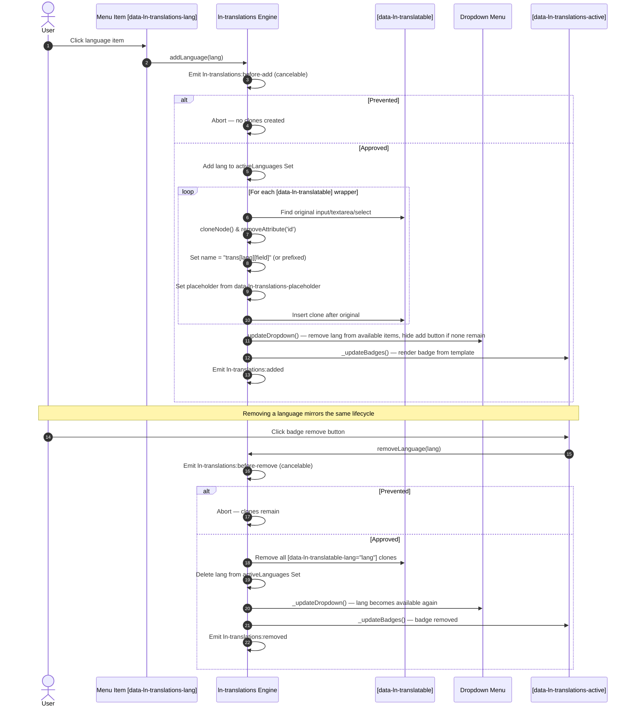

# 🔤 ln-translations

> **Classification:** 🟢 Simple component

---

## 1. Core Behavior & Responsibility

- **Inline field cloning:** wraps translatable form fields via `data-ln-translatable`; when a language is activated, clones the wrapper's original `<input>`/`<textarea>`/`<select>` and appends the clone flagged with `data-ln-translatable-lang="{lang}"`.
- **Deterministic name generation:** cloned inputs get a nested array `name`, e.g. `trans[en][title]`, or `items[1][trans][en][title]` when the wrapper declares `data-ln-translations-prefix="items[1]"`.
- **Menu & badge synchronization:** renders the available-language dropdown menu and the active-language badge list from two `<template>` elements (`ln-translations-menu-item`, `ln-translations-badge`), keeping both in sync on every add/remove.
- **Server-rendered hydration:** on init, scans the container for existing `[data-ln-translatable-lang]` elements and treats any language found there (other than the default) as already active, rebuilding the menu and badges accordingly — no `addLanguage()` call required.

The JavaScript source is located at [ln-translations.js](../../js/ln-translations/src/ln-translations.js).

> [!IMPORTANT]
> **What the component does NOT do (Orthogonality Doctrine):**
> - **Does NOT perform AJAX:** it only manipulates form fields in the DOM; submission is handled by the native `<form>` or [`ln-form`](./ln-form.md).
> - **Does NOT open its own modals or dialogs:** the language menu is delegated to [`ln-dropdown`](./ln-dropdown.md) + [`ln-toggle`](./ln-toggle.md); the component never manages overlay state itself.
> - **Does NOT hardcode UI text:** the cloned field placeholder and the badge remove button's `aria-label` are both configurable templates (`data-ln-translations-placeholder`, `data-ln-translations-remove-label`), with English defaults — never hardcoded strings baked into the script.

---

## 2. Minimal HTML Markup & Usage Variants

### Base HTML Markup

```html
<form data-ln-translations data-ln-translations-default="en">
	<header>
		<h3>Company Info</h3>
		<div class="ln-translations__actions">
			<ul data-ln-translations-active></ul>
			<div data-ln-dropdown>
				<button type="button" data-ln-translations-add data-ln-toggle-for="trans-menu" aria-label="Add translation">
					<svg class="ln-icon" aria-hidden="true"><use href="#ln-world"></use></svg>
				</button>
				<ul id="trans-menu" data-ln-toggle></ul>
			</div>
		</div>
	</header>

	<main>
		<div class="form-element">
			<label for="company-name">Name</label>
			<input type="text" id="company-name" name="name" value="Acme Corp">
		</div>

		<div class="form-element" data-ln-translatable="tagline">
			<label for="company-tagline">Tagline</label>
			<input type="text" id="company-tagline" name="tagline" value="Quality since 1990">
		</div>

		<div class="form-element" data-ln-translatable="scope" data-ln-translations-prefix="company">
			<label for="company-scope">Scope</label>
			<textarea id="company-scope" name="company[scope]">Food and beverage production</textarea>
		</div>
	</main>
</form>

<!-- Required global templates — declare once per page -->
<template data-ln-template="ln-translations-badge">
	<li>
		<p data-ln-translations-lang>
			<span></span>
			<button type="button" aria-label="Remove">
				<svg class="ln-icon ln-icon--sm" aria-hidden="true"><use href="#ln-x"></use></svg>
			</button>
		</p>
	</li>
</template>

<template data-ln-template="ln-translations-menu-item">
	<li><button type="button" data-ln-translations-lang></button></li>
</template>
```

### Variant 1: Server-Rendered / Pre-Hydrated Translations

When translations are already rendered server-side, mark each pre-rendered field with `data-ln-translatable-lang="{lang}"`. On init the component scans for these attributes, treats every non-default language found as already active, and renders the matching menu/badge state — no `addLanguage()` call needed.

#### HTML Markup
```html
<form data-ln-translations data-ln-translations-default="en">
	<header>
		<h3>Standard Details</h3>
		<div class="ln-translations__actions">
			<ul data-ln-translations-active></ul>
			<div data-ln-dropdown>
				<button type="button" data-ln-translations-add data-ln-toggle-for="trans-menu-2" aria-label="Add translation">
					<svg class="ln-icon" aria-hidden="true"><use href="#ln-world"></use></svg>
				</button>
				<ul id="trans-menu-2" data-ln-toggle></ul>
			</div>
		</div>
	</header>

	<main>
		<div class="form-element" data-ln-translatable="title">
			<label for="doc-title">Title</label>
			<input type="text" id="doc-title" name="title" value="Information Security">
			<input data-ln-translatable-lang="en" name="trans[en][title]" value="Information Security" placeholder="English translation">
		</div>
	</main>
</form>
```

---

## 3. Declarative API Contract (Attributes & Events)

### Attributes Table

| Attribute | Element | Type / Values | Default | Description |
|---|---|---|---|---|
| `data-ln-translations` | Container (`<form>` or any element) | Flag | — | Initializes the translations coordinator on the container element. |
| `data-ln-translations-default` | Container | `String` | `""` | Default language code. When set, flags the original (non-cloned) translatable inputs with `data-ln-translatable-lang="{default}"` on init. |
| `data-ln-translations-locales` | Container | `JSON` | `{"en":"English","sq":"Shqip","sr":"Srpski"}` | JSON object mapping language codes to display labels. Invalid JSON logs a `console.warn` and falls back to the default locale set. |
| `data-ln-translations-active` | `<ul>` | Flag | — | Marks the mount container where active-language badges are rendered. |
| `data-ln-translations-add` | `<button>` | Flag | — | Marks the trigger button that opens the language menu; the native `hidden` property is set automatically once every configured language is active. |
| `data-ln-translations-placeholder` | Container | `String` template | `"{lang} translation"` | Placeholder template applied to every cloned `<input>`/`<textarea>`. `{lang}` is replaced with the language's display name. |
| `data-ln-translations-remove-label` | Container | `String` template | `"Remove {lang}"` | `aria-label` template applied to each badge's remove button. `{lang}` is replaced with the language's display name. |
| `data-ln-translatable` | Field wrapper | `String` (field name) | — *(required)* | Marks a translatable field group; the value is the field name used in generated `name` attributes. |
| `data-ln-translations-prefix` | Field wrapper | `String` | `""` | Optional name prefix for nested entities, e.g. `items[1]` produces `items[1][trans][en][title]`. |
| `data-ln-translatable-lang` | `<input>`, `<textarea>`, `<select>` | `String` (language code) | — | Marks a cloned or server-rendered translation field for a specific language; written by the component and also readable on server-rendered markup for hydration. |
| `data-ln-translations-lang` | Inside `<template data-ln-template="ln-translations-badge">` and `<template data-ln-template="ln-translations-menu-item">` | Flag (contract attribute) | — *(required)* | Required anchor attribute inside both templates — the component locates it via `querySelector` to populate the language code, label and event bindings. Templates without it fail to render. |

### Programmatic JS API

The initialized instance is exposed on the container element via `dom.lnTranslations`.

| Helper | Signature | Returns | Description |
|---|---|---|---|
| `dom.lnTranslations.addLanguage` | `(lang: String, values?: Object)` | `void` | Activates `lang`, clones translatable fields (optionally seeded with `values` keyed by field name), updates the menu and badges, and dispatches the add lifecycle events. No-op if `lang` is already active. |
| `dom.lnTranslations.removeLanguage` | `(lang: String)` | `void` | Deactivates `lang`, removes its cloned fields, updates the menu and badges, and dispatches the remove lifecycle events. No-op if `lang` is not active. |
| `dom.lnTranslations.hasLanguage` | `(lang: String)` | `Boolean` | Returns whether `lang` is currently active. |
| `dom.lnTranslations.getActiveLanguages` | `()` | `Set<String>` | Returns a new `Set` copy of the active languages (safe to mutate without affecting internal state). |
| `dom.lnTranslations.destroy` | `()` | `void` | Removes non-default-language clones, detaches the request-event listeners, and deletes the instance reference. |

### Events API

| Event | Direction | Cancelable | Description | `detail` Object |
|---|---|---|---|---|
| `ln-translations:request-add` | Listens | No | Requests activation of a language programmatically. | `{ lang: String }` |
| `ln-translations:request-remove` | Listens | No | Requests deactivation of a language programmatically. | `{ lang: String }` |
| `ln-translations:before-add` | Emits | Yes | Fires before a language's fields are cloned. `preventDefault()` aborts the activation. | `{ target: HTMLElement, lang: String, langName: String }` |
| `ln-translations:added` | Emits | No | Fires after a language's fields are cloned and the menu/badges are updated. | `{ target: HTMLElement, lang: String, langName: String }` |
| `ln-translations:before-remove` | Emits | Yes | Fires before a language's cloned fields are removed. `preventDefault()` aborts the removal. | `{ target: HTMLElement, lang: String }` |
| `ln-translations:removed` | Emits | No | Fires after a language's cloned fields are removed and the menu/badges are updated. | `{ target: HTMLElement, lang: String }` |

> [!NOTE]
> Both `request-add` and `request-remove` listeners are bound directly on the container element (the one carrying `data-ln-translations`), never on `document`. Dispatch the event on the container itself or on a bubbling descendant — a `document`-level dispatch never reaches the component.

---

## 4. CSS Styling & Behavioral Concept

`ln-translations` ships co-located production SCSS: reusable mixins in [`scss/config/mixins/_translations.scss`](../../scss/config/mixins/_translations.scss) and selector bindings in [`scss/components/_translations.scss`](../../scss/components/_translations.scss).

### SCSS Mixins Reference
```scss
// In scss/config/mixins/_translations.scss
@mixin translations-actions {
	@include inline-flex;
	@include items-center;
	--gap: var(--size-xs);
	gap: var(--gap);
	margin-left: auto;
}

@mixin translations-active-list {
	@include inline-flex;
	@include items-center;
	--gap: var(--size-xs);
	gap: var(--gap);
}

@mixin translations-badge {
	@include inline-flex;
	@include items-center;
	--gap: var(--size-xs);
	gap: var(--gap);
	--padding-y: var(--size-2xs);
	--padding-x: var(--size-xs);
	padding: var(--padding-y) var(--padding-x);
	@include text-xs;
	@include font-semibold;
	@include rounded-sm;
	@include tinted-surface(0.08);
	background-position: var(--size-xs) center; // reserved slot for the per-language flag icon
	background-size: 1rem auto;
	--padding-x: var(--size-lg);
	padding-left: var(--padding-x);
}

@mixin translations-badge-remove {
	background: none;
	border: none;
	@include cursor-pointer;
	color: inherit;

	&:hover { @include text-error; }
}

@mixin translations-add-button {
	@include inline-flex;
	@include items-center;
	@include justify-center;
	@include size(1.5rem);
	@include rounded-sm;
	@include tinted-surface(0.08);

	&:hover { @include tinted-surface(0.15); }
}
```

### SCSS Component Selector Bindings
```scss
// In scss/components/_translations.scss
.ln-translations__actions { @include translations-actions; }
[data-ln-translations-active] { @include translations-active-list; }
[data-ln-translations-active] p { @include translations-badge; }
[data-ln-translations-active] button { @include translations-badge-remove; }
[data-ln-translations-add] { @include translations-add-button; }
[data-ln-translatable-lang] { @include translations-flag-input; }
[data-ln-toggle] button[data-ln-translations-lang] { @include translations-dropdown-flag; }
```

### Behavioral Concept

1. **Per-language flag icons (pure CSS, data-driven):** every `[data-ln-translatable-lang]` field, every active-badge root, and every dropdown menu-item button gets a `background-image` flag icon keyed by its language code, resolved to a country flag through an ISO 639-1 → ISO 3166-1 lookup table (e.g. `en` → `gb`, `sq` → `al`, `sr` → `rs` via an explicit override map; other codes map to their own country code automatically). Assets are expected at `/assets/flags/{country}.svg`. This is entirely CSS-driven — the JS layer never touches flags. Because `data-ln-translations-default` also flags the *original* fields with `data-ln-translatable-lang="{default}"`, the flag icon applies uniformly to originals and clones alike, not just clones.
2. **Cloning semantics:** `cloneNode()` never copies event listeners (there is nothing to remove — they simply never exist on the clone). The `id` attribute IS copied and then explicitly stripped (`removeAttribute('id')`) to avoid duplicate IDs. `<select>` elements use a deep clone (`cloneNode(true)`) to preserve their `<option>` children; `<input>`/`<textarea>` use a shallow clone (`cloneNode(false)`).
3. **Name syntax:** `trans[lang][field]` without a prefix, `prefix[trans][lang][field]` when the wrapper declares `data-ln-translations-prefix`.
4. **Add-button auto-hide:** once every configured locale is active, `data-ln-translations-add` receives the native `hidden` property. The global reset in [`scss/base/_reset.scss`](../../scss/base/_reset.scss) enforces `[hidden] { display: none !important; }`, so `hidden` wins even against the `inline-flex` set by `translations-add-button`.

---

## 5. Accessibility (ARIA) & Common Pitfalls

### ARIA & Keyboard

- **Configurable text stays accessible:** every cloned field's `placeholder` (via `data-ln-translations-placeholder`, default `"{lang} translation"`) and every badge remove button's `aria-label` (via `data-ln-translations-remove-label`, default `"Remove {lang}"`) are generated from the language's display name — screen reader users always get a language-specific label, never a generic one.
- **Keyboard-native controls:** every interactive element (menu item, add trigger, badge remove button) is a native `<button>`, so `Tab` / `Enter` / `Space` work without extra JS wiring.
- **Icon-only add trigger:** `[data-ln-translations-add]` renders only an SVG icon — it MUST carry an explicit `aria-label` (e.g. `"Add translation"`); the component does not supply one automatically.

### Common Pitfalls & Anti-patterns

> [!CAUTION]
> 1. **Invalid JSON in `data-ln-translations-locales`:** malformed JSON (e.g. single quotes instead of double quotes) triggers a `console.warn` and the component silently falls back to the default locale set (`en`, `sq`, `sr`).
> 2. **Manually re-adding `id` to a clone:** the component strips `id` from every cloned field on purpose to avoid duplicate IDs in the document; re-adding it defeats that safeguard and breaks `<label for>` associations.
> 3. **Missing `ln-translations-badge` / `ln-translations-menu-item` templates:** without both global `<template>` elements present on the page, `cloneTemplate` warns and returns `null` — no badges render and the language menu stays empty.

---

## 6. Flow Diagram & Lifecycle



---

## 7. Related Components

- [`ln-form`](./ln-form.md) — the enclosing form coordinator that submits the generated `trans[lang][field]` fields as native form data.
- [`ln-dropdown`](./ln-dropdown.md) — provides the overlay positioning and dismissal behavior for the language-selection menu.
- [`ln-toggle`](./ln-toggle.md) — the binary open/close state primitive that `ln-dropdown` observes to drive the menu.
- [`ln-validate`](./ln-validate.md) — validates cloned translation fields the same way it validates the originals, since clones inherit `required`/`pattern` attributes.
