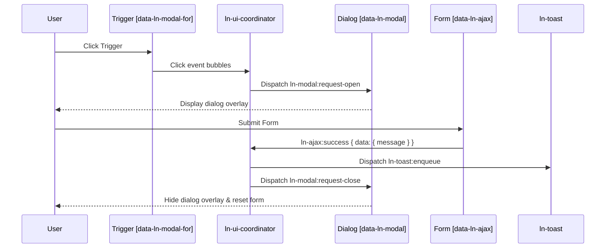

# 🎼 ln-ui-coordinator

> **Classification:** 🟡 Coordinator (Layer 2 - General UI Hub & Mediator)

---

## 1. Core Behavior & Responsibility

The `ln-ui-coordinator` component is a **Layer 2 Coordinator (Mediator)** responsible for orchestrating the common UI lifecycle across user triggers, modals ([`ln-modal`](./ln-modal.md)), AJAX requests ([`ln-ajax`](./ln-ajax.md)), record filling ([`ln-fill`](./ln-fill.md)), and toast notifications ([`ln-toast`](./ln-toast.md)).

The JavaScript source is located at [ln-ui-coordinator.js](../../js/ln-ui-coordinator/src/ln-ui-coordinator.js).

Key responsibilities include:
* **Trigger & Hash Navigation:** Intercepting click events on triggers (`[data-ln-modal-for]`) and hash anchors (`<a href="#modalId:42">`), synchronizing URL hash state with modal visibility and active mode (`new` vs `edit`).
* **Record Filling & Mode Management:** Extracting payload attributes from triggers (`data-ln-fill-*`), calling `lnFill()`, and dispatching `ln-fill:request` to populate nested forms.
* **AJAX Submit Mediation:** Listening to bubbling `ln-ajax:success`:
  - Dispatches `ln-toast:enqueue` when a response envelope contains `{ message: { body, title?, type? } }` (where `body` is required).
  - Automatically closes the parent modal (if the submit was inside a modal), cleans the URL hash, and resets the form.
* **Error Handling & Resilience:** Listening to `ln-ajax:error`:
  - Dispatches error toast notifications on server failures or network disconnects (with fallback strings from `data-ln-ui-coordinator-dict`).
  - Climbs the DOM hierarchy across parent `[data-ln-ui-coordinator]` containers to inherit and merge dictionary translations from root to leaf.
  - Keeps modal panels open so inline form validation errors remain visible.

---

## 2. Minimal HTML Markup & Usage Variants

### Base HTML Markup: Modals + AJAX Form + Toast Coordination

```html
<main data-ln-ui-coordinator>
    <!-- Triggers -->
    <button type="button" data-ln-modal-for="user-modal">New User</button>
    <a href="#user-modal:42"
       data-ln-fill-id="42"
       data-ln-fill-form="user-form"
       data-ln-fill-name="Ada Lovelace">
        Edit User #42
    </a>

    <!-- Target Modal Overlay -->
    <dialog class="ln-modal" data-ln-modal data-ln-modal-mode="new" id="user-modal">
        <form id="user-form" action="/api/users" method="POST" data-ln-ajax data-ln-form>
            <header>
                <h3>
                    <span data-ln-modal-when="new">New User</span>
                    <span data-ln-modal-when="edit">Edit User</span>
                </h3>
                <button type="button" data-ln-modal-close aria-label="Close">&times;</button>
            </header>
            <main>
                <label>Name: <input name="name" type="text" required /></label>
            </main>
            <footer>
                <button type="button" data-ln-modal-close>Cancel</button>
                <button type="submit">Save</button>
            </footer>
        </form>
    </dialog>
</main>
```

### Variant: Translatable Error Dictionary

```html
<section data-ln-ui-coordinator>
    <ul hidden>
        <li data-ln-ui-coordinator-dict="network-error">Се појави мрежен проблем. Проверете ја вашата врска.</li>
        <li data-ln-ui-coordinator-dict="network-error-title">Грешка во мрежата</li>
    </ul>
    <!-- Forms and modals inside here inherit these localized toasts -->
</section>
```

---

## 3. Declarative API Contract (Attributes & Events)

### Attributes Table

| Attribute | Element | Type / Values | Default | Description |
|---|---|---|---|---|
| `data-ln-ui-coordinator` | Container / Dialog | *none* | — | Activates UI coordination for the container and its descendants, acting as the dictionary host. |
| `data-ln-ui-coordinator-dict` | `<li>` element | `"network-error"`, `"network-error-title"`, `"server-error"`, `"server-error-title"` | — | Translatable fallback toast messages for network and server failures. |
| `data-ln-modal-for` | Trigger Button | Modal `id` | — | Connects button trigger to target `ln-modal` for open/toggle requests. |
| `data-ln-modal-mode` | `<dialog>` / Trigger | `"new"` \| `"edit"` | — | Specifies active mode; set automatically based on payload presence or hash parameter. |
| `data-ln-fill-*` | Trigger Link | String | — | Populates form controls matching the `data-ln-fill-*` namespace. |

### Events API

| Event | Direction | Target | Description | `detail` Object |
|---|---|---|---|---|
| `ln-modal:request-open` | Emits | `<dialog>` | Sent to target `ln-modal` to request panel opening. | `{}` |
| `ln-modal:request-close` | Emits | `<dialog>` | Sent to target `ln-modal` to request panel closing. | `{}` |
| `ln-fill:request` | Emits | `<dialog>` | Sent to form layer to fill fields with record data upon open. | `{ id: String }` |
| `ln-toast:enqueue` | Emits | `window` | Dispatched upon AJAX response `message` or network/server error fallbacks. | `{ type, title, message }` |
| `click` | Listens | `document` | Intercepts `[data-ln-modal-for]` triggers and `<a href^="#">` hash anchors. | Native `MouseEvent` |
| `submit` | Listens | `document` | Records pending session storage for native form submissions inside modals. | Native `SubmitEvent` |
| `hashchange` | Listens | `window` | Synchronizes active modal state and triggers `ln-fill:request` on param change. | Native `HashChangeEvent` |
| `ln-modal:before-open` | Listens | `document` | Clears form fields if modal mode is `"new"`. | `{ modalId, target }` |
| `ln-modal:open` | Listens | `document` | Adopts hash parameter and emits `ln-fill:request` for `"edit"` mode. | `{ modalId, target, hashNs, param }` |
| `ln-modal:close` | Listens | `document` | Cleans up modal hash segment and resets fields if mode is `"new"`. | `{ modalId, target }` |
| `ln-ajax:success` | Listens | `document` | Relays response `message` as toast, auto-closes parent modal, resets forms. | `{ method, url, data }` |
| `ln-ajax:error` | Listens | `document` | Relays error `message` or network/server fallback toast, keeps modal open. | `{ method, url, status, data, error }` |

---

## 4. CSS Styling & Behavioral Concept

The coordinator itself is headless and handles orchestration logic without injecting styles. Visual styles are provided by child primitives:
* Modal backdrops and dialog frames: handled by [`.ln-modal`](./ln-modal.md).
* Submit loading spinners: handled by [`.ln-ajax--loading`](./ln-ajax.md).
* Toast animations: handled by [`.ln-toast`](./ln-toast.md).

---

## 5. Accessibility (ARIA) & Common Pitfalls

### ARIA & Focus Management
* Modal dialogs must use semantic `<dialog>` elements or `role="dialog"` with `aria-modal="true"`.
* When an open trigger is clicked, focus is automatically transferred to the opened modal dialog and restored upon closing.

### Common Pitfalls
> [!CAUTION]
> 1. **Do not nest conflicting submit handlers:** Forms using `data-ln-form-scope` belong to [`ln-data-coordinator`](./ln-data-coordinator.md) and will bypass standard `ln-ui-coordinator` AJAX flows.
> 2. **Ensure unique modal IDs:** Deep-link hash navigation (`#modalId`) requires each modal to carry a unique `id` attribute.

---

## 6. Sequence & Lifecycle Flow



---

## 7. Related Components & Coordinators

* [`ln-modal`](./ln-modal.md) — Layer 1 modal overlay primitive.
* [`ln-ajax`](./ln-ajax.md) — Layer 1 progressive enhancement AJAX transport engine.
* [`ln-form`](./ln-form.md) — Form state and field reset component.
* [`ln-fill`](./ln-fill.md) — Declarative record-to-DOM populator.
* [`ln-toast`](./ln-toast.md) — Toast notification display container.
