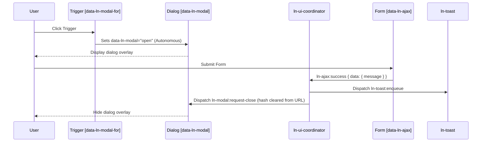

# 🎼 ln-ui-coordinator

> **Classification:** 🟡 Coordinator (Layer 2 - General UI Hub & Mediator)  
> Applied to a container element (`<main data-ln-ui-coordinator>`). It listens for clicks on `a[href^="#"]` hash anchors and window `hashchange` events to synchronize `[data-ln-modal]` dialogs with the URL hash, intercepts bubbling `ln-ajax:success`/`ln-ajax:error` and `ln-upload:error` events to dispatch `ln-toast:enqueue` notifications from server response envelopes, and clears the modal URL hash and closes active modals upon successful AJAX submit. Button triggers (`data-ln-modal-for`) are handled autonomously by `ln-modal`.

---

## 1. Core Behavior & Responsibility

The `ln-ui-coordinator` component is a **Layer 2 Coordinator (Mediator)** responsible for orchestrating the common UI lifecycle across URL hash navigation, modals ([`ln-modal`](./ln-modal.md)), AJAX requests ([`ln-ajax`](./ln-ajax.md)), uploads ([`ln-upload`](./ln-upload.md)), and toast notifications ([`ln-toast`](./ln-toast.md)).

The JavaScript source is located at [ln-ui-coordinator.js](../../components/ln-ui-coordinator/src/ln-ui-coordinator.js).

Key responsibilities include:
* **Hash Navigation & URL Synchronization:** Intercepting click events on hash anchors (`<a href="#modalId">`) and window `hashchange` events, dispatching `ln-modal:request-open` to matching dialogs. Button triggers (`[data-ln-modal-for]`) are owned and opened autonomously by `ln-modal`.
* **AJAX Submit Mediation:** Listening to bubbling `ln-ajax:success`:
  - Dispatches `ln-toast:enqueue` when the server response contains `{ message: ... }`.
  - Automatically closes the parent modal (if the submit was inside a modal) and cleans the URL hash (`hashSet(modal.id, null)` so it does not reopen on reload).
* **Server Error Feedback:** Listening to `ln-ajax:error` and `ln-upload:error`:
  - Dispatches error toast notifications when the server returns an error message.
  - Keeps modal panels open on AJAX error so inline form validation errors remain visible.

> [!IMPORTANT]
> **What the coordinator does NOT do (Orthogonality Doctrine):**
> - **Does NOT inspect or manage form validation state:** Form validation is strictly encapsulated between `<form>` and child [`ln-validate`](./ln-validate.md) primitives.
> - **Does NOT own modal button triggers:** `data-ln-modal-for` triggers are handled autonomously by `ln-modal` itself.
> - **Does NOT invent synthetic client messages:** Toast messages are driven directly by server responses (`data.message`).

---

## 2. Minimal HTML Markup & Usage Variants

### Base HTML Markup: Modals + AJAX Form + Toast Coordination

```html
<main data-ln-ui-coordinator>
    <!-- Triggers -->
    <button type="button" data-ln-modal-for="user-modal">New User</button>
    <a href="#user-modal">Open User Modal</a>

    <!-- Target Modal Overlay -->
    <dialog class="ln-modal" data-ln-modal id="user-modal">
        <form id="user-form" action="/api/users" method="POST" data-ln-ajax>
            <header>
                <h3>User Details</h3>
                <button type="button" data-ln-modal-close aria-label="Close">&times;</button>
            </header>
            <main>
                <label>Name: <input name="name" type="text" required /></label>
            </main>
            <footer>
                <button type="button" data-ln-modal-close>Cancel</button>
                <button type="submit">Save</button>
            </footer>
        </form>
    </dialog>
</main>
```

---

## 3. Declarative API Contract (Attributes & Events)

### Attributes Table

| Attribute | Element | Type / Values | Default | Description |
|---|---|---|---|---|
| `data-ln-ui-coordinator` | Container | *marker* | — | Activates UI coordination for hash-routing, modal closing on AJAX success, and server toast dispatching. |

### Events API

| Event | Direction | Cancelable | Description | `detail` Object |
|---|---|---|---|---|
| `ln-modal:request-open` | Emits | `<dialog>` | Sent to target `ln-modal` from hash routes to request panel opening. | `{}` |
| `ln-modal:request-close` | Emits | `<dialog>` | Sent to target `ln-modal` upon AJAX success to request panel closing. | `{}` |
| `ln-toast:enqueue` | Emits | `window` | Dispatched with server `{ type, title, message }` from response envelopes. | `{ type, title, message }` |
| `click` | Listens | `document` | Intercepts `<a href^="#">` hash navigation anchors. | Native `MouseEvent` |
| `hashchange` | Listens | `window` | Synchronizes active modal state with URL hash. | Native `HashChangeEvent` |
| `ln-modal:close` | Listens | `document` | Cleans up modal hash segment when modal closes. | `{ modalId, target }` |
| `ln-ajax:success` | Listens | `document` | Relays server `message` as toast, cleans modal URL hash, and auto-closes parent modal. | `{ method, url, data }` |
| `ln-ajax:error` | Listens | `document` | Relays server error `message` to toast while keeping modal open. | `{ method, url, status, data, error }` |
| `ln-upload:error` | Listens | `document` | Relays server error `message` to toast. | `{ file, message, status, error }` |

---

## 4. CSS Styling & Behavioral Concept

The coordinator itself is headless and handles orchestration logic without injecting styles. Visual styles are provided by child primitives:
* Modal backdrops and dialog frames: handled by [`.ln-modal`](./ln-modal.md).
* Submit loading spinners: handled by [`.ln-ajax--loading`](./ln-ajax.md).
* Toast animations: handled by [`.ln-toast`](./ln-toast.md).
* Upload indicators: handled by [`.ln-upload`](./ln-upload.md) and [`ln-progress`](./ln-progress.md).

---

## 5. Accessibility (ARIA) & Common Pitfalls

### ARIA & Focus Management
* Modal dialogs must use semantic `<dialog>` elements or `role="dialog"` with `aria-modal="true"`.
* When an open trigger is clicked, focus is automatically transferred to the opened modal dialog and restored upon closing.

### Common Pitfalls
> [!CAUTION]
> 1. **Do not nest conflicting submit handlers:** Forms using `data-ln-data-coordinator-scope` belong to [`ln-data-coordinator`](./ln-data-coordinator.md) and will bypass standard `ln-ui-coordinator` AJAX flows.
> 2. **Ensure unique modal IDs:** Deep-link hash navigation (`#modalId`) requires each modal to carry a unique `id` attribute.

---

## 6. Sequence & Lifecycle Flow


```mermaid
sequenceDiagram
    participant User
    participant Trigger as Trigger [data-ln-modal-for]
    participant Modal as Dialog [data-ln-modal]
    participant Coord as ln-ui-coordinator
    participant Ajax as Form [data-ln-ajax]
    participant Toast as ln-toast

    User->>Trigger: Click Trigger
    Trigger->>Modal: Sets data-ln-modal="open" (Autonomous)
    Modal-->>User: Display dialog overlay
    User->>Ajax: Submit Form
    Ajax->>Coord: ln-ajax:success { data: { message } }
    Coord->>Toast: Dispatch ln-toast:enqueue
    Coord->>Modal: Dispatch ln-modal:request-close (hash cleared from URL)
    Modal-->>User: Hide dialog overlay
```

---

## 7. Related Components & Coordinators

* [`ln-modal`](./ln-modal.md) — Layer 1 modal overlay primitive.
* [`ln-ajax`](./ln-ajax.md) — Layer 1 progressive enhancement AJAX transport engine.
* [`ln-upload`](./ln-upload.md) — Layer 1 file upload component.
* [`ln-form`](./ln-form.md) — Form state and field reset component.
* [`ln-toast`](./ln-toast.md) — Toast notification display container.
