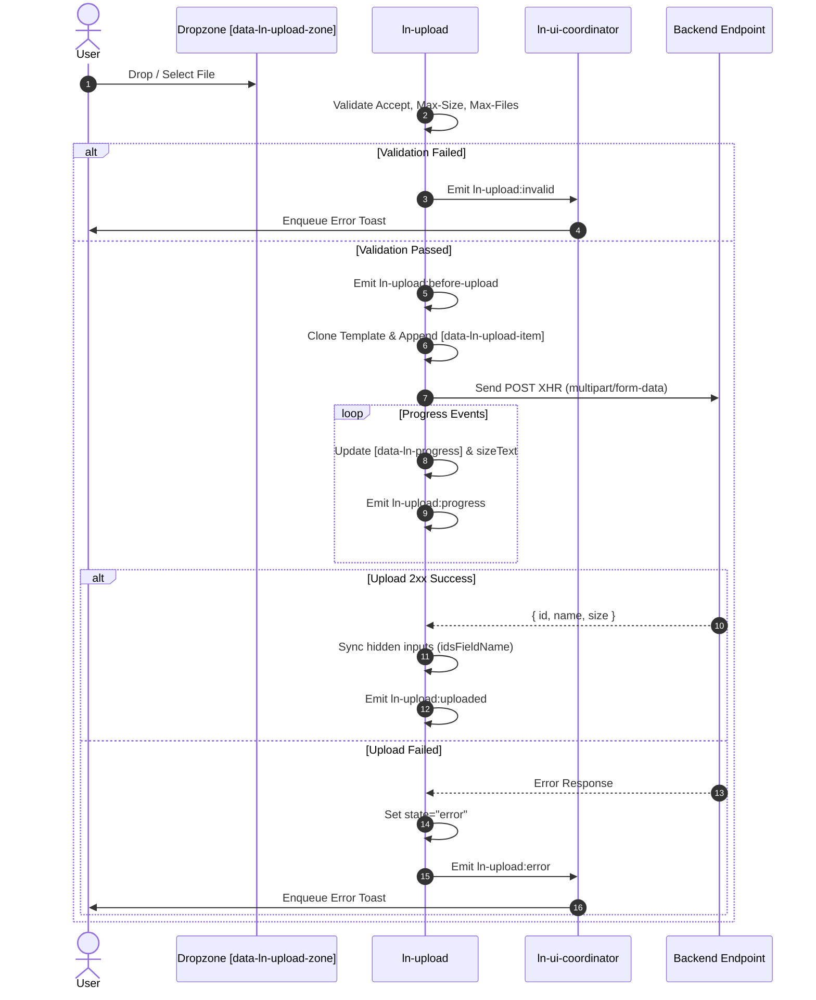

# 📁 ln-upload

> **Classification:** 🟢 Simple Component

---

## 1. Core Behavior & Responsibility

The `ln-upload` component is a file upload manager supporting drag-and-drop file selection, real-time XHR progress tracking, client-side validation, SSR hydration of pre-existing attachments, and dynamic hidden input synchronization for form submissions.

The JavaScript source is located at [ln-upload.js](../../components/ln-upload/src/ln-upload.js).

Key responsibilities include:
- **Drag-and-Drop Intake:** Listening for drag events (`dragover`, `dragleave`, `drop`) on `[data-ln-upload-zone]` and triggering selection on an authored native `<input type="file" multiple>` element.
- **XHR Progress & State Rendering:** Uploading files via `XMLHttpRequest` with live progress events updated on `[data-ln-progress]` for [`ln-progress`](./ln-progress.md) to manage.
- **SSR Hydration:** On initialization, hydrating existing server-rendered attachments declared inside `[data-ln-upload-list]` carrying `data-ln-upload-id` and synchronizing hidden inputs without wiping existing records.
- **Declarative Parameter Serialization:** Dynamically gathering any `<input>`, `<select>`, or `<textarea>` declared inside the `[data-ln-upload]` container and appending them into the `FormData` POST request.
- **Form Submit Integration:** Generating and syncing `<input type="hidden" name="file_ids[]" value="serverId">` (or custom field name) after every upload or deletion so native form submissions send current server IDs.
- **i18n Dictionary:** Reading localized error and action strings via `buildDict()` (`data-ln-upload-dict`) and formatting numbers via `Intl.NumberFormat`.

> [!IMPORTANT]
> **What the component does NOT do (Orthogonality Doctrine):**
> - **Toast Management:** It does not dispatch `ln-toast:enqueue`; instead it emits `ln-upload:invalid` and `ln-upload:error` bubbling events for [`ln-ui-coordinator`](./ln-ui-coordinator.md) to route to toasts.
> - **DOM Injection of Templates/Inputs:** It expects authored HTML markup (`<input type="file">`, `<template data-ln-template="ln-upload-item">`).

---

## 2. Minimal HTML Markup & Usage Variants

### Base HTML Markup

Below is a standard file upload dropzone:

```html
<div data-ln-upload="/files/upload" data-ln-upload-accept="pdf,doc,docx" data-ln-upload-delete="/files/{id}">
    <input type="file" multiple hidden>

    <template data-ln-template="ln-upload-item">
        <li data-ln-upload-item>
            <svg class="ln-icon" aria-hidden="true"><use href="#ln-icon-file"></use></svg>
            <span data-ln-field="name"></span>
            <span data-ln-field="sizeText"></span>
            <button type="button" data-ln-upload-action="remove" data-ln-attr="aria-label:removeLabel, title:removeLabel">
                <svg class="ln-icon" aria-hidden="true"><use href="#ln-icon-x"></use></svg>
            </button>
            <div data-ln-upload-progress>
                <div data-ln-progress="0"></div>
            </div>
        </li>
    </template>

    <div data-ln-upload-zone>
        <p>Drag files here or click to browse</p>
    </div>
    <ul data-ln-upload-list></ul>
</div>
```

### Variant 1: SSR Hydration in Edit Forms

Pre-rendered attachments on the server are hydrated on mount by tagging them with `data-ln-upload-item` and `data-ln-upload-id`:

```html
<div data-ln-upload="/api/uploads" data-ln-upload-delete="/api/uploads/{id}">
    <input type="file" multiple hidden>

    <!-- Pre-existing hidden inputs for SSR form submission -->
    <input type="hidden" name="file_ids[]" value="101">

    <div data-ln-upload-zone><p>Add attachments</p></div>
    <ul data-ln-upload-list>
        <li data-ln-upload-item data-ln-upload-id="101" data-ln-upload-ext="pdf" data-ln-upload-size="1200000">
            <svg class="ln-icon" aria-hidden="true"><use href="#ln-icon-file"></use></svg>
            <span data-ln-field="name">contract.pdf</span>
            <span data-ln-field="sizeText">1.2 MB</span>
            <button type="button" data-ln-upload-action="remove">
                <svg class="ln-icon" aria-hidden="true"><use href="#ln-icon-x"></use></svg>
            </button>
        </li>
    </ul>
</div>
```

### Variant 2: Nested Metadata Parameters & Custom Field Names

Nested inputs inside the container are automatically appended to the `FormData` request:

```html
<div data-ln-upload="/api/uploads" 
     data-ln-upload-file-field="attachment" 
     data-ln-upload-ids-field="attachment_ids[]"
     data-ln-upload-max-size="5242880"
     data-ln-upload-max-files="3">
    <input type="file" multiple hidden>
    <input type="hidden" name="entity_id" value="42">
    <input type="hidden" name="category" value="invoices">

    <div data-ln-upload-zone><p>Upload invoices</p></div>
    <ul data-ln-upload-list></ul>
</div>
```

---

## 3. Declarative API Contract (Attributes & Events)

### Attributes Table

| Attribute | Element | Type / Values | Default | Description |
|---|---|---|---|---|
| `data-ln-upload` | Container | URL String | `""` | Endpoint URL for POST upload requests. |
| `data-ln-upload-zone` | Container / Element | *none* | — | Interactive drag-and-drop zone element (defaults to container). |
| `data-ln-upload-list` | Element (`<ul>`) | *none* | — | Target container where attachment items mount. |
| `data-ln-upload-item` | Element (`<li>`) | *none* | — | Attachment item row root in template or SSR markup. |
| `data-ln-upload-progress` | Element | *none* | — | Wrapper for upload progress bar. |
| `data-ln-upload-action="remove"` | Button | `"remove"` | — | Trigger button to remove an attachment item. |
| `data-ln-upload-accept` | Container / Input | String | `""` | Comma-separated allowed extensions or MIME types (`pdf,doc`, `image/*`). |
| `data-ln-upload-delete` | Container | Pattern String | `""` | Delete endpoint URL pattern containing `{id}`. |
| `data-ln-upload-max-size` | Container | Integer Bytes | `0` | Maximum file size in bytes (e.g. `5242880` for 5MB). |
| `data-ln-upload-max-files` | Container | Integer | `0` | Maximum total allowed files limit. |
| `data-ln-upload-file-field` | Container | String | `"file"` | Name of the file field in `FormData`. |
| `data-ln-upload-ids-field` | Container | String | `"file_ids[]"` | Name of the synchronized hidden form inputs. |
| `data-ln-upload-id` | Item (`<li>`) | String / Number | — | Server file ID for SSR hydration and deletion. |
| `data-ln-upload-size` | Item (`<li>`) | Integer Bytes | — | Optional raw byte size attribute for SSR items. |
| `data-ln-upload-local-id` | Item (`<li>`) | String | *runtime* | Client-generated local tracking ID (`file-1`, `file-2`). |
| `data-ln-upload-state` | Zone / Item | State String | *runtime* | Active state (`dragover`, `uploading`, `error`, `deleting`). |
| `data-ln-upload-ext` | Item (`<li>`) | Extension | *runtime* | Lowercase file extension for CSS/SCSS styling. |
| `data-ln-upload-dict` | Hidden `<li>` | String Key | — | Dictionary key for localized UI messages (`remove`, `error`, `unit-b`, etc.). |

### Programmatic JS API

The element API is exposed on the container element via `dom.lnUpload`.

| Method | Signature | Returns | Description |
|---|---|---|---|
| `dom.lnUpload.getFileIds()` | `()` | `Array<Number\|String>` | Returns array of uploaded server file IDs. |
| `dom.lnUpload.getFiles()` | `()` | `Array<Object>` | Returns array of uploaded file objects (`{ serverId, name, size }`). |
| `dom.lnUpload.upload(files)` | `(FileList\|File[])` | `void` | Programmatically triggers upload of files. |
| `dom.lnUpload.remove(id)` | `(String\|Number)` | `void` | Removes a file by `localId` or `serverId`. |
| `dom.lnUpload.clear()` | `()` | `void` | Deletes all uploaded files from the server and resets the UI. |
| `dom.lnUpload.destroy()` | `()` | `void` | Cleans up event listeners, Map state, and aborts active uploads. |

### Events API

All events bubble up (`bubbles: true`).

| Event | Direction | Cancelable | Description | `detail` Object |
|---|---|---|---|---|
| `ln-upload:request-upload` | Listens | No | Inbound command to upload files. | `{ files: FileList \| File[] }` |
| `ln-upload:request-remove` | Listens | No | Inbound command to remove a file. | `{ localId?: String, serverId?: String\|Number }` |
| `ln-upload:request-clear` | Listens | No | Inbound command to clear all files. | `{}` |
| `ln-upload:before-upload` | Emits | Yes | Fires before an upload starts. | `{ file: File }` |
| `ln-upload:before-remove` | Emits | Yes | Fires before a file is deleted/removed. | `{ localId: String, serverId: String\|Number }` |
| `ln-upload:before-clear` | Emits | Yes | Fires before clearing all files. | `{}` |
| `ln-upload:uploaded` | Emits | No | Fires after a file successfully uploads (2xx response). | `{ localId, serverId, name, size, response }` |
| `ln-upload:progress` | Emits | No | Fires on XHR upload progress updates. | `{ localId, file, percent, loaded, total }` |
| `ln-upload:invalid` | Emits | No | Fires when a file fails extension/size/count validation. | `{ file, reason }` |
| `ln-upload:error` | Emits | No | Fires when an upload or delete request fails. | `{ file, message, status, error }` |
| `ln-upload:removed` | Emits | No | Fires after a file is deleted from server and removed from DOM. | `{ localId, serverId }` |
| `ln-upload:cleared` | Emits | No | Fires after `clear()` wipes all file instances. | `{}` |
| `ln-upload:destroyed` | Emits | No | Fires when component instance is torn down. | `{ target: HTMLElement }` |

---

## 4. CSS Styling & Behavioral Concept

SCSS styles live in `theme/components/_upload.scss` and `theme/config/mixins/_upload.scss`.

### Attribute Hooks & States

- `[data-ln-upload]`: Main container wrapper.
- `[data-ln-upload-zone]`: Interactive drag-and-drop zone.
- `[data-ln-upload-zone][data-ln-upload-state="dragover"]`: Active dragover state.
- `[data-ln-upload-list]`: Unordered list (`<ul>`) holding file item rows.
- `[data-ln-upload-item]`: File item row (`<li>`).
- `[data-ln-upload-item][data-ln-upload-state="uploading"]`: Applied during active XHR transfer.
- `[data-ln-upload-item][data-ln-upload-state="error"]`: Applied when upload fails.
- `[data-ln-upload-item][data-ln-upload-state="deleting"]`: Applied while DELETE request is in flight.
- `[data-ln-upload-ext="pdf"]`: Carries lowercase file extension for CSS/SCSS icon and color styling.

---

## 5. Accessibility (ARIA) & Common Pitfalls

### ARIA & Keyboard

- **File Picker:** Authored `<input type="file">` element stays accessible for keyboard click triggers.
- **Icon Buttons:** Remove buttons receive `aria-label` and `title` populated via `dict.remove` or dictionary fallback.
- **Progress:** Progress is mapped onto `[data-ln-progress]` for native ARIA attributes (`role="progressbar"`, `aria-valuenow`).

### Common Pitfalls & Anti-patterns

> [!CAUTION]
> 1. **Missing Input Element:** The container MUST include an authored `<input type="file" multiple hidden>` element.
> 2. **Missing Template:** A `<template data-ln-template="ln-upload-item">` must be provided scoped within the container or at the document root.
> 3. **Hardcoding BEM Classes:** Do NOT rely on `.ln-upload__*` classes for JS behavior; bind all structure to `[data-ln-upload-*]` attributes.

---

## 6. Sequence & Lifecycle Flow



---

## 7. Related Components & Coordinators

- [`ln-ui-coordinator`](./ln-ui-coordinator.md) — Listens to `ln-upload:invalid` and `ln-upload:error` to display toasts.
- [`ln-form`](./ln-form.md) — Form wrapper that submits uploaded `file_ids[]`.
- [`ln-progress`](./ln-progress.md) — Manages ARIA and rendering on `[data-ln-progress]`.
- [`ln-icon`](./ln-icon.md) — Renders file extension icons based on markup.
