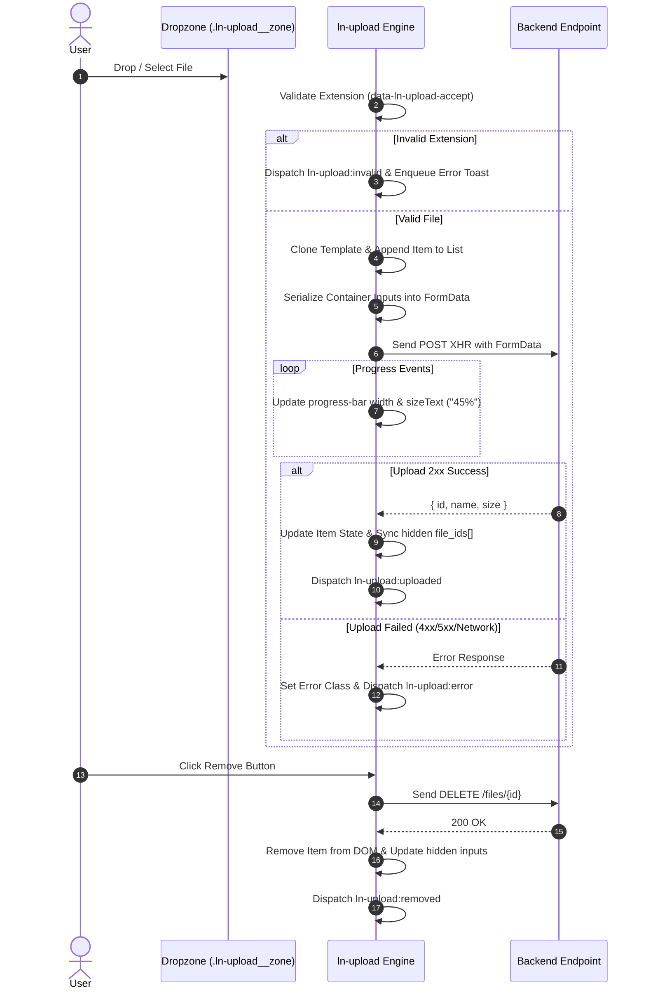

# 📁 ln-upload

> **Classification:** 🟢 Simple Component

---

## 1. Core Behavior & Responsibility

The `ln-upload` component is a file upload manager supporting drag-and-drop file selection, real-time XHR upload progress indicators, client-side extension validation, and auto-generated hidden form inputs.

The JavaScript source is located at [ln-upload.js](../../js/ln-upload/src/ln-upload.js).

Key responsibilities include:
- **Drag-and-Drop Intake:** Listening for drag events (`dragover`, `dragleave`, `drop`) on `.ln-upload__zone` and binding file selection to a native `<input type="file" multiple>` element.
- **XHR Progress & State Rendering:** Uploading files via `XMLHttpRequest` with live progress events (`progress.style.width` and `fill()` state class toggles), supporting asynchronous deletion (`DELETE /files/{id}`).
- **Declarative Parameter Serialization:** Dynamically gathering any `<input type="hidden">`, `<select>`, or `<textarea>` declared inside the `.ln-upload` container and appending them into the `FormData` POST request.
- **Form Submit Integration:** Generating and syncing `<input type="hidden" name="file_ids[]" value="serverId">` elements after every upload or deletion so native form submissions send current server IDs.
- **i18n Dictionary:** Reading localized error and action strings via `buildDict()` (`data-ln-upload-dict`) with fallback English text.

> [!IMPORTANT]
> **What the component does NOT do (Orthogonality Doctrine):**
> - **Toast Management:** It does not render internal toast alerts; instead it dispatches global `ln-toast:enqueue` events for [`ln-toast`](./ln-toast.md) to display if present.
> - **Form Validation:** It does not validate standard text fields in the host form (handled by [`ln-validate`](./ln-validate.md) and [`ln-form`](./ln-form.md)).

---

## 2. Minimal HTML Markup & Usage Variants

### Base HTML Markup

Below is a standard file upload dropzone:

```html
<div class="ln-upload" data-ln-upload="/files/upload" data-ln-upload-accept=".pdf,.doc,.docx">
    <div class="ln-upload__zone">
        <p>Drag files here or click to browse</p>
    </div>
    <ul class="ln-upload__list"></ul>
</div>
```

### Variant 1: Nested Parameter Inputs

Any hidden input or field inside the container is dynamically serialized and sent alongside the file in the `multipart/form-data` payload:

```html
<div class="ln-upload" data-ln-upload="/api/uploads" data-ln-upload-accept=".jpg,.png,.pdf">
    <!-- Extra metadata fields automatically appended to FormData -->
    <input type="hidden" name="context" value="documents">
    <input type="hidden" name="entity_id" value="42">

    <div class="ln-upload__zone">
        <p>Drop attachments for document #42</p>
    </div>
    <ul class="ln-upload__list"></ul>
</div>
```

### Variant 2: Scoped Item Template Override

Custom item layouts can be declared inside the component container via `<template data-ln-template="ln-upload-item">`:

```html
<div class="ln-upload" data-ln-upload="/files/upload">
    <template data-ln-template="ln-upload-item">
        <li class="ln-upload__item" data-ln-class="ln-upload__item--uploading:uploading, ln-upload__item--error:error, ln-upload__item--deleting:deleting">
            <svg class="ln-icon ln-icon--lg" aria-hidden="true">
                <use data-ln-attr="href:iconHref" href="#ln-icon-file"></use>
            </svg>
            <article>
                <span class="ln-upload__name" data-ln-field="name"></span>
                <span class="ln-upload__size" data-ln-field="sizeText"></span>
            </article>
            <button type="button" class="ln-upload__remove" data-ln-upload-action="remove" data-ln-attr="aria-label:removeLabel, title:removeLabel">
                <svg class="ln-icon" aria-hidden="true"><use href="#ln-icon-x"></use></svg>
            </button>
            <div class="ln-upload__progress"><div class="ln-upload__progress-bar"></div></div>
        </li>
    </template>

    <div class="ln-upload__zone"><p>Upload documents</p></div>
    <ul class="ln-upload__list"></ul>
</div>
```

---

## 3. Declarative API Contract (Attributes & Events)

### Attributes Table

| Attribute | Element | Type / Values | Default | Description |
|---|---|---|---|---|
| `data-ln-upload` | Container | URL String | `"/files/upload"` | Endpoint URL for POST upload requests. |
| `data-ln-upload-accept` | Container | Extension String | `""` | Comma-separated list of allowed file extensions (e.g. `".pdf,.doc"`). |
| `data-ln-upload-delete` | Container | Pattern String | Dynamic | Custom delete URL pattern containing `{id}` (defaults to replacing `/upload` with `/{id}`). |
| `data-ln-upload-context` | Container | String | `""` | Legacy context fallback sent if no `<input name="context">` is present. |
| `data-ln-upload-dict` | Hidden `<li>` | String Key | — | Dictionary key for localized UI messages. |

### Programmatic JS API

The element API is exposed on the container element via `dom.lnUploadAPI`.

| Method | Signature | Returns | Description |
|---|---|---|---|
| `dom.lnUploadAPI.getFileIds()` | `()` | `Array<Number\|String>` | Returns array of uploaded server file IDs. |
| `dom.lnUploadAPI.getFiles()` | `()` | `Array<Object>` | Returns array of uploaded file objects (`{ serverId, name, size }`). |
| `dom.lnUploadAPI.clear()` | `()` | `void` | Deletes all uploaded files from the server and resets the UI. |
| `dom.lnUploadAPI.destroy()` | `()` | `void` | Cleans up event listeners, Map state, and DOM elements. |

### Events API

All events bubble up (`bubbles: true`).

| Event | Direction | Cancelable | Description | `detail` Object |
|---|---|---|---|---|
| `ln-upload:uploaded` | Emits | No | Fires after a file successfully uploads (2xx response). | `{ localId: String, serverId: Number\|String, name: String }` |
| `ln-upload:error` | Emits | No | Fires when an upload XHR fails or returns non-2xx status. | `{ file: File, message: String }` |
| `ln-upload:invalid` | Emits | No | Fires when a selected file fails extension validation. | `{ file: File, message: String }` |
| `ln-upload:removed` | Emits | No | Fires after a file is deleted from server and removed from DOM. | `{ localId: String, serverId: Number\|String }` |
| `ln-upload:cleared` | Emits | No | Fires after `clear()` wipes all file instances. | `{}` |

---

## 4. CSS Styling & Behavioral Concept

SCSS styles live in `scss/components/_upload.scss`.

### Component Classes & States

- `.ln-upload`: Main container wrapper.
- `.ln-upload__zone`: Interactive drag-and-drop zone (`.dragover` state added during drag).
- `.ln-upload__list`: Unordered list (`<ul>`) holding file item rows.
- `.ln-upload__item--uploading`: Applied during active XHR transfer.
- `.ln-upload__item--error`: Applied when upload fails.
- `.ln-upload__item--deleting`: Applied while DELETE request is in flight.

---

## 5. Accessibility (ARIA) & Common Pitfalls

### ARIA & Keyboard

- **Hidden File Input:** The file picker input uses `multiple` and stays accessible for click triggers.
- **Icon Buttons:** Remove buttons receive `aria-label` and `title` populated via `dict.remove` or fallback `"Remove"`.
- **Drag Zone:** The zone is focusable for keyboard users to activate standard file browsing.

### Common Pitfalls & Anti-patterns

> [!CAUTION]
> 1. **Missing List Container:** The container MUST include a `<ul class="ln-upload__list"></ul>` element for file items to mount.
> 2. **Extension Dot Omission:** In `data-ln-upload-accept`, include leading dots (e.g. `".pdf,.docx"` rather than `"pdf,docx"`).

---

## 6. Flow Diagram & Lifecycle



---

## 7. Related Components

- [`ln-form`](./ln-form.md) — Form wrapper that submits uploaded `file_ids[]`.
- [`ln-toast`](./ln-toast.md) — Displays upload error notifications.
- [`ln-icon`](./ln-icon.md) — Renders file extension icons (`#ln-icon-custom-file-pdf`, `#ln-icon-file`).
