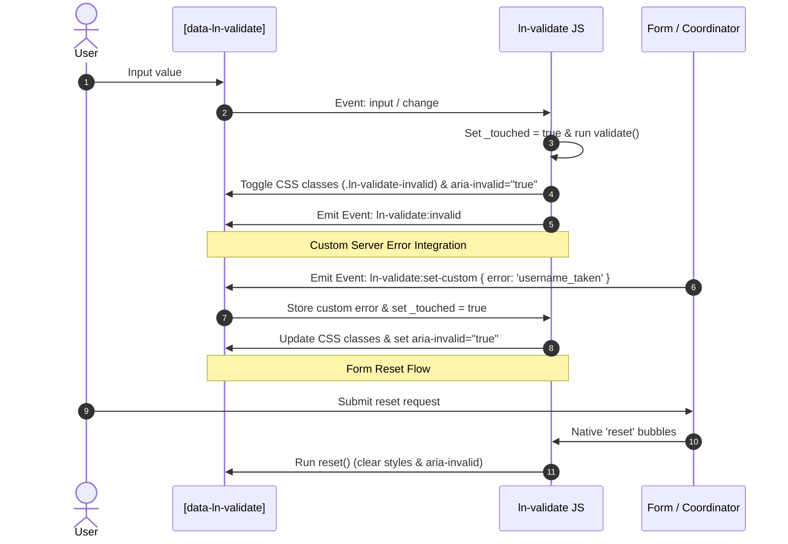

# 🛡️ ln-validate

> **Classification:** 🟢 Simple component / Validity State Adapter

---

## 1. Core Behavior & Responsibility

- Wraps the native HTML5 `ValidityState` API of form elements to control visual error states in the DOM.
- Implements a **touched gate** policy: errors are only shown after the user has interacted with the input (avoids errors on initial page load).
- Registers a submit validation gate: if a form has at least one validated field, submit attempts are intercepted, all fields validated, and the first invalid field focused.
- Located in [`js/ln-validate/src/ln-validate.js`](../../js/ln-validate/src/ln-validate.js).

> [!IMPORTANT]
> **What the component does NOT do (Orthogonality Doctrine):**
> - **Does NOT claim or process valid forms** — it prevents submission of invalid forms, but claiming a valid submit event is the responsibility of [`ln-data-coordinator`](./ln-data-coordinator.md).
> - **Does NOT maintain custom validation rules** — relies entirely on standard HTML5 validity constraints (`required`, `pattern`, etc.).
> - **Does NOT spawn toasts or modals** — visual updates are strictly scoped to the parent `.form-element` container.

---

## 2. Minimal HTML Markup & Usage Variants

### Base HTML Markup

Every input field must be wrapped inside a `.form-element` container to correctly associate errors.

```html
<div class="form-element">
    <label for="email">Email</label>
    <input type="email" 
           id="email" 
           name="email" 
           required 
           pattern=".+@.+\..+"
           data-ln-validate />
    <ul class="form-errors" data-ln-validate-errors>
        <li class="hidden" data-ln-validate-error="required">Field is required.</li>
        <li class="hidden" data-ln-validate-error="typeMismatch">Enter a valid email address.</li>
        <li class="hidden" data-ln-validate-error="patternMismatch">Email must contain @ and a dot.</li>
    </ul>
</div>
```

### Variant 1: Select or Change-Based Elements

For selects, checkboxes, or radios. Listens directly to `change` events rather than `input`.

#### HTML Markup
```html
<div class="form-element">
    <label for="country">Country</label>
    <select id="country" name="country" required data-ln-validate>
        <option value="">Select country...</option>
        <option value="us">United States</option>
    </select>
    <div data-ln-validate-errors>
        <p class="hidden" data-ln-validate-error="required">You must choose a country.</p>
    </div>
</div>
```

### Variant 2: Custom Server-Side Errors

To support validation errors returned from the backend (e.g. "username taken").

#### HTML Markup
```html
<div class="form-element">
    <label for="username">Username</label>
    <input type="text" id="username" name="username" required data-ln-validate />
    <ul data-ln-validate-errors>
        <li class="hidden" data-ln-validate-error="required">Username is required.</li>
        <li class="hidden" data-ln-validate-error="username_taken">Username is already taken.</li>
    </ul>
</div>
```

---

## 3. Declarative API Contract (Attributes & Events)

### Attributes Table

| Attribute | Element | Type / Values | Default | Description |
|---|---|---|---|---|
| `data-ln-validate` | Control | Flag | — | Initializes the component on `<input>`, `<select>`, or `<textarea>`. |
| `data-ln-validate-errors` | Container | Flag | — | Marks the parent node containing associated error messages. |
| `data-ln-validate-error` | Message | `String` | — | The value must correspond to a native ValidityState key (e.g. `required`, `typeMismatch`) or custom server key. |

### Native Error Keys Mapping

| Key in HTML | ValidityState Property | Trigger Attribute |
|---|---|---|
| `required` | `valueMissing` | `required` |
| `typeMismatch` | `typeMismatch` | `type="email"`, `type="url"` |
| `tooShort` | `tooShort` | `minlength` |
| `tooLong` | `tooLong` | `maxlength` |
| `patternMismatch` | `patternMismatch` | `pattern` |
| `rangeUnderflow` | `rangeUnderflow` | `min` |
| `rangeOverflow` | `rangeOverflow` | `max` |

### Programmatic JS API

| Helper | Signature | Returns | Description |
|---|---|---|---|
| `element.lnValidate.isValid` | *Getter* | `Boolean` | Returns `true` if the element is natively valid and has no active custom errors. |
| `element.lnValidate.validate` | `()` | `Boolean` | Runs validation, updates classes, displays errors, and returns the result. |
| `element.lnValidate.reset` | `()` | `void` | Resets the element to its pristine state. |
| `element.lnValidate.destroy` | `()` | `void` | Removes listeners and deletes instance. |

### Events API

| Event | Direction | Cancelable | Description | `detail` Object |
|---|---|---|---|---|
| `ln-validate:valid` | Emits | No | Dispatched when the field transitions to a valid state. | `{ target: HTMLElement, field: String }` |
| `ln-validate:invalid` | Emits | No | Dispatched when the field transitions to an invalid state. | `{ target: HTMLElement, field: String }` |
| `ln-validate:destroyed` | Emits | No | Dispatched when the component is destroyed. | `{ target: HTMLElement }` |
| `ln-validate:set-custom` | Listens | No | Sets a manual custom error key on the input. | `{ error: String }` |
| `ln-validate:clear-custom` | Listens | No | Clears a custom error key. | `{ error?: String }` |
| `ln-validate:request-validate` | Emits (form) / Listens (field) | No | The submit gate: the first `data-ln-validate` field to initialize on a form injects `novalidate` and attaches a form-level `submit` listener that dispatches this event on the form to collect invalid fields; every field instance listens for it on the form and pushes itself into `invalidFields` if invalid. | `{ invalidFields: Array<HTMLElement> }` |

---

## 4. CSS Styling & Behavioral Concept

- **Managed CSS Classes:**
  - `ln-validate-valid`: Applied to valid inputs once touched.
  - `ln-validate-invalid`: Applied to invalid inputs once touched or custom error set.
  - `hidden`: Used to hide inactive error elements (`display: none;`).
- **Reset Hook Integration:**
  The component listens to the native `reset` event on the form (`dom.form`). When triggered, the field's state, custom errors, and visual markers are automatically cleared.

---

## 5. Accessibility (ARIA) & Common Pitfalls

### ARIA & Keyboard

- **`aria-invalid`:** Managed dynamically. Set to `true` when invalid, `false` when valid, and removed upon resetting.
- **`aria-describedby`:** Developers should explicitly match input `aria-describedby` to the ID of the error container (`data-ln-validate-errors`) so screen readers announce the validation feedback on focus.
- **Submit focus redirection:** When validation fails on submit, focus is automatically moved to the first invalid field.

### Common Pitfalls & Anti-patterns

> [!CAUTION]
> 1. **Missing `.form-element` wrapper:** `ln-validate` looks up the DOM tree to locate the error container. If the `.form-element` parent wrapper is missing, associated error messages will not be shown.
> 2. **Initializing on the `<form>` element:** `data-ln-validate` must only be attached to individual input elements. For the form scope, use `data-ln-form-scope`.

---

## 6. Flow Diagram & Lifecycle



---

## 7. Related Components

- [`ln-form.md`](./ln-form.md) — Automates input data population and SPOOF method routing.
- [`ln-data-coordinator.md`](./ln-data-coordinator.md) — Collects form validation results on submit before processing the write pipeline.
- [`ln-ajax.md`](./ln-ajax.md) — Relays backend validation errors (e.g. 422 HTTP responses) back to inputs via `ln-validate:set-custom`.
