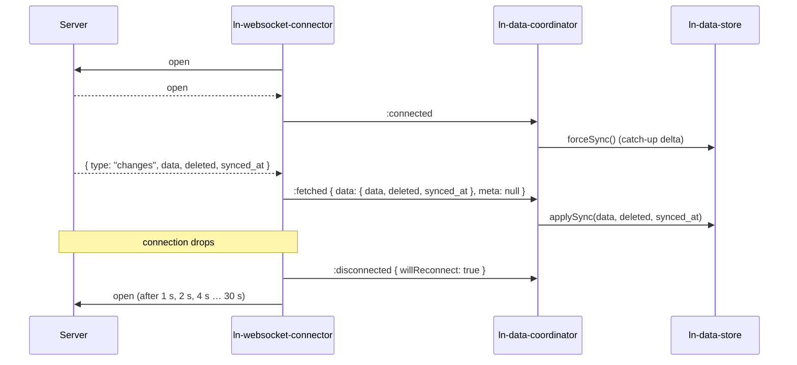

# 🔌 ln-websocket-connector

> **Classification:** 🌐 Simple component / Push Transport Driver

---

## 1. Core Behavior & Responsibility

- **Opens and keeps a WebSocket** to `data-ln-websocket-connector-url` while the command attribute says `connect`; reconnects on an unexpected drop (1 s doubling to 30 s).
- **Turns server pushes into `ln-websocket-connector:fetched`** (`{ data, deleted, synced_at }`), which `ln-data-coordinator` hands to `store.applySync`.
- **Answers the connector request events** (`request-sync`, `request-query`, `request-create`, `request-update`, `request-delete`, `request-bulk-delete`) over the socket, correlating each reply by `ref` and emitting the same response events as the REST connectors.
- **Announces connection status by events** (`:connecting`, `:connected`, `:disconnected`). The status is private state, never an attribute.
- Located in [`components/ln-websocket-connector/src/ln-websocket-connector.js`](../../components/ln-websocket-connector/src/ln-websocket-connector.js).

> [!IMPORTANT]
> **What the component does NOT do (Orthogonality Doctrine):**
> - **Does NOT hold a local cache** — delegated to [`ln-data-store`](./ln-data-store.md).
> - **Does NOT decide which connector takes requests** — [`ln-data-coordinator`](./ln-data-coordinator.md) prefers a REST/CouchDB connector and falls back to the socket.
> - **Does NOT render connection status** — page wiring listens to the status events and draws it.
> - **Does NOT answer `ln-api-connector:*` events** — its own namespace only.

---

## 2. Minimal HTML Markup & Usage Variants

### Base HTML Markup

```html
<ul data-ln-data-coordinator="tasks" hidden>
	<li data-ln-data-store="tasks" id="tasks"></li>
	<li data-ln-websocket-connector data-ln-websocket-connector-url="wss://api.example.com/live"></li>
</ul>
```

### Variant 1: Live changes beside REST

The REST connector takes every request; the socket only pushes changes.

#### HTML Markup
```html
<ul data-ln-data-coordinator="tasks" hidden>
	<li data-ln-data-store="tasks" id="tasks"></li>
	<li data-ln-api-connector data-ln-api-base-url="https://api.example.com" data-ln-api-path="tasks"></li>
	<li data-ln-websocket-connector data-ln-websocket-connector-url="wss://api.example.com/live"></li>
</ul>
```

### Variant 2: Disconnected until told otherwise

#### HTML Markup
```html
<li data-ln-websocket-connector="disconnect" data-ln-websocket-connector-url="wss://api.example.com/live"></li>
```

---

## 3. Declarative API Contract (Attributes & Events)

### Attributes Table

| Attribute | Element | Type / Values | Default | Description |
|---|---|---|---|---|
| `data-ln-websocket-connector` | Connector | `"connect"` \| `"disconnect"` | `"connect"` | Command set from outside: opens or closes the socket. |
| `data-ln-websocket-connector-url` | Connector | `String` (`ws://…` / `wss://…`) | — | Endpoint. Changing it while connected reopens on the new URL. |

### Events API

| Event | Direction | Cancelable | Description | `detail` Object |
|---|---|---|---|---|
| `ln-websocket-connector:request-sync` | Listens | No | Delta sync since a token. | `{ since, meta? }` |
| `ln-websocket-connector:request-query` | Listens | No | One page of a query. | `{ query, meta? }` |
| `ln-websocket-connector:request-create` | Listens | No | Create a record. | `{ data, tempId?, idempotencyKey?, meta? }` |
| `ln-websocket-connector:request-update` | Listens | No | Update a record. | `{ id, data, expected_version?, idempotencyKey?, meta? }` |
| `ln-websocket-connector:request-delete` | Listens | No | Delete a record. | `{ id, idempotencyKey?, meta? }` |
| `ln-websocket-connector:request-bulk-delete` | Listens | No | Delete several records. | `{ ids, idempotencyKey?, meta? }` |
| `ln-websocket-connector:connecting` | Emits | No | A connection attempt starts. | `{ url: String, attempt: Number }` |
| `ln-websocket-connector:connected` | Emits | No | The socket is open. | `{ url: String }` |
| `ln-websocket-connector:disconnected` | Emits | No | The socket closed, or a pending reconnect was cancelled. | `{ url: String, code: Number, reason: String, willReconnect: Boolean }` |
| `ln-websocket-connector:fetched` | Emits | No | A sync reply, a query page, or a server push (`meta: null`). | `{ data, since, meta }` / `{ data, total, filtered, offset, queryGen, meta }` |
| `ln-websocket-connector:created` | Emits | No | Create confirmed. | `{ record, tempId, message, meta }` |
| `ln-websocket-connector:updated` | Emits | No | Update confirmed. | `{ record, id, message, meta }` |
| `ln-websocket-connector:deleted` | Emits | No | Delete confirmed. | `{ response, id, message, meta }` |
| `ln-websocket-connector:bulk-deleted` | Emits | No | Bulk delete confirmed. | `{ response, ids, message, meta }` |
| `ln-websocket-connector:error` | Emits | No | A rejected request, or one that could not be delivered (`status: 0`). | `{ action, error, status, data, conflictData, meta }` |

---

## 4. CSS Styling & Behavioral Concept

- **Headless component:** no styles. Status visuals belong to the page, driven by the status events.
- **Wire protocol (JSON text frames):** request `{ ref, type, ...payload }`; reply `{ ref, ok: true, content, message }` or `{ ref, ok: false, status, error, data }`; push `{ type: "changes", data, deleted, synced_at }`.
- **Held requests:** while the command is `connect` and the socket is not open, requests wait and are sent in order on open. Under `disconnect` they fail at once with `status: 0`.
- **`synced_at` contract:** the push token is the same one the REST delta takes as `since`; beside REST, a push advances the store's `lastSyncedAt`.

---

## 5. Accessibility (ARIA) & Common Pitfalls

### ARIA & Keyboard
- Headless driver. Accessibility structures are not applicable.

### Common Pitfalls & Anti-patterns

> [!CAUTION]
> 1. **Status as an attribute:** do not mirror `connecting` / `connected` into a `data-ln-*` attribute. Listen to the events and write app-owned state (`data-status`) on your own element.
> 2. **Mixed content:** a `ws://` URL on an `https://` page throws in the browser; the connector reports `:disconnected { willReconnect: false }` and does not retry. Use `wss://`.
> 3. **Split token currencies:** if the socket's `synced_at` and the REST `since` differ, a push corrupts the next REST delta.

---

## 6. Flow Diagram & Lifecycle



---

## 7. Related Components

- [`ln-data-coordinator.md`](./ln-data-coordinator.md) — Picks the request connector and runs the catch-up sync on `:connected`.
- [`ln-data-store.md`](./ln-data-store.md) — Receives pushed changes via `applySync`.
- [`ln-api-connector.md`](./ln-api-connector.md) — REST transport the socket runs beside.
