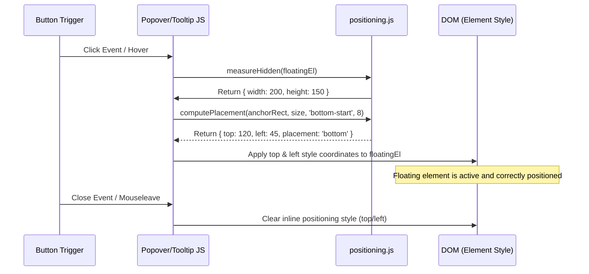

# 📍 positioning

> **Classification:** ⚙️ Service (Layer 3 - Floating UI Mechanics)

---

## 1. Core Behavior & Responsibility

The `positioning.js` module is a core utility script that provides mathematical and DOM helpers to precisely align floating UI elements (such as `ln-popover`, `ln-tooltip`, and `ln-dropdown`) relative to their anchor controls.

The JavaScript source is located at [positioning.js](../../js/ln-core/positioning.js).

Key responsibilities include:
- **Placement Calculation (`computePlacement`):** A pure utility that maps anchor coordinates and floating dimensions onto viewport pixels. It checks whether the floating panel fits inside the viewport and falls back to secondary and tertiary directions if boundary collisions occur.
- **Hidden Measurement (`measureHidden`):** A DOM utility that temporarily measures the width/height of a collapsed (`display: none` or popover) element without visual flickering.

> [!IMPORTANT]
> **What the module does NOT do (Orthogonality Doctrine):**
> - **DOM Teleportation:** It does not manage DOM nesting, body appending, or element teleportation (teleportation logic was deprecated in favor of native Popover API top-layer promotion).
> - **State Management:** It has no knowledge of open/closed states, focus traps, or screen-reader announcements.
> - **Direct Style Painting:** The functions are mathematical calculators; they do not apply CSS class names or handle visual styling rules.

---

## 2. Minimal HTML Markup & Usage Variants

Since `positioning` is an infrastructure JS utility, it is imported and invoked directly within component and coordinator scripts:

```javascript
import { computePlacement, measureHidden } from '../../ln-core';

const trigger = document.getElementById('trigger-btn');
const popup = document.getElementById('floating-panel');

// 1. Measure the dimensions of the currently hidden popup
const size = measureHidden(popup);

// 2. Query trigger dimensions and compute target coordinates
const anchorRect = trigger.getBoundingClientRect();
const coords = computePlacement(anchorRect, size, 'bottom-start', 8);

// 3. Write computed coordinates onto element styles
popup.style.top = coords.top + 'px';
popup.style.left = coords.left + 'px';
```

---

## 3. Declarative API Contract (Attributes & Events)

The module exports the following functions:

| Function | Signature | Returns | Description |
|---|---|---|---|
| `computePlacement` | `(anchorRect: DOMRect\|Object, floatingSize: {width, height}, preferred: String, offset: Number)` | `{ top: Number, left: Number, placement: String }` | Calculates coordinates to position a floating panel relative to an anchor, checking for edge collisions. Tries the preferred placement first, then falls back through opposite, then perpendicular sides, then pins to the viewport edge. `placement` reports the winning side only (`"top"` \| `"bottom"` \| `"left"` \| `"right"`). |
| `measureHidden` | `(el: HTMLElement)` | `{ width: Number, height: Number }` | Briefly forces visibility styles (`visibility: hidden`, `display: block`, `position: fixed`) to read element layout bounds without flicker, then restores the original inline style values. |

### Parameter Notes

*   `anchorRect`: Bounding rect of the anchor control (e.g. from `getBoundingClientRect()`).
*   `floatingSize`: Measured size of the floating element (from `measureHidden`).
*   `preferred`: Preferred side and alignment (e.g. `"bottom-start"`, `"top-end"`, `"left"`, `"right"`). Alignment is preserved through the fallback chain.
*   `offset`: Distance in pixels between anchor and floating element (defaults to `4` if not a number).

---

## 4. CSS Styling & Stacking Constraints

To position floating UI panels successfully, target elements must declare absolute or fixed positioning in their SCSS definitions so they respect coordinate writes:

```scss
[data-ln-popover] {
    position: fixed; // Required to position using positioning calculations
}
```

---

## 5. Accessibility (ARIA) & Common Pitfalls

- **Tab Navigation Flow:** Applying coordinate offsets does not affect the tab order. Ensure your floating components implement a focus routing scheme (like `ln-popover`) so that screen readers and keyboard users can move cleanly into the panel.
- **Common Pitfall — Static Elements:** Forgetting to set `position: fixed` or `position: absolute` on the floating element. If left as `position: static`, the browser ignores the `top` and `left` inline coordinates.

---

## 6. Flow Diagram & Lifecycle



---

## 7. Related Guides & Components

- [`guides/component-authoring`](../guides/component-authoring.md) — Guide on building custom components using ashlar core helpers.
- [`ln-popover`](./ln-popover.md) — Utilizes `computePlacement` and `measureHidden` to align details cards.
- [`ln-dropdown`](./ln-dropdown.md) — Utilizes positioning math to place dropdown lists.
- [`ln-tooltip`](./ln-tooltip.md) — Uses `computePlacement` to align portaled tooltips.
