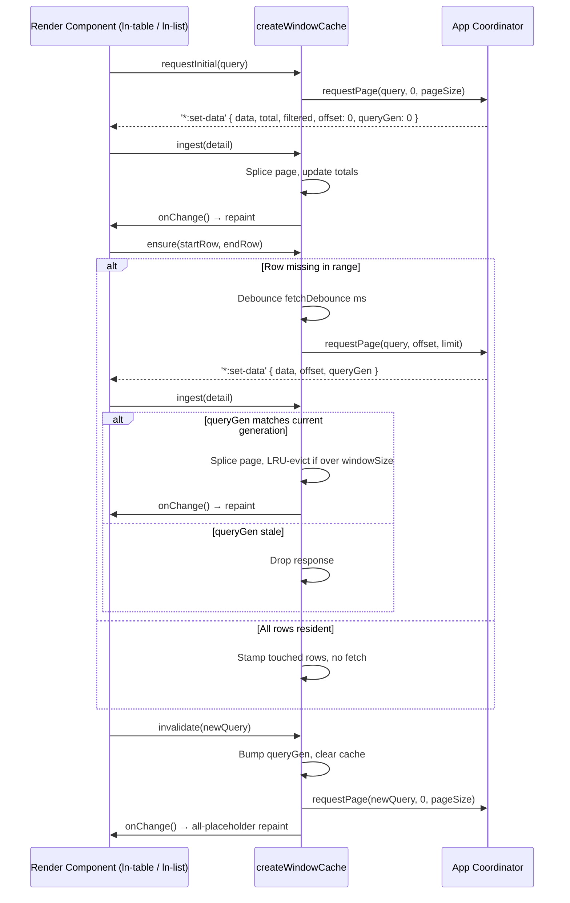

# 🪟 window-cache

> **Classification:** ⚙️ Service (Layer 3 - Data Engine Mechanics)

---

## 1. Core Behavior & Responsibility

`window-cache.js` exports `createWindowCache(config)`, a pure, DOM-agnostic data engine for server-side sliding-window virtualization. It owns a sparse cache keyed by logical index, logical/grand totals, request de-duplication, a stale-response guard (`queryGen`), LRU eviction to a bounded resident-row cap, and a debounced fetch trigger.

The JavaScript source is located at [window-cache.js](../../js/ln-core/window-cache.js).

Key responsibilities include:
- **Sparse Windowing:** Holds at most `windowSize` records at any time, regardless of the logical dataset size, evicting the least-recently-touched rows first (LRU by touch-recency, not viewport distance).
- **Stale-Response Guarding (`queryGen`):** Every query change bumps a generation counter; `ingest()` silently drops any page response tagged with a superseded generation, so an in-flight fetch from a query the user has already moved past can never corrupt the current window.
- **Debounced Fetch Coalescing:** `ensure(startRow, endRow)` coalesces rapid scroll-driven range requests into a single debounced `requestPage` call, padded by `overscan` rows on either side.

> [!IMPORTANT]
> **What the module does NOT do (Orthogonality Doctrine):**
> - **Transport:** It never calls `fetch`, `XMLHttpRequest`, or any network API directly. The consumer supplies `requestPage(query, offset, limit)` — any transport (REST, IndexedDB, WebSocket) can back it.
> - **DOM Rendering:** It has no knowledge of `<tr>`, `<li>`, spacers, or scroll containers. Render clients pull rows via `get()`/`has()` and read `logicalTotal` for their own spacer geometry.
> - **Query Building:** It stores the last-supplied `query` object opaquely and hands it back to `requestPage` verbatim — it does not construct or validate sort/filter/search parameters.

---

## 2. Minimal Usage

Since `window-cache` is an infrastructure JS utility with no DOM footprint, it is imported and instantiated directly within a render component (`ln-table`, `ln-list`):

```javascript
import { createWindowCache, createBatcher, dispatch } from '../../ln-core';

const renderBatch = createBatcher(function () {
	self.totalCount = cache.grandTotal;
	self.visibleCount = cache.logicalTotal;
	self._render();
});

const cache = createWindowCache({
	windowSize: 1000,
	pageSize: 200,
	fetchDebounce: 120,
	overscan: 15,
	requestPage: function (query, offset, limit) {
		dispatch(dom, 'ln-table:request-data', {
			table: self.name,
			sort: query.sort,
			filters: query.filters,
			search: query.search,
			offset: offset,
			limit: limit,
			queryGen: cache.queryGen
		});
	},
	onChange: renderBatch
});

// First load
cache.requestInitial({ sort: null, filters: {}, search: '' });

// On every render pass — pull the visible logical range
cache.ensure(startRow, endRow);
const row = cache.get(i); // undefined → render a placeholder

// On '*:set-data' — splice the fetched page in
cache.ingest({ data: rows, total: grandTotal, filtered: logicalTotal, offset: pageOffset, queryGen: gen });

// On a new sort/filter/search
cache.invalidate({ sort: newSort, filters: {}, search: '' });
```

---

## 3. Declarative API Contract (Config & Methods)

`window-cache` has no HTML attributes or CustomEvents — it is a pure JS factory consumed by component internals.

### Config Object (`createWindowCache(config)`)

| Key | Type | Default | Description |
|---|---|---|---|
| `windowSize` | `Number` | `1000` | Resident-row cap. LRU-evicted once exceeded. Configurable via HTML (`data-ln-table-window="1000"`). |
| `pageSize` | `Number` | `200` | Page/chunk size requested per page-aligned fetch. Configurable via HTML (`data-ln-table-window-page="200"`). |
| `threshold` | `Number` | `25` | Prefetch margin threshold in rows before reaching unloaded page boundaries. Configurable via HTML (`data-ln-table-window-threshold="25"`). |
| `fetchDebounce` | `Number` | `120` | Milliseconds `ensure()` coalesces before firing `requestPage`. |
| `requestPage` | `Function(query, offset, limit)` | no-op | Callback — kick a page-aligned fetch over any transport. |
| `onChange` | `Function()` | no-op | Callback — cache mutated (page ingested or invalidated), re-render. |

---

## 4. Architectural Ownership & Rationale

### Why View Components (`ln-table` / `ln-list`) Own Windowing Parameters

In `ln-ashlar`, `windowSize`, `pageSize` (`window-page`), and `threshold` (`window-threshold`) are owned by the **View Component** rather than the Transport Gateway (`ln-api-connector`).

1. **Separation of Viewport Concerns:** The view component manages DOM layout, row heights, and scroll containers. A large data grid table on the main dashboard may require `pageSize: 200` to maximize scroll throughput, whereas a compact side-panel dropdown list backed by the same API endpoint may require `pageSize: 20`.
2. **Page-Aligned Caching & Pre-fetching:** Requests are aligned to clean page multiples (`offset = 0`, `offset = 200`, `offset = 400`). When scrolling approaches `threshold` rows before an unloaded boundary, `ensure()` triggers pre-fetching for the next page chunk seamlessly.
3. **Passive Transport Layer:** `ln-api-connector` acts as a pure transport driver — it executes network `fetch()` calls for whatever page range the view component requests, without dictating UI window geometry. Optional fallback limit (`data-ln-api-limit`) can be set on the connector for unwindowed components.

### Returned Object — Method Table

| Method | Signature | Returns | Description |
|---|---|---|---|
| `get` | `(i: Number)` | `record \| undefined` | Read a resident row by logical index. |
| `has` | `(i: Number)` | `Boolean` | Whether a logical index is currently resident. |
| `peek` | `()` | `record \| undefined` | Any one resident record — lets the render client measure row/item height before the first page arrives. |
| `logicalTotal` *(getter)* | — | `Number` | Filtered/queried row count — the spacer-geometry basis for the render client. |
| `grandTotal` *(getter)* | — | `Number` | Unfiltered dataset count. |
| `queryGen` *(getter)* | — | `Number` | Current query generation, bumped by `invalidate()`. |
| `size` *(getter)* | — | `Number` | Resident row count. |
| `ensure` | `(startRow: Number, endRow: Number)` | `void` | Render client hands its visible logical range. Stamps in-range resident rows as freshly touched; if any row in range is missing, debounce-fires a padded fetch for the gap. |
| `ingest` | `(detail: Object)` | `void` | Splices a fetched page (`detail.data` at `detail.offset`) into the cache, updates totals from `detail.total`/`detail.filtered`, evicts over-cap rows, fires `onChange()`. Drops the response if `detail.queryGen` doesn't match the current generation. |
| `requestInitial` | `(query: Object)` | `void` | First load — stores `query`, fetches page 0 at the current generation (no bump). |
| `invalidate` | `(query: Object)` | `void` | Query change — bumps `queryGen`, clears the cache, stores the new `query`, refetches page 0, fires `onChange()` for an immediate all-placeholder repaint. |
| `destroy` | `()` | `void` | Clears the debounce timer and cache contents. |

---

## 4. CSS Styling & Stacking Constraints

None. `window-cache` has no DOM footprint and applies no styles — see [ln-table](./ln-table.md) / [ln-list](./ln-list.md) for the render-side placeholder-row styling (blank, no shimmer).

---

## 5. Accessibility (ARIA) & Common Pitfalls

- **Not directly ARIA-relevant** — `window-cache` produces no DOM. Accessibility of placeholder/loading states is owned by the render component (see [ln-table §5](./ln-table.md) / [ln-list §5](./ln-list.md)).

> [!CAUTION]
> 1. **windowSize Too Small:** Setting `windowSize` close to or below one viewport's worth of rows causes thrashing — every scroll tick evicts rows the user is about to scroll back into, forcing a re-fetch. Size the window to comfortably exceed several viewports.
> 2. **Missing `queryGen` Echo:** If the coordinator's response to `requestPage` does not echo `queryGen` back in the `ingest()` detail, every response is treated as matching the current generation — the stale-response guard silently stops protecting against race conditions from rapid sort/filter/search changes.

---

## 6. Flow Diagram & Lifecycle



---

## 7. Related Guides & Components

- [`guides/component-authoring`](../guides/component-authoring.md) — Guide on building custom components using ashlar core helpers.
- [`ln-table`](./ln-table.md) — Consumes `createWindowCache` behind `data-ln-table-window`.
- [`ln-list`](./ln-list.md) — Consumes `createWindowCache` behind `data-ln-list-window`.
