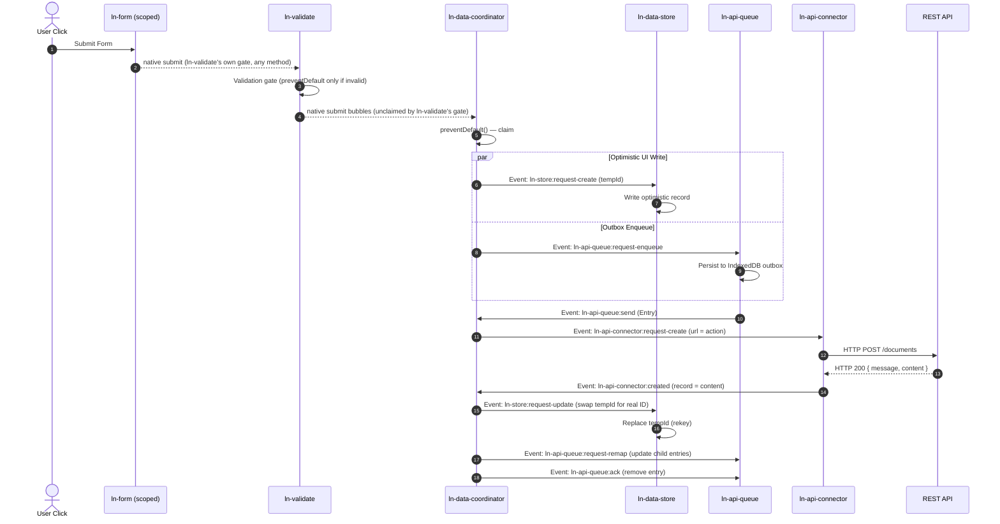

# 📝 Write Workflow Guide

## Summary

This guide explains the declarative write pipeline of `ln-ashlar` for local-first CRUD operations. It walks through the three levels of form submission interception, explains the concern boundaries, and detail step-by-step scenarios for creating, editing, and queuing writes offline without custom application JavaScript.

---

## 1. The Three Levels of Submit Interception

When a user submits a form, the action boundary determines which layer intercepts and processes the data:

| Level | Interceptor | Action / Result | Primary Use Case |
|---|---|---|---|
| **1. Native Browser** | None | Traditional browser page reload. Submits data to `action` endpoint using `method` (and Laravel-style spoofed `_method`). | Standard Server-Side Rendered (SSR) pages (e.g. Laravel Blade templates). |
| **2. Progressive AJAX** | `data-ln-ajax` | Intercepts click/submit, executes `fetch()` asynchronously, prevents page reload, and expects a structured JSON fragment response. | SSR pages with progressive enhancement (updating partial page regions without complete reloads). |
| **3. Scoped Local-First** | `data-ln-form-scope` | Leaves the submit native (after the validation gate). `ln-data-coordinator` claims it via `preventDefault()` on `document`, serializes it itself, writing instantly to `ln-data-store` (IndexedDB) and queuing for server synchronization. | Local-First and Single-Page Applications (SPA) where the local database is the immediate source of truth. |

> [!IMPORTANT]
> **Priority Rule:** `data-ln-form-scope` always takes priority over `data-ln-ajax`. A form cannot be both AJAX-driven and database-scoped; mixing these on a single form will log a development warning.
>
> **Method Gating:** The local-first write pipeline only intercepts submissions when the effective method is `POST`, `PUT`, or `PATCH`. Standard `GET` forms (such as search filters) nested inside coordinators run natively, bypassing the write pipeline.

---

## 2. Component Ownership and Isolation

During a local-first write operation, responsibilities are cleanly isolated among components:

- **Form ([`ln-form`](../components/ln-form.md)):** Acts as the canonical source of truth for the resource `action` and `method` attributes. It populates fields on `ln-fill` and rewrites `action`/`_method` for RESTful edit routing — it never serializes inputs, never dispatches a custom event, and runs no validation gate of its own. It is unaware of database stores or network transport configurations.
- **Validate ([`ln-validate`](../components/ln-validate.md)):** Owns the submit gate. The first `data-ln-validate` field to initialize on a form injects `novalidate` and attaches the form-level `submit` listener: on submit (any method — GET included, mirroring the native browser validation it replaces) it dispatches `ln-validate:request-validate` to collect invalid fields, and if any exist, calls `preventDefault()`, sorts them by document position, and focuses the first one. A valid submit is left native for `ln-data-coordinator` (or plain HTML) to claim next.
- **Store (`ln-data-store`):** Manages the local IndexedDB database cache. It applies optimistic mutations immediately to the local cache and fires database change notifications. It is blind to REST URLs and HTTP headers.
- **Queue (`ln-api-queue`):** Persists transaction payloads in order (FIFO per record chain) to survive browser restarts. It dispatches a `send` command when it is ready to sync, but does not perform network calls.
- **Connector (`ln-*-connector`):** Executes the physical network fetch. It accepts abstract payload requests, translates them into REST or socket payloads, and returns the server's response.
- **Coordinator ([`ln-data-coordinator`](../components/ln-data-coordinator.md)):** Serves as the mediator. It claims the form's native submit event (preventDefault, document, bubble phase), serializes it, maps payloads (Ingress/Egress), and triggers store writes and remote queue uploads in parallel. It handles server updates by dispatching ordinary store updates (triggering rekeys or reverts).

---

## 3. Step-by-Step CRUD Scenarios

### Scenario 1: Creating a Record (POST)
1. **Submit:** The user submits a form configured with `data-ln-form-scope` and `method="POST"`.
2. **Intake:** `ln-form` intercepts the submission only to validate; `ln-data-coordinator` claims the native submit and serializes the fields itself.
3. **Claim:** The coordinator checks the event scope, claims it (`claimed = true`), and generates a temporary ID with a `_temp_` prefix (e.g. `_temp_df88b0...`).
4. **Parallel Fan-Out:** The coordinator triggers two independent branches synchronously:
   - **Local Cache:** Dispatches `ln-store:request-create` with the `tempId` and data. `ln-data-store` writes the record to IndexedDB, instantly updating bound UI tables via state notifications (`ln-store:created`).
   - **Outbox Queue:** If a queue child is present, it enqueues the payload with `meta: { tempId, action }`.
5. **API Transport:** The queue processes the item and tells the coordinator to send. The coordinator directs the connector to POST to the resource URL.
6. **Server Response:** The server processes the request and responds with a `{ message, content }` envelope (see Section 5).
7. **Reconciliation:** The connector unwraps the record and dispatches it back. The coordinator dispatches an ordinary `ln-store:request-update` targeting `id: tempId` with the server's payload (`data: record`). 
   Because the incoming server ID differs from the `tempId`, the store executes an **id-swap (rekey)**, updating the primary key in IndexedDB.
8. **Outbox Completion:** The coordinator dispatches `request-remap` to the queue to update subsequent queued updates targeting the old `tempId` with the new server ID, then issues `ack` to remove the completed create entry from the queue.

---

### Scenario 2: Editing a Record via `lnFill` (PUT/PATCH)
1. **Form Fill:** Clicking the edit button triggers `lnFill` on the form container, populating inputs with the record's values (including hidden `id` and `expected_version` inputs).
2. **Action Rewrite:** Since `data-ln-form-action-edit` is present, the form rewrites its `action` attribute to `/documents/{id}` and injects a hidden `_method` input valued `PUT`.
3. **Submit:** The user saves the changes. `ln-data-coordinator` detects the effective `PUT` method via the `_method` input (identical read to `ln-form`'s own gate), claims the native submission, and serializes the ID and payload itself.
4. **Intake:** The coordinator intercepts the event and executes `_fanOutUpdate`:
   - **Local Cache:** Writes the changes to the store immediately.
   - **Outbox Queue:** Enqueues the update payload (with `expected_version` for conflict checks).
5. **Reconciliation:** Once the server confirms the update, the store updates the cache with the server's record, and the queue entry is acknowledged.

---

### Scenario 3: Offline Edits and Persistent Queuing
1. **Offline Write:** If the network is down, the user's edit goes through the exact same flow. The store writes the change locally, updating the UI. The queue enqueues the mutation in the persistent outbox database (`ln_api_queue`).
2. **Draining:** The queue waits until the browser goes online or detects a tab refresh. It then dispatches `ln-api-queue:send`.
3. **Url Stitching:** The queue carries the base resource URL `/documents` in its `meta.action` property. At send time, the connector builds the final URL via its `buildUrl()` helper (`baseUrl` + the form's `action` path + the record's ID), producing `/documents/5`; the coordinator passes the form's `action` URL through unmodified, preventing stale UUID urls from being sent if the record was originally created offline.

---

### Scenario 4: Handling 409 Conflicts
1. **Conflict Response:** If another user updated the record in the meantime, the server rejects the write with `409 Conflict`, returning the `remote` server record.
2. **Intake:** The connector intercepts the 409 status and dispatches an error event.
3. **Resolution (Server Wins):** The coordinator classifies the 409 error as deterministic. It forces the server's version into the local cache by dispatching `ln-store:request-update` carrying the `remote` record. The UI updates to show the server's data.
4. **Outbox Drop:** The coordinator issues `nack { reason: 'drop' }` to remove the conflicting update from the outbox queue, preventing endless retries.

---

## 4. Sequence Diagram: CRUD Write Pipeline



---

## 5. The Mutation Response Envelope

To standardise successes and dispatch notifications automatically, all write operations expect a `{ message, content }` JSON envelope from the server:

```json
{
  "message": {
    "type": "success",
    "title": "Saved Successfully",
    "body": "Document has been created."
  },
  "content": {
    "id": 142,
    "title": "Project Plan",
    "status": "published"
  }
}
```

- **`content`:** Carries the updated database record. The connector automatically unwraps this property. If missing, the connector falls back to treating the root response body as the record.
- **`message`:** Configures the success toast. If present, the coordinator pushes this message directly to the browser's toast queue (`ln-toast:enqueue`). If omitted, no success toast is shown.

---

## 6. Common Pitfalls and Developer Errors

- **Missing `method="post"` on Scoped Forms:** If `method` is omitted, some browsers default to `GET`. `ln-data-coordinator` only claims `POST`/`PUT`/`PATCH` submits for the write pipeline — a `GET` form is never claimed, regardless of field validity. If every field is valid, the browser executes a native page reload and appends inputs as a query string; `ln-validate`'s submit gate still blocks the reload if fields are invalid (it runs on every method), but a validation pass on an accidentally-`GET` form still bypasses the write pipeline entirely. Always declare `method="post"` explicitly on scoped forms.
- **Mismatched Scope Names:** If `data-ln-form-scope="name"` does not match the parent's `data-ln-data-coordinator="name"`, the coordinator will ignore the submit — no console warning, the native submit proceeds untouched (progressive-enhancement fallback).
- **Base URL and HTTP Session Cookies:** The `ln-*-connector` components submit requests with `credentials: 'same-origin'` to safeguard against CSRF attacks. If you define a cross-origin `data-ln-api-base-url` targeting an external domain, cookies will not be sent. Use a same-origin backend proxy gateway instead.

---

## Related Documents

- [Data Layer doctrine](../doctrine/data-layer.md)
- [Data Flow doctrine](../doctrine/data-flow.md)
- [Coordinator Authoring Guide](./coordinator-authoring.md)
