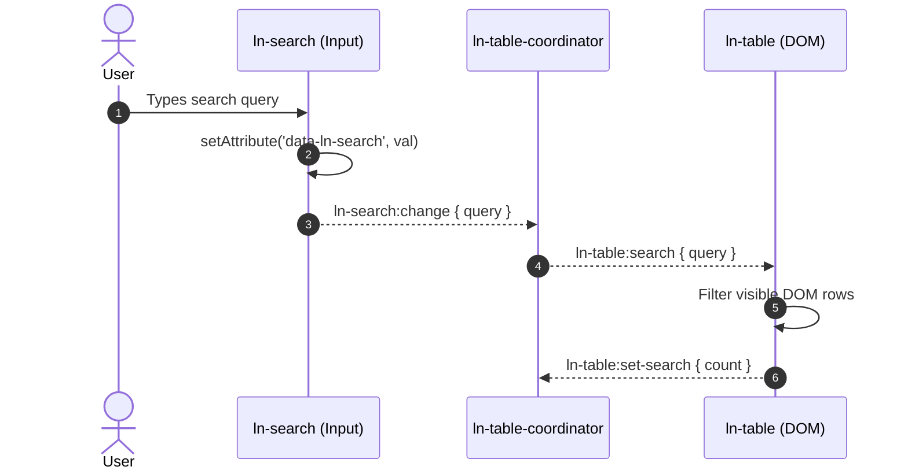

# 🔄 data-table-sync

---

## 1. Problem & Context

High-performance enterprise applications require data tables that deliver instant first paint (via SSR rows) and dynamic client-side filtering, sorting, searching, and background synchronization without full page reloads.

The `data-table-sync` pattern coordinates:
- **`ln-table`:** View presenter managing row rendering, selection, and keyboard navigation.
- **`ln-data-store`:** IndexedDB / in-memory store maintaining local state and delta synchronization.
- **`ln-table-coordinator`:** Mediator bridging search inputs, filter panels, and sort buttons to table mutations.

---

## 2. Complete HTML Markup

### Base HTML Markup

```html
<section id="users-panel" 
         data-ln-table-coordinator="users"
         data-ln-data-coordinator="users">

    <!-- Table Toolbar: Search, Filters, Stats -->
    <header class="table-toolbar">
        <div class="search-box">
            <input type="search" 
                   data-ln-search="users-table" 
                   placeholder="Search users...">
        </div>
        
        <div class="filter-controls">
            <select data-ln-filter="users-table">
                <option value="">All Roles</option>
                <option value="admin">Administrator</option>
                <option value="editor">Editor</option>
            </select>
        </div>

        <div class="stats">
            <span>Total: <strong data-ln-stat="users">0</strong></span>
        </div>
    </header>

    <!-- Enhanced Table Container -->
    <div data-ln-table="users" id="users-table">
        <table>
            <thead>
                <tr>
                    <th data-ln-table-col="name">
                        <span>Name</span>
                        <ul data-ln-sort="users-table" data-ln-sort-field="name" data-ln-sort-state="none">
                            <li><button type="button" data-ln-sort-dir="asc" aria-label="Sort ascending">&uarr;</button></li>
                            <li><button type="button" data-ln-sort-dir="desc" aria-label="Sort descending">&darr;</button></li>
                            <li><button type="button" data-ln-sort-dir="none" aria-label="Clear sort">&times;</button></li>
                        </ul>
                    </th>
                    <th data-ln-table-col="role">Role</th>
                    <th data-ln-table-col="status">Status</th>
                </tr>
            </thead>
            <tbody>
                <!-- SSR Hydration Rows -->
                <tr data-ln-table-row data-id="1">
                    <td>Alice Johnson</td>
                    <td>admin</td>
                    <td><span class="badge success">Active</span></td>
                </tr>
            </tbody>
        </table>
    </div>
</section>
```

---

## 3. Included Components

| Component | Role in the Pattern |
|---|---|
| [`ln-table`](../components/ln-table.md) | Manages table DOM, virtualized rows, and column sorting state |
| [`ln-table-coordinator`](../components/ln-table-coordinator.md) | Connects search, filter, and sort UI triggers to table events |
| [`ln-data-store`](../components/ln-data-store.md) | Manages local IndexedDB record caching and queries |
| [`ln-search`](../components/ln-search.md) | Real-time search query input throttling and dispatching |
| [`ln-filter`](../components/ln-filter.md) | Multi-field criteria filter state emitter |
| [`ln-sort`](../components/ln-sort.md) | Tri-state ascending / descending / none sort trigger host |

---

## 4. Data Flow



---

## 5. Common Pitfalls

> [!CAUTION]
> 1. **Coordinators Dispatch Events:** Coordinators must always dispatch CustomEvents (`ln-table:search`, `ln-table:filter`) rather than calling prototype methods directly.
> 2. **Sort Triggers:** Column sorting triggers belong inside `<ul data-ln-sort>` within the `<th>`. `ln-table` does not render sort buttons on its own.

---

## 6. Related Patterns & Components

- [`modal-crud`](./modal-crud.md) — Create/Edit modal integration with table rows.
- [`ln-table`](../components/ln-table.md) — Table component API reference.
- [`ln-table-coordinator`](../components/ln-table-coordinator.md) — Table coordinator API.
